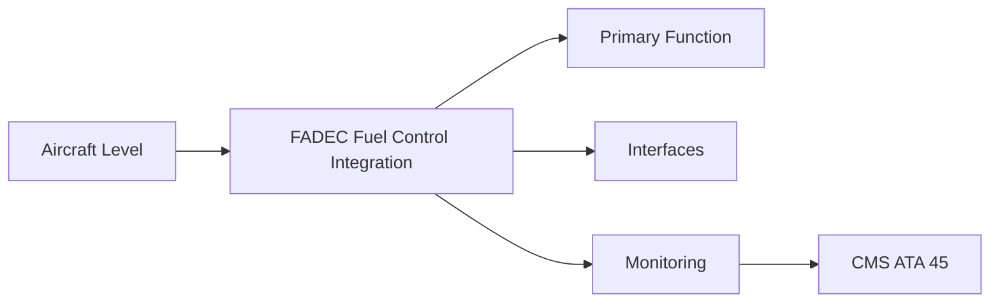
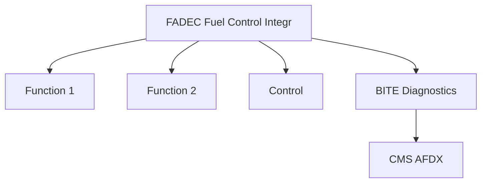

<!-- ──────────────────────────────────────────────────────────────────────────
     QATL-ATLAS-1000-ATLAS-060-069-064-050-FADEC-FUEL-CONTROL-INTEGRATION
     ATA 64 · FADEC Fuel Control Integration
     AMPEL360E eWTW — ATLAS Register 1000
────────────────────────────────────────────────────────────────────────────── -->

# FADEC Fuel Control Integration

---

## §0 Hyperlink Policy

> All hyperlinks in this document are **relative** (five directory levels: `../../../../../`).
> Absolute URLs are forbidden. Every linked document must exist in the Q+ATLANTIDE repository
> before the link is activated. Broken links are treated as open issues and must be resolved
> before the document is promoted from `DRAFT` to `APPROVED`.

---

## §1 Purpose

FADEC is the primary closed-loop controller for engine fuel flow. It commands the HMU EHV to achieve the desired N1 (or N2/EGT limit) target. FADEC dual-channel architecture ensures that a single FADEC channel failure does not result in an unsafe fuel metering state. The FADEC fuel control function is certified to DO-178C DAL A.

---

## §2 Applicability

| Parameter | Value |
|---|---|
| Aircraft Program | AMPEL360E eWTW |
| ATA reference | ATA 64-050 — FADEC Fuel Control Integration |
| Certification basis | EASA CS-25 Amdt 27+ |
| S1000D SNS | 064-050-00 |

---

## §3 Functional Description ![DRAFT]

FADEC is the primary closed-loop controller for engine fuel flow. It commands the HMU EHV to achieve the desired N1 (or N2/EGT limit) target. FADEC dual-channel architecture ensures that a single FADEC channel failure does not result in an unsafe fuel metering state. The FADEC fuel control function is certified to DO-178C DAL A.

---

## §4 Functional Breakdown

| ID | Name | Description | Lead Division |
|---|---|---|---|
| F-001 | FADEC dual-channel unit (fuel control partition) | Primary function | Q-GREENTECH |
| F-002 | System integration | Interface management | Q-MECHANICS |
| F-003 | Monitoring | BITE and health data | Q-AIR |

---

## §5 System Context — Mermaid Diagram

---

## §6 Internal Architecture — Mermaid Diagram

---

## §7 Components and LRUs

| Component | Part Number | Qty | Location | Maintenance Interval | Notes |
|---|---|---|---|---|---|
| FADEC dual-channel unit (fuel control partition) | FADEC-PN-TBD | 1 per engine | Accessories bay | On condition | DO-178C DAL A; dual-channel cross-comparison |
| FADEC N1 feedback sensor | N1-Sens-PN-TBD | 2 per engine (redundant) | Fan frame | On condition | Dual redundant fan speed for FADEC closed loop |
| T41 temperature monitor (EGT limiting) | T41-Mon-PN-TBD | Multiple per engine | HPT inlet | On condition / calibration | FADEC EGT limit protection — DAL A function |
| Fuel control mode select (ECAM/pilot) | ECAM switch / FADEC logic | 1 (aircraft-level) | Overhead panel | Functional test C-check | Allows crew to command alternate fuel control mode (abnormal) |
| FADEC power supply (dedicated) | FADEC-Pwr-PN-TBD | Dual 28 V DC (primary + secondary) | FADEC chassis | On condition | FADEC powered by aircraft bus + dedicated battery backup |

---

## §8 Interfaces

| Interface Type | Connected System | Protocol / Medium | Data / Function |
|---|---|---|---|
| ATA 45 CMS | Central Maintenance System | AFDX ARINC 664 P7 | BITE faults and health data |
| ATA 24 Electrical Power | Power distribution | HVDC / 28 V DC | LRU power supply |
| ATA 67 Engine Controls | FADEC | ARINC 429 / AFDX | Control commands and feedback |
| ATA 31 ECAM | Cockpit display | AFDX | Crew indication and alerts |

---

## §9 Operating Modes

| Mode | Trigger | System State | Actions / Consequences |
|---|---|---|---|
| Normal operation | Aircraft/engine powered | Nominal | Full function active |
| Engine shutdown | Commanded or fault | FADEC stops fuel | System de-energised |
| Maintenance | Isolated | Aircraft grounded | LOTO active |
| Ground test | Post-maintenance | Engine on ground | Test pass before service |

---

## §10 Performance and Budgets ![DRAFT]

| Parameter | Requirement | Target / Design Value | Status |
|---|---|---|---|
| System availability | ≥ 99.9 % dispatch | RAMS analysis | TBD |
| BITE fault detection | ≥ 80 % coverage | BITE design analysis | TBD |

---

## §11 Safety, Redundancy and Fault Tolerance

- All FADEC Fuel Control Integration maintenance requires FADEC and fuel system isolation before starting.
- Safety-critical fastener torques require calibrated tooling and dual sign-off.
- BITE failures affecting FADEC Fuel Control Integration dispatch must be resolved or deferred per approved MEL.

---

## §12 Maintenance and Diagnostics

| Task | Interval | Access | Special Tools |
|---|---|---|---|
| Scheduled FADEC Fuel Control Integration inspection | C-check | Per AMM access | NDT and inspection kit |
| BITE log review and download | A-check | Maintenance terminal | CMS terminal |
| FADEC Fuel Control Integration functional test after LRU replacement | After LRU change | Ground run | FADEC GSE |

---

## §13 Footprint — Physical, Electrical, Maintenance, Data ![TBD]

| Footprint Type | Parameter | Value | Notes |
|---|---|---|---|
| Physical | Mass (system total) | ![TBD] | Pending OEM data |
| Physical | Envelope (max) | ![TBD] | Pending detailed design |
| Electrical | Peak power (W) | ![TBD] | To be defined |
| Maintenance | Access category | Standard line maintenance | Per AMM |
| Data | AFDX bandwidth | ![TBD] | Per AFDX bus load analysis |

---

## §14 Safety and Certification References ![DRAFT]

| Standard / Document | Title | Issuing Body | Applicability |
|---|---|---|---|
| DO-178C | Software Considerations — DAL A FADEC fuel control | RTCA | FADEC software assurance standard |
| SAE ARP4761 | Safety Assessment Process | SAE International | FADEC FHA and FTA methodology |
| EASA CS-E §770 | Fuel system | EASA | FADEC fuel control certification |
| ARINC 429 | Digital Information Transfer | ARINC | FADEC data bus to ECAM and CMS |
| ATA iSpec 2200 | Chapter 64 | ATA | ATA chapter scope |

---

## §15 V&V Approach ![TBD]

| Phase | Method | Acceptance Criterion | Status |
|---|---|---|---|
| Design | Analysis and simulation | Meets all §10 performance requirements | ![TBD] |
| Integration | Ground functional test | All BITE tests pass; interfaces verified | ![TBD] |
| Qualification | DO-160G environmental test | All applicable tests pass | ![TBD] |
| Certification | EASA CS-25 / CS-E compliance demonstration | Type Certificate / STC approval | ![TBD] |

---

## §16 Glossary

| Term | Definition |
|---|---|
| **FADEC** | Full Authority Digital Engine Control — closed-loop engine governor; DAL A software. |
| **N1 control loop** | FADEC control loop commanding fuel flow to achieve target fan speed (N1). |
| **EGT limiting** | FADEC function that reduces fuel flow when EGT approaches the limit; prevents turbine over-temperature. |
| **Alternate fuel control mode** | A degraded but safe mode in which FADEC uses backup sensor data or a fixed fuel schedule. |
| **Dual-channel FADEC** | Two independent computation channels; cross-comparison detects single-channel faults. |
| **FADEC battery backup** | Dedicated battery ensuring FADEC remains powered through aircraft electrical transients during engine start. |
| **DAL A** | Design Assurance Level A — the highest DO-178C level; a failure in this software could be catastrophic. |
| **Closed-loop control** | Control system using sensor feedback (N1, EGT) to continuously correct the output (fuel flow). |
| **Open-loop schedule** | Fallback fuel schedule without sensor feedback; used only if all feedback sensors fail. |
| **Control law** | The mathematical algorithm governing FADEC fuel schedule as a function of thrust lever angle, altitude, temperature, and engine condition. |

---

## §17 Open Issues

| ID | Description | Owner | Target |
|---|---|---|---|
| OI-064-050-001 | Finalise FADEC Fuel Control Integration design with engine OEM | Q-MECHANICS | 2026-Q4 |
| OI-064-050-002 | Define BITE coverage for FADEC Fuel Control Integration | Q-AIR / safety | 2027-Q1 |

---

## §18 Status Legend

| Badge | Meaning |
|---|---|
| `![DRAFT]` | Section is drafted but not yet reviewed |
| `![TBD]` | Content not yet started — to be defined |
| `![To Be Completed]` | Partially complete — needs additional content |
| `![APPROVED]` | Reviewed and formally approved |

---

## §19 Related Documents (Siblings in this Subsection)

- [064-000](./064-000.md)
- [064-010](./064-010.md)
- [064-020](./064-020.md)
- [064-030](./064-030.md)
- [064-040](./064-040.md)
- [064-060](./064-060.md)
- [064-070](./064-070.md)
- [064-080](./064-080.md)
- [064-090](./064-090.md)

---

## §20 Change Log

| Rev | Date | Author | Description |
|---|---|---|---|
| 0.1 | 2026-05-11 | @copilot | Initial DRAFT — contextualized content per AMPEL360E eWTW architecture |
