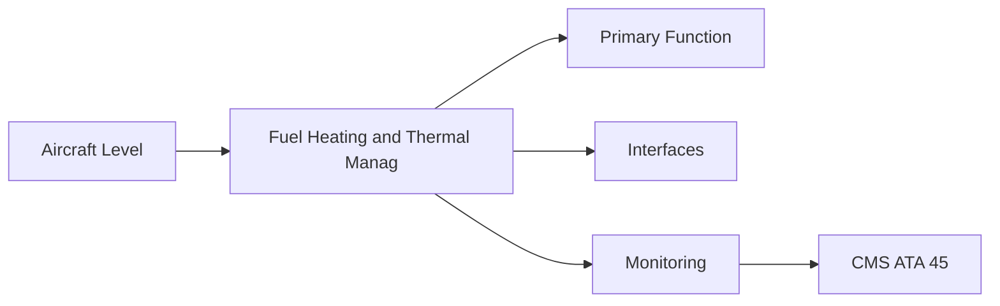
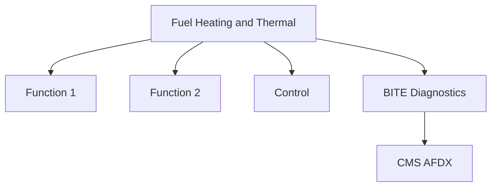

<!-- ──────────────────────────────────────────────────────────────────────────
     QATL-ATLAS-1000-ATLAS-060-069-064-060-FUEL-HEATING-AND-THERMAL-MANAGEMENT
     ATA 64 · Fuel Heating and Thermal Management
     AMPEL360E eWTW — ATLAS Register 1000
────────────────────────────────────────────────────────────────────────────── -->

# Fuel Heating and Thermal Management

---

## §0 Hyperlink Policy

> All hyperlinks in this document are **relative** (five directory levels: `../../../../../`).
> Absolute URLs are forbidden. Every linked document must exist in the Q+ATLANTIDE repository
> before the link is activated. Broken links are treated as open issues and must be resolved
> before the document is promoted from `DRAFT` to `APPROVED`.

---

## §1 Purpose

The AMPEL360E eWTW eliminates the engine bleed-air fuel heater and uses only the engine Fuel/Oil Heat Exchanger (FOHE) for thermal management. The FOHE warms cold fuel to prevent wax crystal formation and icing, while simultaneously cooling engine lube oil. An additional electrically heated fuel inlet (EHFI) protects the LP pump inlet at extreme cold-soak conditions.

---

## §2 Applicability

| Parameter | Value |
|---|---|
| Aircraft Program | AMPEL360E eWTW |
| ATA reference | ATA 64-060 — Fuel Heating and Thermal Management |
| Certification basis | EASA CS-25 Amdt 27+ |
| S1000D SNS | 064-060-00 |

---

## §3 Functional Description ![DRAFT]

The AMPEL360E eWTW eliminates the engine bleed-air fuel heater and uses only the engine Fuel/Oil Heat Exchanger (FOHE) for thermal management. The FOHE warms cold fuel to prevent wax crystal formation and icing, while simultaneously cooling engine lube oil. An additional electrically heated fuel inlet (EHFI) protects the LP pump inlet at extreme cold-soak conditions.

---

## §4 Functional Breakdown

| ID | Name | Description | Lead Division |
|---|---|---|---|
| F-001 | FOHE (Fuel/Oil Heat Exchanger) | Primary function | Q-GREENTECH |
| F-002 | System integration | Interface management | Q-MECHANICS |
| F-003 | Monitoring | BITE and health data | Q-AIR |

---

## §5 System Context — Mermaid Diagram

---

## §6 Internal Architecture — Mermaid Diagram

---

## §7 Components and LRUs

| Component | Part Number | Qty | Location | Maintenance Interval | Notes |
|---|---|---|---|---|---|
| FOHE (Fuel/Oil Heat Exchanger) | FOHE-PN-TBD | 1 per engine | LP fuel circuit after LP pump | On condition / inspect at C-check | Fuel warms; oil cools — no bleed-air heater |
| EHFI (Electrically Heated Fuel Inlet) | EHFI-PN-TBD | 1 per engine | LP pump inlet | On condition | FADEC-controlled; prevents pump inlet icing at extreme cold |
| Fuel temperature sensor (LP circuit) | FuelTemp-PN-TBD | 1 per engine | LP circuit after FOHE | On condition | FADEC input for fuel icing risk monitoring |
| Oil temperature sensor (FOHE outlet) | OilTemp-PN-TBD | 1 per engine | FOHE oil outlet | On condition / calibrate | Oil temperature trending for FOHE effectiveness |
| Engine oil cooler (ACOC, if any) | ACOC-PN-TBD | TBD per configuration | Nacelle air cooled | Inspect at C-check | Air-Cooled Oil Cooler for additional oil cooling if needed |

---

## §8 Interfaces

| Interface Type | Connected System | Protocol / Medium | Data / Function |
|---|---|---|---|
| ATA 45 CMS | Central Maintenance System | AFDX ARINC 664 P7 | BITE faults and health data |
| ATA 24 Electrical Power | Power distribution | HVDC / 28 V DC | LRU power supply |
| ATA 67 Engine Controls | FADEC | ARINC 429 / AFDX | Control commands and feedback |
| ATA 31 ECAM | Cockpit display | AFDX | Crew indication and alerts |

---

## §9 Operating Modes

| Mode | Trigger | System State | Actions / Consequences |
|---|---|---|---|
| Normal operation | Aircraft/engine powered | Nominal | Full function active |
| Engine shutdown | Commanded or fault | FADEC stops fuel | System de-energised |
| Maintenance | Isolated | Aircraft grounded | LOTO active |
| Ground test | Post-maintenance | Engine on ground | Test pass before service |

---

## §10 Performance and Budgets ![DRAFT]

| Parameter | Requirement | Target / Design Value | Status |
|---|---|---|---|
| System availability | ≥ 99.9 % dispatch | RAMS analysis | TBD |
| BITE fault detection | ≥ 80 % coverage | BITE design analysis | TBD |

---

## §11 Safety, Redundancy and Fault Tolerance

- All Fuel Heating and Thermal Management maintenance requires FADEC and fuel system isolation before starting.
- Safety-critical fastener torques require calibrated tooling and dual sign-off.
- BITE failures affecting Fuel Heating and Thermal Management dispatch must be resolved or deferred per approved MEL.

---

## §12 Maintenance and Diagnostics

| Task | Interval | Access | Special Tools |
|---|---|---|---|
| Scheduled Fuel Heating and Thermal Management inspection | C-check | Per AMM access | NDT and inspection kit |
| BITE log review and download | A-check | Maintenance terminal | CMS terminal |
| Fuel Heating and Thermal Management functional test after LRU replacement | After LRU change | Ground run | FADEC GSE |

---

## §13 Footprint — Physical, Electrical, Maintenance, Data ![TBD]

| Footprint Type | Parameter | Value | Notes |
|---|---|---|---|
| Physical | Mass (system total) | ![TBD] | Pending OEM data |
| Physical | Envelope (max) | ![TBD] | Pending detailed design |
| Electrical | Peak power (W) | ![TBD] | To be defined |
| Maintenance | Access category | Standard line maintenance | Per AMM |
| Data | AFDX bandwidth | ![TBD] | Per AFDX bus load analysis |

---

## §14 Safety and Certification References ![DRAFT]

| Standard / Document | Title | Issuing Body | Applicability |
|---|---|---|---|
| EASA CS-E §780 | Fuel system thermal design | EASA | Fuel heating certification |
| ASTM D7566 | SAF specification | ASTM | SAF thermal stability requirement |
| SAE AIR1168 | Aircraft Fuel System Thermal Management | SAE International | Thermal management reference |
| ATA iSpec 2200 | Chapter 64 | ATA | ATA chapter scope |
| DO-160G Section 14 | Icing — Airborne Equipment | RTCA | EHFI environmental icing test |

---

## §15 V&V Approach ![TBD]

| Phase | Method | Acceptance Criterion | Status |
|---|---|---|---|
| Design | Analysis and simulation | Meets all §10 performance requirements | ![TBD] |
| Integration | Ground functional test | All BITE tests pass; interfaces verified | ![TBD] |
| Qualification | DO-160G environmental test | All applicable tests pass | ![TBD] |
| Certification | EASA CS-25 / CS-E compliance demonstration | Type Certificate / STC approval | ![TBD] |

---

## §16 Glossary

| Term | Definition |
|---|---|
| **FOHE** | Fuel/Oil Heat Exchanger — bi-fluid heat exchanger using LP fuel as the oil cooling medium. |
| **EHFI** | Electrically Heated Fuel Inlet — a resistive heater element at the LP pump inlet preventing icing in extreme cold-soak conditions. |
| **Fuel icing** | Formation of ice crystals in fuel at very low temperature (< −40 °C, especially at high altitude). |
| **Wax crystallisation** | Precipitation of wax crystals in fuel at low temperature; can block fuel filters; monitored by fuel temperature sensor. |
| **ACOC** | Air-Cooled Oil Cooler — a heat exchanger using nacelle bypass air to cool engine oil. |
| **Cold-soak** | Condition where aircraft (and fuel system) is exposed to extreme cold temperatures over a long period. |
| **SAF thermal stability** | Thermal stability of SAF blends at high temperature in fuel wetted components; must meet ASTM D7566 Annex A limits. |
| **Oil thermal management** | Maintaining engine oil temperature within operating limits; critical for bearing and gearbox lubrication effectiveness. |
| **Bleed-less heating** | No hot engine bleed air used for fuel heating; replaced by FOHE and EHFI on AMPEL360E eWTW. |
| **LP circuit** | Low-pressure fuel circuit between aircraft boost pump outlet and HP pump inlet. |

---

## §17 Open Issues

| ID | Description | Owner | Target |
|---|---|---|---|
| OI-064-060-001 | Finalise Fuel Heating and Thermal Management design with engine OEM | Q-MECHANICS | 2026-Q4 |
| OI-064-060-002 | Define BITE coverage for Fuel Heating and Thermal Management | Q-AIR / safety | 2027-Q1 |

---

## §18 Status Legend

| Badge | Meaning |
|---|---|
| `![DRAFT]` | Section is drafted but not yet reviewed |
| `![TBD]` | Content not yet started — to be defined |
| `![To Be Completed]` | Partially complete — needs additional content |
| `![APPROVED]` | Reviewed and formally approved |

---

## §19 Related Documents (Siblings in this Subsection)

- [064-000](./064-000.md)
- [064-010](./064-010.md)
- [064-020](./064-020.md)
- [064-030](./064-030.md)
- [064-040](./064-040.md)
- [064-050](./064-050.md)
- [064-070](./064-070.md)
- [064-080](./064-080.md)
- [064-090](./064-090.md)

---

## §20 Change Log

| Rev | Date | Author | Description |
|---|---|---|---|
| 0.1 | 2026-05-11 | @copilot | Initial DRAFT — contextualized content per AMPEL360E eWTW architecture |
