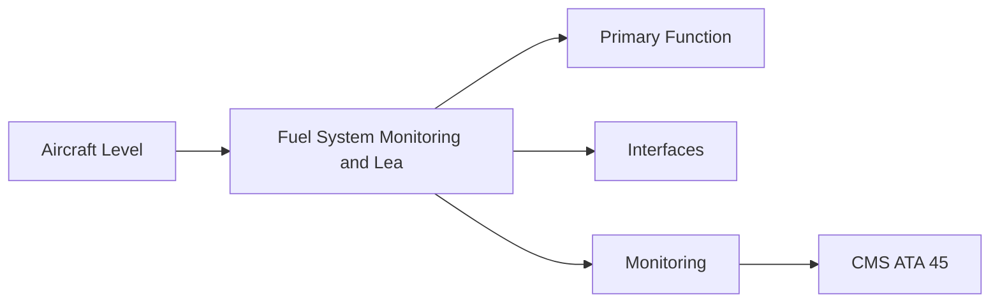
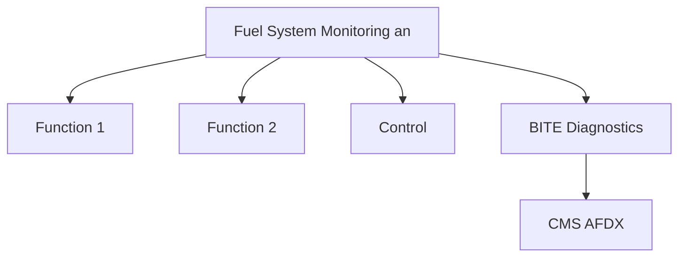

<!-- ──────────────────────────────────────────────────────────────────────────
     QATL-ATLAS-1000-ATLAS-060-069-064-070-FUEL-SYSTEM-MONITORING-AND-LEAK-DETECTION
     ATA 64 · Fuel System Monitoring and Leak Detection
     programme-defined aircraft type — ATLAS Register 1000
────────────────────────────────────────────────────────────────────────────── -->

# Fuel System Monitoring and Leak Detection

---

## §0 Hyperlink Policy

> All hyperlinks in this document are **relative** (five directory levels: `../../../../../`).
> Absolute URLs are forbidden. Every linked document must exist in the Q+ATLANTIDE repository
> before the link is activated. Broken links are treated as open issues and must be resolved
> before the document is promoted from `DRAFT` to `APPROVED`.

---

## §1 Purpose

This document defines the agnostic ATLAS standard-level architecture context for `Fuel System Monitoring and Leak Detection`.

It describes the controlled scope, functions, interfaces, safety considerations, lifecycle traceability, and S1000D/CSDB mapping logic that programme implementations shall instantiate when this node is applicable.

This document is not a programme design baseline. Programme-specific capacities, locations, part numbers, effectivity, operating limits, maintenance references, and data module codes shall be defined only inside the applicable programme implementation branch.
## §2 Applicability

| Applicability Level | Rule |
|---|---|
| Standard taxonomy | Applies to the ATLAS node `064` |
| Programme implementation | Conditional; determined by programme architecture, trade studies, certification basis, and applicability model |
| Product configuration | Defined in the programme-specific configuration baseline |
| Effectivity | Defined in the programme CSDB / applicability layer |
| Non-applicability | Must be explicitly stated in the programme impact-study branch when excluded |
## §3 Functional Description ![DRAFT]

Engine fuel system monitoring covers fuel flow metering accuracy (ACMF), filter differential pressure, fuel temperature, pump inlet pressure, and leak detection. Fuel leaks in the engine fire zone are a primary safety concern; the fire detection system (ATA 26) is the ultimate defence, but fuel leak detection provisions in the nacelle drain system are the first line.

---

## §4 Functional Breakdown

| ID | Name | Description | Lead Division |
|---|---|---|---|
| F-001 | ACMF fuel flow data acquisition | Primary function | Q-GREENTECH |
| F-002 | System integration | Interface management | Q-MECHANICS |
| F-003 | Monitoring | BITE and health data | Q-AIR |

---

## §5 System Context — Mermaid Diagram

---

## §6 Internal Architecture — Mermaid Diagram

---

## §7 Components and LRUs

| Component | Part Number | Qty | Location | Maintenance Interval | Notes |
|---|---|---|---|---|---|
| ACMF fuel flow data acquisition | FADEC/EDIU DAL D software | Per engine | FADEC/EDIU | Software update | Per-flight fuel flow record for OEM trending |
| Filter DP switch (CMS alert) | DP-SW-PN-TBD | 1 per engine | Primary filter housing | Test at C-check | FADEC and CMS alert at high DP |
| Fuel leak detector (nacelle drain) | Drain-Sen-PN-TBD | 1 per engine | Nacelle drain mast sensor (if fitted) | On condition | Detects fuel presence in nacelle drain flow |
| Pump inlet pressure sensor | PumpInlet-PN-TBD | 1 per engine | LP pump inlet | On condition | FADEC low-pressure alarm if suction drops |
| FADEC fuel system BITE | FADEC software | Per engine | FADEC hardware | Continuous CBIT | Monitors all fuel metering LRU signals; detects sensor/valve faults |

---

## §8 Interfaces

| Interface Type | Connected System | Protocol / Medium | Data / Function |
|---|---|---|---|
| ATA 45 CMS | Central Maintenance System | AFDX ARINC 664 P7 | BITE faults and health data |
| ATA 24 Electrical Power | Power distribution | HVDC / 28 V DC | LRU power supply |
| ATA 67 Engine Controls | FADEC | ARINC 429 / AFDX | Control commands and feedback |
| ATA 31 ECAM | Cockpit display | AFDX | Crew indication and alerts |

---

## §9 Operating Modes

| Mode | Trigger | System State | Actions / Consequences |
|---|---|---|---|
| Normal operation | Aircraft/engine powered | Nominal | Full function active |
| Engine shutdown | Commanded or fault | FADEC stops fuel | System de-energised |
| Maintenance | Isolated | Aircraft grounded | LOTO active |
| Ground test | Post-maintenance | Engine on ground | Test pass before service |

---

## §10 Performance and Budgets ![DRAFT]

| Parameter | Requirement | Target / Design Value | Status |
|---|---|---|---|
| System availability | ≥ 99.9 % dispatch | RAMS analysis | TBD |
| BITE fault detection | ≥ 80 % coverage | BITE design analysis | TBD |

---

## §11 Safety, Redundancy and Fault Tolerance

- All Fuel System Monitoring and Leak Detection maintenance requires FADEC and fuel system isolation before starting.
- Safety-critical fastener torques require calibrated tooling and dual sign-off.
- BITE failures affecting Fuel System Monitoring and Leak Detection dispatch must be resolved or deferred per approved MEL.

---

## §12 Maintenance and Diagnostics

| Task | Interval | Access | Special Tools |
|---|---|---|---|
| Scheduled Fuel System Monitoring and Leak Detection inspection | C-check | Per AMM access | NDT and inspection kit |
| BITE log review and download | A-check | Maintenance terminal | CMS terminal |
| Fuel System Monitoring and Leak Detection functional test after LRU replacement | After LRU change | Ground run | FADEC GSE |

---

## §13 Footprint — Physical, Electrical, Maintenance, Data ![TBD]

| Footprint Type | Parameter | Value | Notes |
|---|---|---|---|
| Physical | Mass (system total) | ![TBD] | Pending OEM data |
| Physical | Envelope (max) | ![TBD] | Pending detailed design |
| Electrical | Peak power (W) | ![TBD] | To be defined |
| Maintenance | Access category | Standard line maintenance | Per AMM |
| Data | AFDX bandwidth | ![TBD] | Per AFDX bus load analysis |

---

## §14 Safety and Certification References ![DRAFT]

| Standard / Document | Title | Issuing Body | Applicability |
|---|---|---|---|
| EASA CS-25 §25.1183 | Flammable fluid lines and fittings in fire zones | EASA | Fuel line fire zone standard |
| EASA CS-E §780 | Fuel system design | EASA | Engine fuel monitoring certification |
| SAE ARP1533 | Aircraft Fuel System Design | SAE International | Leak detection reference |
| ATA iSpec 2200 | Chapter 64 | ATA | ATA chapter scope |
| DO-160G | Environmental Conditions | RTCA | Fuel system sensor qualification |

---

## §15 V&V Approach ![TBD]

| Phase | Method | Acceptance Criterion | Status |
|---|---|---|---|
| Design | Analysis and simulation | Meets all §10 performance requirements | ![TBD] |
| Integration | Ground functional test | All BITE tests pass; interfaces verified | ![TBD] |
| Qualification | DO-160G environmental test | All applicable tests pass | ![TBD] |
| Certification | EASA CS-25 / CS-E compliance demonstration | Type Certificate / STC approval | ![TBD] |

---

## §16 Glossary

| Term | Definition |
|---|---|
| **ACMF** | Aircraft Condition Monitoring Function — records per-flight fuel flow data for long-term trending. |
| **Filter DP** | Filter Differential Pressure — the pressure drop across the filter; increases as filter loads with contamination. |
| **Nacelle drain** | The lowest point of the engine fire zone designed to drain any fuel or fluid accumulation overboard. |
| **Fuel leak detection** | Sensing the presence of fuel outside the fuel system boundary in the nacelle; important for fire risk management. |
| **Pump inlet suction pressure** | The fuel pressure at the LP pump inlet; must remain above the fuel vapour pressure to prevent cavitation. |
| **FADEC BITE** | FADEC Built-In Test Equipment — continuously monitors all fuel control LRU signals during operation. |
| **Fuel quantity imbalance** | Asymmetric fuel burn between engines; monitored by ATA 28 fuel management and FADEC fuel flow comparison. |
| **Fuel system health trend** | Long-term monitoring of fuel consumption and system performance; used to detect deterioration. |
| **Fire zone monitoring** | The fire detection system (ATA 26) monitors the engine fire zone for temperature and flame. |
| **Continuous Built-In Test** | FADEC continuously checking fuel metering LRU signals for plausibility and range faults. |

---

## §17 Open Issues

| ID | Description | Owner | Target |
|---|---|---|---|
| OI-064-070-001 | Finalise Fuel System Monitoring and Leak Detection design with engine OEM | Q-MECHANICS | 2026-Q4 |
| OI-064-070-002 | Define BITE coverage for Fuel System Monitoring and Leak Detection | Q-AIR / safety | 2027-Q1 |

---

## §18 Status Legend

| Badge | Meaning |
|---|---|
| `![DRAFT]` | Section is drafted but not yet reviewed |
| `![TBD]` | Content not yet started — to be defined |
| `![To Be Completed]` | Partially complete — needs additional content |
| `![APPROVED]` | Reviewed and formally approved |

---

## §19 Related Documents (Siblings in this Subsection)

- [064-000](./064-000.md)
- [064-010](./064-010.md)
- [064-020](./064-020.md)
- [064-030](./064-030.md)
- [064-040](./064-040.md)
- [064-050](./064-050.md)
- [064-060](./064-060.md)
- [064-080](./064-080.md)
- [064-090](./064-090.md)

---

## §20 Change Log

| Rev | Date | Author | Description |
|---|---|---|---|
| 0.1 | 2026-05-11 | @copilot | Initial DRAFT — contextualized content per programme-defined aircraft type architecture |
