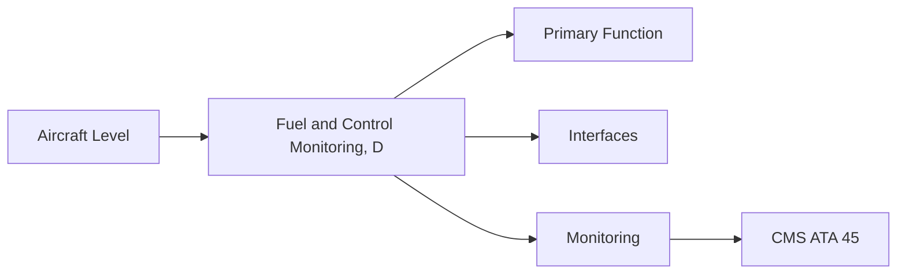
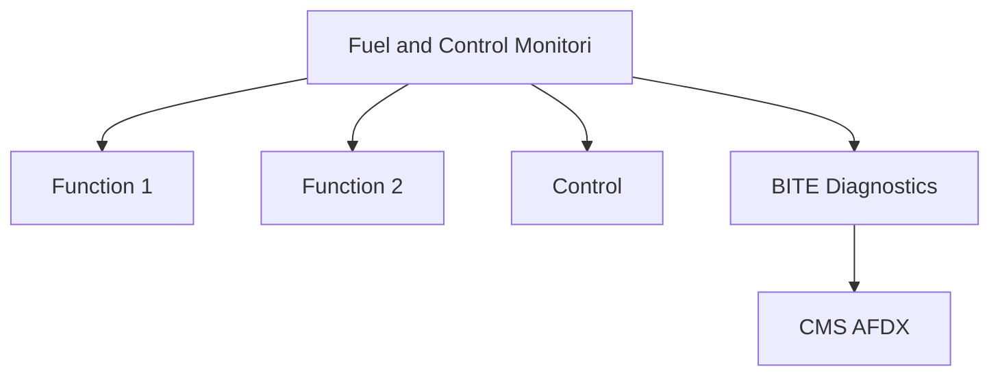

<!-- ──────────────────────────────────────────────────────────────────────────
     QATL-ATLAS-1000-ATLAS-060-069-064-080-FUEL-AND-CONTROL-MONITORING-DIAGNOSTICS-AND-CONTROL-INTERFACES
     ATA 64 · Fuel and Control Monitoring, Diagnostics and Control Interfaces
     programme-defined aircraft type — ATLAS Register 1000
────────────────────────────────────────────────────────────────────────────── -->

# Fuel and Control Monitoring, Diagnostics and Control Interfaces

---

## §0 Hyperlink Policy

> All hyperlinks in this document are **relative** (five directory levels: `../../../../../`).
> Absolute URLs are forbidden. Every linked document must exist in the Q+ATLANTIDE repository
> before the link is activated. Broken links are treated as open issues and must be resolved
> before the document is promoted from `DRAFT` to `APPROVED`.

---

## §1 Purpose

This document defines the agnostic ATLAS standard-level architecture context for `Fuel and Control Monitoring, Diagnostics and Control Interfaces`.

It describes the controlled scope, functions, interfaces, safety considerations, lifecycle traceability, and S1000D/CSDB mapping logic that programme implementations shall instantiate when this node is applicable.

This document is not a programme design baseline. Programme-specific capacities, locations, part numbers, effectivity, operating limits, maintenance references, and data module codes shall be defined only inside the applicable programme implementation branch.
## §2 Applicability

| Applicability Level | Rule |
|---|---|
| Standard taxonomy | Applies to the ATLAS node `064` |
| Programme implementation | Conditional; determined by programme architecture, trade studies, certification basis, and applicability model |
| Product configuration | Defined in the programme-specific configuration baseline |
| Effectivity | Defined in the programme CSDB / applicability layer |
| Non-applicability | Must be explicitly stated in the programme impact-study branch when excluded |
## §3 Functional Description ![DRAFT]

ATA 64 FADEC monitoring integration covers: fuel metering accuracy (FFT), filter DP, pump inlet suction, FOHE effectiveness, and EHFI status. FADEC provides all monitoring data to CMS via EDIU AFDX. ECAM engine page displays fuel flow, filter status, and fuel temperature for crew awareness.

---

## §4 Functional Breakdown

| ID | Name | Description | Lead Division |
|---|---|---|---|
| F-001 | FADEC fuel metering monitor (FFT data) | Primary function | Q-GREENTECH |
| F-002 | System integration | Interface management | Q-MECHANICS |
| F-003 | Monitoring | BITE and health data | Q-AIR |

---

## §5 System Context — Mermaid Diagram

---

## §6 Internal Architecture — Mermaid Diagram

---

## §7 Components and LRUs

| Component | Part Number | Qty | Location | Maintenance Interval | Notes |
|---|---|---|---|---|---|
| FADEC fuel metering monitor (FFT data) | FADEC internal — continuous | 1 per engine | FADEC | Continuous CBIT | Fuel flow vs. commanded flow comparison |
| Filter DP indication (CMS) | Filter DP switch → CMS | 1 per engine | EDIU → AFDX → CMS | Test at C-check | CMS maintenance message on high DP |
| FOHE effectiveness monitor | Fuel and oil temp sensors → FADEC | 1 per engine | FADEC calculation | On condition | Monitors FOHE thermal transfer effectiveness |
| ECAM engine page (fuel flow) | ECAM display system | Crew-shared | Cockpit centre display | On condition | Fuel flow, filter status, fuel temp display |
| FADEC fault history export (EDIU) | EDIU software | Per engine | EDIU hardware | Software update | Exports FADEC fault history to AHMS ground tool |

---

## §8 Interfaces

| Interface Type | Connected System | Protocol / Medium | Data / Function |
|---|---|---|---|
| ATA 45 CMS | Central Maintenance System | AFDX ARINC 664 P7 | BITE faults and health data |
| ATA 24 Electrical Power | Power distribution | HVDC / 28 V DC | LRU power supply |
| ATA 67 Engine Controls | FADEC | ARINC 429 / AFDX | Control commands and feedback |
| ATA 31 ECAM | Cockpit display | AFDX | Crew indication and alerts |

---

## §9 Operating Modes

| Mode | Trigger | System State | Actions / Consequences |
|---|---|---|---|
| Normal operation | Aircraft/engine powered | Nominal | Full function active |
| Engine shutdown | Commanded or fault | FADEC stops fuel | System de-energised |
| Maintenance | Isolated | Aircraft grounded | LOTO active |
| Ground test | Post-maintenance | Engine on ground | Test pass before service |

---

## §10 Performance and Budgets ![DRAFT]

| Parameter | Requirement | Target / Design Value | Status |
|---|---|---|---|
| System availability | ≥ 99.9 % dispatch | RAMS analysis | TBD |
| BITE fault detection | ≥ 80 % coverage | BITE design analysis | TBD |

---

## §11 Safety, Redundancy and Fault Tolerance

- All Fuel and Control Monitoring, Diagnostics and Control Interfaces maintenance requires FADEC and fuel system isolation before starting.
- Safety-critical fastener torques require calibrated tooling and dual sign-off.
- BITE failures affecting Fuel and Control Monitoring, Diagnostics and Control Interfaces dispatch must be resolved or deferred per approved MEL.

---

## §12 Maintenance and Diagnostics

| Task | Interval | Access | Special Tools |
|---|---|---|---|
| Scheduled Fuel and Control Monitoring, Diagnostics and Control Interfaces inspection | C-check | Per AMM access | NDT and inspection kit |
| BITE log review and download | A-check | Maintenance terminal | CMS terminal |
| Fuel and Control Monitoring, Diagnostics and Control Interfaces functional test after LRU replacement | After LRU change | Ground run | FADEC GSE |

---

## §13 Footprint — Physical, Electrical, Maintenance, Data ![TBD]

| Footprint Type | Parameter | Value | Notes |
|---|---|---|---|
| Physical | Mass (system total) | ![TBD] | Pending OEM data |
| Physical | Envelope (max) | ![TBD] | Pending detailed design |
| Electrical | Peak power (W) | ![TBD] | To be defined |
| Maintenance | Access category | Standard line maintenance | Per AMM |
| Data | AFDX bandwidth | ![TBD] | Per AFDX bus load analysis |

---

## §14 Safety and Certification References ![DRAFT]

| Standard / Document | Title | Issuing Body | Applicability |
|---|---|---|---|
| DO-178C | Software Considerations — FADEC fuel BITE | RTCA | FADEC BITE DAL A assurance |
| ARINC 664 P7 | AFDX | ARINC | CMS interface bus |
| SAE ARP4761 | Safety Assessment | SAE International | BITE coverage analysis |
| ATA iSpec 2200 | Chapter 64 | ATA | ATA chapter scope |
| MSG-3 Rev 2020 | Maintenance Programme Development | ATA / IATA | PHM credit for on-condition monitoring |

---

## §15 V&V Approach ![TBD]

| Phase | Method | Acceptance Criterion | Status |
|---|---|---|---|
| Design | Analysis and simulation | Meets all §10 performance requirements | ![TBD] |
| Integration | Ground functional test | All BITE tests pass; interfaces verified | ![TBD] |
| Qualification | DO-160G environmental test | All applicable tests pass | ![TBD] |
| Certification | EASA CS-25 / CS-E compliance demonstration | Type Certificate / STC approval | ![TBD] |

---

## §16 Glossary

| Term | Definition |
|---|---|
| **FFT** | Fuel Flow Transducer — measures actual fuel mass flow; FADEC closed-loop accuracy reference. |
| **Filter DP indication** | CMS maintenance message generated when filter DP exceeds the alert threshold. |
| **FOHE effectiveness** | Comparison of fuel temperature rise and oil temperature drop across FOHE; indicates FOHE blockage or fouling. |
| **ECAM engine page** | The cockpit Electronic Centralised Aircraft Monitor display page showing engine parameters including fuel flow. |
| **FADEC fault history** | Record of all FADEC BITE fault codes logged during operation; exported to AHMS for ground analysis. |
| **EDIU** | Engine Data Interface Unit — FADEC-to-AFDX gateway delivering fuel system data to CMS and ECAM. |
| **AHMS** | Aircraft Health Management System — ground tool analysing FADEC data for fuel system trending. |
| **Commanded vs. actual fuel flow** | FADEC closed-loop comparison; large deviation indicates HMU metering valve fault. |
| **Cold fuel alarm** | FADEC alert when LP fuel temperature drops below the icing risk threshold. |
| **BITE coverage** | Percentage of detectable fuel system faults detected by FADEC BITE; target ≥ 80 %. |

---

## §17 Open Issues

| ID | Description | Owner | Target |
|---|---|---|---|
| OI-064-080-001 | Finalise Fuel and Control Monitoring, Diagnostics and Control Interfaces design with engine OEM | Q-MECHANICS | 2026-Q4 |
| OI-064-080-002 | Define BITE coverage for Fuel and Control Monitoring, Diagnostics and Control Interfaces | Q-AIR / safety | 2027-Q1 |

---

## §18 Status Legend

| Badge | Meaning |
|---|---|
| `![DRAFT]` | Section is drafted but not yet reviewed |
| `![TBD]` | Content not yet started — to be defined |
| `![To Be Completed]` | Partially complete — needs additional content |
| `![APPROVED]` | Reviewed and formally approved |

---

## §19 Related Documents (Siblings in this Subsection)

- [064-000](./064-000.md)
- [064-010](./064-010.md)
- [064-020](./064-020.md)
- [064-030](./064-030.md)
- [064-040](./064-040.md)
- [064-050](./064-050.md)
- [064-060](./064-060.md)
- [064-070](./064-070.md)
- [064-090](./064-090.md)

---

## §20 Change Log

| Rev | Date | Author | Description |
|---|---|---|---|
| 0.1 | 2026-05-11 | @copilot | Initial DRAFT — contextualized content per programme-defined aircraft type architecture |
