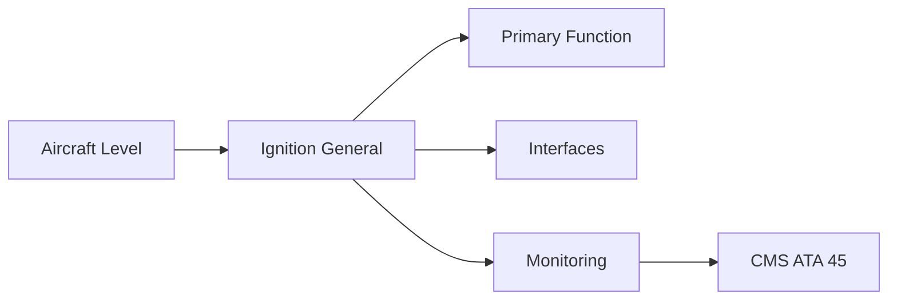
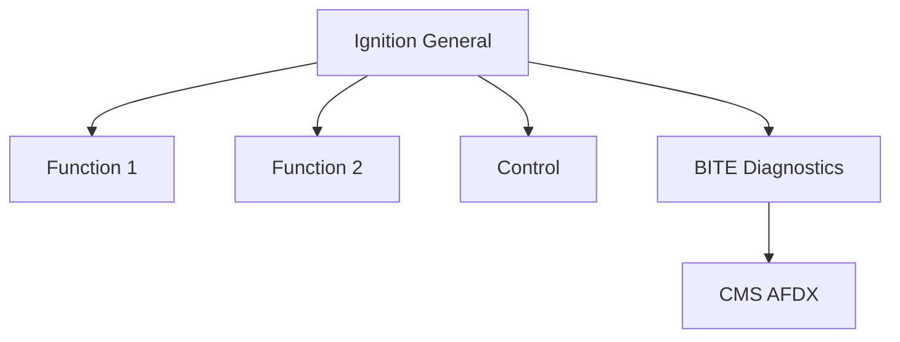

<!-- ──────────────────────────────────────────────────────────────────────────
     QATL-ATLAS-1000-ATLAS-060-069-065-000-IGNITION-GENERAL
     ATA 65 · Ignition General
     AMPEL360E eWTW — ATLAS Register 1000
────────────────────────────────────────────────────────────────────────────── -->

# Ignition General

---

## §0 Hyperlink Policy

> All hyperlinks in this document are **relative** (five directory levels: `../../../../../`).
> Absolute URLs are forbidden. Every linked document must exist in the Q+ATLANTIDE repository
> before the link is activated. Broken links are treated as open issues and must be resolved
> before the document is promoted from `DRAFT` to `APPROVED`.

---

## §1 Purpose

ATA Chapter 65 covers the engine ignition system — all components from the aircraft ignition switch through to the igniter plug spark discharge in the combustor. The ignition system must be capable of achieving reliable engine light-off at all conditions within the certified start and in-flight relight envelope, including cold-soak starts at −40 °C and high-altitude windmill relights.

On the AMPEL360E eWTW, the ignition system is entirely electrical (consistent with the bleed-less architecture). There are no pneumatic starter-related ignition complications. The system uses two high-energy ignition exciter boxes per engine and two igniter plugs per combustor, providing dual-redundant ignition coverage. The FADEC sequences ignition automatically for engine starts, continuous ignition mode (icing/turbulence), and in-flight relight.

---

## §2 Applicability

| Parameter | Value |
|---|---|
| Aircraft Program | AMPEL360E eWTW |
| ATA reference | ATA 65-000 — Ignition General |
| Certification basis | EASA CS-25 Amdt 27+ |
| S1000D SNS | 065-000-00 |

---

## §3 Functional Description ![DRAFT]

The ATA 65 architecture comprises four top-level functions:
1. **Ignition exciter** — converts 28 V DC aircraft power to high-voltage capacitor discharge (~2 J per spark at 12 000 V peak).
2. **Igniter lead (HT cable)** — shielded high-tension cable from exciter to plug.
3. **Igniter plug** — air-gapped spark plug in combustor; produces repeatable arc across combustor fuel-air mixture.
4. **FADEC ignition control** — sequences START, CONTINUOUS, and RELIGHT modes; commands exciter enable via discrete signal.

---

## §4 Functional Breakdown

| ID | Name | Description | Lead Division |
|---|---|---|---|
| F-001 | Ignition exciter box (A-channel) | Primary function | Q-GREENTECH |
| F-002 | System integration | Interface management | Q-MECHANICS |
| F-003 | Monitoring | BITE and health data | Q-AIR |

---

## §5 System Context — Mermaid Diagram

---

## §6 Internal Architecture — Mermaid Diagram

---

## §7 Components and LRUs

| Component | Part Number | Qty | Location | Maintenance Interval | Notes |
|---|---|---|---|---|---|
| Ignition exciter box (A-channel) | ExcA-PN-TBD | 1 per engine | Nacelle electrical bay | On condition / functional test C-check | Converts 28 V DC → 12 kV discharge; DO-160G qualified |
| Ignition exciter box (B-channel) | ExcB-PN-TBD | 1 per engine | Nacelle electrical bay | On condition / functional test C-check | Independent B-channel for dual redundancy |
| Igniter plug (No.1 — 4 o'clock) | IgnPlug1-PN-TBD | 1 per engine | Combustor 4 o'clock port | Replace per FH interval / on erosion limit | Air-gapped spark plug; high erosion rate at centre-body |
| Igniter plug (No.2 — 8 o'clock) | IgnPlug2-PN-TBD | 1 per engine | Combustor 8 o'clock port | Replace per FH interval / on erosion limit | Second plug; ensures ignition coverage if No.1 plug fails |
| HT ignition lead (A-channel) | HTLead-A-PN-TBD | 1 per engine | Exciter box to No.1 plug | Inspect at C-check; replace on damage | Shielded coaxial HV cable; must be kept clear of fuel lines |

---

## §8 Interfaces

| Interface Type | Connected System | Protocol / Medium | Data / Function |
|---|---|---|---|
| ATA 45 CMS | Central Maintenance System | AFDX ARINC 664 P7 | BITE faults and health data |
| ATA 24 Electrical Power | Power distribution | HVDC / 28 V DC | LRU power supply |
| ATA 67 Engine Controls | FADEC | ARINC 429 / AFDX | Control commands and feedback |
| ATA 31 ECAM | Cockpit display | AFDX | Crew indication and alerts |

---

## §9 Operating Modes

| Mode | Trigger | System State | Actions / Consequences |
|---|---|---|---|
| Normal operation | Aircraft/engine powered | Nominal | Full function active |
| Engine shutdown | Commanded or fault | FADEC stops fuel | System de-energised |
| Maintenance | Isolated | Aircraft grounded | LOTO active |
| Ground test | Post-maintenance | Engine on ground | Test pass before service |

---

## §10 Performance and Budgets ![DRAFT]

| Parameter | Requirement | Target / Design Value | Status |
|---|---|---|---|
| System availability | ≥ 99.9 % dispatch | RAMS analysis | TBD |
| BITE fault detection | ≥ 80 % coverage | BITE design analysis | TBD |

---

## §11 Safety, Redundancy and Fault Tolerance

- All Ignition General maintenance requires FADEC and fuel system isolation before starting.
- Safety-critical fastener torques require calibrated tooling and dual sign-off.
- BITE failures affecting Ignition General dispatch must be resolved or deferred per approved MEL.

---

## §12 Maintenance and Diagnostics

| Task | Interval | Access | Special Tools |
|---|---|---|---|
| Scheduled Ignition General inspection | C-check | Per AMM access | NDT and inspection kit |
| BITE log review and download | A-check | Maintenance terminal | CMS terminal |
| Ignition General functional test after LRU replacement | After LRU change | Ground run | FADEC GSE |

---

## §13 Footprint — Physical, Electrical, Maintenance, Data ![TBD]

| Footprint Type | Parameter | Value | Notes |
|---|---|---|---|
| Physical | Mass (system total) | ![TBD] | Pending OEM data |
| Physical | Envelope (max) | ![TBD] | Pending detailed design |
| Electrical | Peak power (W) | ![TBD] | To be defined |
| Maintenance | Access category | Standard line maintenance | Per AMM |
| Data | AFDX bandwidth | ![TBD] | Per AFDX bus load analysis |

---

## §14 Safety and Certification References ![DRAFT]

| Standard / Document | Title | Issuing Body | Applicability |
|---|---|---|---|
| EASA CS-E §790 | Ignition system | EASA | Engine ignition system certification |
| DO-160G | Environmental Conditions and Test Procedures | RTCA | Ignition exciter environmental qualification |
| SAE ARP1177 | Aircraft Gas Turbine Engine Ignition Systems | SAE International | Ignition system design reference |
| ATA iSpec 2200 | Chapter 65 — Ignition | ATA | ATA chapter scope |
| DO-178C | Software Considerations | RTCA | FADEC ignition control software assurance |

---

## §15 V&V Approach ![TBD]

| Phase | Method | Acceptance Criterion | Status |
|---|---|---|---|
| Design | Analysis and simulation | Meets all §10 performance requirements | ![TBD] |
| Integration | Ground functional test | All BITE tests pass; interfaces verified | ![TBD] |
| Qualification | DO-160G environmental test | All applicable tests pass | ![TBD] |
| Certification | EASA CS-25 / CS-E compliance demonstration | Type Certificate / STC approval | ![TBD] |

---

## §16 Glossary

| Term | Definition |
|---|---|
| **Ignition exciter** | Electronic device converting low-voltage DC to high-energy pulsed high-voltage spark discharge. |
| **HT lead** | High-Tension lead — shielded high-voltage cable carrying ignition spark energy from exciter to plug. |
| **Igniter plug** | Spark plug installed in combustor; generates arc that ignites fuel-air mixture during start. |
| **Capacitor discharge** | Ignition technique where a capacitor is charged to high voltage then discharged through the plug; produces high-energy spark. |
| **START mode** | FADEC ignition mode active during engine start sequence; both A and B channels energised until N1 self-sustaining. |
| **CONTINUOUS mode** | Ignition mode maintaining constant spark during conditions where flame-out risk is elevated (icing, turbulence, heavy precipitation). |
| **RELIGHT mode** | In-flight relight following engine shutdown or flame-out; FADEC commands both igniters for 30 s. |
| **Cold-soak start** | Engine start following prolonged exposure to very low temperatures; requires full spark energy for reliable light-off. |
| **Windmill relight** | Relight of a shutdown engine using ram air to windmill the LP/HP spools; limited by minimum windmill speed. |
| **Dual-redundant ignition** | Two independent igniter channels (A and B) and two plugs ensuring reliable light-off even if one channel or plug fails. |

---

## §17 Open Issues

| ID | Description | Owner | Target |
|---|---|---|---|
| OI-065-000-001 | Finalise Ignition General design with engine OEM | Q-MECHANICS | 2026-Q4 |
| OI-065-000-002 | Define BITE coverage for Ignition General | Q-AIR / safety | 2027-Q1 |

---

## §18 Status Legend

| Badge | Meaning |
|---|---|
| `![DRAFT]` | Section is drafted but not yet reviewed |
| `![TBD]` | Content not yet started — to be defined |
| `![To Be Completed]` | Partially complete — needs additional content |
| `![APPROVED]` | Reviewed and formally approved |

---

## §19 Related Documents (Siblings in this Subsection)

- [065-010](./065-010.md)
- [065-020](./065-020.md)
- [065-030](./065-030.md)
- [065-040](./065-040.md)
- [065-050](./065-050.md)
- [065-060](./065-060.md)
- [065-070](./065-070.md)
- [065-080](./065-080.md)
- [065-090](./065-090.md)

---

## §20 Change Log

| Rev | Date | Author | Description |
|---|---|---|---|
| 0.1 | 2026-05-11 | @copilot | Initial DRAFT — contextualized content per AMPEL360E eWTW architecture |
