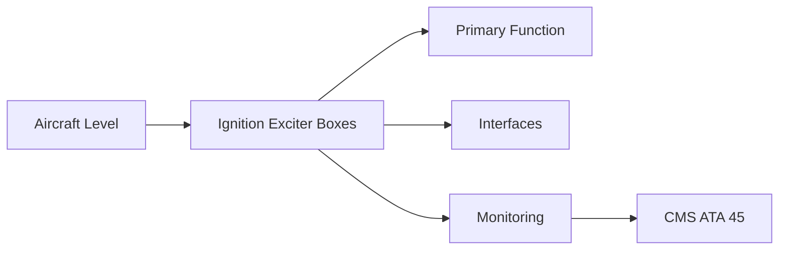
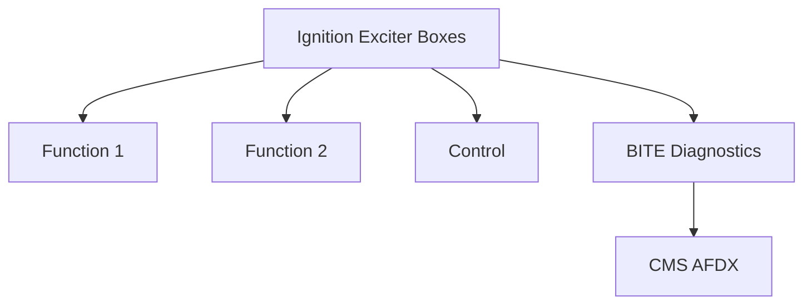

<!-- ──────────────────────────────────────────────────────────────────────────
     QATL-ATLAS-1000-ATLAS-060-069-065-010-IGNITION-EXCITER-BOXES
     ATA 65 · Ignition Exciter Boxes
     AMPEL360E eWTW — ATLAS Register 1000
────────────────────────────────────────────────────────────────────────────── -->

# Ignition Exciter Boxes

---

## §0 Hyperlink Policy

> All hyperlinks in this document are **relative** (five directory levels: `../../../../../`).
> Absolute URLs are forbidden. Every linked document must exist in the Q+ATLANTIDE repository
> before the link is activated. Broken links are treated as open issues and must be resolved
> before the document is promoted from `DRAFT` to `APPROVED`.

---

## §1 Purpose

The ignition exciter boxes are the primary energy conversion LRUs in the ignition system. Each exciter takes 28 V DC input and produces a high-voltage pulsed output (typically 12 000–20 000 V at 0.5–2.5 J per pulse) to the igniter plug. The dual-exciter architecture (A-channel and B-channel) ensures that a single exciter failure does not prevent engine starts.

---

## §2 Applicability

| Parameter | Value |
|---|---|
| Aircraft Program | AMPEL360E eWTW |
| ATA reference | ATA 65-010 — Ignition Exciter Boxes |
| Certification basis | EASA CS-25 Amdt 27+ |
| S1000D SNS | 065-010-00 |

---

## §3 Functional Description ![DRAFT]

The ignition exciter boxes are the primary energy conversion LRUs in the ignition system. Each exciter takes 28 V DC input and produces a high-voltage pulsed output (typically 12 000–20 000 V at 0.5–2.5 J per pulse) to the igniter plug. The dual-exciter architecture (A-channel and B-channel) ensures that a single exciter failure does not prevent engine starts.

---

## §4 Functional Breakdown

| ID | Name | Description | Lead Division |
|---|---|---|---|
| F-001 | Ignition exciter box (A-channel) | Primary function | Q-GREENTECH |
| F-002 | System integration | Interface management | Q-MECHANICS |
| F-003 | Monitoring | BITE and health data | Q-AIR |

---

## §5 System Context — Mermaid Diagram

---

## §6 Internal Architecture — Mermaid Diagram

---

## §7 Components and LRUs

| Component | Part Number | Qty | Location | Maintenance Interval | Notes |
|---|---|---|---|---|---|
| Ignition exciter box (A-channel) | ExcA-PN-TBD | 1 per engine | Nacelle electrical bay | On condition / functional test C-check | Primary start exciter; FADEC-switched |
| Ignition exciter box (B-channel) | ExcB-PN-TBD | 1 per engine | Nacelle electrical bay | On condition / functional test C-check | Secondary; fully independent from A-channel |
| Exciter BITE indicator (LED or discrete) | ExcBITE-PN-TBD | 1 per exciter | Exciter body | Check during functional test | 'FAULT' output to FADEC and CMS on exciter failure |
| 28 V DC power supply (to exciters) | ATA 24 circuit breakers | 2 per engine (A + B feeds) | Nacelle power panel | Per ATA 24 C/B inspection | Independent power buses for A and B exciters |
| EMI shielding (exciter mounting) | Drawing-controlled shield | Per exciter | Nacelle mounting bay | Inspect at C-check | Prevents HV EMI from exciter affecting avionics |

---

## §8 Interfaces

| Interface Type | Connected System | Protocol / Medium | Data / Function |
|---|---|---|---|
| ATA 45 CMS | Central Maintenance System | AFDX ARINC 664 P7 | BITE faults and health data |
| ATA 24 Electrical Power | Power distribution | HVDC / 28 V DC | LRU power supply |
| ATA 67 Engine Controls | FADEC | ARINC 429 / AFDX | Control commands and feedback |
| ATA 31 ECAM | Cockpit display | AFDX | Crew indication and alerts |

---

## §9 Operating Modes

| Mode | Trigger | System State | Actions / Consequences |
|---|---|---|---|
| Normal operation | Aircraft/engine powered | Nominal | Full function active |
| Engine shutdown | Commanded or fault | FADEC stops fuel | System de-energised |
| Maintenance | Isolated | Aircraft grounded | LOTO active |
| Ground test | Post-maintenance | Engine on ground | Test pass before service |

---

## §10 Performance and Budgets ![DRAFT]

| Parameter | Requirement | Target / Design Value | Status |
|---|---|---|---|
| System availability | ≥ 99.9 % dispatch | RAMS analysis | TBD |
| BITE fault detection | ≥ 80 % coverage | BITE design analysis | TBD |

---

## §11 Safety, Redundancy and Fault Tolerance

- All Ignition Exciter Boxes maintenance requires FADEC and fuel system isolation before starting.
- Safety-critical fastener torques require calibrated tooling and dual sign-off.
- BITE failures affecting Ignition Exciter Boxes dispatch must be resolved or deferred per approved MEL.

---

## §12 Maintenance and Diagnostics

| Task | Interval | Access | Special Tools |
|---|---|---|---|
| Scheduled Ignition Exciter Boxes inspection | C-check | Per AMM access | NDT and inspection kit |
| BITE log review and download | A-check | Maintenance terminal | CMS terminal |
| Ignition Exciter Boxes functional test after LRU replacement | After LRU change | Ground run | FADEC GSE |

---

## §13 Footprint — Physical, Electrical, Maintenance, Data ![TBD]

| Footprint Type | Parameter | Value | Notes |
|---|---|---|---|
| Physical | Mass (system total) | ![TBD] | Pending OEM data |
| Physical | Envelope (max) | ![TBD] | Pending detailed design |
| Electrical | Peak power (W) | ![TBD] | To be defined |
| Maintenance | Access category | Standard line maintenance | Per AMM |
| Data | AFDX bandwidth | ![TBD] | Per AFDX bus load analysis |

---

## §14 Safety and Certification References ![DRAFT]

| Standard / Document | Title | Issuing Body | Applicability |
|---|---|---|---|
| EASA CS-E §790 | Ignition system | EASA | Exciter certification requirement |
| DO-160G Section 21 | Emission of Radio Frequency Energy | RTCA | Exciter EMI qualification |
| SAE ARP1177 | Gas Turbine Ignition Systems | SAE International | Exciter design reference |
| MIL-I-6181 | Interference Control Requirements — Aircraft Ignition | US DoD | Ignition EMI reference |
| ATA iSpec 2200 | Chapter 65 | ATA | ATA chapter scope |

---

## §15 V&V Approach ![TBD]

| Phase | Method | Acceptance Criterion | Status |
|---|---|---|---|
| Design | Analysis and simulation | Meets all §10 performance requirements | ![TBD] |
| Integration | Ground functional test | All BITE tests pass; interfaces verified | ![TBD] |
| Qualification | DO-160G environmental test | All applicable tests pass | ![TBD] |
| Certification | EASA CS-25 / CS-E compliance demonstration | Type Certificate / STC approval | ![TBD] |

---

## §16 Glossary

| Term | Definition |
|---|---|
| **Energy per spark** | The electrical energy delivered to the igniter plug per discharge pulse; typically 0.5–2.5 J. |
| **Repetition rate** | Number of sparks per second; typically 1–4 Hz; FADEC-controlled. |
| **A-channel** | The primary ignition channel; exciter A powers igniter plug No.1 (4 o'clock). |
| **B-channel** | The secondary independent ignition channel; exciter B powers igniter plug No.2 (8 o'clock). |
| **Capacitor charging voltage** | The high voltage (12–20 kV) to which the exciter internal capacitor is charged before discharge. |
| **Exciter output (HV side)** | The high-voltage output connection from the exciter box to the HT lead; must be handled with extreme care when energised. |
| **28 V DC feed (ignition)** | The exciter power source from the aircraft electrical system; typically from separate buses for A and B channels. |
| **EMI shielding** | Electro-magnetic interference shielding required around igniters and HT leads to prevent interference with sensitive avionics. |
| **Functional test** | Ground test with exciter energised and output measured; verifies exciter energy output and repetition rate. |
| **BITE output** | Discrete or serial fault signal from exciter to FADEC and CMS indicating exciter internal fault. |

---

## §17 Open Issues

| ID | Description | Owner | Target |
|---|---|---|---|
| OI-065-010-001 | Finalise Ignition Exciter Boxes design with engine OEM | Q-MECHANICS | 2026-Q4 |
| OI-065-010-002 | Define BITE coverage for Ignition Exciter Boxes | Q-AIR / safety | 2027-Q1 |

---

## §18 Status Legend

| Badge | Meaning |
|---|---|
| `![DRAFT]` | Section is drafted but not yet reviewed |
| `![TBD]` | Content not yet started — to be defined |
| `![To Be Completed]` | Partially complete — needs additional content |
| `![APPROVED]` | Reviewed and formally approved |

---

## §19 Related Documents (Siblings in this Subsection)

- [065-000](./065-000.md)
- [065-020](./065-020.md)
- [065-030](./065-030.md)
- [065-040](./065-040.md)
- [065-050](./065-050.md)
- [065-060](./065-060.md)
- [065-070](./065-070.md)
- [065-080](./065-080.md)
- [065-090](./065-090.md)

---

## §20 Change Log

| Rev | Date | Author | Description |
|---|---|---|---|
| 0.1 | 2026-05-11 | @copilot | Initial DRAFT — contextualized content per AMPEL360E eWTW architecture |
