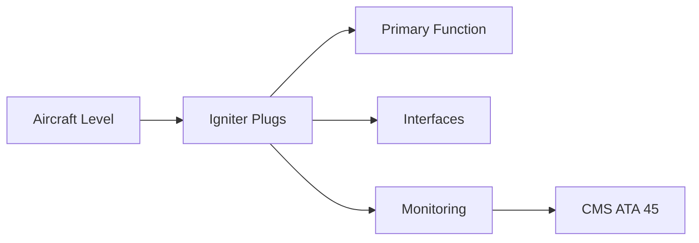
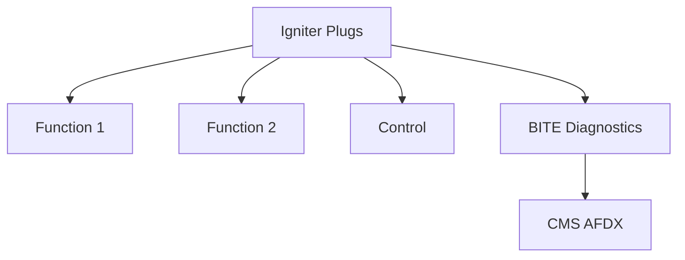

<!-- ──────────────────────────────────────────────────────────────────────────
     QATL-ATLAS-1000-ATLAS-060-069-065-020-IGNITER-PLUGS
     ATA 65 · Igniter Plugs
     AMPEL360E eWTW — ATLAS Register 1000
────────────────────────────────────────────────────────────────────────────── -->

# Igniter Plugs

---

## §0 Hyperlink Policy

> All hyperlinks in this document are **relative** (five directory levels: `../../../../../`).
> Absolute URLs are forbidden. Every linked document must exist in the Q+ATLANTIDE repository
> before the link is activated. Broken links are treated as open issues and must be resolved
> before the document is promoted from `DRAFT` to `APPROVED`.

---

## §1 Purpose

Igniter plugs are the consumable elements of the ignition system. They are installed in the combustor casing at defined circumferential positions and produce an arc gap discharge that ignites the fuel-air mixture. Erosion of the electrode is the primary wear mechanism; plug life is measured in FH or number of starts and is defined in the engine OEM maintenance manual.

---

## §2 Applicability

| Parameter | Value |
|---|---|
| Aircraft Program | AMPEL360E eWTW |
| ATA reference | ATA 65-020 — Igniter Plugs |
| Certification basis | EASA CS-25 Amdt 27+ |
| S1000D SNS | 065-020-00 |

---

## §3 Functional Description ![DRAFT]

Igniter plugs are the consumable elements of the ignition system. They are installed in the combustor casing at defined circumferential positions and produce an arc gap discharge that ignites the fuel-air mixture. Erosion of the electrode is the primary wear mechanism; plug life is measured in FH or number of starts and is defined in the engine OEM maintenance manual.

---

## §4 Functional Breakdown

| ID | Name | Description | Lead Division |
|---|---|---|---|
| F-001 | Igniter plug (No.1 — 4 o'clock) | Primary function | Q-GREENTECH |
| F-002 | System integration | Interface management | Q-MECHANICS |
| F-003 | Monitoring | BITE and health data | Q-AIR |

---

## §5 System Context — Mermaid Diagram

---

## §6 Internal Architecture — Mermaid Diagram

---

## §7 Components and LRUs

| Component | Part Number | Qty | Location | Maintenance Interval | Notes |
|---|---|---|---|---|---|
| Igniter plug (No.1 — 4 o'clock) | IgnPlug1-PN-TBD | 1 per engine | Combustor 4 o'clock igniter boss | Replace per FH / start count / erosion limit | Air-gap plug; high-energy tip; SAF-compatible seat materials |
| Igniter plug (No.2 — 8 o'clock) | IgnPlug2-PN-TBD | 1 per engine | Combustor 8 o'clock igniter boss | Replace per FH / start count / erosion limit | Second plug; redundant coverage |
| Igniter plug boss (combustor casing) | IgnBoss-PN-TBD | 1 per plug position | Combustor casing | Inspect at plug removal / replace if damaged | Threaded insert in combustor outer casing for plug seating |
| Igniter plug seating gasket | IgnGasket-PN-TBD | 2 per engine (1 per plug) | Between plug and boss | Replace at each plug removal | Seal prevents hot gas blowby; single-use |
| Plug gap gauge (maintenance tool) | Calibrated gap gauge — engine-specific | Per MRO team | Tool store | Annual calibration | Measures electrode gap at removal for condition assessment |

---

## §8 Interfaces

| Interface Type | Connected System | Protocol / Medium | Data / Function |
|---|---|---|---|
| ATA 45 CMS | Central Maintenance System | AFDX ARINC 664 P7 | BITE faults and health data |
| ATA 24 Electrical Power | Power distribution | HVDC / 28 V DC | LRU power supply |
| ATA 67 Engine Controls | FADEC | ARINC 429 / AFDX | Control commands and feedback |
| ATA 31 ECAM | Cockpit display | AFDX | Crew indication and alerts |

---

## §9 Operating Modes

| Mode | Trigger | System State | Actions / Consequences |
|---|---|---|---|
| Normal operation | Aircraft/engine powered | Nominal | Full function active |
| Engine shutdown | Commanded or fault | FADEC stops fuel | System de-energised |
| Maintenance | Isolated | Aircraft grounded | LOTO active |
| Ground test | Post-maintenance | Engine on ground | Test pass before service |

---

## §10 Performance and Budgets ![DRAFT]

| Parameter | Requirement | Target / Design Value | Status |
|---|---|---|---|
| System availability | ≥ 99.9 % dispatch | RAMS analysis | TBD |
| BITE fault detection | ≥ 80 % coverage | BITE design analysis | TBD |

---

## §11 Safety, Redundancy and Fault Tolerance

- All Igniter Plugs maintenance requires FADEC and fuel system isolation before starting.
- Safety-critical fastener torques require calibrated tooling and dual sign-off.
- BITE failures affecting Igniter Plugs dispatch must be resolved or deferred per approved MEL.

---

## §12 Maintenance and Diagnostics

| Task | Interval | Access | Special Tools |
|---|---|---|---|
| Scheduled Igniter Plugs inspection | C-check | Per AMM access | NDT and inspection kit |
| BITE log review and download | A-check | Maintenance terminal | CMS terminal |
| Igniter Plugs functional test after LRU replacement | After LRU change | Ground run | FADEC GSE |

---

## §13 Footprint — Physical, Electrical, Maintenance, Data ![TBD]

| Footprint Type | Parameter | Value | Notes |
|---|---|---|---|
| Physical | Mass (system total) | ![TBD] | Pending OEM data |
| Physical | Envelope (max) | ![TBD] | Pending detailed design |
| Electrical | Peak power (W) | ![TBD] | To be defined |
| Maintenance | Access category | Standard line maintenance | Per AMM |
| Data | AFDX bandwidth | ![TBD] | Per AFDX bus load analysis |

---

## §14 Safety and Certification References ![DRAFT]

| Standard / Document | Title | Issuing Body | Applicability |
|---|---|---|---|
| SAE ARP1177 | Gas Turbine Ignition Systems | SAE International | Igniter plug design and life reference |
| SAE AS3266 | Igniter Plug Specification | SAE International | Igniter plug qualification |
| EASA CS-E §790 | Ignition system | EASA | Plug certification |
| ATA iSpec 2200 | Chapter 65 | ATA | ATA chapter scope |
| ASTM D7566 | SAF specification | ASTM | Plug seat SAF material compatibility |

---

## §15 V&V Approach ![TBD]

| Phase | Method | Acceptance Criterion | Status |
|---|---|---|---|
| Design | Analysis and simulation | Meets all §10 performance requirements | ![TBD] |
| Integration | Ground functional test | All BITE tests pass; interfaces verified | ![TBD] |
| Qualification | DO-160G environmental test | All applicable tests pass | ![TBD] |
| Certification | EASA CS-25 / CS-E compliance demonstration | Type Certificate / STC approval | ![TBD] |

---

## §16 Glossary

| Term | Definition |
|---|---|
| **Air-gap plug** | Igniter plug design with an open gap between the centre and outer electrodes; arc discharges across the gap. |
| **Erosion** | Material loss from plug electrodes due to the high-energy arc discharge; the primary plug wear mechanism. |
| **Plug life** | The maximum FH or start count before mandatory replacement; published in the engine OEM maintenance manual. |
| **Electrode gap** | The distance between centre and outer electrodes of the igniter plug; must be within limits for reliable ignition. |
| **Hot gas blowby** | Gas leakage past the plug seat into the nacelle environment if the seat gasket fails; a fire risk. |
| **Plug seating torque** | Torque applied to igniter plug during installation; must be correct to seat the gasket and prevent blowby. |
| **Combustor igniter boss** | The threaded insert in the combustor casing into which the igniter plug is screwed. |
| **SAF compatibility (plug)** | Plug seat materials must be compatible with SAF fuel components that may be present in combustor zone. |
| **Centre electrode** | The central conductor of the igniter plug; one end of the spark arc gap. |
| **Outer electrode (ground)** | The outer conductor of the igniter plug; forms the other end of the spark arc gap; typically the plug body. |

---

## §17 Open Issues

| ID | Description | Owner | Target |
|---|---|---|---|
| OI-065-020-001 | Finalise Igniter Plugs design with engine OEM | Q-MECHANICS | 2026-Q4 |
| OI-065-020-002 | Define BITE coverage for Igniter Plugs | Q-AIR / safety | 2027-Q1 |

---

## §18 Status Legend

| Badge | Meaning |
|---|---|
| `![DRAFT]` | Section is drafted but not yet reviewed |
| `![TBD]` | Content not yet started — to be defined |
| `![To Be Completed]` | Partially complete — needs additional content |
| `![APPROVED]` | Reviewed and formally approved |

---

## §19 Related Documents (Siblings in this Subsection)

- [065-000](./065-000.md)
- [065-010](./065-010.md)
- [065-030](./065-030.md)
- [065-040](./065-040.md)
- [065-050](./065-050.md)
- [065-060](./065-060.md)
- [065-070](./065-070.md)
- [065-080](./065-080.md)
- [065-090](./065-090.md)

---

## §20 Change Log

| Rev | Date | Author | Description |
|---|---|---|---|
| 0.1 | 2026-05-11 | @copilot | Initial DRAFT — contextualized content per AMPEL360E eWTW architecture |
