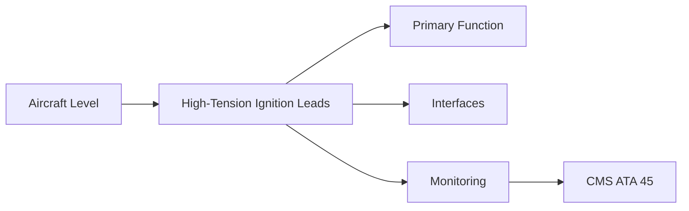
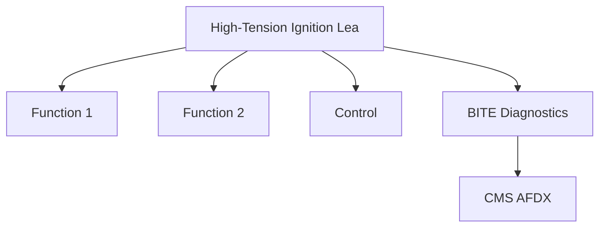

<!-- ──────────────────────────────────────────────────────────────────────────
     QATL-ATLAS-1000-ATLAS-060-069-065-030-HIGH-TENSION-IGNITION-LEADS
     ATA 65 · High-Tension Ignition Leads
     programme-defined aircraft type — ATLAS Register 1000
────────────────────────────────────────────────────────────────────────────── -->

# High-Tension Ignition Leads

---

## §0 Hyperlink Policy

> All hyperlinks in this document are **relative** (five directory levels: `../../../../../`).
> Absolute URLs are forbidden. Every linked document must exist in the Q+ATLANTIDE repository
> before the link is activated. Broken links are treated as open issues and must be resolved
> before the document is promoted from `DRAFT` to `APPROVED`.

---

## §1 Purpose

This document defines the agnostic ATLAS standard-level architecture context for `High-Tension Ignition Leads`.

It describes the controlled scope, functions, interfaces, safety considerations, lifecycle traceability, and S1000D/CSDB mapping logic that programme implementations shall instantiate when this node is applicable.

This document is not a programme design baseline. Programme-specific capacities, locations, part numbers, effectivity, operating limits, maintenance references, and data module codes shall be defined only inside the applicable programme implementation branch.
## §2 Applicability

| Applicability Level | Rule |
|---|---|
| Standard taxonomy | Applies to the ATLAS node `065` |
| Programme implementation | Conditional; determined by programme architecture, trade studies, certification basis, and applicability model |
| Product configuration | Defined in the programme-specific configuration baseline |
| Effectivity | Defined in the programme CSDB / applicability layer |
| Non-applicability | Must be explicitly stated in the programme impact-study branch when excluded |
## §3 Functional Description ![DRAFT]

High-tension (HT) ignition leads carry the high-voltage discharge from the exciter box to the igniter plug. The HT lead is a coaxial cable with an outer shield and inner conductor; the centre conductor carries the HV pulse while the outer shield provides EMI attenuation. HT leads must be routed clear of fuel lines and hot surfaces to prevent fire risk from potential HV arc-over.

---

## §4 Functional Breakdown

| ID | Name | Description | Lead Division |
|---|---|---|---|
| F-001 | HT lead (A-channel, exciter to plug No.1) | Primary function | Q-GREENTECH |
| F-002 | System integration | Interface management | Q-MECHANICS |
| F-003 | Monitoring | BITE and health data | Q-AIR |

---

## §5 System Context — Mermaid Diagram

---

## §6 Internal Architecture — Mermaid Diagram

---

## §7 Components and LRUs

| Component | Part Number | Qty | Location | Maintenance Interval | Notes |
|---|---|---|---|---|---|
| HT lead (A-channel, exciter to plug No.1) | HTLead-A-PN-TBD | 1 per engine | Exciter → No.1 plug (4 o'clock) | Inspect at C-check; replace on damage | Coaxial HV cable; silicone outer jacket; shielded |
| HT lead (B-channel, exciter to plug No.2) | HTLead-B-PN-TBD | 1 per engine | Exciter → No.2 plug (8 o'clock) | Inspect at C-check; replace on damage | Independent B-channel cable route |
| HT lead clamps and P-clips | Clamp-HT-PN-TBD | Multiple per lead | Along nacelle structure | Inspect at C-check | Maintain routing; prevent chafing on adjacent lines |
| HT lead end terminations (plug side) | Term-HT-PN-TBD | 2 per engine | At each igniter plug connection | Inspect at plug replacement | HV spring-contact terminal; inspect for corrosion/tracking |
| Lead routing inspection fixture (tool) | Routing-Fix-PN-TBD | Per hangar | Tool store | Annual inspection | Ensures correct routing during HT lead replacement |

---

## §8 Interfaces

| Interface Type | Connected System | Protocol / Medium | Data / Function |
|---|---|---|---|
| ATA 45 CMS | Central Maintenance System | AFDX ARINC 664 P7 | BITE faults and health data |
| ATA 24 Electrical Power | Power distribution | HVDC / 28 V DC | LRU power supply |
| ATA 67 Engine Controls | FADEC | ARINC 429 / AFDX | Control commands and feedback |
| ATA 31 ECAM | Cockpit display | AFDX | Crew indication and alerts |

---

## §9 Operating Modes

| Mode | Trigger | System State | Actions / Consequences |
|---|---|---|---|
| Normal operation | Aircraft/engine powered | Nominal | Full function active |
| Engine shutdown | Commanded or fault | FADEC stops fuel | System de-energised |
| Maintenance | Isolated | Aircraft grounded | LOTO active |
| Ground test | Post-maintenance | Engine on ground | Test pass before service |

---

## §10 Performance and Budgets ![DRAFT]

| Parameter | Requirement | Target / Design Value | Status |
|---|---|---|---|
| System availability | ≥ 99.9 % dispatch | RAMS analysis | TBD |
| BITE fault detection | ≥ 80 % coverage | BITE design analysis | TBD |

---

## §11 Safety, Redundancy and Fault Tolerance

- All High-Tension Ignition Leads maintenance requires FADEC and fuel system isolation before starting.
- Safety-critical fastener torques require calibrated tooling and dual sign-off.
- BITE failures affecting High-Tension Ignition Leads dispatch must be resolved or deferred per approved MEL.

---

## §12 Maintenance and Diagnostics

| Task | Interval | Access | Special Tools |
|---|---|---|---|
| Scheduled High-Tension Ignition Leads inspection | C-check | Per AMM access | NDT and inspection kit |
| BITE log review and download | A-check | Maintenance terminal | CMS terminal |
| High-Tension Ignition Leads functional test after LRU replacement | After LRU change | Ground run | FADEC GSE |

---

## §13 Footprint — Physical, Electrical, Maintenance, Data ![TBD]

| Footprint Type | Parameter | Value | Notes |
|---|---|---|---|
| Physical | Mass (system total) | ![TBD] | Pending OEM data |
| Physical | Envelope (max) | ![TBD] | Pending detailed design |
| Electrical | Peak power (W) | ![TBD] | To be defined |
| Maintenance | Access category | Standard line maintenance | Per AMM |
| Data | AFDX bandwidth | ![TBD] | Per AFDX bus load analysis |

---

## §14 Safety and Certification References ![DRAFT]

| Standard / Document | Title | Issuing Body | Applicability |
|---|---|---|---|
| SAE ARP1177 | Gas Turbine Ignition Systems | SAE International | HT lead design reference |
| DO-160G Section 21 | EMI emission | RTCA | HT lead EMI compliance test |
| EASA CS-E §790 | Ignition system | EASA | HT lead installation requirement |
| CS-25 §25.1183 | Flammable fluid line separation | EASA | HT lead clearance from fuel lines |
| ATA iSpec 2200 | Chapter 65 | ATA | ATA chapter scope |

---

## §15 V&V Approach ![TBD]

| Phase | Method | Acceptance Criterion | Status |
|---|---|---|---|
| Design | Analysis and simulation | Meets all §10 performance requirements | ![TBD] |
| Integration | Ground functional test | All BITE tests pass; interfaces verified | ![TBD] |
| Qualification | DO-160G environmental test | All applicable tests pass | ![TBD] |
| Certification | EASA CS-25 / CS-E compliance demonstration | Type Certificate / STC approval | ![TBD] |

---

## §16 Glossary

| Term | Definition |
|---|---|
| **HT lead** | High-Tension lead — a coaxial cable carrying high-voltage ignition pulse from exciter to plug. |
| **Coaxial cable** | A cable with a centre conductor surrounded by insulation, then a shield, then outer jacket; standard for HV signal transmission. |
| **HV arc-over** | Unintended electrical discharge from the HT lead through adjacent material (insulation failure); can ignite fuel vapour. |
| **Silicone jacket** | The outer protective covering of the HT lead; silicone is used for its resistance to high temperature and engine fluids. |
| **P-clip** | A clip used to secure cables and leads to aircraft structure; prevents vibration-induced chafing. |
| **Tracking** | Electrical breakdown along the surface of an insulator under voltage stress, leaving a carbon track; indicates insulation degradation. |
| **Shielding** | The outer braid or foil of the coaxial HT lead that provides EMI attenuation and prevents HV radiation. |
| **Spring-contact terminal** | The igniter-plug-end terminal of the HT lead; a spring-loaded contact that maintains electrical connection. |
| **Minimum clearance** | The minimum distance HT leads must maintain from fuel lines and hot surfaces; defined in the routing drawing. |
| **Insulation resistance** | The DC resistance measured between HT lead conductor and shield; low value indicates insulation degradation. |

---

## §17 Open Issues

| ID | Description | Owner | Target |
|---|---|---|---|
| OI-065-030-001 | Finalise High-Tension Ignition Leads design with engine OEM | Q-MECHANICS | 2026-Q4 |
| OI-065-030-002 | Define BITE coverage for High-Tension Ignition Leads | Q-AIR / safety | 2027-Q1 |

---

## §18 Status Legend

| Badge | Meaning |
|---|---|
| `![DRAFT]` | Section is drafted but not yet reviewed |
| `![TBD]` | Content not yet started — to be defined |
| `![To Be Completed]` | Partially complete — needs additional content |
| `![APPROVED]` | Reviewed and formally approved |

---

## §19 Related Documents (Siblings in this Subsection)

- [065-000](./065-000.md)
- [065-010](./065-010.md)
- [065-020](./065-020.md)
- [065-040](./065-040.md)
- [065-050](./065-050.md)
- [065-060](./065-060.md)
- [065-070](./065-070.md)
- [065-080](./065-080.md)
- [065-090](./065-090.md)

---

## §20 Change Log

| Rev | Date | Author | Description |
|---|---|---|---|
| 0.1 | 2026-05-11 | @copilot | Initial DRAFT — contextualized content per programme-defined aircraft type architecture |
