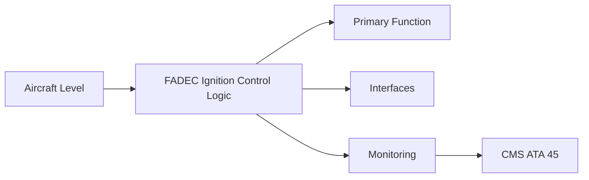
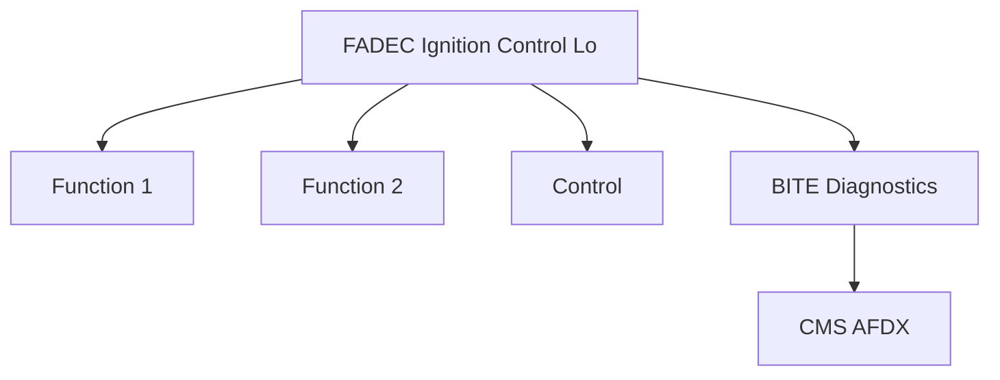

<!-- ──────────────────────────────────────────────────────────────────────────
     QATL-ATLAS-1000-ATLAS-060-069-065-040-FADEC-IGNITION-CONTROL-LOGIC
     ATA 65 · FADEC Ignition Control Logic
     programme-defined aircraft type — ATLAS Register 1000
────────────────────────────────────────────────────────────────────────────── -->

# FADEC Ignition Control Logic

---

## §0 Hyperlink Policy

> All hyperlinks in this document are **relative** (five directory levels: `../../../../../`).
> Absolute URLs are forbidden. Every linked document must exist in the Q+ATLANTIDE repository
> before the link is activated. Broken links are treated as open issues and must be resolved
> before the document is promoted from `DRAFT` to `APPROVED`.

---

## §1 Purpose

This document defines the agnostic ATLAS standard-level architecture context for `FADEC Ignition Control Logic`.

It describes the controlled scope, functions, interfaces, safety considerations, lifecycle traceability, and S1000D/CSDB mapping logic that programme implementations shall instantiate when this node is applicable.

This document is not a programme design baseline. Programme-specific capacities, locations, part numbers, effectivity, operating limits, maintenance references, and data module codes shall be defined only inside the applicable programme implementation branch.
## §2 Applicability

| Applicability Level | Rule |
|---|---|
| Standard taxonomy | Applies to the ATLAS node `065` |
| Programme implementation | Conditional; determined by programme architecture, trade studies, certification basis, and applicability model |
| Product configuration | Defined in the programme-specific configuration baseline |
| Effectivity | Defined in the programme CSDB / applicability layer |
| Non-applicability | Must be explicitly stated in the programme impact-study branch when excluded |
## §3 Functional Description ![DRAFT]

FADEC software manages all ignition sequencing. The ignition control function within FADEC is classified as DO-178C DAL C (non-critical to continued safe flight; a single ignition failure does not result in catastrophic failure on a twin-engine aircraft). FADEC controls ignition in three modes: START, CONTINUOUS, and RELIGHT.

---

## §4 Functional Breakdown

| ID | Name | Description | Lead Division |
|---|---|---|---|
| F-001 | FADEC ignition control software (DAL C) | Primary function | Q-GREENTECH |
| F-002 | System integration | Interface management | Q-MECHANICS |
| F-003 | Monitoring | BITE and health data | Q-AIR |

---

## §5 System Context — Mermaid Diagram

---

## §6 Internal Architecture — Mermaid Diagram

---

## §7 Components and LRUs

| Component | Part Number | Qty | Location | Maintenance Interval | Notes |
|---|---|---|---|---|---|
| FADEC ignition control software (DAL C) | FADEC partition | Per engine | FADEC hardware | Software update | Sequences START, CONTINUOUS, RELIGHT modes |
| Ignition mode selector switch (crew) | ECAM/overhead panel switch | 1 per engine (AUTO, CONT, OFF) | Overhead panel | Functional test at C-check | Allows crew to command continuous ignition manually |
| N1/N2 speed signal (start logic) | Speed sensor → FADEC | 2 per spool per engine | Fan frame / HP bearing frame | On condition | FADEC monitors spool acceleration for start success/abort |
| EGT/T41 signal (hot-start protection) | T41 thermocouple → FADEC | Multiple per engine | HPT inlet | On condition | FADEC monitors EGT rise during start to abort hot start |
| Igniter disable (fire handle) | Fire handle → FADEC | 1 per engine | Cockpit overhead panel | Functional test at C-check | Fire handle commands ignition OFF as part of engine shutdown |

---

## §8 Interfaces

| Interface Type | Connected System | Protocol / Medium | Data / Function |
|---|---|---|---|
| ATA 45 CMS | Central Maintenance System | AFDX ARINC 664 P7 | BITE faults and health data |
| ATA 24 Electrical Power | Power distribution | HVDC / 28 V DC | LRU power supply |
| ATA 67 Engine Controls | FADEC | ARINC 429 / AFDX | Control commands and feedback |
| ATA 31 ECAM | Cockpit display | AFDX | Crew indication and alerts |

---

## §9 Operating Modes

| Mode | Trigger | System State | Actions / Consequences |
|---|---|---|---|
| Normal operation | Aircraft/engine powered | Nominal | Full function active |
| Engine shutdown | Commanded or fault | FADEC stops fuel | System de-energised |
| Maintenance | Isolated | Aircraft grounded | LOTO active |
| Ground test | Post-maintenance | Engine on ground | Test pass before service |

---

## §10 Performance and Budgets ![DRAFT]

| Parameter | Requirement | Target / Design Value | Status |
|---|---|---|---|
| System availability | ≥ 99.9 % dispatch | RAMS analysis | TBD |
| BITE fault detection | ≥ 80 % coverage | BITE design analysis | TBD |

---

## §11 Safety, Redundancy and Fault Tolerance

- All FADEC Ignition Control Logic maintenance requires FADEC and fuel system isolation before starting.
- Safety-critical fastener torques require calibrated tooling and dual sign-off.
- BITE failures affecting FADEC Ignition Control Logic dispatch must be resolved or deferred per approved MEL.

---

## §12 Maintenance and Diagnostics

| Task | Interval | Access | Special Tools |
|---|---|---|---|
| Scheduled FADEC Ignition Control Logic inspection | C-check | Per AMM access | NDT and inspection kit |
| BITE log review and download | A-check | Maintenance terminal | CMS terminal |
| FADEC Ignition Control Logic functional test after LRU replacement | After LRU change | Ground run | FADEC GSE |

---

## §13 Footprint — Physical, Electrical, Maintenance, Data ![TBD]

| Footprint Type | Parameter | Value | Notes |
|---|---|---|---|
| Physical | Mass (system total) | ![TBD] | Pending OEM data |
| Physical | Envelope (max) | ![TBD] | Pending detailed design |
| Electrical | Peak power (W) | ![TBD] | To be defined |
| Maintenance | Access category | Standard line maintenance | Per AMM |
| Data | AFDX bandwidth | ![TBD] | Per AFDX bus load analysis |

---

## §14 Safety and Certification References ![DRAFT]

| Standard / Document | Title | Issuing Body | Applicability |
|---|---|---|---|
| DO-178C | Software Considerations — FADEC ignition DAL C | RTCA | FADEC ignition software assurance |
| SAE ARP4761 | Safety Assessment Process | SAE International | FADEC FHA for ignition function |
| EASA CS-E §790 | Ignition system | EASA | Ignition control certification |
| EASA CS-25 §25.1165 | Engine ignition systems | EASA | In-flight relight requirement |
| ATA iSpec 2200 | Chapter 65 | ATA | ATA chapter scope |

---

## §15 V&V Approach ![TBD]

| Phase | Method | Acceptance Criterion | Status |
|---|---|---|---|
| Design | Analysis and simulation | Meets all §10 performance requirements | ![TBD] |
| Integration | Ground functional test | All BITE tests pass; interfaces verified | ![TBD] |
| Qualification | DO-160G environmental test | All applicable tests pass | ![TBD] |
| Certification | EASA CS-25 / CS-E compliance demonstration | Type Certificate / STC approval | ![TBD] |

---

## §16 Glossary

| Term | Definition |
|---|---|
| **START mode** | Ignition mode during engine start sequence; both igniters energised until self-sustaining N1. |
| **CONTINUOUS mode** | Sustained ignition commanded by crew or automatically during icing, heavy rain, or turbulence; prevents inadvertent flame-out. |
| **RELIGHT mode** | In-flight ignition command following engine shutdown or flame-out; both igniters for 30 s with appropriate fuel schedule. |
| **AUTO mode** | Normal ignition mode; FADEC commands ignition as needed for start and special conditions. |
| **Hot-start abort** | FADEC detection of excessive EGT rise during start; FADEC cuts fuel and ignition before HPT over-temperature. |
| **Hung-start abort** | FADEC detection of spool not reaching self-sustaining speed; FADEC terminates start. |
| **N1 self-sustaining speed** | The fan speed at which the engine produces enough turbine power to continue accelerating without the starter. |
| **FADEC DAL C** | Design Assurance Level C — ignition control; a failure results in a major failure effect, not catastrophic. |
| **Fire handle ignition cutoff** | Pulling the engine fire handle simultaneously cuts fuel, hydraulics (if any), and ignition power to the engine. |
| **Ignition enable discrete** | A FADEC output discrete signal switching power to the ignition exciter boxes. |

---

## §17 Open Issues

| ID | Description | Owner | Target |
|---|---|---|---|
| OI-065-040-001 | Finalise FADEC Ignition Control Logic design with engine OEM | Q-MECHANICS | 2026-Q4 |
| OI-065-040-002 | Define BITE coverage for FADEC Ignition Control Logic | Q-AIR / safety | 2027-Q1 |

---

## §18 Status Legend

| Badge | Meaning |
|---|---|
| `![DRAFT]` | Section is drafted but not yet reviewed |
| `![TBD]` | Content not yet started — to be defined |
| `![To Be Completed]` | Partially complete — needs additional content |
| `![APPROVED]` | Reviewed and formally approved |

---

## §19 Related Documents (Siblings in this Subsection)

- [065-000](./065-000.md)
- [065-010](./065-010.md)
- [065-020](./065-020.md)
- [065-030](./065-030.md)
- [065-050](./065-050.md)
- [065-060](./065-060.md)
- [065-070](./065-070.md)
- [065-080](./065-080.md)
- [065-090](./065-090.md)

---

## §20 Change Log

| Rev | Date | Author | Description |
|---|---|---|---|
| 0.1 | 2026-05-11 | @copilot | Initial DRAFT — contextualized content per programme-defined aircraft type architecture |
