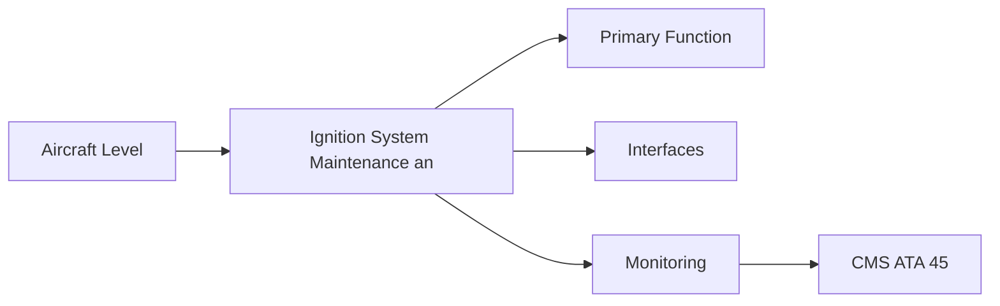
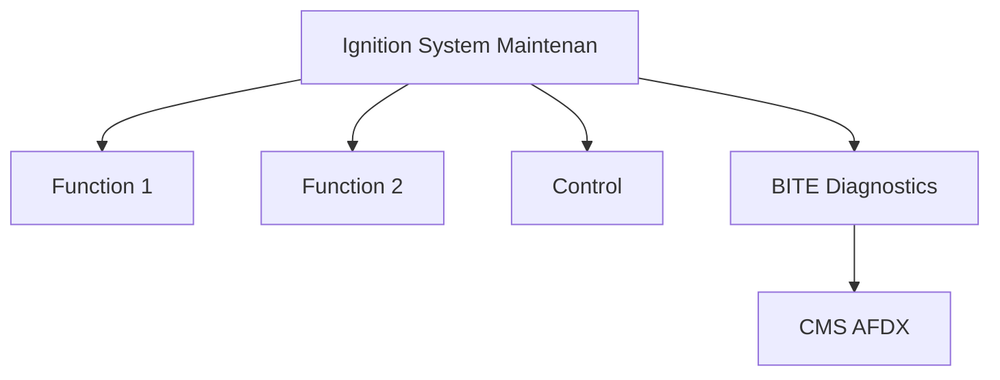

<!-- ──────────────────────────────────────────────────────────────────────────
     QATL-ATLAS-1000-ATLAS-060-069-065-050-IGNITION-SYSTEM-MAINTENANCE-AND-INSPECTION
     ATA 65 · Ignition System Maintenance and Inspection
     AMPEL360E eWTW — ATLAS Register 1000
────────────────────────────────────────────────────────────────────────────── -->

# Ignition System Maintenance and Inspection

---

## §0 Hyperlink Policy

> All hyperlinks in this document are **relative** (five directory levels: `../../../../../`).
> Absolute URLs are forbidden. Every linked document must exist in the Q+ATLANTIDE repository
> before the link is activated. Broken links are treated as open issues and must be resolved
> before the document is promoted from `DRAFT` to `APPROVED`.

---

## §1 Purpose

Ignition system maintenance comprises three main activities: scheduled igniter plug replacement (FH/start-count-limited), C-check functional test of exciter boxes (energy and repetition rate), and HT lead inspection (visual, insulation resistance). All maintenance on ignition hardware must be performed with exciter boxes isolated (28 V DC circuit breakers open); the stored charge in exciter capacitors is lethal.

---

## §2 Applicability

| Parameter | Value |
|---|---|
| Aircraft Program | AMPEL360E eWTW |
| ATA reference | ATA 65-050 — Ignition System Maintenance and Inspection |
| Certification basis | EASA CS-25 Amdt 27+ |
| S1000D SNS | 065-050-00 |

---

## §3 Functional Description ![DRAFT]

Ignition system maintenance comprises three main activities: scheduled igniter plug replacement (FH/start-count-limited), C-check functional test of exciter boxes (energy and repetition rate), and HT lead inspection (visual, insulation resistance). All maintenance on ignition hardware must be performed with exciter boxes isolated (28 V DC circuit breakers open); the stored charge in exciter capacitors is lethal.

---

## §4 Functional Breakdown

| ID | Name | Description | Lead Division |
|---|---|---|---|
| F-001 | Igniter plug replacement kit (2 per engine) | Primary function | Q-GREENTECH |
| F-002 | System integration | Interface management | Q-MECHANICS |
| F-003 | Monitoring | BITE and health data | Q-AIR |

---

## §5 System Context — Mermaid Diagram

---

## §6 Internal Architecture — Mermaid Diagram

---

## §7 Components and LRUs

| Component | Part Number | Qty | Location | Maintenance Interval | Notes |
|---|---|---|---|---|---|
| Igniter plug replacement kit (2 per engine) | Per engine OEM kit | Per event | Parts store | Single-use (plug + gasket per kit) | OEM-approved plug; must not substitute unapproved type |
| Exciter functional test set | Approved test set — engine-specific | Per MRO team | Avionics test equipment store | Annual calibration | Measures exciter energy output and repetition rate |
| HT lead insulation resistance kit | Calibrated megger / HV tester | Per team | Tool store | Annual calibration | Tests HT lead insulation integrity; pass/fail per drawing limit |
| Torque wrench (igniter plug) | Calibrated torque wrench — plug torque range | Per team | Tool crib | 6-month calibration | Critical torque — gasket seating and blowby prevention |
| Exciter isolation C/B list | AMM procedure reference | Per task | AMM reference | N/A — procedural | Lists specific circuit breakers to pull before any ignition work |

---

## §8 Interfaces

| Interface Type | Connected System | Protocol / Medium | Data / Function |
|---|---|---|---|
| ATA 45 CMS | Central Maintenance System | AFDX ARINC 664 P7 | BITE faults and health data |
| ATA 24 Electrical Power | Power distribution | HVDC / 28 V DC | LRU power supply |
| ATA 67 Engine Controls | FADEC | ARINC 429 / AFDX | Control commands and feedback |
| ATA 31 ECAM | Cockpit display | AFDX | Crew indication and alerts |

---

## §9 Operating Modes

| Mode | Trigger | System State | Actions / Consequences |
|---|---|---|---|
| Normal operation | Aircraft/engine powered | Nominal | Full function active |
| Engine shutdown | Commanded or fault | FADEC stops fuel | System de-energised |
| Maintenance | Isolated | Aircraft grounded | LOTO active |
| Ground test | Post-maintenance | Engine on ground | Test pass before service |

---

## §10 Performance and Budgets ![DRAFT]

| Parameter | Requirement | Target / Design Value | Status |
|---|---|---|---|
| System availability | ≥ 99.9 % dispatch | RAMS analysis | TBD |
| BITE fault detection | ≥ 80 % coverage | BITE design analysis | TBD |

---

## §11 Safety, Redundancy and Fault Tolerance

- All Ignition System Maintenance and Inspection maintenance requires FADEC and fuel system isolation before starting.
- Safety-critical fastener torques require calibrated tooling and dual sign-off.
- BITE failures affecting Ignition System Maintenance and Inspection dispatch must be resolved or deferred per approved MEL.

---

## §12 Maintenance and Diagnostics

| Task | Interval | Access | Special Tools |
|---|---|---|---|
| Scheduled Ignition System Maintenance and Inspection inspection | C-check | Per AMM access | NDT and inspection kit |
| BITE log review and download | A-check | Maintenance terminal | CMS terminal |
| Ignition System Maintenance and Inspection functional test after LRU replacement | After LRU change | Ground run | FADEC GSE |

---

## §13 Footprint — Physical, Electrical, Maintenance, Data ![TBD]

| Footprint Type | Parameter | Value | Notes |
|---|---|---|---|
| Physical | Mass (system total) | ![TBD] | Pending OEM data |
| Physical | Envelope (max) | ![TBD] | Pending detailed design |
| Electrical | Peak power (W) | ![TBD] | To be defined |
| Maintenance | Access category | Standard line maintenance | Per AMM |
| Data | AFDX bandwidth | ![TBD] | Per AFDX bus load analysis |

---

## §14 Safety and Certification References ![DRAFT]

| Standard / Document | Title | Issuing Body | Applicability |
|---|---|---|---|
| SAE ARP1177 | Gas Turbine Ignition Systems | SAE International | Igniter plug life and maintenance reference |
| EASA Part-145 | Approved Maintenance Organisation | EASA | Dual sign-off and authorised signatory |
| IEC 60900 | Live working — Insulation gloves | IEC | Ignition maintenance electrical safety |
| ATA iSpec 2200 | Chapter 65 | ATA | ATA chapter scope |
| SAE AS3266 | Igniter Plug Specification | SAE International | Approved plug qualification standard |

---

## §15 V&V Approach ![TBD]

| Phase | Method | Acceptance Criterion | Status |
|---|---|---|---|
| Design | Analysis and simulation | Meets all §10 performance requirements | ![TBD] |
| Integration | Ground functional test | All BITE tests pass; interfaces verified | ![TBD] |
| Qualification | DO-160G environmental test | All applicable tests pass | ![TBD] |
| Certification | EASA CS-25 / CS-E compliance demonstration | Type Certificate / STC approval | ![TBD] |

---

## §16 Glossary

| Term | Definition |
|---|---|
| **Igniter plug life limit** | Maximum FH or start count before mandatory replacement; published by engine OEM. |
| **Exciter functional test** | Ground test energising the exciter with a dummy load; measures spark energy and repetition rate. |
| **Insulation resistance test** | DC test measuring resistance between HT lead conductor and outer shield; low value indicates degradation. |
| **Lethal stored charge** | The charge stored in exciter capacitors can be > 2 J at > 12 kV; capable of causing cardiac arrest; circuit breakers MUST be pulled before handling. |
| **Circuit breaker isolation** | The specific 28 V DC C/Bs supplying A and B exciter channels must be pulled before any maintenance on ignition components. |
| **Capacitor discharge time** | After C/B removal, the exciter capacitor discharges to a safe level in typically 5–10 s; a wait time is mandatory. |
| **OEM-approved plug** | Igniter plug part number must exactly match OEM-approved list; unapproved plugs may have incorrect electrode material or gap geometry. |
| **Dual sign-off (safety-critical)** | Independent second technician signs off igniter plug installation torque as a safety-critical task. |
| **C-check functional test** | Full exciter functional test and HT lead inspection performed at every C-check interval. |
| **Plug start count** | Cumulative number of engine starts through which the plug has fired; tracked by FADEC and CMS. |

---

## §17 Open Issues

| ID | Description | Owner | Target |
|---|---|---|---|
| OI-065-050-001 | Finalise Ignition System Maintenance and Inspection design with engine OEM | Q-MECHANICS | 2026-Q4 |
| OI-065-050-002 | Define BITE coverage for Ignition System Maintenance and Inspection | Q-AIR / safety | 2027-Q1 |

---

## §18 Status Legend

| Badge | Meaning |
|---|---|
| `![DRAFT]` | Section is drafted but not yet reviewed |
| `![TBD]` | Content not yet started — to be defined |
| `![To Be Completed]` | Partially complete — needs additional content |
| `![APPROVED]` | Reviewed and formally approved |

---

## §19 Related Documents (Siblings in this Subsection)

- [065-000](./065-000.md)
- [065-010](./065-010.md)
- [065-020](./065-020.md)
- [065-030](./065-030.md)
- [065-040](./065-040.md)
- [065-060](./065-060.md)
- [065-070](./065-070.md)
- [065-080](./065-080.md)
- [065-090](./065-090.md)

---

## §20 Change Log

| Rev | Date | Author | Description |
|---|---|---|---|
| 0.1 | 2026-05-11 | @copilot | Initial DRAFT — contextualized content per AMPEL360E eWTW architecture |
