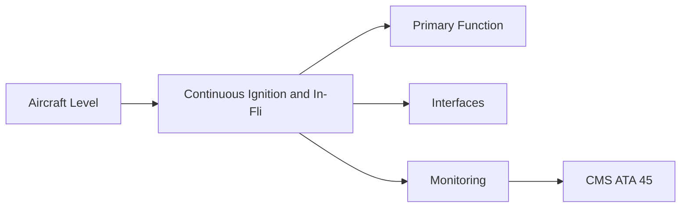
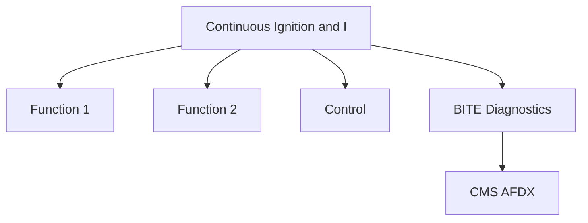

<!-- ──────────────────────────────────────────────────────────────────────────
     QATL-ATLAS-1000-ATLAS-060-069-065-060-CONTINUOUS-IGNITION-AND-IN-FLIGHT-RELIGHT-SYSTEMS
     ATA 65 · Continuous Ignition and In-Flight Relight Systems
     programme-defined aircraft type — ATLAS Register 1000
────────────────────────────────────────────────────────────────────────────── -->

# Continuous Ignition and In-Flight Relight Systems

---

## §0 Hyperlink Policy

> All hyperlinks in this document are **relative** (five directory levels: `../../../../../`).
> Absolute URLs are forbidden. Every linked document must exist in the Q+ATLANTIDE repository
> before the link is activated. Broken links are treated as open issues and must be resolved
> before the document is promoted from `DRAFT` to `APPROVED`.

---

## §1 Purpose

This document defines the agnostic ATLAS standard-level architecture context for `Continuous Ignition and In-Flight Relight Systems`.

It describes the controlled scope, functions, interfaces, safety considerations, lifecycle traceability, and S1000D/CSDB mapping logic that programme implementations shall instantiate when this node is applicable.

This document is not a programme design baseline. Programme-specific capacities, locations, part numbers, effectivity, operating limits, maintenance references, and data module codes shall be defined only inside the applicable programme implementation branch.
## §2 Applicability

| Applicability Level | Rule |
|---|---|
| Standard taxonomy | Applies to the ATLAS node `065` |
| Programme implementation | Conditional; determined by programme architecture, trade studies, certification basis, and applicability model |
| Product configuration | Defined in the programme-specific configuration baseline |
| Effectivity | Defined in the programme CSDB / applicability layer |
| Non-applicability | Must be explicitly stated in the programme impact-study branch when excluded |
## §3 Functional Description ![DRAFT]

Continuous ignition is activated by FADEC automatically or by crew command during conditions that elevate flame-out risk: flight through severe icing, heavy precipitation, gusty crosswinds during approach, or operation near aerodynamic stall. In-flight relight (air start) is the FADEC-managed process of restarting a shutdown engine at altitude using windmill N2 speed.

---

## §4 Functional Breakdown

| ID | Name | Description | Lead Division |
|---|---|---|---|
| F-001 | Continuous ignition switch (overhead panel) | Primary function | Q-GREENTECH |
| F-002 | System integration | Interface management | Q-MECHANICS |
| F-003 | Monitoring | BITE and health data | Q-AIR |

---

## §5 System Context — Mermaid Diagram

---

## §6 Internal Architecture — Mermaid Diagram

---

## §7 Components and LRUs

| Component | Part Number | Qty | Location | Maintenance Interval | Notes |
|---|---|---|---|---|---|
| Continuous ignition switch (overhead panel) | Cont-Ign-SW-PN-TBD | 2 (1 per engine) | Overhead panel — engine section | Functional test at C-check | Allows crew to command continuous ignition independent of FADEC AUTO |
| FADEC AUTO continuous ignition logic | FADEC software DAL C | Per engine | FADEC hardware | Software update | FADEC activates continuous ignition when icing or stall proximity detected |
| Windmill speed sensor (N2, for air start) | N2-Sens-PN-TBD | 2 per engine (redundant) | HP bearing frame | On condition | FADEC determines if N2 windmill speed is above minimum relight speed |
| Air start envelope definition (document) | AFM supplement — ATA 65 | Programme document | AFM | Per AFM revision | Defines altitude/speed/temperature envelope for in-flight relight |
| Unfeathering accumulator (if applicable) | See ATA 61-040 | N/A for turbofan | N/A | N/A | Turbofan does not require unfeathering; propeller-specific only |

---

## §8 Interfaces

| Interface Type | Connected System | Protocol / Medium | Data / Function |
|---|---|---|---|
| ATA 45 CMS | Central Maintenance System | AFDX ARINC 664 P7 | BITE faults and health data |
| ATA 24 Electrical Power | Power distribution | HVDC / 28 V DC | LRU power supply |
| ATA 67 Engine Controls | FADEC | ARINC 429 / AFDX | Control commands and feedback |
| ATA 31 ECAM | Cockpit display | AFDX | Crew indication and alerts |

---

## §9 Operating Modes

| Mode | Trigger | System State | Actions / Consequences |
|---|---|---|---|
| Normal operation | Aircraft/engine powered | Nominal | Full function active |
| Engine shutdown | Commanded or fault | FADEC stops fuel | System de-energised |
| Maintenance | Isolated | Aircraft grounded | LOTO active |
| Ground test | Post-maintenance | Engine on ground | Test pass before service |

---

## §10 Performance and Budgets ![DRAFT]

| Parameter | Requirement | Target / Design Value | Status |
|---|---|---|---|
| System availability | ≥ 99.9 % dispatch | RAMS analysis | TBD |
| BITE fault detection | ≥ 80 % coverage | BITE design analysis | TBD |

---

## §11 Safety, Redundancy and Fault Tolerance

- All Continuous Ignition and In-Flight Relight Systems maintenance requires FADEC and fuel system isolation before starting.
- Safety-critical fastener torques require calibrated tooling and dual sign-off.
- BITE failures affecting Continuous Ignition and In-Flight Relight Systems dispatch must be resolved or deferred per approved MEL.

---

## §12 Maintenance and Diagnostics

| Task | Interval | Access | Special Tools |
|---|---|---|---|
| Scheduled Continuous Ignition and In-Flight Relight Systems inspection | C-check | Per AMM access | NDT and inspection kit |
| BITE log review and download | A-check | Maintenance terminal | CMS terminal |
| Continuous Ignition and In-Flight Relight Systems functional test after LRU replacement | After LRU change | Ground run | FADEC GSE |

---

## §13 Footprint — Physical, Electrical, Maintenance, Data ![TBD]

| Footprint Type | Parameter | Value | Notes |
|---|---|---|---|
| Physical | Mass (system total) | ![TBD] | Pending OEM data |
| Physical | Envelope (max) | ![TBD] | Pending detailed design |
| Electrical | Peak power (W) | ![TBD] | To be defined |
| Maintenance | Access category | Standard line maintenance | Per AMM |
| Data | AFDX bandwidth | ![TBD] | Per AFDX bus load analysis |

---

## §14 Safety and Certification References ![DRAFT]

| Standard / Document | Title | Issuing Body | Applicability |
|---|---|---|---|
| EASA CS-25 §25.1165 | Engine ignition systems — in-flight relight | EASA | In-flight relight certification requirement |
| EASA CS-E §790 | Ignition system | EASA | Continuous ignition certification |
| SAE ARP1177 | Gas Turbine Ignition Systems | SAE International | Continuous ignition and relight reference |
| DO-178C | Software Considerations | RTCA | FADEC AUTO ignition logic DAL C |
| ATA iSpec 2200 | Chapter 65 | ATA | ATA chapter scope |

---

## §15 V&V Approach ![TBD]

| Phase | Method | Acceptance Criterion | Status |
|---|---|---|---|
| Design | Analysis and simulation | Meets all §10 performance requirements | ![TBD] |
| Integration | Ground functional test | All BITE tests pass; interfaces verified | ![TBD] |
| Qualification | DO-160G environmental test | All applicable tests pass | ![TBD] |
| Certification | EASA CS-25 / CS-E compliance demonstration | Type Certificate / STC approval | ![TBD] |

---

## §16 Glossary

| Term | Definition |
|---|---|
| **Continuous ignition** | Persistent spark from both igniters during elevated flame-out risk conditions; prevents uncommanded engine shutdown. |
| **In-flight relight** | Restart of a shutdown turbofan engine in flight; FADEC-managed with ignition + fuel schedule. |
| **Windmill speed** | The spool speed maintained by ram air through a dead engine; the minimum windmill N2 for relight is a key certified parameter. |
| **Air start envelope** | The certified altitude/airspeed/temperature range within which an in-flight relight can be attempted. |
| **FADEC AUTO ignition** | FADEC algorithm that activates continuous ignition based on icing sensor, proximity to stall, or crew alert. |
| **Flame-out** | Unexpected extinction of combustion; can result from fuel interruption, severe air disturbance, or ice ingestion. |
| **Starter-assisted relight** | In-flight relight assisted by the electric starter motor; provides N2 above the minimum windmill speed. |
| **Crosswind limit** | The maximum crosswind component for safe engine start; at high crosswinds, fuel-air mixture in combustor may be disturbed. |
| **Approach mode ignition** | Automatic continuous ignition activated when aircraft is on approach phase; standard practice for twin-engine aircraft. |
| **N2 relight minimum speed** | The minimum HP spool windmill speed below which a successful in-flight relight is not certified. |

---

## §17 Open Issues

| ID | Description | Owner | Target |
|---|---|---|---|
| OI-065-060-001 | Finalise Continuous Ignition and In-Flight Relight Systems design with engine OEM | Q-MECHANICS | 2026-Q4 |
| OI-065-060-002 | Define BITE coverage for Continuous Ignition and In-Flight Relight Systems | Q-AIR / safety | 2027-Q1 |

---

## §18 Status Legend

| Badge | Meaning |
|---|---|
| `![DRAFT]` | Section is drafted but not yet reviewed |
| `![TBD]` | Content not yet started — to be defined |
| `![To Be Completed]` | Partially complete — needs additional content |
| `![APPROVED]` | Reviewed and formally approved |

---

## §19 Related Documents (Siblings in this Subsection)

- [065-000](./065-000.md)
- [065-010](./065-010.md)
- [065-020](./065-020.md)
- [065-030](./065-030.md)
- [065-040](./065-040.md)
- [065-050](./065-050.md)
- [065-070](./065-070.md)
- [065-080](./065-080.md)
- [065-090](./065-090.md)

---

## §20 Change Log

| Rev | Date | Author | Description |
|---|---|---|---|
| 0.1 | 2026-05-11 | @copilot | Initial DRAFT — contextualized content per programme-defined aircraft type architecture |
