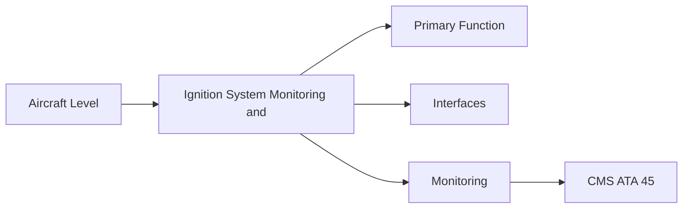
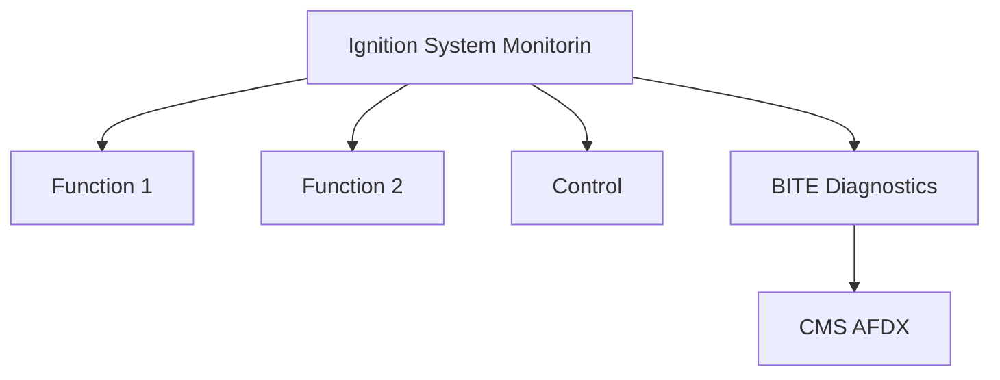

<!-- ──────────────────────────────────────────────────────────────────────────
     QATL-ATLAS-1000-ATLAS-060-069-065-070-IGNITION-SYSTEM-MONITORING-AND-BITE
     ATA 65 · Ignition System Monitoring and BITE
     programme-defined aircraft type — ATLAS Register 1000
────────────────────────────────────────────────────────────────────────────── -->

# Ignition System Monitoring and BITE

---

## §0 Hyperlink Policy

> All hyperlinks in this document are **relative** (five directory levels: `../../../../../`).
> Absolute URLs are forbidden. Every linked document must exist in the Q+ATLANTIDE repository
> before the link is activated. Broken links are treated as open issues and must be resolved
> before the document is promoted from `DRAFT` to `APPROVED`.

---

## §1 Purpose

This document defines the agnostic ATLAS standard-level architecture context for `Ignition System Monitoring and BITE`.

It describes the controlled scope, functions, interfaces, safety considerations, lifecycle traceability, and S1000D/CSDB mapping logic that programme implementations shall instantiate when this node is applicable.

This document is not a programme design baseline. Programme-specific capacities, locations, part numbers, effectivity, operating limits, maintenance references, and data module codes shall be defined only inside the applicable programme implementation branch.
## §2 Applicability

| Applicability Level | Rule |
|---|---|
| Standard taxonomy | Applies to the ATLAS node `065` |
| Programme implementation | Conditional; determined by programme architecture, trade studies, certification basis, and applicability model |
| Product configuration | Defined in the programme-specific configuration baseline |
| Effectivity | Defined in the programme CSDB / applicability layer |
| Non-applicability | Must be explicitly stated in the programme impact-study branch when excluded |
## §3 Functional Description ![DRAFT]

FADEC monitors the ignition system through the exciter BITE output (fault discrete), plug start-count accumulation, and ignition mode confirmation (did the commanded ignition mode actually engage?). Ignition system BITE faults are reported to CMS via the EDIU AFDX interface and generate a CMS maintenance message for ground resolution.

---

## §4 Functional Breakdown

| ID | Name | Description | Lead Division |
|---|---|---|---|
| F-001 | Exciter fault discrete (BITE output) | Primary function | Q-GREENTECH |
| F-002 | System integration | Interface management | Q-MECHANICS |
| F-003 | Monitoring | BITE and health data | Q-AIR |

---

## §5 System Context — Mermaid Diagram

---

## §6 Internal Architecture — Mermaid Diagram

---

## §7 Components and LRUs

| Component | Part Number | Qty | Location | Maintenance Interval | Notes |
|---|---|---|---|---|---|
| Exciter fault discrete (BITE output) | Integrated in exciter | 1 per exciter | Exciter → FADEC discrete input | Monitor continuously | Declares exciter fault; FADEC reports to CMS |
| Plug start counter (FADEC software) | FADEC software partition | Per plug | FADEC hardware | Software update | Counts engine starts through each plug; compares to life limit |
| Ignition mode confirmation logic | FADEC software | Per engine | FADEC | Software update | Verifies commanded ignition mode was actually achieved |
| CMS ignition maintenance message | FADEC → EDIU → AFDX → CMS | 1 per engine | CMS display terminal | On condition | Maintenance message text and recommended action for technician |
| Ignition BITE test (ground, via CMS) | CMS maintenance test page | 1 (aircraft-shared) | Maintenance terminal | Functional test procedure | Allows ground activation of igniter for test (no fuel; safety interlock) |

---

## §8 Interfaces

| Interface Type | Connected System | Protocol / Medium | Data / Function |
|---|---|---|---|
| ATA 45 CMS | Central Maintenance System | AFDX ARINC 664 P7 | BITE faults and health data |
| ATA 24 Electrical Power | Power distribution | HVDC / 28 V DC | LRU power supply |
| ATA 67 Engine Controls | FADEC | ARINC 429 / AFDX | Control commands and feedback |
| ATA 31 ECAM | Cockpit display | AFDX | Crew indication and alerts |

---

## §9 Operating Modes

| Mode | Trigger | System State | Actions / Consequences |
|---|---|---|---|
| Normal operation | Aircraft/engine powered | Nominal | Full function active |
| Engine shutdown | Commanded or fault | FADEC stops fuel | System de-energised |
| Maintenance | Isolated | Aircraft grounded | LOTO active |
| Ground test | Post-maintenance | Engine on ground | Test pass before service |

---

## §10 Performance and Budgets ![DRAFT]

| Parameter | Requirement | Target / Design Value | Status |
|---|---|---|---|
| System availability | ≥ 99.9 % dispatch | RAMS analysis | TBD |
| BITE fault detection | ≥ 80 % coverage | BITE design analysis | TBD |

---

## §11 Safety, Redundancy and Fault Tolerance

- All Ignition System Monitoring and BITE maintenance requires FADEC and fuel system isolation before starting.
- Safety-critical fastener torques require calibrated tooling and dual sign-off.
- BITE failures affecting Ignition System Monitoring and BITE dispatch must be resolved or deferred per approved MEL.

---

## §12 Maintenance and Diagnostics

| Task | Interval | Access | Special Tools |
|---|---|---|---|
| Scheduled Ignition System Monitoring and BITE inspection | C-check | Per AMM access | NDT and inspection kit |
| BITE log review and download | A-check | Maintenance terminal | CMS terminal |
| Ignition System Monitoring and BITE functional test after LRU replacement | After LRU change | Ground run | FADEC GSE |

---

## §13 Footprint — Physical, Electrical, Maintenance, Data ![TBD]

| Footprint Type | Parameter | Value | Notes |
|---|---|---|---|
| Physical | Mass (system total) | ![TBD] | Pending OEM data |
| Physical | Envelope (max) | ![TBD] | Pending detailed design |
| Electrical | Peak power (W) | ![TBD] | To be defined |
| Maintenance | Access category | Standard line maintenance | Per AMM |
| Data | AFDX bandwidth | ![TBD] | Per AFDX bus load analysis |

---

## §14 Safety and Certification References ![DRAFT]

| Standard / Document | Title | Issuing Body | Applicability |
|---|---|---|---|
| DO-178C | Software Considerations | RTCA | FADEC ignition BITE DAL C assurance |
| ARINC 664 P7 | AFDX | ARINC | CMS interface |
| SAE ARP4761 | Safety Assessment | SAE International | BITE coverage methodology |
| ATA iSpec 2200 | Chapter 65 | ATA | ATA chapter scope |
| EASA CS-E §790 | Ignition system | EASA | Ignition monitoring certification |

---

## §15 V&V Approach ![TBD]

| Phase | Method | Acceptance Criterion | Status |
|---|---|---|---|
| Design | Analysis and simulation | Meets all §10 performance requirements | ![TBD] |
| Integration | Ground functional test | All BITE tests pass; interfaces verified | ![TBD] |
| Qualification | DO-160G environmental test | All applicable tests pass | ![TBD] |
| Certification | EASA CS-25 / CS-E compliance demonstration | Type Certificate / STC approval | ![TBD] |

---

## §16 Glossary

| Term | Definition |
|---|---|
| **Exciter fault discrete** | Discrete electrical signal from exciter box to FADEC declaring an internal exciter fault. |
| **Plug start counter** | FADEC software accumulator tracking starts through each igniter plug; triggers replacement advisory at life limit. |
| **Ignition mode confirmation** | FADEC logic verifying that the commanded ignition mode (START/CONTINUOUS/RELIGHT) was successfully achieved. |
| **CMS maintenance message** | A standardised text message in the CMS maintenance page identifying the fault and recommended maintenance action. |
| **Ground ignition test** | FADEC test mode allowing a controlled ground spark test without fuel flow to verify exciter and plug functionality. |
| **Safety interlock** | A FADEC or aircraft-level interlock preventing ignition system activation under unsafe conditions (e.g., fuel flow active without N2). |
| **Start count life limit** | The published maximum number of starts through an igniter plug before mandatory replacement. |
| **FADEC DAL C ignition monitoring** | FADEC ignition monitoring function assurance level; non-catastrophic failure effect. |
| **EDIU** | Engine Data Interface Unit — FADEC bus to aircraft AFDX gateway. |
| **Maintenance advisory** | A FADEC output advising maintenance action (e.g., 'replace plug No.1 — start count exceeded') without preventing dispatch. |

---

## §17 Open Issues

| ID | Description | Owner | Target |
|---|---|---|---|
| OI-065-070-001 | Finalise Ignition System Monitoring and BITE design with engine OEM | Q-MECHANICS | 2026-Q4 |
| OI-065-070-002 | Define BITE coverage for Ignition System Monitoring and BITE | Q-AIR / safety | 2027-Q1 |

---

## §18 Status Legend

| Badge | Meaning |
|---|---|
| `![DRAFT]` | Section is drafted but not yet reviewed |
| `![TBD]` | Content not yet started — to be defined |
| `![To Be Completed]` | Partially complete — needs additional content |
| `![APPROVED]` | Reviewed and formally approved |

---

## §19 Related Documents (Siblings in this Subsection)

- [065-000](./065-000.md)
- [065-010](./065-010.md)
- [065-020](./065-020.md)
- [065-030](./065-030.md)
- [065-040](./065-040.md)
- [065-050](./065-050.md)
- [065-060](./065-060.md)
- [065-080](./065-080.md)
- [065-090](./065-090.md)

---

## §20 Change Log

| Rev | Date | Author | Description |
|---|---|---|---|
| 0.1 | 2026-05-11 | @copilot | Initial DRAFT — contextualized content per programme-defined aircraft type architecture |
