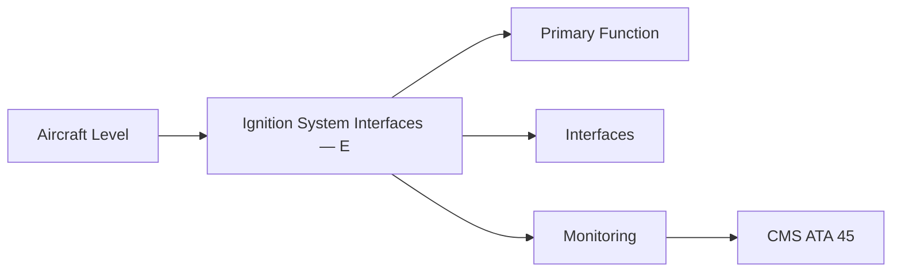
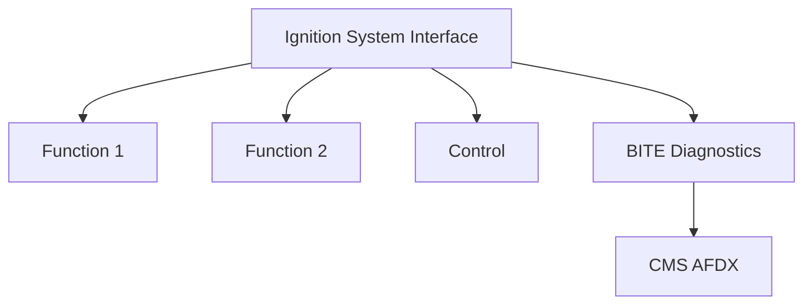

<!-- ──────────────────────────────────────────────────────────────────────────
     QATL-ATLAS-1000-ATLAS-060-069-065-080-IGNITION-SYSTEM-INTERFACES-—-ELECTRICAL-AND-DATA
     ATA 65 · Ignition System Interfaces — Electrical and Data
     programme-defined aircraft type — ATLAS Register 1000
────────────────────────────────────────────────────────────────────────────── -->

# Ignition System Interfaces — Electrical and Data

---

## §0 Hyperlink Policy

> All hyperlinks in this document are **relative** (five directory levels: `../../../../../`).
> Absolute URLs are forbidden. Every linked document must exist in the Q+ATLANTIDE repository
> before the link is activated. Broken links are treated as open issues and must be resolved
> before the document is promoted from `DRAFT` to `APPROVED`.

---

## §1 Purpose

This document defines the agnostic ATLAS standard-level architecture context for `Ignition System Interfaces — Electrical and Data`.

It describes the controlled scope, functions, interfaces, safety considerations, lifecycle traceability, and S1000D/CSDB mapping logic that programme implementations shall instantiate when this node is applicable.

This document is not a programme design baseline. Programme-specific capacities, locations, part numbers, effectivity, operating limits, maintenance references, and data module codes shall be defined only inside the applicable programme implementation branch.
## §2 Applicability

| Applicability Level | Rule |
|---|---|
| Standard taxonomy | Applies to the ATLAS node `065` |
| Programme implementation | Conditional; determined by programme architecture, trade studies, certification basis, and applicability model |
| Product configuration | Defined in the programme-specific configuration baseline |
| Effectivity | Defined in the programme CSDB / applicability layer |
| Non-applicability | Must be explicitly stated in the programme impact-study branch when excluded |
## §3 Functional Description ![DRAFT]

The ignition system interfaces with three aircraft-level domains: electrical power (ATA 24), engine controls (ATA 67/FADEC), and maintenance data management (ATA 45 CMS). The electrical interface defines the independent A and B power bus feeds. The FADEC interface defines command and status discrete signals. The CMS interface defines fault code reporting and start-count advisory messages.

---

## §4 Functional Breakdown

| ID | Name | Description | Lead Division |
|---|---|---|---|
| F-001 | ATA 24 bus A (exciter A power) | Primary function | Q-GREENTECH |
| F-002 | System integration | Interface management | Q-MECHANICS |
| F-003 | Monitoring | BITE and health data | Q-AIR |

---

## §5 System Context — Mermaid Diagram

---

## §6 Internal Architecture — Mermaid Diagram

---

## §7 Components and LRUs

| Component | Part Number | Qty | Location | Maintenance Interval | Notes |
|---|---|---|---|---|---|
| ATA 24 bus A (exciter A power) | Circuit breaker CB-IGN-A-PN-TBD | 1 per engine | Main AC/DC bus A | Per ATA 24 C/B inspection schedule | Independent bus feed for A-channel exciter |
| ATA 24 bus B (exciter B power) | Circuit breaker CB-IGN-B-PN-TBD | 1 per engine | Main AC/DC bus B | Per ATA 24 C/B inspection | Independent bus feed for B-channel exciter |
| FADEC ignition command discrete (A) | FADEC discrete output — DAL C | 1 per engine | FADEC chassis → Exciter A | On condition | Commands exciter A ON/OFF |
| FADEC ignition command discrete (B) | FADEC discrete output — DAL C | 1 per engine | FADEC chassis → Exciter B | On condition | Commands exciter B ON/OFF |
| EDIU to CMS (AFDX) | EDIU hardware | 1 per engine | EDIU → AFDX → CMS | On condition | Reports ignition fault codes and start-count advisory to CMS |

---

## §8 Interfaces

| Interface Type | Connected System | Protocol / Medium | Data / Function |
|---|---|---|---|
| ATA 45 CMS | Central Maintenance System | AFDX ARINC 664 P7 | BITE faults and health data |
| ATA 24 Electrical Power | Power distribution | HVDC / 28 V DC | LRU power supply |
| ATA 67 Engine Controls | FADEC | ARINC 429 / AFDX | Control commands and feedback |
| ATA 31 ECAM | Cockpit display | AFDX | Crew indication and alerts |

---

## §9 Operating Modes

| Mode | Trigger | System State | Actions / Consequences |
|---|---|---|---|
| Normal operation | Aircraft/engine powered | Nominal | Full function active |
| Engine shutdown | Commanded or fault | FADEC stops fuel | System de-energised |
| Maintenance | Isolated | Aircraft grounded | LOTO active |
| Ground test | Post-maintenance | Engine on ground | Test pass before service |

---

## §10 Performance and Budgets ![DRAFT]

| Parameter | Requirement | Target / Design Value | Status |
|---|---|---|---|
| System availability | ≥ 99.9 % dispatch | RAMS analysis | TBD |
| BITE fault detection | ≥ 80 % coverage | BITE design analysis | TBD |

---

## §11 Safety, Redundancy and Fault Tolerance

- All Ignition System Interfaces — Electrical and Data maintenance requires FADEC and fuel system isolation before starting.
- Safety-critical fastener torques require calibrated tooling and dual sign-off.
- BITE failures affecting Ignition System Interfaces — Electrical and Data dispatch must be resolved or deferred per approved MEL.

---

## §12 Maintenance and Diagnostics

| Task | Interval | Access | Special Tools |
|---|---|---|---|
| Scheduled Ignition System Interfaces — Electrical and Data inspection | C-check | Per AMM access | NDT and inspection kit |
| BITE log review and download | A-check | Maintenance terminal | CMS terminal |
| Ignition System Interfaces — Electrical and Data functional test after LRU replacement | After LRU change | Ground run | FADEC GSE |

---

## §13 Footprint — Physical, Electrical, Maintenance, Data ![TBD]

| Footprint Type | Parameter | Value | Notes |
|---|---|---|---|
| Physical | Mass (system total) | ![TBD] | Pending OEM data |
| Physical | Envelope (max) | ![TBD] | Pending detailed design |
| Electrical | Peak power (W) | ![TBD] | To be defined |
| Maintenance | Access category | Standard line maintenance | Per AMM |
| Data | AFDX bandwidth | ![TBD] | Per AFDX bus load analysis |

---

## §14 Safety and Certification References ![DRAFT]

| Standard / Document | Title | Issuing Body | Applicability |
|---|---|---|---|
| DO-160G | Environmental Conditions | RTCA | Exciter EMI and environmental qualification |
| ARINC 664 P7 | AFDX | ARINC | CMS data interface |
| EASA CS-25 §25.1165 | Engine ignition | EASA | Independent ignition bus requirement |
| SAE ARP1177 | Ignition Systems | SAE International | Interface design reference |
| ATA iSpec 2200 | Chapter 65 | ATA | ATA chapter scope |

---

## §15 V&V Approach ![TBD]

| Phase | Method | Acceptance Criterion | Status |
|---|---|---|---|
| Design | Analysis and simulation | Meets all §10 performance requirements | ![TBD] |
| Integration | Ground functional test | All BITE tests pass; interfaces verified | ![TBD] |
| Qualification | DO-160G environmental test | All applicable tests pass | ![TBD] |
| Certification | EASA CS-25 / CS-E compliance demonstration | Type Certificate / STC approval | ![TBD] |

---

## §16 Glossary

| Term | Definition |
|---|---|
| **Independent power buses** | A and B ignition exciters are powered from separate aircraft buses; single bus failure does not prevent ignition. |
| **Ignition circuit breaker** | The dedicated circuit breaker supplying power to each exciter; must be pulled for ignition system maintenance. |
| **FADEC command discrete** | A low-power discrete signal from FADEC to the exciter enabling or disabling the exciter. |
| **EDIU** | Engine Data Interface Unit — gateway between FADEC bus and aircraft AFDX network. |
| **CMS fault code** | A standardised text code identifying an ignition fault; reported to CMS maintenance page for technician action. |
| **AFDX** | Avionics Full-Duplex Switched Ethernet — ARINC 664 P7; carries EDIU data to CMS. |
| **ICD-065-024** | Interface Control Document defining ATA 65 to ATA 24 power interface. |
| **Crew overhead panel** | The location of the engine ignition mode selector switches (AUTO / CONT / OFF). |
| **Fire handle interrupt** | The engine fire handle signal that cuts all power to igniters as part of engine shutdown. |
| **Discrete signal** | A simple ON/OFF (logic 1/0) electrical signal; the ignition command uses discretes rather than complex bus protocols. |

---

## §17 Open Issues

| ID | Description | Owner | Target |
|---|---|---|---|
| OI-065-080-001 | Finalise Ignition System Interfaces — Electrical and Data design with engine OEM | Q-MECHANICS | 2026-Q4 |
| OI-065-080-002 | Define BITE coverage for Ignition System Interfaces — Electrical and Data | Q-AIR / safety | 2027-Q1 |

---

## §18 Status Legend

| Badge | Meaning |
|---|---|
| `![DRAFT]` | Section is drafted but not yet reviewed |
| `![TBD]` | Content not yet started — to be defined |
| `![To Be Completed]` | Partially complete — needs additional content |
| `![APPROVED]` | Reviewed and formally approved |

---

## §19 Related Documents (Siblings in this Subsection)

- [065-000](./065-000.md)
- [065-010](./065-010.md)
- [065-020](./065-020.md)
- [065-030](./065-030.md)
- [065-040](./065-040.md)
- [065-050](./065-050.md)
- [065-060](./065-060.md)
- [065-070](./065-070.md)
- [065-090](./065-090.md)

---

## §20 Change Log

| Rev | Date | Author | Description |
|---|---|---|---|
| 0.1 | 2026-05-11 | @copilot | Initial DRAFT — contextualized content per programme-defined aircraft type architecture |
