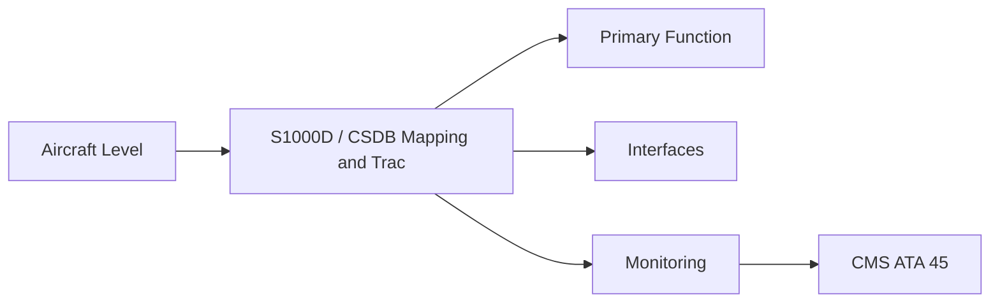
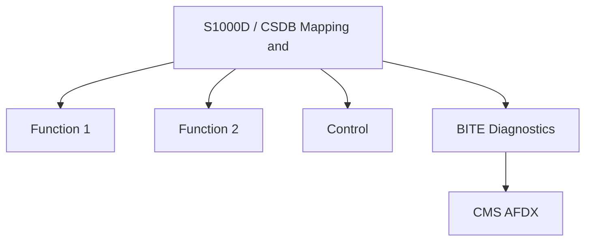

<!-- ──────────────────────────────────────────────────────────────────────────
     QATL-ATLAS-1000-ATLAS-060-069-065-090-S1000D---CSDB-MAPPING-AND-TRACEABILITY
     ATA 65 · S1000D / CSDB Mapping and Traceability
     programme-defined aircraft type — ATLAS Register 1000
────────────────────────────────────────────────────────────────────────────── -->

# S1000D / CSDB Mapping and Traceability

---

## §0 Hyperlink Policy

> All hyperlinks in this document are **relative** (five directory levels: `../../../../../`).
> Absolute URLs are forbidden. Every linked document must exist in the Q+ATLANTIDE repository
> before the link is activated. Broken links are treated as open issues and must be resolved
> before the document is promoted from `DRAFT` to `APPROVED`.

---

## §1 Purpose

This document defines the agnostic ATLAS standard-level architecture context for `S1000D / CSDB Mapping and Traceability`.

It describes the controlled scope, functions, interfaces, safety considerations, lifecycle traceability, and S1000D/CSDB mapping logic that programme implementations shall instantiate when this node is applicable.

This document is not a programme design baseline. Programme-specific capacities, locations, part numbers, effectivity, operating limits, maintenance references, and data module codes shall be defined only inside the applicable programme implementation branch.

## §2 Applicability

| Applicability Level | Rule |
|---|---|
| Standard taxonomy | Applies to the ATLAS node `065` |
| Programme implementation | Conditional; determined by programme architecture, trade studies, certification basis, and applicability model |
| Product configuration | Defined in the programme-specific configuration baseline |
| Effectivity | Defined in the programme CSDB / applicability layer |
| Non-applicability | Must be explicitly stated in the programme impact-study branch when excluded |

## §3 Functional Description ![DRAFT]

ATA 65 DMRL: 36 data modules. DMC `[PROGRAMME-AIRCRAFT]-[PROGRAMME-VARIANT]-065-{NNN}-00A-EN-US`. BREX `[PROGRAMME-AIRCRAFT]-BREX-065-v1` enforces: (1) all igniter plug DMs must cite the applicable start-count life limit from the engine OEM maintenance manual; (2) all exciter maintenance DMs must include the mandatory capacitor discharge wait-time safety note; (3) all HT lead routing DMs must reference the minimum clearance requirement from fuel lines.

---

## §4 Functional Breakdown

| ID | Name | Description | Lead Division |
|---|---|---|---|
| F-001 | S1000D Issue 5.0 | Primary function | Q-GREENTECH |
| F-002 | System integration | Interface management | Q-MECHANICS |
| F-003 | Monitoring | BITE and health data | Q-AIR |

---

## §5 System Context — Mermaid Diagram

---

## §6 Internal Architecture — Mermaid Diagram

---

## §7 Components and LRUs

| Component | Part Number | Qty | Location | Maintenance Interval | Notes |
|---|---|---|---|---|---|
| S1000D Issue 5.0 | S1000D.org | CSDB | IT | Per release | XML authoring standard |
| BREX-065-v1 | Programme doc | CSDB validator | IT | Per revision | Three domain constraints enforced |
| DMRL — 36 DMs | Q-DATAGOV tracker | PMO | PMO tool | Monthly review | All 36 DMs tracked |
| ICN registry ATA 65 | Q-DATAGOV database | CSDB | IT | Continuous | Illustration traceability |
| Start count life limit register | Engine OEM + CMS data | Q-DATAGOV + CAMO | IT | Per FADEC download | Links start-count DM requirement to CMS data |

---

## §8 Interfaces

| Interface Type | Connected System | Protocol / Medium | Data / Function |
|---|---|---|---|
| ATA 45 CMS | Central Maintenance System | AFDX ARINC 664 P7 | BITE faults and health data |
| ATA 24 Electrical Power | Power distribution | HVDC / 28 V DC | LRU power supply |
| ATA 67 Engine Controls | FADEC | ARINC 429 / AFDX | Control commands and feedback |
| ATA 31 ECAM | Cockpit display | AFDX | Crew indication and alerts |

---

## §9 Operating Modes

| Mode | Trigger | System State | Actions / Consequences |
|---|---|---|---|
| Normal operation | Aircraft/engine powered | Nominal | Full function active |
| Engine shutdown | Commanded or fault | FADEC stops fuel | System de-energised |
| Maintenance | Isolated | Aircraft grounded | LOTO active |
| Ground test | Post-maintenance | Engine on ground | Test pass before service |

---

## §10 Performance and Budgets ![DRAFT]

| Parameter | Requirement | Target / Design Value | Status |
|---|---|---|---|
| System availability | ≥ 99.9 % dispatch | RAMS analysis | TBD |
| BITE fault detection | ≥ 80 % coverage | BITE design analysis | TBD |

---

## §11 Safety, Redundancy and Fault Tolerance

- All S1000D / CSDB Mapping and Traceability maintenance requires FADEC and fuel system isolation before starting.
- Safety-critical fastener torques require calibrated tooling and dual sign-off.
- BITE failures affecting S1000D / CSDB Mapping and Traceability dispatch must be resolved or deferred per approved MEL.

---

## §12 Maintenance and Diagnostics

| Task | Interval | Access | Special Tools |
|---|---|---|---|
| Scheduled S1000D / CSDB Mapping and Traceability inspection | C-check | Per AMM access | NDT and inspection kit |
| BITE log review and download | A-check | Maintenance terminal | CMS terminal |
| S1000D / CSDB Mapping and Traceability functional test after LRU replacement | After LRU change | Ground run | FADEC GSE |

---

## §13 Footprint — Physical, Electrical, Maintenance, Data ![TBD]

| Footprint Type | Parameter | Value | Notes |
|---|---|---|---|
| Physical | Mass (system total) | ![TBD] | Pending OEM data |
| Physical | Envelope (max) | ![TBD] | Pending detailed design |
| Electrical | Peak power (W) | ![TBD] | To be defined |
| Maintenance | Access category | Standard line maintenance | Per AMM |
| Data | AFDX bandwidth | ![TBD] | Per AFDX bus load analysis |

---

## §14 Safety and Certification References ![DRAFT]

| Standard / Document | Title | Issuing Body | Applicability |
|---|---|---|---|
| S1000D Issue 5.0 | Technical Publications Standard | S1000D.org | Authoring standard |
| ATA iSpec 2200 | Chapter 65 | ATA | ATA SNS reference |
| SAE ARP1177 | Gas Turbine Ignition Systems | SAE International | Plug life limit BREX rule reference |
| [PROGRAMME-AIRCRAFT] GP-CSDB-001 | CSDB Governance Procedure | Q-DATAGOV | CSDB workflow |
| IEC 60900 | Live working electrical safety | IEC | Safety note reference standard |

---

## §15 V&V Approach ![TBD]

| Phase | Method | Acceptance Criterion | Status |
|---|---|---|---|
| Design | Analysis and simulation | Meets all §10 performance requirements | ![TBD] |
| Integration | Ground functional test | All BITE tests pass; interfaces verified | ![TBD] |
| Qualification | DO-160G environmental test | All applicable tests pass | ![TBD] |
| Certification | EASA CS-25 / CS-E compliance demonstration | Type Certificate / STC approval | ![TBD] |

---

## §16 Glossary

| Term | Definition |
|---|---|
| **DMC** | Data Module Code — unique S1000D identifier. |
| **DMRL** | Data Module Requirement List. |
| **BREX** | Business Rules eXchange — enforced at CSDB ingestion. |
| **Start-count life limit** | Engine OEM published maximum start count per igniter plug. |
| **Capacitor discharge wait-time** | Safety wait time after circuit breaker isolation before exciter may be touched; BREX requires this in every maintenance DM. |
| **CSDB** | Common Source DataBase. |
| **SNS** | Standard Numbering System. |
| **IETP** | Interactive Electronic Technical Publication. |
| **DM-040** | Descriptive data module. |
| **DM-300** | Inspection/check data module. |

---

## §17 Open Issues

| ID | Description | Owner | Target |
|---|---|---|---|
| OI-065-090-001 | Finalise S1000D / CSDB Mapping and Traceability design with engine OEM | Q-MECHANICS | 2026-Q4 |
| OI-065-090-002 | Define BITE coverage for S1000D / CSDB Mapping and Traceability | Q-AIR / safety | 2027-Q1 |

---

## §18 Status Legend

| Badge | Meaning |
|---|---|
| `![DRAFT]` | Section is drafted but not yet reviewed |
| `![TBD]` | Content not yet started — to be defined |
| `![To Be Completed]` | Partially complete — needs additional content |
| `![APPROVED]` | Reviewed and formally approved |

---

## §19 Related Documents (Siblings in this Subsection)

- [065-000](./065-000.md)
- [065-010](./065-010.md)
- [065-020](./065-020.md)
- [065-030](./065-030.md)
- [065-040](./065-040.md)
- [065-050](./065-050.md)
- [065-060](./065-060.md)
- [065-070](./065-070.md)
- [065-080](./065-080.md)

---

## §20 Change Log

| Rev | Date | Author | Description |
|---|---|---|---|
| 0.1 | 2026-05-11 | @copilot | Initial DRAFT — contextualized content per programme-defined aircraft type architecture |
