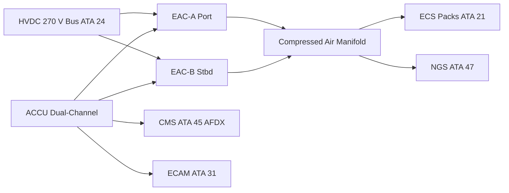
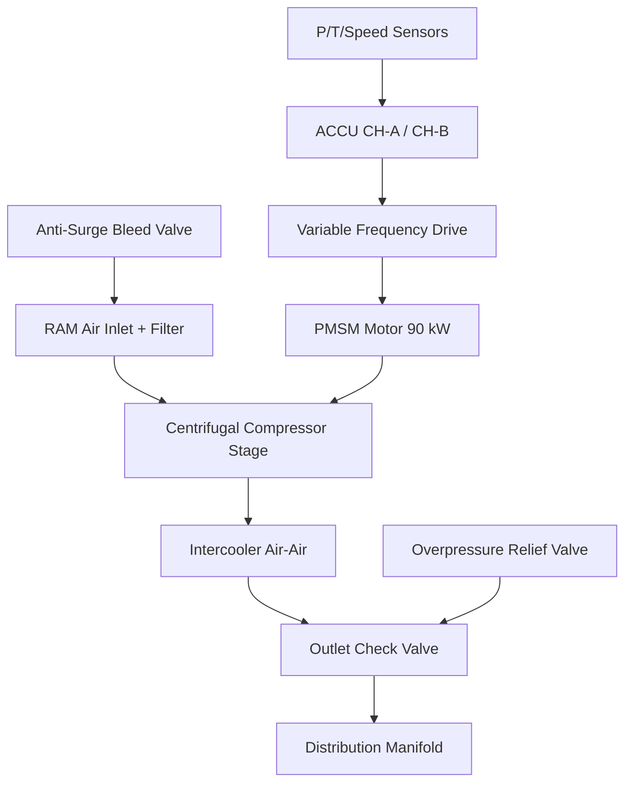

<!-- ──────────────────────────────────────────────────────────────────────────
     QATL-ATLAS-1000-ATLAS-060-069-066-000-AIR-COMPRESSOR-GENERAL
     ATA 66 · Air Compressor General
     programme-defined aircraft type — ATLAS Register 1000
────────────────────────────────────────────────────────────────────────────── -->

# Air Compressor General

---

## §0 Hyperlink Policy

> All hyperlinks in this document are **relative** (five directory levels: `../../../../../`).
> Absolute URLs are forbidden. Every linked document must exist in the Q+ATLANTIDE repository
> before the link is activated. Broken links are treated as open issues and must be resolved
> before the document is promoted from `DRAFT` to `APPROVED`.

---

## §1 Purpose

This document defines the agnostic ATLAS standard-level architecture context for `Air Compressor General`.

It describes the controlled scope, functions, interfaces, safety considerations, lifecycle traceability, and S1000D/CSDB mapping logic that programme implementations shall instantiate when this node is applicable.

This document is not a programme design baseline. Programme-specific capacities, locations, part numbers, effectivity, operating limits, maintenance references, and data module codes shall be defined only inside the applicable programme implementation branch.
## §2 Applicability

| Applicability Level | Rule |
|---|---|
| Standard taxonomy | Applies to the ATLAS node `066` |
| Programme implementation | Conditional; determined by programme architecture, trade studies, certification basis, and applicability model |
| Product configuration | Defined in the programme-specific configuration baseline |
| Effectivity | Defined in the programme CSDB / applicability layer |
| Non-applicability | Must be explicitly stated in the programme impact-study branch when excluded |
## §3 Functional Description ![DRAFT]

The ATA 66 system on the programme-defined aircraft type comprises two identical, cross-ship Electric Air Compressors (EAC-A and EAC-B), each a single-stage centrifugal compressor driven by a permanent-magnet synchronous motor (PMSM) rated at approximately 90 kW at design point. The EACs are controlled by the Air Compressor Control Unit (ACCU), a dual-channel digital controller qualified to DO-178C DAL C and DO-160G.

Each EAC delivers compressed air at up to 0.55 MPa gauge, with a mass flow of up to 0.8 kg/s at cruise altitude conditions. In normal operation, EAC-A and EAC-B operate in parallel, each feeding one ECS pack (ATA 21). In case of one EAC failure, the remaining unit can supply both packs at reduced flow, sufficient for single-pack operation under degraded mode.

The system includes inlet filtration, an intercooler between compression stages, anti-surge bleed valve (ASBV), overpressure relief valve (OPRV), and outlet check valves preventing back-flow between channels. ACCU BITE data is reported to the Central Maintenance System (CMS, ATA 45) via AFDX.

---

## §4 Functional Breakdown

| ID | Name | Description | Lead Division |
|---|---|---|---|
| F-001 | EAC-A — Electric Air Compressor (port) | Primary compressed-air source for ECS Pack 1; HVDC 270 V motor-driven centrifugal compressor | Q-GREENTECH |
| F-002 | EAC-B — Electric Air Compressor (stbd) | Primary compressed-air source for ECS Pack 2; identical unit to EAC-A | Q-GREENTECH |
| F-003 | ACCU — Air Compressor Control Unit | Dual-channel digital controller; pressure/flow regulation, BITE, fault management | Q-MECHANICS |
| F-004 | Anti-Surge and Protection | ASBV surge prevention, OPRV overpressure protection, motor thermal management | Q-AIR |
| F-005 | Health Monitoring and CMS Interface | BITE parameter reporting, predictive maintenance data, AFDX to CMS ATA 45 | Q-INDUSTRY |

---

## §5 System Context — Mermaid Diagram

---

## §6 Internal Architecture — Mermaid Diagram

---

## §7 Components and LRUs

| Component | Part Number | Qty | Location | Maintenance Interval | Notes |
|---|---|---|---|---|---|
| EAC-A Electric Air Compressor | EAC-A-PN-TBD | 1 | Fwd belly fairing, port | On condition / bearing check 12 000 FH | HVDC 270 V PMSM + centrifugal stage; oil-free |
| EAC-B Electric Air Compressor | EAC-B-PN-TBD | 1 | Fwd belly fairing, stbd | On condition / bearing check 12 000 FH | Identical to EAC-A; cross-ship redundancy |
| ACCU Air Compressor Control Unit | ACCU-PN-TBD | 1 | EE bay rack ATA 24 zone | Software update per FADEC/ACCU SB cycle | Dual-channel; DO-178C DAL C |
| Anti-Surge Bleed Valve (ASBV) | ASBV-PN-TBD | 2 (1 per EAC) | EAC outlet duct | Functional test C-check | Opens within 50 ms on surge detection |
| Overpressure Relief Valve (OPRV) | OPRV-PN-TBD | 2 (1 per EAC) | EAC outlet manifold | Replace on actuation / C-check inspection | Set point 0.65 MPa |

---

## §8 Interfaces

| Interface Type | Connected System | Protocol / Medium | Data / Function |
|---|---|---|---|
| ATA 21 ECS | Environmental Control System packs | Compressed air duct 0.55 MPa | Pressurization and conditioning supply |
| ATA 24 Electrical Power | HVDC 270 V primary bus | HVDC cable | EAC motor drive power; ~90 kW per unit |
| ATA 45 CMS | Central Maintenance System | AFDX ARINC 664 P7 | BITE faults, health parameters, exceedance log |
| ATA 31 ECAM | Cockpit display | AFDX | EAC pressure, flow, fault annunciation |
| ATA 47 NGS | Nitrogen Generation System | Compressed air branch duct | NGS feed air at reduced pressure |

---

## §9 Operating Modes

| Mode | Trigger | System State | Actions / Consequences |
|---|---|---|---|
| Normal dual EAC | Both EACs healthy, aircraft powered | EAC-A + EAC-B parallel operation | Each EAC feeds own ECS pack; ACCU regulates flow |
| Single EAC (degraded) | One EAC fault or shutdown | Remaining EAC supplies both ECS packs | ACCU increases speed setpoint; ECAM amber caution |
| Ground pre-cooling | Aircraft on ground, doors open | EAC-A or B active per ACCU ground logic | ECS receives compressed air for cabin pre-conditioning before departure |
| Anti-surge transient | Surge margin < 15 % detected | ASBV opens; compressor speed reduced | Stable operation restored within 200 ms; ACCU logs event |
| Maintenance | Aircraft grounded, circuit breaker open | ACCU isolated; EAC mechanically locked | LOTO procedure per AMM; no compressed air in system |

---

## §10 Performance and Budgets ![DRAFT]

| Parameter | Requirement | Target / Design Value | Status |
|---|---|---|---|
| Mass flow (each EAC, design point) | ≥ 0.7 kg/s at FL350 | 0.8 kg/s | ![TBD] |
| Outlet pressure (cruise) | 0.50–0.55 MPa gauge | 0.52 MPa | ![TBD] |
| Surge margin | ≥ 15 % across flight envelope | ≥ 18 % at design | ![TBD] |
| Motor power (each EAC, max) | ≤ 95 kW | 90 kW nominal | ![TBD] |
| BITE fault detection coverage | ≥ 85 % | ≥ 87 % target | ![TBD] |

---

## §11 Safety, Redundancy and Fault Tolerance

- Dual EAC cross-ship redundancy ensures continued cabin pressurization supply after single EAC failure (DAL analysis required for ACCU per DO-178C DAL C).
- ASBV and OPRV provide independent protection against surge and over-pressure respectively; both are passive fail-safe devices (spring-loaded).
- Loss of both EAC units is classified as a hazardous condition (CS-25 §25.831); ACCU dual-channel failure shall be shown to be Extremely Improbable per FHA.
- All EAC maintenance tasks require HVDC bus isolation (LOTO) before accessing motor or compressor stage — no residual charge in PMSM bus within 5 minutes of isolation.
- EAC outlet ducts are rated for max working pressure 0.70 MPa; OPRV limits system to 0.65 MPa.

---

## §12 Maintenance and Diagnostics

| Task | Interval | Access | Special Tools |
|---|---|---|---|
| EAC bearing vibration check and trending | 12 000 FH | Belly fairing access panel | ACCU GSE terminal; vibration analyser |
| ASBV functional test (open/close cycle) | C-check | EAC outlet duct access | ACCU GSE ground command |
| ACCU BITE log download and review | A-check | Maintenance terminal (CMS) | CMS terminal or ACARS download |
| EAC LRU replacement | On condition | Belly fairing removal — 4 h task | Torque wrench set; HVDC isolation kit |

---

## §13 Footprint — Physical, Electrical, Maintenance, Data ![TBD]

| Footprint Type | Parameter | Value | Notes |
|---|---|---|---|
| Physical | Mass — each EAC unit | ![TBD] | Pending OEM final design |
| Physical | Envelope — each EAC | ![TBD] | Belly fairing zone, forward section |
| Electrical | Peak power (both EACs) | ~180 kW | Per HVDC bus load analysis |
| Maintenance | Access category | Belly fairing panel — line maintenance | Per AMM |
| Data | AFDX bandwidth (ACCU to CMS) | ![TBD] | Per AFDX bus load analysis |

---

## §14 Safety and Certification References ![DRAFT]

| Standard / Document | Title | Issuing Body | Applicability |
|---|---|---|---|
| EASA CS-25 §25.831 | Ventilation and pressurization | EASA | Minimum airflow requirement — drives EAC sizing |
| DO-178C | Software Considerations in Airborne Systems | RTCA | ACCU software DO-178C DAL C |
| DO-160G | Environmental Conditions and Test Procedures | RTCA | EAC and ACCU environmental qualification |
| ATA iSpec 2200 | Chapter 66 — Air Compressor | ATA | ATA chapter scope definition |
| SAE AIR1168/3 | Air Cycle Machine Cooling Systems | SAE International | Thermodynamic reference for EAC-ECS integration |

---

## §15 V&V Approach ![TBD]

| Phase | Method | Acceptance Criterion | Status |
|---|---|---|---|
| Design | Analysis and CFD simulation | Surge margin ≥ 15 %; mass flow ≥ 0.7 kg/s at FL350 | ![TBD] |
| Integration | Ground functional test (ACCU GSE) | All BITE tests pass; ASBV cycles correctly | ![TBD] |
| Qualification | DO-160G environmental test | All applicable categories pass (temp, vibration, EMI) | ![TBD] |
| Certification | EASA CS-25 §25.831 compliance demo | Pressurized flight test; ACCU BITE coverage report | ![TBD] |

---

## §16 Glossary

| Term | Definition |
|---|---|
| **EAC** | Electric Air Compressor — HVDC-powered centrifugal compressor replacing engine bleed. |
| **ACCU** | Air Compressor Control Unit — dual-channel digital controller for EAC speed and pressure regulation. |
| **PMSM** | Permanent-Magnet Synchronous Motor — high-efficiency motor driving the EAC impeller. |
| **VFD** | Variable Frequency Drive — power electronics unit controlling PMSM speed via frequency variation. |
| **ASBV** | Anti-Surge Bleed Valve — valve that opens to dump compressor outlet air, preventing surge. |
| **OPRV** | Overpressure Relief Valve — spring-loaded valve protecting the duct system at 0.65 MPa set point. |
| **Surge margin** | Percentage separation between operating point and surge line on the compressor map; must be ≥ 15 %. |
| **Bleed-less architecture** | Aircraft design with no pneumatic bleed extraction from turbofan stages; relies on EAC for all compressed-air needs. |
| **HVDC 270 V** | High-Voltage Direct Current bus at 270 V nominal, primary power source for EAC motors. |
| **SFC improvement** | Specific Fuel Consumption gain (~3 % per engine) from eliminating bleed-air extraction. |

---

## §17 Open Issues

| ID | Description | Owner | Target |
|---|---|---|---|
| OI-066-000-001 | Finalise EAC sizing with ECS OEM (mass flow vs cabin altitude schedule) | Q-MECHANICS | 2026-Q4 |
| OI-066-000-002 | Complete FHA for dual-EAC loss scenario (ACCU DAL classification) | Q-AIR / safety | 2027-Q1 |

---

## §18 Status Legend

| Badge | Meaning |
|---|---|
| `![DRAFT]` | Section is drafted but not yet reviewed |
| `![TBD]` | Content not yet started — to be defined |
| `![To Be Completed]` | Partially complete — needs additional content |
| `![APPROVED]` | Reviewed and formally approved |

---

## §19 Related Documents (Siblings in this Subsection)

- [066-010](./066-010-Engine-Driven-Air-Compressor.md)
- [066-020](./066-020-Auxiliary-Air-Compressor.md)
- [066-030](./066-030-Compressor-Inlet-and-Outlet-Interfaces.md)
- [066-040](./066-040-Compressor-Control-and-Regulation.md)
- [066-050](./066-050-Compressor-Cooling-and-Lubrication.md)
- [066-060](./066-060-Compressor-Protection-and-Surge-Control.md)
- [066-070](./066-070-Compressor-Inspection-Test-and-Maintenance.md)
- [066-080](./066-080-Air-Compressor-Monitoring-Diagnostics-and-Control-Interfaces.md)
- [066-090](./066-090-S1000D-CSDB-Mapping-and-Traceability.md)

---

## §20 Change Log

| Rev | Date | Author | Description |
|---|---|---|---|
| 0.1 | 2026-05-11 | @copilot | Initial DRAFT — contextualized content per programme-defined aircraft type architecture |
