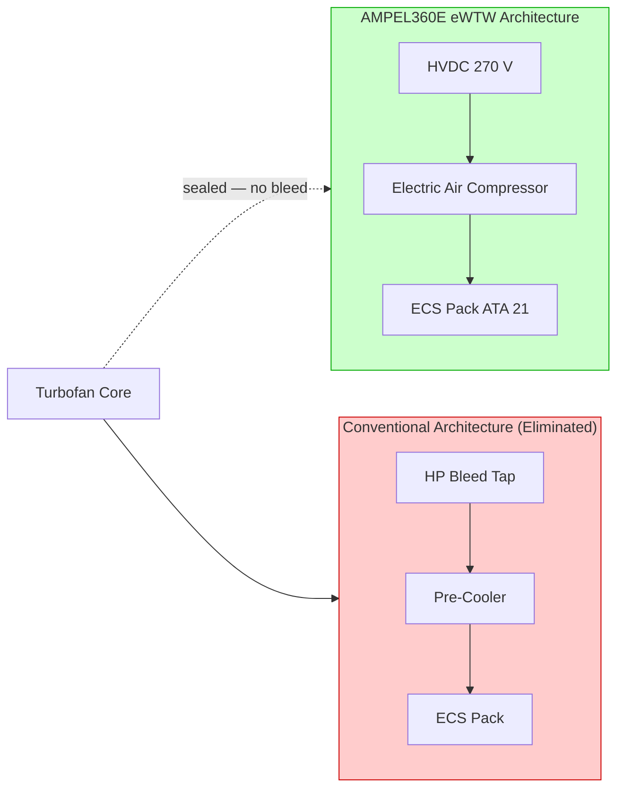
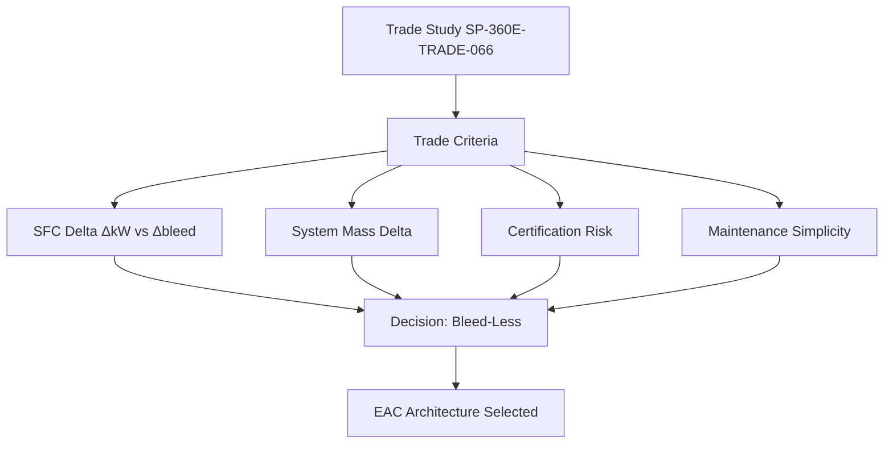

<!-- ──────────────────────────────────────────────────────────────────────────
     QATL-ATLAS-1000-ATLAS-060-069-066-010-ENGINE-DRIVEN-AIR-COMPRESSOR
     ATA 66 · Engine-Driven Air Compressor — Architectural Trade
     AMPEL360E eWTW — ATLAS Register 1000
────────────────────────────────────────────────────────────────────────────── -->

# Engine-Driven Air Compressor — Architectural Trade

---

## §0 Hyperlink Policy

> All hyperlinks in this document are **relative** (five directory levels: `../../../../../`).
> Absolute URLs are forbidden. Every linked document must exist in the Q+ATLANTIDE repository
> before the link is activated. Broken links are treated as open issues and must be resolved
> before the document is promoted from `DRAFT` to `APPROVED`.

---

## §1 Purpose

This document captures the architectural trade study that led to the **elimination of the conventional engine-driven air compressor** (bleed air off-take) on the AMPEL360E eWTW, and the adoption of electrically driven Electric Air Compressors (EAC) as the sole compressed-air source. It provides the rationale, trade criteria, quantified benefits, and residual risks that justify the bleed-less design.

On conventional narrowbody and widebody aircraft, the engine-driven compressor concept relies on extracting HP and/or LP stage bleed air from the turbofan core. This imposes a thermodynamic penalty on the engine cycle, reducing net thrust and increasing SFC. The AMPEL360E eWTW programme formally closed this design option in favour of a fully electric compressed-air supply architecture.

This document is part of the ATA 66 baseline and shall be referenced in all FADEC and ECS integration reviews. It does not describe a physical LRU but records the design decision and its evidence base.

---

## §2 Applicability

| Parameter | Value |
|---|---|
| Aircraft Program | AMPEL360E eWTW |
| ATA reference | ATA 66-010 — Engine-Driven Air Compressor (Architectural Trade) |
| Certification basis | EASA CS-25 Amdt 27+ |
| S1000D SNS | 066-010-00 |

---

## §3 Functional Description ![DRAFT]

A conventional engine-driven bleed compressor system taps HP compressor exit air (HP bleed at ~0.8–1.2 MPa, ~500 °C) or LP stage air for cabin pressurization and pneumatic systems. On a twin-engine narrowbody, this extraction amounts to approximately 3–5 % of total engine core airflow, producing a direct SFC penalty of 2–4 %.

The AMPEL360E eWTW eliminates all bleed ports from the turbofan — no HP bleed valve, no LP bleed band, and no pre-cooler assembly. The turbofan on the eWTW operates with a fully sealed compressor section. All previously bleed-supplied functions (cabin air, wing anti-ice, engine cowl anti-ice) are electrified. Wing and cowl anti-ice use electric heating mats (ATA 30); cabin pressurization uses EAC (ATA 66); NGS uses EAC-fed ASM (ATA 47).

The trade closure was confirmed at PDR (Preliminary Design Review) based on AMPEL360E performance model SP-360E-PERF-022, showing a net SFC gain of 2.9 % at cruise and a 3.4 % gain at climb, at the cost of approximately 180 kW additional electrical load on the HVDC bus.

---

## §4 Functional Breakdown

| ID | Name | Description | Lead Division |
|---|---|---|---|
| F-001 | Bleed port elimination | Removal of HP/LP bleed taps from turbofan fan case and core casing | Q-GREENTECH |
| F-002 | Pre-cooler removal | Elimination of pre-cooler assembly (no hot bleed to cool) | Q-MECHANICS |
| F-003 | Engine performance gain | SFC improvement from sealed compressor section; captured in engine model | Q-GREENTECH |
| F-004 | Electrical load delta | Additional ~180 kW on HVDC bus replaces pneumatic work; traded via MEA margin | Q-AIR |
| F-005 | Certification evidence | CS-25 §25.831 compliance shown via EAC; no pneumatic system fire zone changes | Q-INDUSTRY |

---

## §5 System Context — Mermaid Diagram

---

## §6 Internal Architecture — Mermaid Diagram

---

## §7 Components and LRUs

| Component | Part Number | Qty | Location | Maintenance Interval | Notes |
|---|---|---|---|---|---|
| HP Bleed Valve | N/A — eliminated | 0 | — | — | Absent on eWTW; no maintenance required |
| LP Bleed Band | N/A — eliminated | 0 | — | — | Absent on eWTW; no maintenance required |
| Pre-Cooler Assembly | N/A — eliminated | 0 | — | — | Absent on eWTW; significant mass saving |
| HP Bleed Duct (nacelle) | N/A — eliminated | 0 | — | — | No hot duct in nacelle — simplified fire zone |
| Trade Study Reference Document | SP-360E-TRADE-066 | 1 | Q-DATAGOV CSDB | Per programme revision | Records trade rationale and performance data |

---

## §8 Interfaces

| Interface Type | Connected System | Protocol / Medium | Data / Function |
|---|---|---|---|
| ATA 21 ECS | Environmental Control System | Architecture decision — ECS redesigned for EAC supply | EAC replaces bleed as pressurization source |
| ATA 24 Electrical Power | HVDC 270 V bus | Electrical load addition ~180 kW | Additional HVDC load from EAC vs eliminated pneumatic work |
| ATA 30 Ice Protection | Wing and cowl anti-ice | Architecture decision — electrothermal anti-ice | Eliminates hot bleed anti-ice ducts |
| ATA 62/63 Turbofan Engine | Core compressor section | Sealed — no bleed port interfaces | Engine performance gain from elimination |
| ATA 47 NGS | Nitrogen Generation System | Architecture decision — EAC-fed ASM | NGS uses EAC supply instead of engine bleed |

---

## §9 Operating Modes

| Mode | Trigger | System State | Actions / Consequences |
|---|---|---|---|
| Normal in-flight | Both engines running | No bleed extraction from engine | Turbofan operates at peak efficiency; EAC supplies all pneumatic loads |
| Single engine | One engine out | Remaining engine delivers full thrust with no bleed penalty | EAC supplied from HVDC; RAT may support if required |
| Ground (engines off) | APU running | APU provides HVDC to EAC | Cabin pre-conditioning via EAC; APU supplies ~150 kVA HVDC |
| Engine start | FADEC start sequence | Bleed-less start — starter/generator used | No bleed crossfeed valve required; simplified start logic |
| Emergency | Total electrical failure | EAC offline; RAT provides minimal power | Crew follows MEL for pressurization with RAM air (CS-25 §25.831) |

---

## §10 Performance and Budgets ![DRAFT]

| Parameter | Conventional Bleed | AMPEL360E eWTW (EAC) | Delta |
|---|---|---|---|
| Cruise SFC improvement | Baseline | +2.9 % | +2.9 % gain |
| Climb SFC improvement | Baseline | +3.4 % | +3.4 % gain |
| Nacelle bleed duct mass | ~25 kg / engine | 0 kg | −25 kg / engine |
| Additional HVDC electrical load | 0 kW (bleed carries energy) | ~180 kW | +180 kW HVDC load |
| Pre-cooler mass saving | ~8 kg / engine | 0 kg | −8 kg / engine |

---

## §11 Safety, Redundancy and Fault Tolerance

- Elimination of high-temperature bleed ducts from nacelle and pylon reduces fire risk in engine zone (CS-25 §25.1181 zone simplification).
- No HP bleed duct means no risk of bleed air leak ignition in the pylon; nacelle fire zone analysis (CS-25 §25.1185) simplified accordingly.
- Loss of both EAC units is considered in the FHA; ACCU dual-channel architecture and independent HVDC bus feeds provide adequate redundancy.
- The absence of bleed valves removes a class of single-point failures (bleed valve stuck-open leading to overheat); net safety improvement documented in Safety Assessment SA-066-010.

---

## §12 Maintenance and Diagnostics

| Task | Interval | Access | Special Tools |
|---|---|---|---|
| Verify bleed-port blanks (turbofan inspection) | C-check borescope | Engine borescope ports | Borescope kit |
| Review trade study document currency | Per programme revision | Q-DATAGOV CSDB | CSDB access |
| Validate EAC load vs performance model at each airline entry into service | EIS + 500 FH | ACCU GSE download | ACCU GSE terminal |
| Confirm no HP/LP bleed valve listed in IPC (incorrect parts risk) | Each IPC revision | Q-DATAGOV IPC review | IPC comparison tool |

---

## §13 Footprint — Physical, Electrical, Maintenance, Data ![TBD]

| Footprint Type | Parameter | Value | Notes |
|---|---|---|---|
| Physical | Bleed duct mass eliminated | ~33 kg / engine | Pre-cooler + duct + valve |
| Physical | EAC + ACCU mass added | ![TBD] | Pending EAC OEM final design |
| Electrical | Net HVDC load increase | ~180 kW | Both EACs at design point |
| Maintenance | Bleed valve inspection tasks eliminated | ~8 tasks / engine / C-check | Maintenance cost benefit |
| Data | Trade study document | SP-360E-TRADE-066 | Q-DATAGOV controlled |

---

## §14 Safety and Certification References ![DRAFT]

| Standard / Document | Title | Issuing Body | Applicability |
|---|---|---|---|
| EASA CS-25 §25.831 | Ventilation | EASA | Minimum cabin air supply — met by EAC |
| EASA CS-25 §25.1181 | Designated fire zones | EASA | Nacelle fire zone simplified by bleed elimination |
| EASA CS-E §810 | Engine compressor | EASA | Sealed compressor — no bleed port certification |
| SP-360E-TRADE-066 | Bleed vs EAC Trade Study | AMPEL360E Programme | Programme trade closure document |
| SP-360E-PERF-022 | Engine Performance Model with EAC | AMPEL360E Programme | SFC delta quantification |

---

## §15 V&V Approach ![TBD]

| Phase | Method | Acceptance Criterion | Status |
|---|---|---|---|
| Design | Trade study and performance model | SFC gain confirmed ≥ 2 % at cruise | ![TBD] |
| Integration | Engine ground test (no bleed extraction) | Engine operates per model; no bleed port leakage | ![TBD] |
| Qualification | Flight test — performance verification | SFC delta confirmed within ±0.5 % of model | ![TBD] |
| Certification | CS-25 §25.831 compliance demonstration | Cabin air flow met by EAC in all flight phases | ![TBD] |

---

## §16 Glossary

| Term | Definition |
|---|---|
| **Bleed-less architecture** | Aircraft design with no engine compressor stage bleed extraction for pneumatic systems. |
| **HP bleed** | High-Pressure bleed — air extracted from HP compressor exit; highest energy but largest SFC penalty. |
| **LP bleed** | Low-Pressure bleed — air extracted from LP compressor stage; lower energy but cooler temperature. |
| **Pre-cooler** | Heat exchanger cooling hot HP bleed air to ECS pack inlet temperature; eliminated on eWTW. |
| **SFC** | Specific Fuel Consumption — fuel burned per unit of thrust; key engine efficiency metric. |
| **EAC** | Electric Air Compressor — HVDC-powered unit replacing bleed. |
| **MEA** | More Electric Aircraft — design philosophy maximising use of electrical power in place of pneumatic/hydraulic. |
| **HVDC 270 V** | High-Voltage DC bus providing power to EAC motors. |
| **Trade study** | Systematic comparison of design alternatives against weighted criteria to select the preferred option. |
| **PDR** | Preliminary Design Review — programme milestone at which architecture is baselined. |

---

## §17 Open Issues

| ID | Description | Owner | Target |
|---|---|---|---|
| OI-066-010-001 | Confirm turbofan OEM warranty implications of bleed port elimination (engine model qualification) | Q-MECHANICS | 2026-Q3 |
| OI-066-010-002 | Update Safety Assessment SA-066-010 with final FHA figures from ACCU certification | Q-AIR / safety | 2027-Q1 |

---

## §18 Status Legend

| Badge | Meaning |
|---|---|
| `![DRAFT]` | Section is drafted but not yet reviewed |
| `![TBD]` | Content not yet started — to be defined |
| `![To Be Completed]` | Partially complete — needs additional content |
| `![APPROVED]` | Reviewed and formally approved |

---

## §19 Related Documents (Siblings in this Subsection)

- [066-000](./066-000-Air-Compressor-General.md)
- [066-020](./066-020-Auxiliary-Air-Compressor.md)
- [066-030](./066-030-Compressor-Inlet-and-Outlet-Interfaces.md)
- [066-040](./066-040-Compressor-Control-and-Regulation.md)
- [066-050](./066-050-Compressor-Cooling-and-Lubrication.md)
- [066-060](./066-060-Compressor-Protection-and-Surge-Control.md)
- [066-070](./066-070-Compressor-Inspection-Test-and-Maintenance.md)
- [066-080](./066-080-Air-Compressor-Monitoring-Diagnostics-and-Control-Interfaces.md)
- [066-090](./066-090-S1000D-CSDB-Mapping-and-Traceability.md)

---

## §20 Change Log

| Rev | Date | Author | Description |
|---|---|---|---|
| 0.1 | 2026-05-11 | @copilot | Initial DRAFT — contextualized content per AMPEL360E eWTW architecture |
