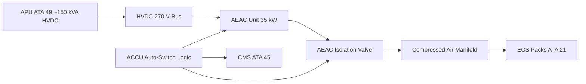
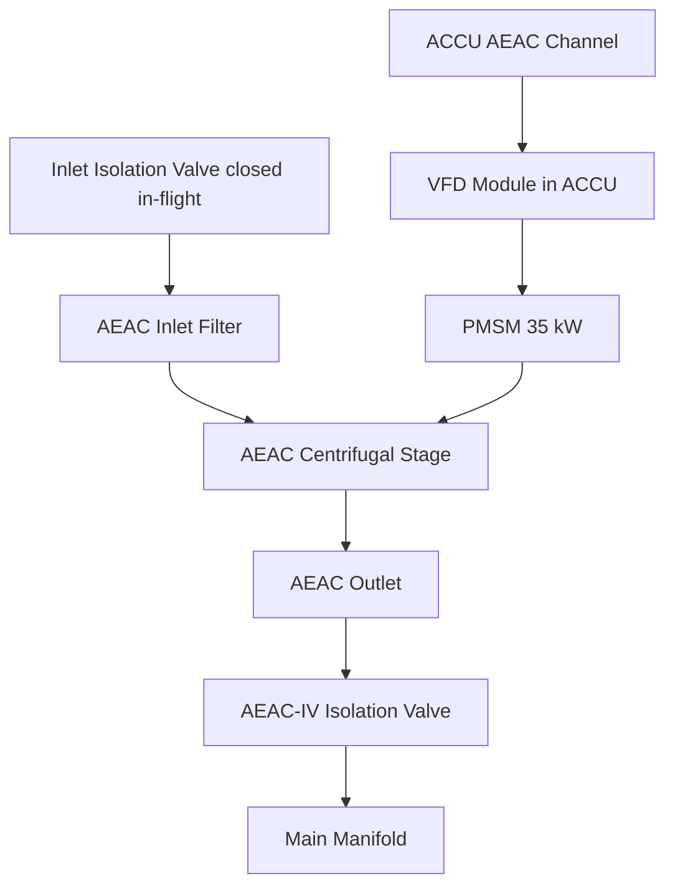

<!-- ──────────────────────────────────────────────────────────────────────────
     QATL-ATLAS-1000-ATLAS-060-069-066-020-AUXILIARY-AIR-COMPRESSOR
     ATA 66 · Auxiliary Air Compressor
     AMPEL360E eWTW — ATLAS Register 1000
────────────────────────────────────────────────────────────────────────────── -->

# Auxiliary Air Compressor

---

## §0 Hyperlink Policy

> All hyperlinks in this document are **relative** (five directory levels: `../../../../../`).
> Absolute URLs are forbidden. Every linked document must exist in the Q+ATLANTIDE repository
> before the link is activated. Broken links are treated as open issues and must be resolved
> before the document is promoted from `DRAFT` to `APPROVED`.

---

## §1 Purpose

The Auxiliary Electric Air Compressor (AEAC) provides compressed air when the two main Electric Air Compressors (EAC-A and EAC-B) are offline — principally during ground operations when both main engines are shut down and the APU (ATA 49) is the sole electrical power source.

On the AMPEL360E eWTW the AEAC is a compact single-stage centrifugal unit, rated at approximately 1.5 kg/s at 0.45 MPa outlet pressure. It is powered from the HVDC 270 V bus fed by the APU generator (~150 kVA). The AEAC enables full cabin pre-conditioning (ATA 21) and limited NGS (ATA 47) operation on the ground before engine start, supporting rapid turnaround operations without reliance on a ground air cart.

The AEAC is controlled by the ACCU (same dual-channel unit that manages EAC-A/B) using a dedicated AEAC speed channel. Auto-switch logic in the ACCU activates the AEAC when both EAC-A and EAC-B are decommanded and APU HVDC power is available.

---

## §2 Applicability

| Parameter | Value |
|---|---|
| Aircraft Program | AMPEL360E eWTW |
| ATA reference | ATA 66-020 — Auxiliary Air Compressor |
| Certification basis | EASA CS-25 Amdt 27+ |
| S1000D SNS | 066-020-00 |

---

## §3 Functional Description ![DRAFT]

The AEAC shares the compressed-air distribution manifold with EAC-A and EAC-B, but is isolated from the main ECS supply duct by a dedicated isolation valve (AEAC-IV) commanded by the ACCU. This isolation valve prevents AEAC operation from interfering with in-flight EAC operation, and prevents pressurisation of the AEAC from the main system during flight.

The AEAC inlet is the same RAM air intake used by the main EACs but has an additional inlet isolation valve (AEAC-IIV) that closes during flight to prevent windmilling. The AEAC motor is a smaller PMSM (approximately 35 kW) with a dedicated VFD module housed in the ACCU chassis.

BITE for the AEAC is integrated into the ACCU BITE architecture and reported to CMS (ATA 45) via AFDX. An AEAC status indication is provided on the ECAM SD ECS page.

---

## §4 Functional Breakdown

| ID | Name | Description | Lead Division |
|---|---|---|---|
| F-001 | AEAC Unit | Compact centrifugal compressor; PMSM 35 kW; HVDC 270 V powered | Q-GREENTECH |
| F-002 | AEAC Isolation Valve (AEAC-IV) | Separates AEAC from main ECS manifold; closed in flight | Q-MECHANICS |
| F-003 | AEAC Inlet Isolation Valve (AEAC-IIV) | Closes AEAC inlet during flight to prevent windmilling | Q-AIR |
| F-004 | ACCU AEAC Channel | Dedicated speed/pressure control channel for AEAC within ACCU | Q-MECHANICS |
| F-005 | Auto-Switch Logic | ACCU logic detecting EAC-A/B decommand + APU HVDC available → AEAC start command | Q-INDUSTRY |

---

## §5 System Context — Mermaid Diagram

---

## §6 Internal Architecture — Mermaid Diagram

---

## §7 Components and LRUs

| Component | Part Number | Qty | Location | Maintenance Interval | Notes |
|---|---|---|---|---|---|
| AEAC Unit (compressor + motor) | AEAC-PN-TBD | 1 | Fwd belly fairing, centreline | On condition / bearing check 8 000 FH | Smaller than main EAC; ground use only |
| AEAC Isolation Valve (AEAC-IV) | AEAC-IV-PN-TBD | 1 | AEAC outlet manifold | Functional test C-check | Motor-operated butterfly valve; fail-closed |
| AEAC Inlet Isolation Valve (AEAC-IIV) | AEAC-IIV-PN-TBD | 1 | AEAC inlet duct | Functional test C-check | Closes in-flight via ACCU command |
| VFD Module (AEAC channel) | VFD-AEAC-PN-TBD | 1 | Inside ACCU chassis | With ACCU replacement | Dedicated AEAC drive circuit |
| Inlet Filter Element | AEAC-FILT-PN-TBD | 1 | AEAC inlet duct | Replace A-check / 500 FH ground cycles | Prevents FOD ingestion during ground ops |

---

## §8 Interfaces

| Interface Type | Connected System | Protocol / Medium | Data / Function |
|---|---|---|---|
| ATA 49 APU | Auxiliary Power Unit | HVDC 270 V cable | Power supply for AEAC motor drive |
| ATA 21 ECS | Environmental Control System | Compressed air duct 0.45 MPa | Ground pre-conditioning air supply |
| ATA 24 Electrical Power | HVDC 270 V bus | HVDC cable | Power when APU or ground power active |
| ATA 45 CMS | Central Maintenance System | AFDX ARINC 664 P7 | AEAC BITE faults and health data |
| ATA 31 ECAM | Cockpit display | AFDX | AEAC status on ECS SD page |

---

## §9 Operating Modes

| Mode | Trigger | System State | Actions / Consequences |
|---|---|---|---|
| Ground pre-conditioning | Engines off, APU running | AEAC active; AEAC-IV open; AEAC-IIV open | Cabin receives pre-conditioned air; ACCU regulates at 0.45 MPa |
| In-flight (AEAC off) | EAC-A and/or EAC-B active | AEAC-IV closed; AEAC-IIV closed; AEAC stopped | AEAC isolated; no windmilling risk |
| Ground power (no APU) | Ground power cart supplying HVDC | AEAC can operate if HVDC available | Used for maintenance ground tests |
| AEAC fault (ground) | ACCU BITE fault on AEAC | AEAC decommanded; ECAM amber | Ground operation without cabin air; requires APU bleed cart (non-eWTW GSE) or MEL defer |
| AEAC ground test | ACCU GSE command | AEAC operated at reduced speed | Functional test per AMM without AEAC-IV open (recirculation mode) |

---

## §10 Performance and Budgets ![DRAFT]

| Parameter | Requirement | Target / Design Value | Status |
|---|---|---|---|
| Mass flow (AEAC, ground) | ≥ 1.3 kg/s at sea level | 1.5 kg/s | ![TBD] |
| Outlet pressure (AEAC) | 0.40–0.50 MPa gauge | 0.45 MPa | ![TBD] |
| Motor power (AEAC) | ≤ 40 kW | 35 kW nominal | ![TBD] |
| APU HVDC budget impact | AEAC ≤ 25 % APU capacity | ~23 % at 150 kVA APU | ![TBD] |
| AEAC auto-start time | ≤ 30 s from ACCU command | Target 20 s | ![TBD] |

---

## §11 Safety, Redundancy and Fault Tolerance

- AEAC is a ground-only system; in-flight operation is inhibited by ACCU logic and AEAC-IIV closure — double protection against inadvertent in-flight activation.
- AEAC-IV fail-closed design ensures a failed-open valve does not back-drive compressed air into the AEAC during EAC in-flight operation.
- AEAC fault on the ground is non-safety-critical (cabin air not required for pressurization when not airborne); MEL deferred per approved MEL procedure.
- Inlet filter prevents large particulate FOD during ground operations in contaminated environments.

---

## §12 Maintenance and Diagnostics

| Task | Interval | Access | Special Tools |
|---|---|---|---|
| AEAC inlet filter replacement | A-check / 500 FH ground cycles | Belly fairing access panel | Filter extraction tool |
| AEAC-IV and AEAC-IIV functional test | C-check | ACCU GSE command | ACCU GSE terminal |
| AEAC bearing check and vibration trend | 8 000 FH | Belly fairing access | Vibration analyser; ACCU GSE |
| AEAC LRU replacement | On condition | Belly fairing removal — 3 h task | HVDC isolation kit; torque wrench set |

---

## §13 Footprint — Physical, Electrical, Maintenance, Data ![TBD]

| Footprint Type | Parameter | Value | Notes |
|---|---|---|---|
| Physical | Mass — AEAC unit | ![TBD] | Ground use only; smaller than main EAC |
| Physical | Envelope — AEAC | ![TBD] | Belly fairing centreline zone |
| Electrical | Peak power (AEAC) | ~35 kW | From APU HVDC |
| Maintenance | Access category | Belly fairing panel — line maintenance | Per AMM |
| Data | AFDX bandwidth (AEAC BITE) | ![TBD] | Subset of ACCU AFDX allocation |

---

## §14 Safety and Certification References ![DRAFT]

| Standard / Document | Title | Issuing Body | Applicability |
|---|---|---|---|
| EASA CS-25 §25.831 | Ventilation | EASA | Ground pre-conditioning air supply requirement |
| DO-178C | Software Considerations | RTCA | ACCU AEAC channel software (DAL C) |
| DO-160G | Environmental Conditions | RTCA | AEAC unit environmental qualification |
| ATA iSpec 2200 | Chapter 66 — Air Compressor | ATA | ATA chapter scope |
| EASA CS-25 §25.1309 | Equipment, systems, installations | EASA | Failure effects of AEAC-IV stuck-open |

---

## §15 V&V Approach ![TBD]

| Phase | Method | Acceptance Criterion | Status |
|---|---|---|---|
| Design | Analysis — APU HVDC budget | AEAC ≤ 25 % APU capacity | ![TBD] |
| Integration | Ground functional test (ACCU GSE) | AEAC starts in ≤ 30 s; AEAC-IV cycles correctly | ![TBD] |
| Qualification | DO-160G environmental test | All applicable categories pass | ![TBD] |
| Certification | CS-25 §25.831 ground demonstration | Cabin receives adequate air on ground from AEAC alone | ![TBD] |

---

## §16 Glossary

| Term | Definition |
|---|---|
| **AEAC** | Auxiliary Electric Air Compressor — ground-operations compressed-air unit. |
| **AEAC-IV** | AEAC Isolation Valve — separates AEAC from main manifold. |
| **AEAC-IIV** | AEAC Inlet Isolation Valve — closes AEAC inlet during flight. |
| **APU** | Auxiliary Power Unit — gas turbine providing HVDC on the ground (ATA 49). |
| **HVDC 270 V** | High-Voltage DC bus powering AEAC motor. |
| **Auto-switch logic** | ACCU function detecting conditions for AEAC start/stop. |
| **VFD** | Variable Frequency Drive — motor controller for AEAC PMSM. |
| **PMSM** | Permanent-Magnet Synchronous Motor. |
| **Ground pre-conditioning** | Cooling or heating of cabin before departure using AEAC-supplied ECS. |
| **FOD** | Foreign Object Debris — debris ingestion risk during ground operations. |

---

## §17 Open Issues

| ID | Description | Owner | Target |
|---|---|---|---|
| OI-066-020-001 | Confirm APU HVDC capacity margin with AEAC + galley + avionics ground loads | Q-MECHANICS | 2026-Q3 |
| OI-066-020-002 | Define AEAC MEL category and dispatch without AEAC on ground operations | Q-AIR / safety | 2026-Q4 |

---

## §18 Status Legend

| Badge | Meaning |
|---|---|
| `![DRAFT]` | Section is drafted but not yet reviewed |
| `![TBD]` | Content not yet started — to be defined |
| `![To Be Completed]` | Partially complete — needs additional content |
| `![APPROVED]` | Reviewed and formally approved |

---

## §19 Related Documents (Siblings in this Subsection)

- [066-000](./066-000-Air-Compressor-General.md)
- [066-010](./066-010-Engine-Driven-Air-Compressor.md)
- [066-030](./066-030-Compressor-Inlet-and-Outlet-Interfaces.md)
- [066-040](./066-040-Compressor-Control-and-Regulation.md)
- [066-050](./066-050-Compressor-Cooling-and-Lubrication.md)
- [066-060](./066-060-Compressor-Protection-and-Surge-Control.md)
- [066-070](./066-070-Compressor-Inspection-Test-and-Maintenance.md)
- [066-080](./066-080-Air-Compressor-Monitoring-Diagnostics-and-Control-Interfaces.md)
- [066-090](./066-090-S1000D-CSDB-Mapping-and-Traceability.md)

---

## §20 Change Log

| Rev | Date | Author | Description |
|---|---|---|---|
| 0.1 | 2026-05-11 | @copilot | Initial DRAFT — contextualized content per AMPEL360E eWTW architecture |
