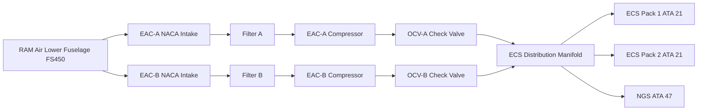
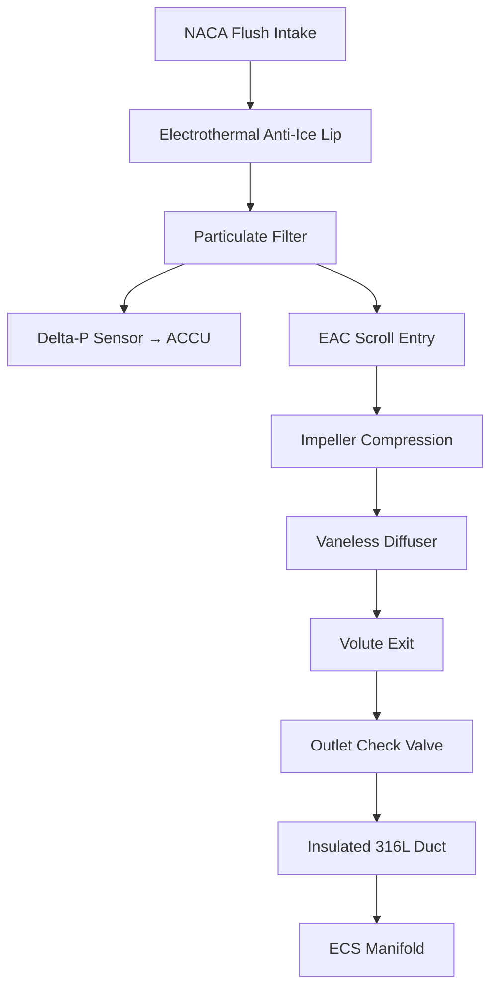

# Compressor Inlet and Outlet Interfaces

---

## §0 Hyperlink Policy

> All hyperlinks in this document are **relative** (five directory levels: `../../../../../`).
> Absolute URLs are forbidden.

---

## §1 Purpose

This document defines the agnostic ATLAS standard-level architecture context for `Compressor Inlet and Outlet Interfaces`.

It describes the controlled scope, functions, interfaces, safety considerations, lifecycle traceability, and S1000D/CSDB mapping logic that programme implementations shall instantiate when this node is applicable.

This document is not a programme design baseline. Programme-specific capacities, locations, part numbers, effectivity, operating limits, maintenance references, and data module codes shall be defined only inside the applicable programme implementation branch.
## §2 Applicability

| Applicability Level | Rule |
|---|---|
| Standard taxonomy | Applies to the ATLAS node `066` |
| Programme implementation | Conditional; determined by programme architecture, trade studies, certification basis, and applicability model |
| Product configuration | Defined in the programme-specific configuration baseline |
| Effectivity | Defined in the programme CSDB / applicability layer |
| Non-applicability | Must be explicitly stated in the programme impact-study branch when excluded |
## §3 Functional Description ![DRAFT]

**Inlet:** Each EAC uses a NACA flush intake on the lower fuselage forward section (station approximately FS 450). The inlet lip is electrically heated (electrothermal anti-ice, EAI) to prevent ice accretion at altitudes up to FL410 and OAT down to −55 °C. Inlet air passes through a high-efficiency particulate filter before entering the EAC scroll. A differential pressure sensor monitors filter condition; ACCU triggers a maintenance advisory when ΔP across filter exceeds 1.5 kPa.

**Outlet:** Compressed air exits the EAC at approximately 0.52 MPa and 180 °C. A stainless-steel outlet duct (316L, 75 mm ID) routes through the belly fairing to the common ECS manifold. An outlet check valve (OCV) on each EAC prevents back-flow between channels. Downstream of the OCV, a distribution manifold splits to ECS Pack 1, ECS Pack 2, and the NGS feed branch. Duct insulation (aerogel blanket) limits surface temperature to < 60 °C for maintenance accessibility.

---

## §4 Functional Breakdown

| ID | Name | Description | Lead Division |
|---|---|---|---|
| F-001 | NACA Flush Intake | Aerodynamically optimised inlet; low drag; low turbulence recovery | Q-GREENTECH |
| F-002 | Inlet Electrothermal Anti-Ice (EAI) | Electrically heated inlet lip; prevents ice accretion | Q-AIR |
| F-003 | Inlet Particulate Filter | High-efficiency filter element; ΔP monitoring by ACCU | Q-MECHANICS |
| F-004 | Outlet Check Valve (OCV) | Prevents back-flow between EAC-A and EAC-B channels | Q-MECHANICS |
| F-005 | Outlet Duct and Manifold | 316L stainless duct; aerogel insulation; connects to ECS manifold | Q-INDUSTRY |

---

## §5 System Context — Mermaid Diagram

---

## §6 Internal Architecture — Mermaid Diagram

---

## §7 Components and LRUs

| Component | Part Number | Qty | Location | Maintenance Interval | Notes |
|---|---|---|---|---|---|
| NACA Intake Lip (incl. EAI heater mat) | NACA-LIP-PN-TBD | 2 (A+B) | Lower fuselage FS450 | Inspect C-check; replace on damage | Electrically heated; resistance check A-check |
| Inlet Particulate Filter Element | FILT-EAC-PN-TBD | 2 (A+B) | EAC inlet duct | Replace 500 FH or on ΔP advisory | ACCU monitors ΔP; maintenance advisory at 1.5 kPa |
| Outlet Check Valve (OCV) | OCV-EAC-PN-TBD | 2 (A+B) | EAC outlet | Functional test C-check; replace on seat leakage | Stainless swing check valve; fail-closed |
| EAI Controller Module | EAI-CTRL-PN-TBD | 1 (shared A+B) | EE bay | Software update per SB | Controls heater power based on OAT and altitude |
| Outlet Duct Section (316L) | DUCT-EAC-PN-TBD | 2 per EAC | Belly fairing interior | Inspect for cracking C-check | Aerogel-insulated; surface temp < 60 °C |

---

## §8 Interfaces

| Interface Type | Connected System | Protocol / Medium | Data / Function |
|---|---|---|---|
| ATA 21 ECS | ECS packs 1 and 2 | Compressed air duct 0.52 MPa, 180 °C | Primary air supply to ECS |
| ATA 30 Ice Protection | Inlet anti-ice system | Electrical 28 V DC heater mats | EAI inlet lip heating |
| ATA 24 Electrical Power | 28 V DC bus | Electrical cable | EAI heater and EAI controller power |
| ATA 45 CMS | Central Maintenance System | AFDX | Filter ΔP advisory, EAI status |
| ATA 47 NGS | Nitrogen Generation System | Compressed air branch duct | Reduced-pressure air supply to ASM |

---

## §9 Operating Modes

| Mode | Trigger | System State | Actions / Consequences |
|---|---|---|---|
| Normal in-flight | EAC-A or B running | RAM recovery 0.4–0.6 qc | Inlet operates without icing risk above FL050 if EAI active |
| EAI active (icing conditions) | OAT ≤ +5 °C and visible moisture | EAI heater on; lip heated to > +10 °C | ACCU monitors EAI circuit continuity; ECAM indication |
| Filter ΔP advisory | ΔP filter > 1.5 kPa | ACCU issues maintenance advisory | EAC continues to operate; advisory triggers filter check at next A-check |
| OCV back-flow prevention | One EAC higher pressure | OCV on lower-pressure EAC closes | Prevents compressed air flowing back through idle EAC |
| Duct over-temperature | Outlet > 220 °C | ACCU decelerates EAC | Temperature fault logged; ECAM amber advisory |

---

## §10 Performance and Budgets ![DRAFT]

| Parameter | Requirement | Target / Design Value | Status |
|---|---|---|---|
| Inlet RAM recovery coefficient | ≥ 0.93 at M0.82 | 0.95 (NACA flush design) | ![TBD] |
| Inlet EAI power per side | ≤ 1.5 kW | 1.2 kW at −55 °C | ![TBD] |
| Outlet duct max temperature | ≤ 250 °C continuous | 180 °C nominal / 220 °C transient | ![TBD] |
| OCV seat leakage | ≤ 0.01 kg/s at 0.55 MPa | < 0.005 kg/s | ![TBD] |
| Filter service life | ≥ 500 FH ground cycles | 600 FH design target | ![TBD] |

---

## §11 Safety, Redundancy and Fault Tolerance

- OCV on each EAC provides passive back-flow prevention; failure in open position is detectable by ACCU via cross-channel pressure monitoring.
- EAI heater mat failure on one side does not prevent EAC operation; ice accretion risk mitigated by AMM minimum speed requirement and OAT monitoring.
- Inlet filter clogging is progressive; ACCU advisory gives advance warning before filter pressure drop affects EAC performance.
- Outlet duct rated for max 0.70 MPa (OPRV set point 0.65 MPa); factor 1.5 burst margin per CS-25 §25.1435.

---

## §12 Maintenance and Diagnostics

| Task | Interval | Access | Special Tools |
|---|---|---|---|
| Inlet filter inspection and replacement | 500 FH or ΔP advisory | Belly fairing access panel | Filter extraction tool |
| EAI heater mat resistance check | A-check | Lower fuselage inspection panel | Resistance meter; AMM limits |
| OCV seat leakage test | C-check | EAC outlet duct access | Pressure gauge; AMM procedure |
| Outlet duct inspection for cracks and insulation condition | C-check | Belly fairing interior | Borescope if required; NDT kit |

---

## §13 Footprint — Physical, Electrical, Maintenance, Data ![TBD]

| Footprint Type | Parameter | Value | Notes |
|---|---|---|---|
| Physical | Inlet NACA aperture (each) | ![TBD] | Pending aerodynamic detail design |
| Physical | Outlet duct diameter | 75 mm ID (316L) | Per system sizing |
| Electrical | EAI heater power (per side) | ~1.2 kW | 28 V DC |
| Maintenance | Filter replacement time | ~20 min | Belly fairing access panel |
| Data | AFDX — filter ΔP and EAI status | ![TBD] | Subset of ACCU AFDX allocation |

---

## §14 Safety and Certification References ![DRAFT]

| Standard / Document | Title | Issuing Body | Applicability |
|---|---|---|---|
| EASA CS-25 §25.1435 | Hydraulic systems (pressure design) | EASA | Duct pressure rating reference |
| EASA CS-25 §25.1419 | Ice protection | EASA | EAI inlet anti-ice qualification |
| DO-160G | Environmental Conditions | RTCA | Inlet hardware and EAI controller |
| ATA iSpec 2200 | Chapter 66 — Air Compressor | ATA | Chapter scope |
| SAE AIR1168/3 | Air Cycle Systems | SAE International | Duct design reference |

---

## §15 V&V Approach ![TBD]

| Phase | Method | Acceptance Criterion | Status |
|---|---|---|---|
| Design | CFD — intake recovery at M0.82 | RAM recovery ≥ 0.93 | ![TBD] |
| Integration | Ground test — OCV back-flow | Seat leakage < 0.01 kg/s | ![TBD] |
| Qualification | Icing wind tunnel — EAI heater | No ice accretion on lip at −20 °C SAT | ![TBD] |
| Certification | Flight test — duct temperature survey | Outlet duct surface < 60 °C | ![TBD] |

---

## §16 Glossary

| Term | Definition |
|---|---|
| **NACA flush intake** | Aerodynamic inlet shape providing RAM recovery with minimal external protrusion. |
| **EAI** | Electrothermal Anti-Ice — electrically heated component preventing ice build-up. |
| **OCV** | Outlet Check Valve — prevents reverse flow. |
| **ΔP** | Differential pressure — pressure drop across the inlet filter indicating clogging. |
| **RAM recovery** | Ratio of intake total pressure to freestream total pressure. |
| **316L** | Grade of austenitic stainless steel used for high-temperature compressed-air ducting. |
| **Aerogel insulation** | Low-conductivity insulation blanket reducing duct surface temperature. |
| **Scroll** | Curved inlet casing directing air into the centrifugal impeller. |
| **Diffuser** | Component downstream of impeller converting velocity to static pressure. |
| **Volute** | Spiral casing collecting diffuser exit flow. |

---

## §17 Open Issues

| ID | Description | Owner | Target |
|---|---|---|---|
| OI-066-030-001 | Complete CFD analysis for NACA intake at M0.82 in clean and icing conditions | Q-AIR | 2026-Q3 |
| OI-066-030-002 | Confirm duct routing clearance in belly fairing vs structural frames | Q-MECHANICS | 2026-Q4 |

---

## §18 Status Legend

| Badge | Meaning |
|---|---|
| `![DRAFT]` | Section is drafted but not yet reviewed |
| `![TBD]` | Content not yet started — to be defined |
| `![To Be Completed]` | Partially complete — needs additional content |
| `![APPROVED]` | Reviewed and formally approved |

---

## §19 Related Documents (Siblings in this Subsection)

- [066-000](./066-000-Air-Compressor-General.md)
- [066-010](./066-010-Engine-Driven-Air-Compressor.md)
- [066-020](./066-020-Auxiliary-Air-Compressor.md)
- [066-040](./066-040-Compressor-Control-and-Regulation.md)
- [066-050](./066-050-Compressor-Cooling-and-Lubrication.md)
- [066-060](./066-060-Compressor-Protection-and-Surge-Control.md)
- [066-070](./066-070-Compressor-Inspection-Test-and-Maintenance.md)
- [066-080](./066-080-Air-Compressor-Monitoring-Diagnostics-and-Control-Interfaces.md)
- [066-090](./066-090-S1000D-CSDB-Mapping-and-Traceability.md)

---

## §20 Change Log

| Rev | Date | Author | Description |
|---|---|---|---|
| 0.1 | 2026-05-11 | @copilot | Initial DRAFT — contextualized content per programme-defined aircraft type architecture |
