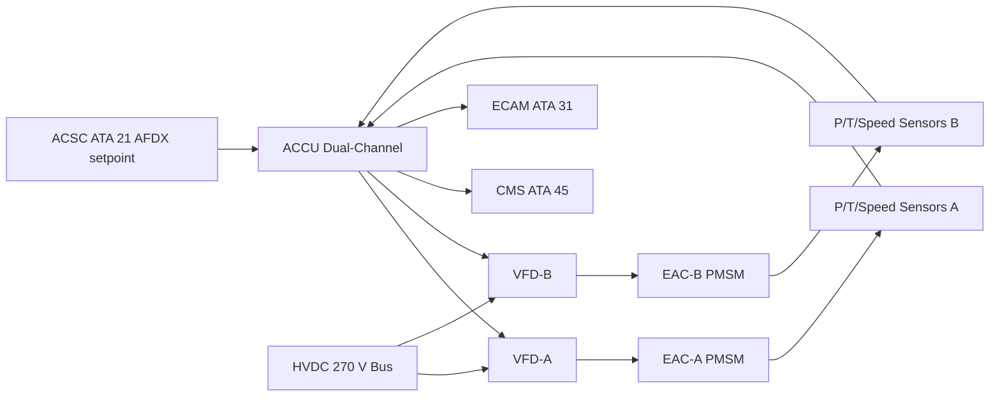
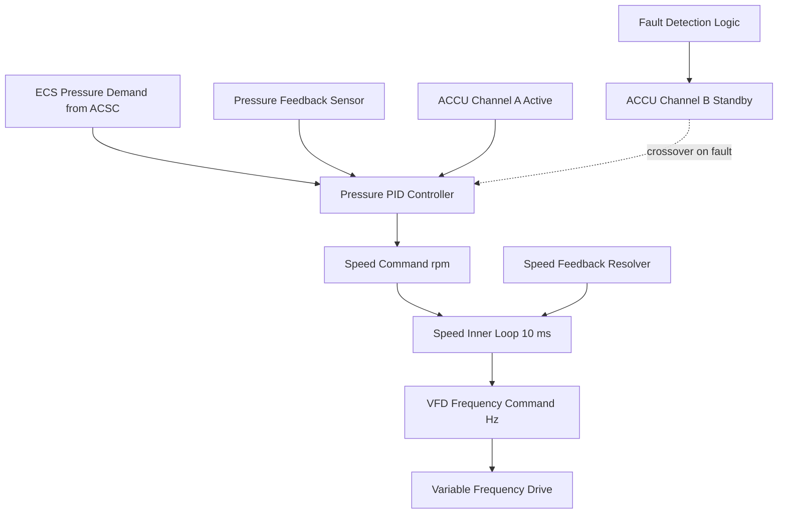

# Compressor Control and Regulation

---

## §0 Hyperlink Policy

> All hyperlinks in this document are **relative** (five directory levels: `../../../../../`).
> Absolute URLs are forbidden.

---

## §1 Purpose

This document defines the agnostic ATLAS standard-level architecture context for `Compressor Control and Regulation`.

It describes the controlled scope, functions, interfaces, safety considerations, lifecycle traceability, and S1000D/CSDB mapping logic that programme implementations shall instantiate when this node is applicable.

This document is not a programme design baseline. Programme-specific capacities, locations, part numbers, effectivity, operating limits, maintenance references, and data module codes shall be defined only inside the applicable programme implementation branch.
## §2 Applicability

| Applicability Level | Rule |
|---|---|
| Standard taxonomy | Applies to the ATLAS node `066` |
| Programme implementation | Conditional; determined by programme architecture, trade studies, certification basis, and applicability model |
| Product configuration | Defined in the programme-specific configuration baseline |
| Effectivity | Defined in the programme CSDB / applicability layer |
| Non-applicability | Must be explicitly stated in the programme impact-study branch when excluded |
## §3 Functional Description ![DRAFT]

The ACCU receives the ECS demand signal (pressure setpoint 0.45–0.55 MPa) from the ACSC over AFDX at a 50 ms update rate. An inner speed control loop runs at 10 ms and adjusts VFD output frequency to track the speed target derived from the pressure PID outer loop. The VFD converts HVDC 270 V to variable-frequency AC for the EAC PMSM motor.

Each channel (A and B) independently monitors EAC pressure, motor current, bearing temperature, and outlet temperature. Channel A is the commanding channel; Channel B is a shadow controller that can assume control within 50 ms of a Channel A failure. ACCU BITE continuously checks sensor reasonableness, VFD output, and communication integrity.

The ACCU also manages compressor load shedding during high-demand electrical events: if the HVDC bus voltage drops below 235 V, the ACCU reduces EAC speed by 10 % to shed load and prevent HVDC bus collapse.

---

## §4 Functional Breakdown

| ID | Name | Description | Lead Division |
|---|---|---|---|
| F-001 | Pressure outer loop (PID) | Regulates EAC outlet pressure to ACSC setpoint via speed command | Q-GREENTECH |
| F-002 | Speed inner loop | 10 ms speed control loop commanding VFD frequency | Q-MECHANICS |
| F-003 | Channel crossover | Automatic CH-A to CH-B switchover within 50 ms on fault | Q-MECHANICS |
| F-004 | Load shedding | EAC speed reduction 10 % when HVDC bus V < 235 V | Q-AIR |
| F-005 | AFDX demand interface | Receives ECS setpoint from ACSC; transmits status to CMS and ECAM | Q-INDUSTRY |

---

## §5 System Context — Mermaid Diagram

---

## §6 Internal Architecture — Mermaid Diagram

---

## §7 Components and LRUs

| Component | Part Number | Qty | Location | Maintenance Interval | Notes |
|---|---|---|---|---|---|
| ACCU (Air Compressor Control Unit) | ACCU-PN-TBD | 1 | EE bay rack zone | Software update per ACCU SB cycle | Dual-channel; DO-178C DAL C; DO-160G |
| VFD-A (Variable Frequency Drive, EAC-A) | VFD-A-PN-TBD | 1 | ACCU chassis or adjacent rack | With ACCU or standalone replacement | Converts HVDC 270 V to variable-freq AC |
| VFD-B (Variable Frequency Drive, EAC-B) | VFD-B-PN-TBD | 1 | ACCU chassis or adjacent rack | With ACCU or standalone replacement | Identical to VFD-A |
| EAC Outlet Pressure Sensor (each EAC) | P-SENS-EAC-PN-TBD | 2 | EAC outlet duct | Calibration check C-check | Dual-redundant per channel; ACCU selects best-value |
| EAC Motor Speed Resolver (each EAC) | RESOLVER-EAC-PN-TBD | 2 | EAC motor shaft | Inspect C-check; replace on fault | 0.05 % accuracy; provides inner-loop feedback |

---

## §8 Interfaces

| Interface Type | Connected System | Protocol / Medium | Data / Function |
|---|---|---|---|
| ATA 21 ACSC | Air Conditioning System Controller | AFDX ARINC 664 P7 | ECS pressure demand setpoint to ACCU |
| ATA 24 HVDC | HVDC 270 V primary bus | HVDC cable | Power supply to VFD-A and VFD-B |
| ATA 45 CMS | Central Maintenance System | AFDX | ACCU BITE faults, health parameters |
| ATA 31 ECAM | Cockpit display | AFDX | EAC pressure, speed, ACCU status |
| ATA 24 Bus Monitor | HVDC voltage monitoring | Hardwired discrete | Load-shedding trigger if HVDC < 235 V |

---

## §9 Operating Modes

| Mode | Trigger | System State | Actions / Consequences |
|---|---|---|---|
| Normal dual EAC control | Both EACs healthy | ACCU CH-A commanding both VFDs | Closed-loop pressure regulation at ACSC setpoint |
| Channel crossover | CH-A fault detected by BITE | CH-B assumes control within 50 ms | Bumpless transfer; ECAM amber ACCU advisory |
| Load shedding | HVDC bus < 235 V | ACCU reduces EAC speed 10 % | Cabin pressure may drop slightly; crew notified via ECAM |
| Single EAC mode | One EAC commanded off | Remaining EAC speed increased to supply both packs | ACCU adjusts setpoint; ECAM status change |
| Ground test mode | ACCU GSE command | ACCU runs EAC at reduced speed for BITE test | AEAC-IV closed; pressurised to test duct |

---

## §10 Performance and Budgets ![DRAFT]

| Parameter | Requirement | Target / Design Value | Status |
|---|---|---|---|
| Pressure regulation accuracy | ±0.02 MPa of setpoint | ±0.015 MPa | ![TBD] |
| Speed inner loop response | Step response ≤ 100 ms | 80 ms | ![TBD] |
| CH-A to CH-B crossover time | ≤ 50 ms | 35 ms target | ![TBD] |
| ACCU BITE fault detection coverage | ≥ 85 % | ≥ 87 % | ![TBD] |
| Load-shedding speed reduction | 10 % speed in ≤ 200 ms | 150 ms | ![TBD] |

---

## §11 Safety, Redundancy and Fault Tolerance

- ACCU dual-channel architecture (DO-178C DAL C) provides single-fault tolerance; dual-channel failure classified as Extremely Improbable per FHA.
- VFD failure is detected by ACCU within one 10 ms loop; EAC decommanded; remaining EAC supplies both packs.
- Load-shedding function protects HVDC bus stability at the expense of slight cabin pressure reduction — a safe degradation path per CS-25 §25.841.
- Pressure sensor dual-redundancy prevents single sensor failure from causing incorrect speed commands.

---

## §12 Maintenance and Diagnostics

| Task | Interval | Access | Special Tools |
|---|---|---|---|
| ACCU BITE log download | A-check | CMS terminal or ACARS | CMS terminal |
| Pressure sensor calibration check | C-check | EAC outlet duct access | Calibrated pressure reference |
| ACCU channel crossover test | C-check | ACCU GSE | ACCU GSE terminal |
| VFD output waveform check | C-check | ACCU chassis access | Oscilloscope probe set |

---

## §13 Footprint — Physical, Electrical, Maintenance, Data ![TBD]

| Footprint Type | Parameter | Value | Notes |
|---|---|---|---|
| Physical | ACCU mass | ![TBD] | EE bay rack unit |
| Physical | VFD mass (each) | ![TBD] | ACCU chassis or separate rack |
| Electrical | ACCU self-power | 28 V DC ~50 W | From dual DC buses |
| Maintenance | ACCU LRU swap time | ~1 h | EE bay access |
| Data | AFDX bandwidth (ACCU) | ![TBD] | Per AFDX bus load analysis |

---

## §14 Safety and Certification References ![DRAFT]

| Standard / Document | Title | Issuing Body | Applicability |
|---|---|---|---|
| DO-178C | Software Considerations | RTCA | ACCU software DAL C |
| DO-254 | Design Assurance for Airborne Electronic Hardware | RTCA | ACCU FPGA/complex hardware |
| DO-160G | Environmental Conditions | RTCA | ACCU and VFD qualification |
| EASA CS-25 §25.841 | Pressurization | EASA | Cabin pressure control regulation |
| ATA iSpec 2200 | Chapter 66 | ATA | Chapter scope |

---

## §15 V&V Approach ![TBD]

| Phase | Method | Acceptance Criterion | Status |
|---|---|---|---|
| Design | Model-based control analysis | Stability margins ≥ 6 dB gain / 45° phase | ![TBD] |
| Integration | HIL simulation — ACCU + VFD | Pressure regulation ±0.02 MPa | ![TBD] |
| Qualification | DO-160G environmental test | ACCU passes all applicable categories | ![TBD] |
| Certification | Ground test — channel crossover | CH-B control within 50 ms, bumpless | ![TBD] |

---

## §16 Glossary

| Term | Definition |
|---|---|
| **ACCU** | Air Compressor Control Unit — dual-channel digital controller for EAC. |
| **VFD** | Variable Frequency Drive — converts HVDC 270 V to variable-frequency AC. |
| **ACSC** | Air Conditioning System Controller (ATA 21) — sends pressure demand to ACCU. |
| **PID** | Proportional-Integral-Derivative — classical feedback control algorithm. |
| **CH-A / CH-B** | Active and standby channels of the ACCU. |
| **Bumpless transfer** | Smooth channel crossover with no spike in output. |
| **Load shedding** | Reducing EAC power to protect HVDC bus voltage. |
| **HIL** | Hardware-in-the-Loop simulation — test method for embedded controllers. |
| **DO-178C DAL C** | Software design assurance level C — for systems with hazardous failure effects. |
| **Resolver** | Electromagnetic sensor measuring shaft rotation angle and speed. |

---

## §17 Open Issues

| ID | Description | Owner | Target |
|---|---|---|---|
| OI-066-040-001 | Finalise ACCU control laws with EAC OEM (pressure PID tuning at altitude) | Q-MECHANICS | 2026-Q4 |
| OI-066-040-002 | Complete HIL simulation for ACCU channel crossover bumpless transfer verification | Q-AIR | 2027-Q1 |

---

## §18 Status Legend

| Badge | Meaning |
|---|---|
| `![DRAFT]` | Section is drafted but not yet reviewed |
| `![TBD]` | Content not yet started — to be defined |
| `![To Be Completed]` | Partially complete — needs additional content |
| `![APPROVED]` | Reviewed and formally approved |

---

## §19 Related Documents (Siblings in this Subsection)

- [066-000](./066-000-Air-Compressor-General.md)
- [066-010](./066-010-Engine-Driven-Air-Compressor.md)
- [066-020](./066-020-Auxiliary-Air-Compressor.md)
- [066-030](./066-030-Compressor-Inlet-and-Outlet-Interfaces.md)
- [066-050](./066-050-Compressor-Cooling-and-Lubrication.md)
- [066-060](./066-060-Compressor-Protection-and-Surge-Control.md)
- [066-070](./066-070-Compressor-Inspection-Test-and-Maintenance.md)
- [066-080](./066-080-Air-Compressor-Monitoring-Diagnostics-and-Control-Interfaces.md)
- [066-090](./066-090-S1000D-CSDB-Mapping-and-Traceability.md)

---

## §20 Change Log

| Rev | Date | Author | Description |
|---|---|---|---|
| 0.1 | 2026-05-11 | @copilot | Initial DRAFT — contextualized content per programme-defined aircraft type architecture |
