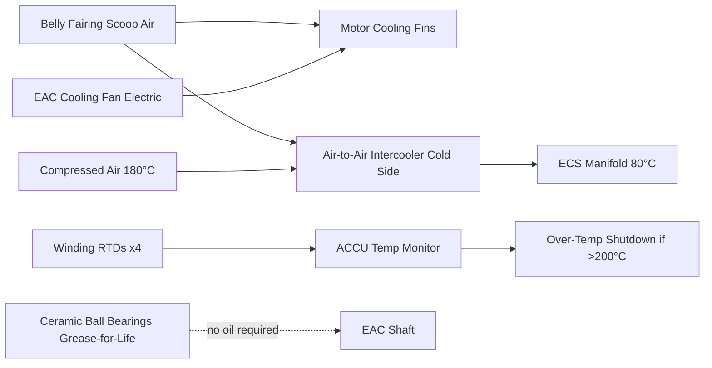
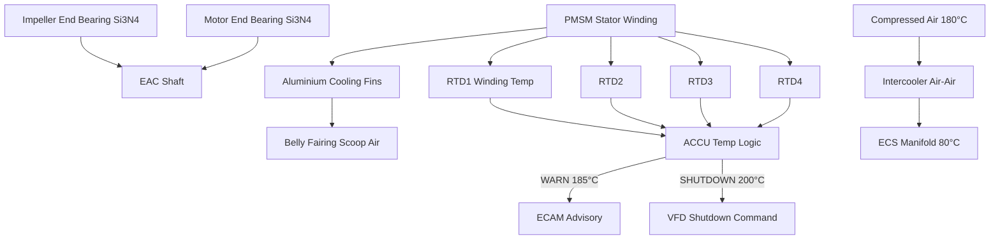

# Compressor Cooling and Lubrication

---

## §0 Hyperlink Policy

> All hyperlinks in this document are **relative** (five directory levels: `../../../../../`).
> Absolute URLs are forbidden.

---

## §1 Purpose

This document defines the agnostic ATLAS standard-level architecture context for `Compressor Cooling and Lubrication`.

It describes the controlled scope, functions, interfaces, safety considerations, lifecycle traceability, and S1000D/CSDB mapping logic that programme implementations shall instantiate when this node is applicable.

This document is not a programme design baseline. Programme-specific capacities, locations, part numbers, effectivity, operating limits, maintenance references, and data module codes shall be defined only inside the applicable programme implementation branch.
## §2 Applicability

| Applicability Level | Rule |
|---|---|
| Standard taxonomy | Applies to the ATLAS node `066` |
| Programme implementation | Conditional; determined by programme architecture, trade studies, certification basis, and applicability model |
| Product configuration | Defined in the programme-specific configuration baseline |
| Effectivity | Defined in the programme CSDB / applicability layer |
| Non-applicability | Must be explicitly stated in the programme impact-study branch when excluded |
## §3 Functional Description ![DRAFT]

**Bearing lubrication:** Ceramic hybrid angular-contact ball bearings (Si₃N₄ balls, steel rings) are used at both the impeller end and motor end of the EAC shaft. These bearings are grease-lubricated for life (no periodic re-greasing) with a design life exceeding 15 000 FH under normal operating loads. Vibration trending by the ACCU detects bearing degradation well before failure. There is no oil system: no oil tank, no oil pump, no oil cooler, and no oil filter to service.

**Motor cooling:** The PMSM stator is cooled by forced convection from belly fairing scoop air passing over cast aluminium cooling fins on the motor outer casing. At ground idle conditions, a small electric cooling fan (EAC-CF) supplements airflow when RAM air is insufficient. The ACCU monitors winding temperature (four embedded RTDs per motor). Over-temperature shutdown threshold: 200 °C; warning at 185 °C.

**Intercooler:** Between EAC compression stages (for two-stage variant, if adopted) or at EAC outlet before ECS manifold, an air-to-air intercooler reduces compressed-air temperature from ~180 °C to ~80 °C using RAM belly fairing air as the cold side. This reduces ECS pack thermal load and duct temperature.

---

## §4 Functional Breakdown

| ID | Name | Description | Lead Division |
|---|---|---|---|
| F-001 | Ceramic hybrid ball bearings | Oil-free bearing solution; 15 000 FH design life; grease-for-life | Q-GREENTECH |
| F-002 | Motor stator air cooling | Forced convection over aluminium fins; belly fairing scoop air | Q-MECHANICS |
| F-003 | EAC Cooling Fan (EAC-CF) | Electric fan supplementing motor cooling at ground/low-speed conditions | Q-AIR |
| F-004 | Air-to-Air Intercooler | Reduces compressed-air temperature before ECS manifold; RAM cold side | Q-MECHANICS |
| F-005 | Winding RTD monitoring | Four RTD sensors per motor; ACCU over-temp protection at 200 °C | Q-INDUSTRY |

---

## §5 System Context — Mermaid Diagram

---

## §6 Internal Architecture — Mermaid Diagram

---

## §7 Components and LRUs

| Component | Part Number | Qty | Location | Maintenance Interval | Notes |
|---|---|---|---|---|---|
| Ceramic hybrid ball bearing (impeller end) | BRG-IMP-PN-TBD | 2 (one per EAC) | EAC shaft impeller end | Replace at 15 000 FH or on vibration limit | Si₃N₄ balls; grease-for-life; no oil servicing |
| Ceramic hybrid ball bearing (motor end) | BRG-MOT-PN-TBD | 2 (one per EAC) | EAC shaft motor end | Replace at 15 000 FH or on vibration limit | Same as impeller end bearing |
| Motor winding RTD sensor | RTD-EAC-PN-TBD | 8 (four per EAC) | Embedded in stator winding | Replace with motor if fault | PT100 class A; ±0.5 °C accuracy |
| EAC Cooling Fan (EAC-CF) | EAC-CF-PN-TBD | 2 (one per EAC) | Motor housing exterior | Replace on failure (on-condition) | 28 V DC; 50 W; ACCU commanded |
| Air-to-Air Intercooler | IC-EAC-PN-TBD | 2 (one per EAC) | EAC outlet duct section | Inspect for fouling C-check | Corrugated aluminium core; no moving parts |

---

## §8 Interfaces

| Interface Type | Connected System | Protocol / Medium | Data / Function |
|---|---|---|---|
| ATA 24 Electrical Power | 28 V DC bus | Electrical | EAC-CF cooling fan power |
| ATA 21 ECS | ECS packs | Compressed air duct (intercooler outlet) | Reduced-temperature air to ECS packs |
| ATA 45 CMS | Central Maintenance System | AFDX | Winding temperature trends, bearing vibration |
| ATA 31 ECAM | Cockpit display | AFDX | Winding temp warning; over-temp indication |
| ACCU | EAC Control Unit | Internal signal (ACCU chassis) | RTD input, fan command, VFD shutdown command |

---

## §9 Operating Modes

| Mode | Trigger | System State | Actions / Consequences |
|---|---|---|---|
| Normal in-flight | EAC running at design point | RAM belly air cools motor; intercooler active | Motor winding ≤ 160 °C; intercooler reduces manifold temp to ~80 °C |
| Ground idle (engine off) | EAC running on APU HVDC | EAC-CF on; RAM air reduced | EAC-CF supplements motor cooling; winding temp monitored |
| Winding over-temp warning | RTD reads > 185 °C | ECAM amber advisory | Crew aware; ACCU logs event; cooling fan max speed |
| Winding over-temp shutdown | RTD reads > 200 °C | ACCU commands EAC shutdown | EAC decommanded; other EAC carries load; ECAM caution |
| Bearing vibration advisory | ACCU vibration trend exceeds limit | Maintenance advisory to CMS | Schedule bearing replacement at next C-check |

---

## §10 Performance and Budgets ![DRAFT]

| Parameter | Requirement | Target / Design Value | Status |
|---|---|---|---|
| Bearing design life | ≥ 12 000 FH | 15 000 FH | ![TBD] |
| Motor winding max temp (continuous) | ≤ 180 °C | 160 °C at design point | ![TBD] |
| Intercooler temperature reduction | ≥ 80 °C delta | ~100 °C delta (180 → 80 °C) | ![TBD] |
| EAC-CF power | ≤ 60 W | 50 W | ![TBD] |
| Intercooler pressure drop | ≤ 8 kPa | < 5 kPa | ![TBD] |

---

## §11 Safety, Redundancy and Fault Tolerance

- Oil-free bearing design eliminates oil fire risk in belly fairing zone (no oil system, no hot oil line).
- Dual-sensor redundancy (four RTDs per motor): ACCU uses median-select logic; single RTD failure does not trigger incorrect shutdown.
- Bearing vibration trending provides 500+ FH warning ahead of failure; no sudden bearing seizure risk.
- Intercooler is passive (no moving parts, no pumps); failure mode is blocked core (progressive, detectable by outlet temperature rise).

---

## §12 Maintenance and Diagnostics

| Task | Interval | Access | Special Tools |
|---|---|---|---|
| Bearing vibration trend review | A-check (ACCU data download) | CMS terminal | CMS terminal |
| Intercooler core visual inspection and cleaning | C-check | Belly fairing access | Compressed air/rinse kit |
| Motor winding RTD resistance check | C-check | EAC housing access | Resistance meter |
| EAC-CF functional test | C-check | ACCU GSE command | ACCU GSE terminal |

---

## §13 Footprint — Physical, Electrical, Maintenance, Data ![TBD]

| Footprint Type | Parameter | Value | Notes |
|---|---|---|---|
| Physical | Intercooler mass (each) | ![TBD] | Aluminium core; pending design |
| Physical | EAC-CF mass (each) | ![TBD] | Small fan unit; motor housing mounted |
| Electrical | EAC-CF power | 50 W at 28 V DC | Per EAC |
| Maintenance | Oil servicing tasks eliminated | 0 | No oil system — key [PROGRAMME-VARIANT] benefit |
| Data | RTD data to CMS | ![TBD] | Per AFDX bus load analysis |

---

## §14 Safety and Certification References ![DRAFT]

| Standard / Document | Title | Issuing Body | Applicability |
|---|---|---|---|
| EASA CS-E §810 | Engine compressor (applicable to EAC by analogy) | EASA | Bearing life and cooling requirements |
| DO-160G | Environmental Conditions | RTCA | EAC unit thermal cycling test |
| IEC 60034-1 | Rotating electrical machines | IEC | PMSM motor winding temperature class |
| ATA iSpec 2200 | Chapter 66 — Air Compressor | ATA | Chapter scope |
| ASTM F2131 | Ceramic bearing performance | ASTM | Si₃N₄ bearing qualification reference |

---

## §15 V&V Approach ![TBD]

| Phase | Method | Acceptance Criterion | Status |
|---|---|---|---|
| Design | Thermal analysis — motor cooling | Winding temp ≤ 160 °C at 45 °C OAT ground | ![TBD] |
| Integration | Ground test — intercooler effectiveness | Outlet temp ≤ 80 °C at design flow | ![TBD] |
| Qualification | Endurance test — bearing life | No bearing failure at 15 000 FH equivalent | ![TBD] |
| Certification | DO-160G thermal test | ACCU and EAC pass temperature/humidity categories | ![TBD] |

---

## §16 Glossary

| Term | Definition |
|---|---|
| **Ceramic hybrid bearing** | Ball bearing with Si₃N₄ ceramic balls and steel rings; oil-free; grease-lubricated for life. |
| **Grease-for-life** | Bearing pre-packed with grease at manufacture; no periodic re-greasing required. |
| **RTD** | Resistance Temperature Detector — precision temperature sensor (PT100). |
| **EAC-CF** | EAC Cooling Fan — small electric fan supplementing motor air cooling at low-speed conditions. |
| **Intercooler** | Air-to-air heat exchanger reducing compressed-air temperature. |
| **Si₃N₄** | Silicon nitride — ceramic material for bearing balls; very hard, light, electrically insulating. |
| **PMSM** | Permanent-Magnet Synchronous Motor. |
| **Over-temp shutdown** | ACCU-commanded EAC stop when winding RTD > 200 °C. |
| **Vibration trending** | ACCU tracking of bearing vibration signature over time to predict degradation. |
| **Oil-free architecture** | Design eliminating all lubrication oil systems from the EAC. |

---

## §17 Open Issues

| ID | Description | Owner | Target |
|---|---|---|---|
| OI-066-050-001 | Confirm bearing grease type and life limit with EAC OEM for full flight envelope temperature range | Q-MECHANICS | 2026-Q4 |
| OI-066-050-002 | Validate intercooler core fouling rate in airport environments with high particulate load | Q-AIR | 2027-Q1 |

---

## §18 Status Legend

| Badge | Meaning |
|---|---|
| `![DRAFT]` | Section is drafted but not yet reviewed |
| `![TBD]` | Content not yet started — to be defined |
| `![To Be Completed]` | Partially complete — needs additional content |
| `![APPROVED]` | Reviewed and formally approved |

---

## §19 Related Documents (Siblings in this Subsection)

- [066-000](./066-000-Air-Compressor-General.md)
- [066-010](./066-010-Engine-Driven-Air-Compressor.md)
- [066-020](./066-020-Auxiliary-Air-Compressor.md)
- [066-030](./066-030-Compressor-Inlet-and-Outlet-Interfaces.md)
- [066-040](./066-040-Compressor-Control-and-Regulation.md)
- [066-060](./066-060-Compressor-Protection-and-Surge-Control.md)
- [066-070](./066-070-Compressor-Inspection-Test-and-Maintenance.md)
- [066-080](./066-080-Air-Compressor-Monitoring-Diagnostics-and-Control-Interfaces.md)
- [066-090](./066-090-S1000D-CSDB-Mapping-and-Traceability.md)

---

## §20 Change Log

| Rev | Date | Author | Description |
|---|---|---|---|
| 0.1 | 2026-05-11 | @copilot | Initial DRAFT — contextualized content per programme-defined aircraft type architecture |
