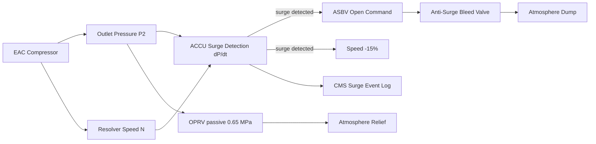
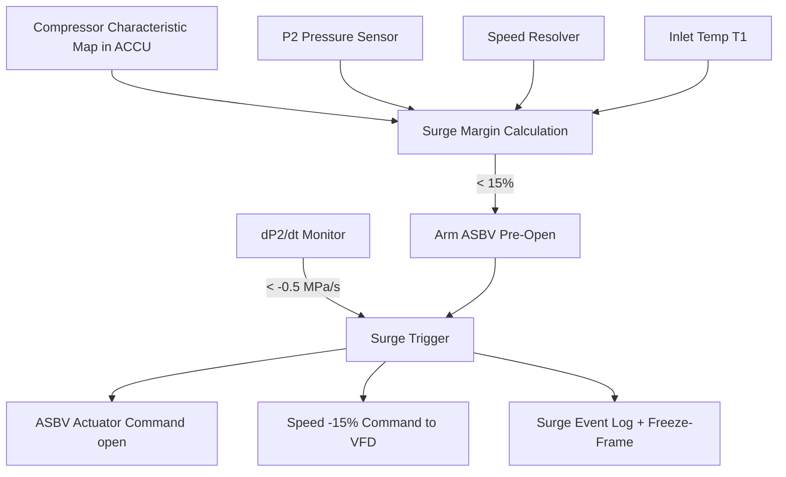

# Compressor Protection and Surge Control

---

## §0 Hyperlink Policy

> All hyperlinks in this document are **relative** (five directory levels: `../../../../../`).
> Absolute URLs are forbidden.

---

## §1 Purpose

This document defines the surge detection and protection systems for the AMPEL360E eWTW Electric Air Compressors (EAC-A and EAC-B). Centrifugal compressor surge is the primary aerodynamic instability risk for the EAC system and must be actively prevented to protect the compressor impeller and diffuser from cyclic loading damage and to avoid loss of compressed air supply.

The surge protection system comprises: (1) the Anti-Surge Bleed Valve (ASBV) on each EAC outlet, (2) ACCU surge detection logic based on outlet pressure rate-of-change (dP/dt) and mass flow (estimated from speed and inlet pressure/temperature), and (3) compressor speed reduction commanded by ACCU within one control cycle of surge detection. An Overpressure Relief Valve (OPRV) provides independent protection against outlet pressure exceeding 0.65 MPa.

---

## §2 Applicability

| Parameter | Value |
|---|---|
| Aircraft Program | AMPEL360E eWTW |
| ATA reference | ATA 66-060 — Compressor Protection and Surge Control |
| Certification basis | EASA CS-25 Amdt 27+ |
| S1000D SNS | 066-060-00 |

---

## §3 Functional Description ![DRAFT]

**Surge detection:** The ACCU continuously monitors outlet pressure (P2) and estimated mass flow (derived from resolver speed, inlet P/T, and impeller characteristic map). When the operating point approaches within 15 % surge margin on the compressor map, the ACCU arms the ASBV pre-open command. If dP2/dt exceeds −0.5 MPa/s (characteristic of surge inception), the ACCU commands ASBV full open within 10 ms and reduces speed by 15 %.

**ASBV:** The Anti-Surge Bleed Valve is an electrically actuated ball valve on the EAC outlet duct. Fail-position is open (spring-loaded open, motor-held closed during normal operation). This ensures that on any power or actuator failure, the valve opens, dumping compressed air to atmosphere and preventing surge from a stalled impeller. ASBV opens to > 90 % in ≤ 50 ms.

**OPRV:** The Overpressure Relief Valve is a passive spring-loaded poppet valve set at 0.65 MPa. It opens automatically if outlet pressure exceeds set point and closes once pressure drops below reset pressure (0.60 MPa). The OPRV actuation is logged by the ACCU pressure sensor; repeated OPRV actuation triggers a maintenance action.

---

## §4 Functional Breakdown

| ID | Name | Description | Lead Division |
|---|---|---|---|
| F-001 | ACCU surge detection | dP/dt + compressor map margin algorithm; 10 ms scan | Q-GREENTECH |
| F-002 | Anti-Surge Bleed Valve (ASBV) | Electrically actuated ball valve; fail-open; ≤ 50 ms response | Q-MECHANICS |
| F-003 | ACCU speed reduction on surge | 15 % speed reduction commanded within one control cycle | Q-MECHANICS |
| F-004 | Overpressure Relief Valve (OPRV) | Passive spring poppet; 0.65 MPa set point | Q-AIR |
| F-005 | Surge event logging | ACCU logs all surge events with timestamp and parameter freeze-frame | Q-INDUSTRY |

---

## §5 System Context — Mermaid Diagram

---

## §6 Internal Architecture — Mermaid Diagram

---

## §7 Components and LRUs

| Component | Part Number | Qty | Location | Maintenance Interval | Notes |
|---|---|---|---|---|---|
| Anti-Surge Bleed Valve (ASBV) | ASBV-PN-TBD | 2 (one per EAC) | EAC outlet duct | Functional test C-check; replace on slow actuation | Electrically actuated ball valve; fail-open spring |
| OPRV (Overpressure Relief Valve) | OPRV-PN-TBD | 2 (one per EAC) | EAC outlet manifold | Replace on actuation / C-check inspection | Passive spring poppet; 0.65 MPa set; 0.60 MPa reset |
| ASBV Position Sensor | ASBV-POS-PN-TBD | 2 (one per ASBV) | ASBV body | Functional test C-check | LVDT type; confirms valve open/closed to ACCU |
| Outlet Pressure Sensor (surge input) | P2-SENS-PN-TBD | 2 (one per EAC) | EAC outlet duct | Calibration check C-check | High-bandwidth sensor for dP/dt surge detection |
| ACCU Surge Algorithm Module | Software in ACCU | — | ACCU | Software update per SB | DO-178C DAL C; compressor map held in ACCU NVM |

---

## §8 Interfaces

| Interface Type | Connected System | Protocol / Medium | Data / Function |
|---|---|---|---|
| ATA 24 Electrical Power | 28 V DC bus | Electrical | ASBV actuator motor power |
| ATA 45 CMS | Central Maintenance System | AFDX | Surge events, ASBV position fault, OPRV actuation count |
| ATA 31 ECAM | Cockpit display | AFDX | Surge event alert, ASBV position indication |
| ACCU Internal | EAC Control Unit | Internal hardwired | P2 sensor, speed resolver → surge algorithm |
| Outlet Duct | ECS Manifold | Compressed air (when ASBV closed) | Compressed air to ECS during normal ops |

---

## §9 Operating Modes

| Mode | Trigger | System State | Actions / Consequences |
|---|---|---|---|
| Normal (surge margin ≥ 15 %) | Compressor operating map OK | ASBV closed; OPRV closed | Full compressed-air supply to ECS |
| Pre-surge warning (margin < 15 %) | ACCU map margin drops | ASBV armed for pre-open | ECAM advisory; ACCU may reduce setpoint |
| Surge event | dP2/dt < −0.5 MPa/s | ASBV opens ≤ 50 ms; speed −15 % | Surge arrested; ECAM amber; event logged |
| OPRV actuation | P2 > 0.65 MPa | OPRV opens passively | Excess pressure dumped; ACCU logs event |
| ASBV stuck closed | ASBV position sensor fault | ACCU isolates EAC channel | ECS supplied by other EAC; ECAM amber |

---

## §10 Performance and Budgets ![DRAFT]

| Parameter | Requirement | Target / Design Value | Status |
|---|---|---|---|
| Surge margin maintained | ≥ 15 % at all operating points | ≥ 18 % at design point | ![TBD] |
| ASBV open time | ≤ 50 ms | 35 ms | ![TBD] |
| ACCU surge detection latency | ≤ 10 ms from surge inception | 8 ms | ![TBD] |
| OPRV set point | 0.65 MPa ± 3 % | 0.65 MPa | ![TBD] |
| Surge arrest success rate | 100 % (ASBV response) | 100 % (design target) | ![TBD] |

---

## §11 Safety, Redundancy and Fault Tolerance

- ASBV fail-open (spring-loaded) ensures surge protection is available even on total actuator power failure.
- OPRV is fully independent of ACCU and ASBV; provides passive pressure relief as final barrier.
- Repeated surge events (> 3 in one flight) trigger a maintenance advisory and inspection before next dispatch.
- ASBV position sensor provides confirmation of actual valve state; ACCU uses this for fault isolation (stuck-open vs stuck-closed).

---

## §12 Maintenance and Diagnostics

| Task | Interval | Access | Special Tools |
|---|---|---|---|
| ASBV functional test (open/close cycle, timing) | C-check | ACCU GSE command | ACCU GSE terminal; stopwatch |
| OPRV set point verification | C-check | Pressurised test rig | Calibrated pressure rig per AMM |
| ACCU surge event log review | A-check | CMS terminal | CMS terminal |
| ASBV position sensor continuity check | C-check | ASBV body access | Resistance meter |

---

## §13 Footprint — Physical, Electrical, Maintenance, Data ![TBD]

| Footprint Type | Parameter | Value | Notes |
|---|---|---|---|
| Physical | ASBV mass (each) | ![TBD] | Ball valve with actuator |
| Physical | OPRV mass (each) | ![TBD] | Spring poppet; compact |
| Electrical | ASBV actuator power | 28 V DC ~10 W | Motor-held closed; fail-open on power loss |
| Maintenance | Surge event logging | Per flight | Stored in ACCU NVM; downloadable via CMS |
| Data | AFDX surge event rate | Event-driven | Surge events only |

---

## §14 Safety and Certification References ![DRAFT]

| Standard / Document | Title | Issuing Body | Applicability |
|---|---|---|---|
| EASA CS-25 §25.1435 | Pressure design reference | EASA | OPRV and duct pressure rating |
| DO-178C | Software Considerations | RTCA | ACCU surge algorithm DO-178C DAL C |
| SAE AIR1168/3 | Air Cycle Systems | SAE International | Compressor surge design reference |
| ATA iSpec 2200 | Chapter 66 — Air Compressor | ATA | Chapter scope |
| EASA CS-25 §25.1309 | Equipment systems and installations | EASA | ASBV failure effects assessment |

---

## §15 V&V Approach ![TBD]

| Phase | Method | Acceptance Criterion | Status |
|---|---|---|---|
| Design | Compressor map analysis + surge margin calculation | Surge margin ≥ 15 % at all conditions | ![TBD] |
| Integration | ASBV response time test | ASBV opens in ≤ 50 ms | ![TBD] |
| Qualification | Induced surge test on EAC test rig | ASBV arrests surge; speed recovers | ![TBD] |
| Certification | OPRV set point verification | Actuation at 0.65 MPa ± 3 % | ![TBD] |

---

## §16 Glossary

| Term | Definition |
|---|---|
| **Surge** | Aerodynamic instability in centrifugal compressor; characterised by reversed flow and loud periodic bangs. |
| **Surge margin** | Percentage distance from operating point to surge line on compressor map. |
| **ASBV** | Anti-Surge Bleed Valve — dumps outlet air to arrest surge. |
| **OPRV** | Overpressure Relief Valve — passive pressure relief at 0.65 MPa. |
| **dP/dt** | Rate of change of pressure — surge detection signature. |
| **Compressor map** | Plot of pressure ratio vs mass flow for a centrifugal compressor at various speeds. |
| **Fail-open** | Safety valve position on loss of power; ASBV defaults to open. |
| **Freeze-frame** | Snapshot of all relevant parameters captured at the moment of a surge event trigger. |
| **NVM** | Non-Volatile Memory — stores ACCU compressor map and event log. |
| **Ball valve** | Type of quarter-turn valve suitable for fast actuation (ASBV). |

---

## §17 Open Issues

| ID | Description | Owner | Target |
|---|---|---|---|
| OI-066-060-001 | Validate ACCU surge algorithm against EAC OEM compressor map across full flight envelope | Q-MECHANICS | 2026-Q4 |
| OI-066-060-002 | Define MEL category for ASBV position sensor fault — dispatch conditions | Q-AIR / safety | 2027-Q1 |

---

## §18 Status Legend

| Badge | Meaning |
|---|---|
| `![DRAFT]` | Section is drafted but not yet reviewed |
| `![TBD]` | Content not yet started — to be defined |
| `![To Be Completed]` | Partially complete — needs additional content |
| `![APPROVED]` | Reviewed and formally approved |

---

## §19 Related Documents (Siblings in this Subsection)

- [066-000](./066-000-Air-Compressor-General.md)
- [066-010](./066-010-Engine-Driven-Air-Compressor.md)
- [066-020](./066-020-Auxiliary-Air-Compressor.md)
- [066-030](./066-030-Compressor-Inlet-and-Outlet-Interfaces.md)
- [066-040](./066-040-Compressor-Control-and-Regulation.md)
- [066-050](./066-050-Compressor-Cooling-and-Lubrication.md)
- [066-070](./066-070-Compressor-Inspection-Test-and-Maintenance.md)
- [066-080](./066-080-Air-Compressor-Monitoring-Diagnostics-and-Control-Interfaces.md)
- [066-090](./066-090-S1000D-CSDB-Mapping-and-Traceability.md)

---

## §20 Change Log

| Rev | Date | Author | Description |
|---|---|---|---|
| 0.1 | 2026-05-11 | @copilot | Initial DRAFT — contextualized content per AMPEL360E eWTW architecture |
