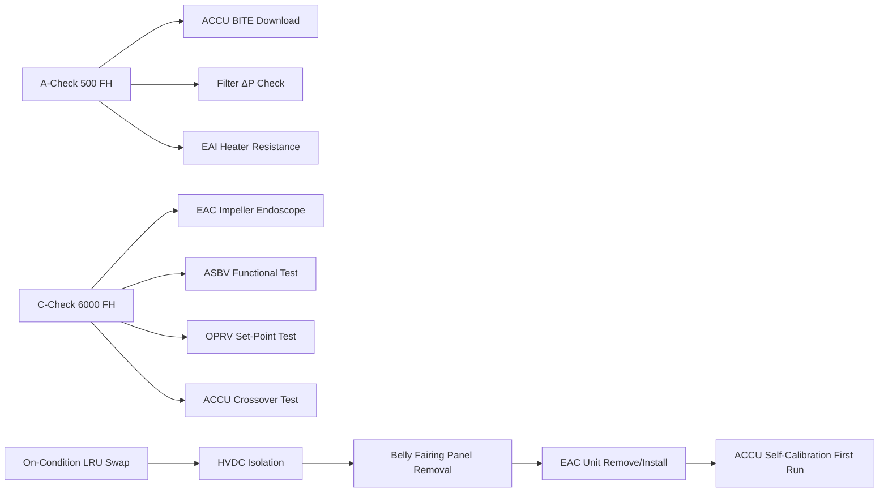
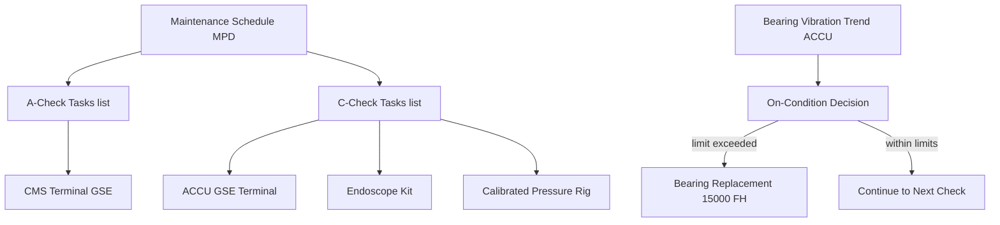

# Compressor Inspection, Test and Maintenance

---

## §0 Hyperlink Policy

> All hyperlinks in this document are **relative** (five directory levels: `../../../../../`).
> Absolute URLs are forbidden.

---

## §1 Purpose

This document defines the inspection, test, and maintenance procedures for the AMPEL360E eWTW Electric Air Compressors (EAC-A and EAC-B), their control unit (ACCU), and associated valves. The EAC system is maintained on an On-Condition (OC) basis — no mandatory discard intervals for the EAC unit itself — with scheduled inspections at A-check and C-check intervals triggering condition-based decisions.

Key maintenance advantages of the eWTW EAC over conventional bleed systems: **no oil to service**, **no hot-section inspection** (no combustor), **no HP bleed valve overhaul**, and **no pre-cooler cleaning**. Bearing condition is managed by ACCU vibration trending. EAC LRU replacement at line maintenance requires HVDC isolation, belly fairing panel removal, and a 4-hour task with no special calibration (ACCU self-calibrates on first run after replacement).

---

## §2 Applicability

| Parameter | Value |
|---|---|
| Aircraft Program | AMPEL360E eWTW |
| ATA reference | ATA 66-070 — Compressor Inspection, Test and Maintenance |
| Certification basis | EASA CS-25 Amdt 27+ |
| S1000D SNS | 066-070-00 |

---

## §3 Functional Description ![DRAFT]

**A-Check tasks (approx. every 500 FH):**
- ACCU BITE log download and review (5 min via CMS terminal)
- Inlet filter ΔP check — replace filter if ΔP > 1.5 kPa
- EAI heater mat resistance check (pass/fail per AMM limits)
- Bearing vibration trend review from ACCU data

**C-Check tasks (approx. every 6 000 FH or 18–24 months):**
- EAC impeller visual inspection (endoscope via inlet duct — no disassembly needed)
- ASBV functional test (ACCU GSE open/close cycle, timing ≤ 50 ms)
- OPRV set-point verification (calibrated test rig)
- Outlet check valve (OCV) leakage test
- Intercooler core inspection and cleaning
- Winding RTD resistance check (in-situ, four RTDs per EAC)
- ACCU channel crossover test (ACCU GSE command)
- EAC cooling fan (EAC-CF) functional test

**Bearing replacement (15 000 FH or on vibration limit):**
- Requires EAC LRU removal or in-situ bearing swap (TBD with OEM)
- If LRU swap: 4 h task, belly fairing access, HVDC isolation

**ACCU software update (per SB):**
- Ground laptop connection via AFDX maintenance port
- Software load tool: ACCU LOADMASTER v2+
- Post-load ACCU BITE self-test confirms load integrity

---

## §4 Functional Breakdown

| ID | Name | Description | Lead Division |
|---|---|---|---|
| F-001 | A-check EAC tasks | ACCU BITE download, filter check, EAI check, bearing trend | Q-GREENTECH |
| F-002 | C-check EAC tasks | Impeller visual, valve tests, intercooler, RTD check, ACCU crossover | Q-MECHANICS |
| F-003 | EAC LRU replacement | Belly fairing access; HVDC isolation; 4 h task; no post-swap calibration | Q-MECHANICS |
| F-004 | Bearing replacement | 15 000 FH scheduled or on vibration limit; OEM procedure | Q-AIR |
| F-005 | ACCU software update | ACCU LOADMASTER tool via AFDX maintenance port; per SB | Q-INDUSTRY |

---

## §5 System Context — Mermaid Diagram

---

## §6 Internal Architecture — Mermaid Diagram

---

## §7 Components and LRUs

| Component | Part Number | Qty | Location | Maintenance Interval | Notes |
|---|---|---|---|---|---|
| EAC Unit (complete LRU) | EAC-LRU-PN-TBD | 2 (A+B) | Belly fairing | On condition (bearing vibration limit) | 4 h swap; no calibration; HVDC isolation required |
| ACCU (Air Compressor Control Unit) | ACCU-PN-TBD | 1 | EE bay | On condition / software update per SB | Self-calibrates after replacement |
| Inlet Filter Element | FILT-EAC-PN-TBD | 2 (A+B) | EAC inlet duct | 500 FH or ΔP > 1.5 kPa | Replace on advisory; 20 min task |
| ASBV (Anti-Surge Bleed Valve) | ASBV-PN-TBD | 2 (A+B) | EAC outlet duct | Functional test C-check; replace slow actuation | Replace if open time > 60 ms |
| OPRV (Overpressure Relief Valve) | OPRV-PN-TBD | 2 (A+B) | EAC outlet manifold | Verify C-check; replace on repeated actuation | Calibrated test rig required |

---

## §8 Interfaces

| Interface Type | Connected System | Protocol / Medium | Data / Function |
|---|---|---|---|
| ATA 45 CMS | Central Maintenance System | AFDX | ACCU BITE download at A-check |
| ACCU GSE | Ground Support Equipment | AFDX maintenance port | ACCU command interface for ground tests |
| ATA 24 HVDC | HVDC isolation | Electrical (LOTO) | Required before EAC LRU access |
| Belly Fairing Access Panel | Aircraft structure | Mechanical | Access route for EAC maintenance |
| ACCU LOADMASTER | Software load tool | Laptop + AFDX cable | ACCU software update |

---

## §9 Operating Modes

| Mode | Trigger | System State | Actions / Consequences |
|---|---|---|---|
| Normal in-service | Aircraft in revenue service | EAC-A and B active | ACCU health trending active; alerts if limits exceeded |
| A-check maintenance | Scheduled 500 FH | Aircraft grounded; systems powered for test | CMS download; filter and EAI checks; 45 min total EAC tasks |
| C-check maintenance | Scheduled 6 000 FH | Aircraft grounded; belly fairing panels removed | Full inspection suite; ASBV/OPRV tests; 8 h total EAC tasks |
| EAC LRU swap | Bearing vibration limit or fault | HVDC isolated; EAC removed | 4 h task; ACCU re-calibrates on first engine start post-swap |
| ACCU software update | New SB released | Aircraft grounded; ACCU powered | 30 min load; ACCU BITE self-test confirms integrity |

---

## §10 Performance and Budgets ![DRAFT]

| Parameter | Requirement | Target / Design Value | Status |
|---|---|---|---|
| EAC LRU swap time (each) | ≤ 5 h | 4 h | ![TBD] |
| A-check EAC tasks duration | ≤ 60 min | 45 min | ![TBD] |
| C-check EAC tasks duration | ≤ 10 h | 8 h | ![TBD] |
| Bearing replacement interval | ≥ 12 000 FH | 15 000 FH (design) | ![TBD] |
| ACCU software load time | ≤ 45 min | 30 min | ![TBD] |

---

## §11 Safety, Redundancy and Fault Tolerance

- All EAC maintenance tasks require HVDC 270 V bus isolation (LOTO per AMM) before accessing motor or compressor — residual charge dissipates within 5 minutes of isolation.
- ASBV must be re-confirmed closed by ACCU BITE after any maintenance task before EAC is returned to service.
- Post-ACCU software update, a BITE self-test must pass before EAC is returned to service.
- Bearing replacement after vibration limit is an OC task; ACCU trending provides ≥ 500 FH advance warning.

---

## §12 Maintenance and Diagnostics

| Task | Interval | Access | Special Tools |
|---|---|---|---|
| ACCU BITE log download | A-check | CMS terminal | CMS terminal or ACARS |
| Inlet filter replacement | 500 FH / ΔP advisory | Belly fairing access panel | Filter extraction tool |
| EAC impeller endoscope inspection | C-check | EAC inlet duct (no disassembly) | Endoscope kit |
| ASBV functional test | C-check | ACCU GSE | ACCU GSE terminal |
| EAC LRU replacement | On condition | Belly fairing removal | HVDC isolation kit; torque set; ACCU GSE |

---

## §13 Footprint — Physical, Electrical, Maintenance, Data ![TBD]

| Footprint Type | Parameter | Value | Notes |
|---|---|---|---|
| Physical | EAC LRU access panel size | ![TBD] | Belly fairing panel per design |
| Physical | Belly fairing EAC zone | ![TBD] | Forward belly fairing |
| Electrical | HVDC isolation time before access | 5 min minimum | Residual charge dissipation |
| Maintenance | A-check EAC man-hours | ~0.75 h | Per aircraft |
| Maintenance | C-check EAC man-hours | ~8 h | Per aircraft |

---

## §14 Safety and Certification References ![DRAFT]

| Standard / Document | Title | Issuing Body | Applicability |
|---|---|---|---|
| EASA CS-25 §25.1529 | Instructions for Continued Airworthiness | EASA | AMM and MPD requirement |
| IEC 60900 | Live working — electrical insulation | IEC | HVDC isolation safety before EAC access |
| DO-178C | Software Considerations | RTCA | ACCU software update procedure |
| ATA iSpec 2200 | Chapter 66 — Air Compressor | ATA | AMM chapter scope |
| SAE ARP4761 | Safety Assessment Process | SAE International | On-condition maintenance justification |

---

## §15 V&V Approach ![TBD]

| Phase | Method | Acceptance Criterion | Status |
|---|---|---|---|
| Design | Maintainability analysis (FMEA + task analysis) | LRU swap ≤ 5 h; no special tools beyond kit | ![TBD] |
| Integration | First-article maintenance demonstration | All C-check tasks completed per AMM in target time | ![TBD] |
| Qualification | DO-160G — post-maintenance functional test | EAC passes BITE after maintenance | ![TBD] |
| Certification | EASA CS-25 §25.1529 ICA review | AMM approved by authority | ![TBD] |

---

## §16 Glossary

| Term | Definition |
|---|---|
| **On-Condition (OC)** | Maintenance regime replacing LRUs based on condition indicators rather than fixed intervals. |
| **MPD** | Maintenance Planning Document — lists all scheduled maintenance tasks and intervals. |
| **LOTO** | Lock-Out Tag-Out — safety procedure isolating energy before maintenance access. |
| **ACCU LOADMASTER** | Software tool for ACCU firmware updates via AFDX maintenance port. |
| **Endoscope** | Fibre-optic or digital inspection tool for visual inspection without disassembly. |
| **ASBV** | Anti-Surge Bleed Valve. |
| **OPRV** | Overpressure Relief Valve. |
| **LRU** | Line Replaceable Unit — component swapped at line maintenance level. |
| **BITE** | Built-In Test Equipment — self-diagnostic capability of avionics/control units. |
| **SB** | Service Bulletin — OEM instruction for modification or maintenance action. |

---

## §17 Open Issues

| ID | Description | Owner | Target |
|---|---|---|---|
| OI-066-070-001 | Finalise MPD task intervals with EAC OEM and CAMO (maintenance programme approval) | Q-MECHANICS | 2026-Q4 |
| OI-066-070-002 | Define ACCU GSE specification and availability at MRO stations | Q-INDUSTRY | 2026-Q3 |

---

## §18 Status Legend

| Badge | Meaning |
|---|---|
| `![DRAFT]` | Section is drafted but not yet reviewed |
| `![TBD]` | Content not yet started — to be defined |
| `![To Be Completed]` | Partially complete — needs additional content |
| `![APPROVED]` | Reviewed and formally approved |

---

## §19 Related Documents (Siblings in this Subsection)

- [066-000](./066-000-Air-Compressor-General.md)
- [066-010](./066-010-Engine-Driven-Air-Compressor.md)
- [066-020](./066-020-Auxiliary-Air-Compressor.md)
- [066-030](./066-030-Compressor-Inlet-and-Outlet-Interfaces.md)
- [066-040](./066-040-Compressor-Control-and-Regulation.md)
- [066-050](./066-050-Compressor-Cooling-and-Lubrication.md)
- [066-060](./066-060-Compressor-Protection-and-Surge-Control.md)
- [066-080](./066-080-Air-Compressor-Monitoring-Diagnostics-and-Control-Interfaces.md)
- [066-090](./066-090-S1000D-CSDB-Mapping-and-Traceability.md)

---

## §20 Change Log

| Rev | Date | Author | Description |
|---|---|---|---|
| 0.1 | 2026-05-11 | @copilot | Initial DRAFT — contextualized content per AMPEL360E eWTW architecture |
