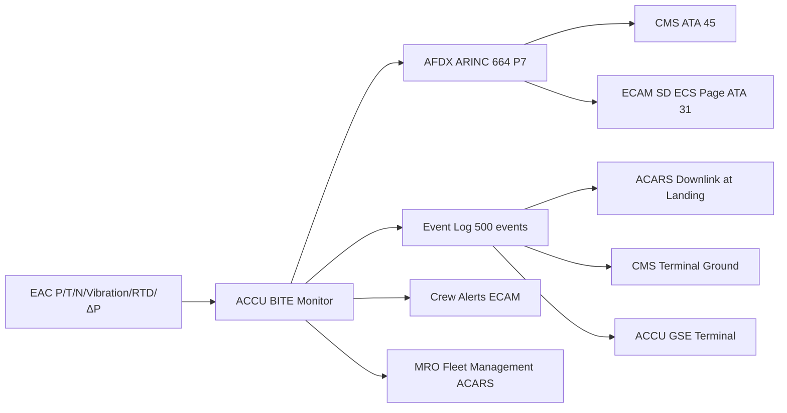
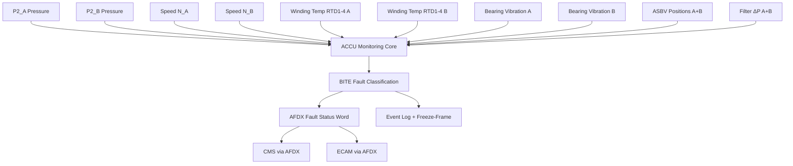

# Air Compressor Monitoring, Diagnostics and Control Interfaces

---

## §0 Hyperlink Policy

> All hyperlinks in this document are **relative** (five directory levels: `../../../../../`).
> Absolute URLs are forbidden.

---

## §1 Purpose

This document defines the health monitoring, diagnostics, BITE architecture, and control interfaces for the AMPEL360E eWTW Air Compressor system (EAC-A, EAC-B, ACCU, AEAC). It covers the parameters monitored, their AFDX transmission to the Central Maintenance System (CMS, ATA 45), ECAM display content, predictive maintenance data hooks, and the ACCU GSE control interface for ground operations and testing.

The ACCU transmits health data to the CMS at a 50 ms base rate via AFDX (ARINC 664 Part 7). ECAM (ATA 31) displays the EAC synoptic page on the System Display (SD) showing pressure, speed, valve positions, and EAC status. The ACCU event log retains the last 500 events with parameter freeze-frames, accessible via ACARS uplink, CMS terminal, or ACCU GSE terminal.

---

## §2 Applicability

| Parameter | Value |
|---|---|
| Aircraft Program | AMPEL360E eWTW |
| ATA reference | ATA 66-080 — Air Compressor Monitoring, Diagnostics and Control Interfaces |
| Certification basis | EASA CS-25 Amdt 27+ |
| S1000D SNS | 066-080-00 |

---

## §3 Functional Description ![DRAFT]

**Monitored parameters (ACCU → CMS via AFDX at 50 ms):**
- EAC-A and EAC-B outlet pressure (P2_A, P2_B) and temperature (T2_A, T2_B)
- EAC-A and EAC-B motor speed (N_A, N_B from resolver)
- EAC-A and EAC-B motor winding temperature (RTD1–4 per unit)
- EAC-A and EAC-B bearing vibration (broadband RMS + 1× and 2× harmonics)
- ASBV-A and ASBV-B position (open / closed / in-transit)
- ACCU active channel (CH-A / CH-B) and BITE status word
- Inlet filter ΔP (each EAC)
- AEAC status, speed, outlet pressure (ground only)

**BITE coverage:** ACCU BITE covers ≥ 87 % of detectable faults. BITE tests run at power-on, continuously during operation (background BITE), and on demand via ACCU GSE. Faults are classified as: GO (no dispatch restriction), NO-GO (EAC non-operational), MEL (dispatch with restriction), and ADVISORY (maintenance action required).

**Predictive maintenance hooks:** Bearing vibration trending data is downlinked via ACARS at each landing for MRO fleet management. Rolling 500-event ACCU log enables trend analysis of surge events, motor temperature exceedances, and filter advisory frequency.

---

## §4 Functional Breakdown

| ID | Name | Description | Lead Division |
|---|---|---|---|
| F-001 | ACCU BITE (power-on and background) | Continuous fault detection; ≥ 87 % coverage; fault classification | Q-GREENTECH |
| F-002 | AFDX health data stream | 50 ms ACCU→CMS parameter stream; 20+ parameters | Q-MECHANICS |
| F-003 | ECAM EAC synoptic page | SD ECS page: P2, N, valve positions, EAC status | Q-AIR |
| F-004 | ACCU event log | 500-event rolling log with freeze-frames; ACARS / CMS / GSE access | Q-MECHANICS |
| F-005 | Bearing vibration trending | Broadband + harmonic vibration; ACARS downlink at each landing | Q-INDUSTRY |

---

## §5 System Context — Mermaid Diagram

---

## §6 Internal Architecture — Mermaid Diagram

---

## §7 Components and LRUs

| Component | Part Number | Qty | Location | Maintenance Interval | Notes |
|---|---|---|---|---|---|
| ACCU (monitoring core embedded) | ACCU-PN-TBD | 1 | EE bay | Software update per SB | BITE + monitoring in ACCU firmware |
| Bearing vibration sensor (accelerometer) | VIB-EAC-PN-TBD | 2 (one per EAC) | EAC housing | Inspect C-check; replace on fault | Piezoelectric; broadband + harmonic output |
| AFDX End-System (ACCU to IMA) | AFDX-ES-PN-TBD | 1 | ACCU chassis | With ACCU | Provides ARINC 664 P7 connectivity |
| ACCU GSE Terminal | GSE-ACCU-PN-TBD | Ground tool | MRO / line maintenance kit | Calibrate annually | Portable laptop + AFDX adaptor; ACCU command |
| ECAM ECS SD Page Software | SW-ECAM-ECS | — | ECAM processing unit | ECAM software update per SB | Displays EAC-A/B status on SD ECS page |

---

## §8 Interfaces

| Interface Type | Connected System | Protocol / Medium | Data / Function |
|---|---|---|---|
| ATA 45 CMS | Central Maintenance System | AFDX ARINC 664 P7 | 20+ ACCU health parameters at 50 ms; fault log |
| ATA 31 ECAM | Cockpit System Display | AFDX | EAC synoptic page: P2, N, valve status |
| ACARS (ATA 46) | Aircraft Communications | ACARS RF / SATCOM | Bearing trend downlink at landing; event log |
| ACCU GSE | Ground Support Equipment | AFDX maintenance port | Ground tests, BITE, ACCU commands |
| ATA 21 ACSC | Air Cond. System Controller | AFDX | Demand setpoint source; ACCU confirms EAC status |

---

## §9 Operating Modes

| Mode | Trigger | System State | Actions / Consequences |
|---|---|---|---|
| Normal monitoring | Aircraft powered | ACCU background BITE active | All parameters logged; fault status transmitted to CMS |
| BITE fault active (GO) | Minor fault detected | EAC continues; fault code in CMS | Maintenance deferred to next scheduled check |
| BITE fault active (MEL) | MEL-class fault | EAC may continue with restriction | Dispatch per MEL; repair at next opportunity |
| BITE fault active (NO-GO) | EAC non-operational | EAC decommanded | Single-EAC mode; ECAM amber; NON-NORMAL PROC |
| Ground BITE test (demand) | ACCU GSE command | ACCU runs demand BITE sequence | Full BITE test in < 5 min; results on GSE terminal |

---

## §10 Performance and Budgets ![DRAFT]

| Parameter | Requirement | Target / Design Value | Status |
|---|---|---|---|
| BITE fault detection coverage | ≥ 85 % | ≥ 87 % | ![TBD] |
| AFDX parameter update rate | 50 ms | 50 ms | ![TBD] |
| Event log capacity | ≥ 200 events | 500 events | ![TBD] |
| Bearing vibration ACARS downlink frequency | At each landing | At each landing (ACARS trigger) | ![TBD] |
| Demand BITE test duration | ≤ 10 min | < 5 min | ![TBD] |

---

## §11 Safety, Redundancy and Fault Tolerance

- BITE fault classification (GO / MEL / NO-GO) drives dispatch decisions without requiring maintenance access; reduces turn time impact.
- Event log freeze-frames capture full parameter snapshot at fault onset, enabling remote root-cause analysis without GSE visit.
- AFDX communication failure between ACCU and CMS does not affect EAC operation (monitoring loss only); ECAM advisory issued.
- Bearing vibration ACARS downlink enables fleet-level trending, flagging early bearing degradation across multiple aircraft simultaneously.

---

## §12 Maintenance and Diagnostics

| Task | Interval | Access | Special Tools |
|---|---|---|---|
| ACCU BITE log download | A-check | CMS terminal or ACARS | CMS terminal |
| Demand BITE test (full sequence) | C-check | ACCU GSE | ACCU GSE terminal |
| Vibration sensor functional check | C-check | EAC housing access | ACCU GSE; vibration reference |
| AFDX end-system link test | C-check | ACCU chassis | AFDX network test tool |

---

## §13 Footprint — Physical, Electrical, Maintenance, Data ![TBD]

| Footprint Type | Parameter | Value | Notes |
|---|---|---|---|
| Physical | Vibration sensor mass (each) | ![TBD] | Small piezo; EAC housing mounted |
| Electrical | ACCU monitoring core power | Included in ACCU 28 V DC ~50 W | — |
| Maintenance | Demand BITE test duration | < 5 min | ACCU GSE terminal |
| Data | AFDX bandwidth (ACCU to CMS) | ![TBD] | 20+ parameters at 50 ms |
| Data | ACARS bearing trend downlink size | ![TBD] | Per landing; estimated < 1 kB |

---

## §14 Safety and Certification References ![DRAFT]

| Standard / Document | Title | Issuing Body | Applicability |
|---|---|---|---|
| DO-178C | Software Considerations | RTCA | ACCU BITE software DAL C |
| ARINC 664 Part 7 | AFDX Standard | ARINC | ACCU to CMS and ECAM data network |
| EASA CS-25 §25.1309 | Equipment systems | EASA | BITE coverage requirement |
| ATA iSpec 2200 | Chapter 45 / 66 | ATA | CMS and ATA 66 integration |
| SAE ARP4761 | Safety Assessment Process | SAE International | BITE classification methodology |

---

## §15 V&V Approach ![TBD]

| Phase | Method | Acceptance Criterion | Status |
|---|---|---|---|
| Design | BITE fault model analysis | Coverage ≥ 85 % of FMEA failure modes | ![TBD] |
| Integration | HIL + CMS interface test | All parameters arrive at CMS at 50 ms | ![TBD] |
| Qualification | BITE test execution (all fault codes) | All fault codes correctly classified | ![TBD] |
| Certification | Flight test monitoring validation | ECAM EAC page correct in all phases | ![TBD] |

---

## §16 Glossary

| Term | Definition |
|---|---|
| **BITE** | Built-In Test Equipment — self-diagnostic system. |
| **ACCU** | Air Compressor Control Unit. |
| **AFDX** | Avionics Full-Duplex Switched Ethernet (ARINC 664 Part 7). |
| **CMS** | Central Maintenance System (ATA 45). |
| **ECAM** | Electronic Centralised Aircraft Monitor. |
| **SD ECS page** | System Display page showing ECS and EAC status. |
| **Freeze-frame** | Parameter snapshot at fault trigger time. |
| **Broadband RMS** | Overall vibration level across full frequency range. |
| **Harmonic** | Vibration component at integer multiples of rotation frequency. |
| **ACARS** | Aircraft Communications Addressing and Reporting System. |

---

## §17 Open Issues

| ID | Description | Owner | Target |
|---|---|---|---|
| OI-066-080-001 | Finalise AFDX bus load analysis for ACCU parameter stream vs other ECS systems | Q-MECHANICS | 2026-Q4 |
| OI-066-080-002 | Define ACARS bearing trend report format with MRO data management system | Q-INDUSTRY | 2026-Q3 |

---

## §18 Status Legend

| Badge | Meaning |
|---|---|
| `![DRAFT]` | Section is drafted but not yet reviewed |
| `![TBD]` | Content not yet started — to be defined |
| `![To Be Completed]` | Partially complete — needs additional content |
| `![APPROVED]` | Reviewed and formally approved |

---

## §19 Related Documents (Siblings in this Subsection)

- [066-000](./066-000-Air-Compressor-General.md)
- [066-010](./066-010-Engine-Driven-Air-Compressor.md)
- [066-020](./066-020-Auxiliary-Air-Compressor.md)
- [066-030](./066-030-Compressor-Inlet-and-Outlet-Interfaces.md)
- [066-040](./066-040-Compressor-Control-and-Regulation.md)
- [066-050](./066-050-Compressor-Cooling-and-Lubrication.md)
- [066-060](./066-060-Compressor-Protection-and-Surge-Control.md)
- [066-070](./066-070-Compressor-Inspection-Test-and-Maintenance.md)
- [066-090](./066-090-S1000D-CSDB-Mapping-and-Traceability.md)

---

## §20 Change Log

| Rev | Date | Author | Description |
|---|---|---|---|
| 0.1 | 2026-05-11 | @copilot | Initial DRAFT — contextualized content per AMPEL360E eWTW architecture |
