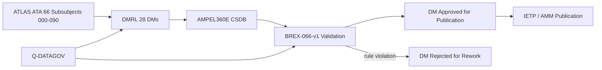
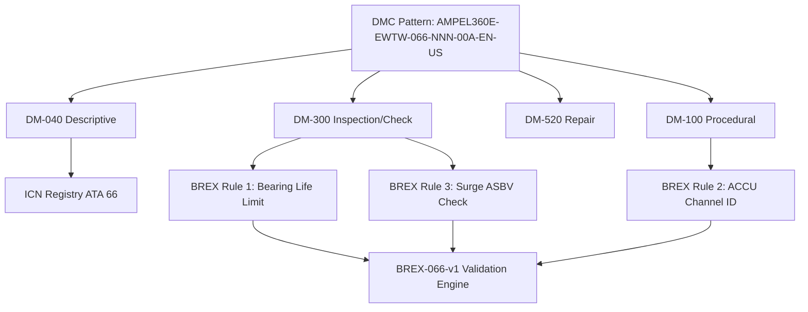

# S1000D / CSDB Mapping and Traceability

---

## §0 Hyperlink Policy

> All hyperlinks in this document are **relative** (five directory levels: `../../../../../`).
> Absolute URLs are forbidden.

---

## §1 Purpose

This document maps the ATLAS ATA 66 subsubject structure to S1000D Data Module Codes (DMCs) and defines the Data Module Requirement List (DMRL) and Business Rules eXchange (BREX) constraints for the AMPEL360E eWTW Air Compressor Common Source DataBase (CSDB).

ATA 66 DMRL for AMPEL360E eWTW: **28 data modules**. DMC pattern: `AMPEL360E-EWTW-066-{NNN}-00A-EN-US`. BREX document: `AMPEL360E-BREX-066-v1`, enforcing three domain-specific constraints described in §3.

This document is owned by Q-DATAGOV and reviewed at each CSDB milestone (DMRL baseline, DMRL first issue, DMRL final).

---

## §2 Applicability

| Parameter | Value |
|---|---|
| Aircraft Program | AMPEL360E eWTW |
| ATA reference | ATA 66-090 — S1000D / CSDB Mapping and Traceability |
| Certification basis | S1000D Issue 5.0 |
| S1000D SNS | 066-090-00 |

---

## §3 Functional Description ![DRAFT]

**BREX AMPEL360E-BREX-066-v1 enforces three constraints:**

1. **Bearing life limit citation rule:** All EAC maintenance DMs (DM type 300/520) must cite the bearing life limit (FH) from the EAC OEM Component Maintenance Manual (CMM). This prevents maintenance DMs from being issued without a traceable life limit.

2. **ACCU channel identification rule:** All DMs referencing ACCU commands, BITE procedures, or software updates must explicitly identify the active channel (CH-A or CH-B) affected by the procedure. This prevents ambiguity during single-channel maintenance.

3. **Surge event inspection rule:** All DMs for EAC post-surge return to service must include the ASBV inspection step (open/close cycle test) before the EAC is cleared for dispatch. This ensures the ASBV was not damaged during the surge event.

---

## §4 Functional Breakdown

| ID | Name | Description | Lead Division |
|---|---|---|---|
| F-001 | DMRL management | 28 DM codes tracked; status managed by Q-DATAGOV | Q-DATAGOV |
| F-002 | BREX-066-v1 validation | Three constraints checked at CSDB ingestion | Q-DATAGOV |
| F-003 | ICN registry ATA 66 | Illustration Control Numbers for EAC figures, diagrams, schematics | Q-DATAGOV |
| F-004 | DM-040 descriptive modules | System description DMs for EAC-A/B, ACCU, AEAC, valves | Q-MECHANICS |
| F-005 | DM-300 inspection/check modules | Scheduled maintenance task DMs per MPD | Q-AIR |

---

## §5 System Context — Mermaid Diagram

---

## §6 Internal Architecture — Mermaid Diagram

---

## §7 Components and LRUs

| Component | Part Number | Qty | Location | Maintenance Interval | Notes |
|---|---|---|---|---|---|
| S1000D Issue 5.0 | S1000D.org | CSDB | IT infrastructure | Per S1000D issue update | XML authoring standard for all DMs |
| BREX-066-v1 | Programme document | CSDB validator | IT | Per programme revision | Three ATA 66 domain rules enforced |
| DMRL — 28 DMs | Q-DATAGOV tracker | PMO | PMO tool | Monthly review | All 28 DMs tracked for status |
| ICN registry ATA 66 | Q-DATAGOV database | CSDB | IT | Continuous | All EAC illustrations traced |
| Bearing life limit register | EAC OEM CMM + DMRL | Q-DATAGOV + CAMO | IT | Per OEM CMM revision | Links BREX Rule 1 to OEM data |

---

## §8 Interfaces

| Interface Type | Connected System | Protocol / Medium | Data / Function |
|---|---|---|---|
| ATA 45 CMS | Central Maintenance System | AFDX | BITE fault codes cross-referenced to DM-300 task codes |
| S1000D CSDB | Common Source DataBase | XML / HTTP | DM storage, validation, publication |
| EAC OEM CMM | Component Maintenance Manual | Document exchange | Bearing life limit source for BREX Rule 1 |
| IETP Publication | Interactive Electronic Technical Publication | HTML5 / XML | Technician access to approved DMs |
| Q-DATAGOV DMRL Tracker | PMO tool | Web-based | 28 DM status tracking |

---

## §9 Operating Modes

| Mode | Trigger | System State | Actions / Consequences |
|---|---|---|---|
| DMRL baseline | PDR milestone | Initial 28 DM codes allocated | Q-DATAGOV issues DMRL-066-v0 |
| DM authoring | Programme schedule | Authors create DMs per DMRL | BREX-066-v1 checked at ingestion |
| BREX violation | Rule 1, 2, or 3 triggered | DM rejected | Author corrects DM; re-submit to CSDB |
| CSDB milestone review | Per programme gate | All DMs reviewed for status | Q-DATAGOV reports DM completion % |
| IETP publication | Certification milestone | All DMs approved | IETP issued to airline customers |

---

## §10 Performance and Budgets ![DRAFT]

| Parameter | Requirement | Target / Design Value | Status |
|---|---|---|---|
| DMRL completeness at CDR | ≥ 80 % DMs in DRAFT | 90 % target | ![TBD] |
| BREX validation pass rate | 100 % at final milestone | 100 % | ![TBD] |
| ICN traceability coverage | 100 % of figures in DMs | 100 % | ![TBD] |
| DM review cycle time | ≤ 10 working days per DM | 7 days target | ![TBD] |
| IETP publication lead time | ≤ 3 months pre-EIS | On schedule | ![TBD] |

---

## §11 Safety, Redundancy and Fault Tolerance

- BREX Rule 1 (bearing life limit) is a safety-relevant rule: absence of life limit in a maintenance DM could lead to over-limit bearing operation and EAC failure.
- BREX Rule 3 (surge ASBV check) prevents return-to-service of a potentially damaged ASBV, maintaining the anti-surge protection.
- CSDB version control ensures only approved DMs are published; superseded DMs are archived with obsolescence date.

---

## §12 Maintenance and Diagnostics

| Task | Interval | Access | Special Tools |
|---|---|---|---|
| DMRL status review | Monthly | Q-DATAGOV PMO tool | PMO tracker |
| BREX validation run on all 28 DMs | At each CSDB milestone | CSDB BREX engine | CSDB tool |
| OEM CMM bearing life limit verification | Per CMM revision | Q-DATAGOV document control | CMM comparison tool |
| ICN registry audit | Annually | Q-DATAGOV database | ICN tool |

---

## §13 Footprint — Physical, Electrical, Maintenance, Data ![TBD]

| Footprint Type | Parameter | Value | Notes |
|---|---|---|---|
| Data | Total DMs ATA 66 | 28 DMs | Per DMRL-066 |
| Data | DM types | 040/100/300/520 | Descriptive/Procedural/Inspection/Repair |
| Data | CSDB storage estimate | ![TBD] | Per DM average size × 28 |
| Maintenance | DMRL review man-hours | ~2 h/month | Q-DATAGOV |
| Data | BREX rules count | 3 rules | BREX-066-v1 |

---

## §14 Safety and Certification References ![DRAFT]

| Standard / Document | Title | Issuing Body | Applicability |
|---|---|---|---|
| S1000D Issue 5.0 | Technical Publications Standard | S1000D.org | DM authoring standard |
| ATA iSpec 2200 | Chapter 66 | ATA | ATA SNS reference for DM coding |
| EASA CS-25 §25.1529 | Instructions for Continued Airworthiness | EASA | ICA requirement driving DM content |
| AMPEL360E GP-CSDB-001 | CSDB Governance Procedure | Q-DATAGOV | CSDB workflow and DMRL management |
| EAC OEM CMM | Component Maintenance Manual | EAC OEM | Bearing life limit source for BREX Rule 1 |

---

## §15 V&V Approach ![TBD]

| Phase | Method | Acceptance Criterion | Status |
|---|---|---|---|
| Design | DMRL review at PDR | All 28 DM codes allocated and scoped | ![TBD] |
| Integration | BREX validation run at CDR | Zero BREX violations in submitted DMs | ![TBD] |
| Qualification | Full CSDB review at SOW milestone | All 28 DMs in REVIEW or APPROVED status | ![TBD] |
| Certification | EASA ICA review | AMM/CMM approved; IETP published | ![TBD] |

---

## §16 Glossary

| Term | Definition |
|---|---|
| **DMC** | Data Module Code — unique S1000D identifier for each DM. |
| **DMRL** | Data Module Requirement List — list of all required DMs for a publication. |
| **BREX** | Business Rules eXchange — enforced at CSDB ingestion to apply programme-specific rules. |
| **ICN** | Illustration Control Number — unique identifier for each graphic in a DM. |
| **CSDB** | Common Source DataBase — authoritative storage for S1000D DMs. |
| **IETP** | Interactive Electronic Technical Publication — electronic format for technician use. |
| **DM-040** | S1000D descriptive data module type. |
| **DM-300** | S1000D inspection/check data module type. |
| **DM-520** | S1000D repair data module type. |
| **CMM** | Component Maintenance Manual — OEM document specifying component maintenance. |

---

## §17 Open Issues

| ID | Description | Owner | Target |
|---|---|---|---|
| OI-066-090-001 | Obtain EAC OEM CMM bearing life limit values to populate BREX Rule 1 reference | Q-DATAGOV | 2026-Q3 |
| OI-066-090-002 | Confirm CSDB BREX engine capability to validate channel identification in procedural DMs (BREX Rule 2) | Q-DATAGOV / IT | 2026-Q4 |

---

## §18 Status Legend

| Badge | Meaning |
|---|---|
| `![DRAFT]` | Section is drafted but not yet reviewed |
| `![TBD]` | Content not yet started — to be defined |
| `![To Be Completed]` | Partially complete — needs additional content |
| `![APPROVED]` | Reviewed and formally approved |

---

## §19 Related Documents (Siblings in this Subsection)

- [066-000](./066-000-Air-Compressor-General.md)
- [066-010](./066-010-Engine-Driven-Air-Compressor.md)
- [066-020](./066-020-Auxiliary-Air-Compressor.md)
- [066-030](./066-030-Compressor-Inlet-and-Outlet-Interfaces.md)
- [066-040](./066-040-Compressor-Control-and-Regulation.md)
- [066-050](./066-050-Compressor-Cooling-and-Lubrication.md)
- [066-060](./066-060-Compressor-Protection-and-Surge-Control.md)
- [066-070](./066-070-Compressor-Inspection-Test-and-Maintenance.md)
- [066-080](./066-080-Air-Compressor-Monitoring-Diagnostics-and-Control-Interfaces.md)

---

## §20 Change Log

| Rev | Date | Author | Description |
|---|---|---|---|
| 0.1 | 2026-05-11 | @copilot | Initial DRAFT — contextualized content per AMPEL360E eWTW architecture |
