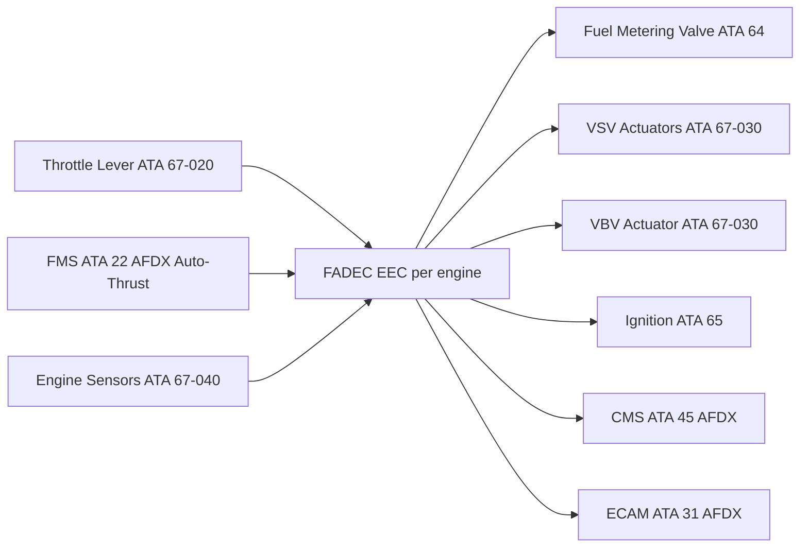
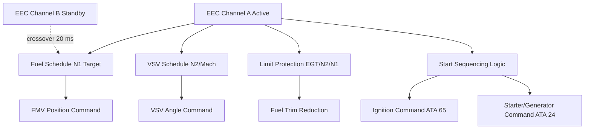

# Engine Controls General

---

## §0 Hyperlink Policy

> All hyperlinks in this document are **relative** (five directory levels: `../../../../../`).
> Absolute URLs are forbidden. Every linked document must exist in the Q+ATLANTIDE repository
> before the link is activated. Broken links are treated as open issues and must be resolved
> before the document is promoted from `DRAFT` to `APPROVED`.

---

## §1 Purpose

This document defines the agnostic ATLAS standard-level architecture context for `Engine Controls General`.

It describes the controlled scope, functions, interfaces, safety considerations, lifecycle traceability, and S1000D/CSDB mapping logic that programme implementations shall instantiate when this node is applicable.

This document is not a programme design baseline. Programme-specific capacities, locations, part numbers, effectivity, operating limits, maintenance references, and data module codes shall be defined only inside the applicable programme implementation branch.
## §2 Applicability

| Applicability Level | Rule |
|---|---|
| Standard taxonomy | Applies to the ATLAS node `067` |
| Programme implementation | Conditional; determined by programme architecture, trade studies, certification basis, and applicability model |
| Product configuration | Defined in the programme-specific configuration baseline |
| Effectivity | Defined in the programme CSDB / applicability layer |
| Non-applicability | Must be explicitly stated in the programme impact-study branch when excluded |
## §3 Functional Description ![DRAFT]

The FADEC EEC is mounted on the engine fan case, passively cooled by ram air through a dedicated cooling channel in the EEC enclosure. The EEC contains two independent channels (CH-A and CH-B) on separate circuit boards sharing a common housing. Each channel has its own power supply (28 V DC from independent aircraft buses), its own processor, its own sensor inputs, and its own output drivers for actuators. CH-A is the commanding channel; CH-B is a hot-standby shadow controller that assumes authority within one FADEC frame (20 ms) on CH-A fault.

FADEC authority covers all engine phases: ground start → taxi → takeoff → climb → cruise → descent → approach → landing → shutdown → motoring/dry crank. Thrust management is performed via N1 target tracking; N1 is the primary thrust control parameter. EGT and N2 limits are enforced as absolute limits — FADEC reduces fuel flow to prevent exceedance.

---

## §4 Functional Breakdown

| ID | Name | Description | Lead Division |
|---|---|---|---|
| F-001 | EEC CH-A (commanding) | DO-178C DAL A; full authority fuel and geometry control | Q-GREENTECH |
| F-002 | EEC CH-B (standby) | Hot-standby shadow controller; 20 ms crossover on CH-A fault | Q-MECHANICS |
| F-003 | Fuel metering control | FMV position command; fuel schedule vs N1/T3/P25 | Q-MECHANICS |
| F-004 | Variable geometry control | VSV stages 1–4 and VBV schedule vs N2 and Mach | Q-AIR |
| F-005 | Limit protection | N1/N2 overspeed, EGT over-limit, N2 stall detection | Q-INDUSTRY |

---

## §5 System Context — Mermaid Diagram

---

## §6 Internal Architecture — Mermaid Diagram

---

## §7 Components and LRUs

| Component | Part Number | Qty | Location | Maintenance Interval | Notes |
|---|---|---|---|---|---|
| EEC (Electronic Engine Controller) | EEC-PN-TBD | 2 (one per engine) | Engine fan case, 3 o'clock | On condition / software update per SB | DO-178C DAL A; dual-channel; RAM-air cooled |
| EEC Harness Assembly | HARNESS-EEC-PN-TBD | 2 (one per engine) | Fan case to pylon | Inspect C-check | Fire-rated; EMI-shielded; ARINC 429 + AFDX |
| EEC Cooling Inlet Screen | SCREEN-EEC-PN-TBD | 2 (one per engine) | EEC housing RAM-air inlet | Inspect A-check; clean or replace | Prevents FOD ingestion into EEC cooling channel |
| Fuel Metering Valve (FMV) | FMV-PN-TBD | 2 (one per engine) | HMU (ATA 64) | On condition per FADEC HMU interface | FADEC-commanded; LVDT position feedback |
| Throttle Lever Angle Resolver (RVDT) | RVDT-TLA-PN-TBD | 4 (dual per engine, 2 levers) | Throttle lever assembly | Functional check A-check | Dual RVDT per lever; FADEC uses both |

---

## §8 Interfaces

| Interface Type | Connected System | Protocol / Medium | Data / Function |
|---|---|---|---|
| ATA 22 FMS | Flight Management System | AFDX ARINC 664 P7 | Auto-Thrust N1 target and thrust mode |
| ATA 24 Electrical Power | HVDC / 28 V DC | Dual independent DC buses | EEC dual-channel independent power supplies |
| ATA 31 ECAM | Cockpit display | AFDX | N1, N2, EGT, FF indications; engine alerts |
| ATA 45 CMS | Central Maintenance System | AFDX | FADEC BITE faults, exceedance log, event freeze-frames |
| ATA 65 Ignition | Ignition exciter system | Discrete hardwired | FADEC enable/disable ignition per mode |

---

## §9 Operating Modes

| Mode | Trigger | System State | Actions / Consequences |
|---|---|---|---|
| Ground start | Start button pressed | FADEC sequences starter, fuel, ignition | N1 light-off confirmed; ignition off at N1 self-sustaining |
| Takeoff (TOGA/FLEX) | TLA at TO/GA or FLEX detent | FADEC targets max rated N1 | FMV advances to max fuel schedule |
| Climb / Cruise | FMS Auto-Thrust active | FADEC tracks FMS N1 target | Continuous trim for T3 and N2 limits |
| In-flight relight | Flame-out detected | FADEC commands both igniters; re-opens FMV | Relight attempt within windmill speed envelope |
| Channel crossover | CH-A fault detected | CH-B assumes authority within 20 ms | Bumpless transfer; ECAM FADEC CH-B advisory |

---

## §10 Performance and Budgets ![DRAFT]

| Parameter | Requirement | Target / Design Value | Status |
|---|---|---|---|
| FADEC frame rate | ≥ 40 Hz (25 ms) | 50 Hz (20 ms) | ![TBD] |
| CH-A to CH-B crossover time | ≤ 20 ms | 15 ms | ![TBD] |
| N1 control accuracy | ±0.3 % N1 | ±0.2 % N1 | ![TBD] |
| EGT limit protection response | ≤ 100 ms from exceedance | 60 ms | ![TBD] |
| FADEC BITE coverage | ≥ 90 % (DAL A requirement) | ≥ 92 % | ![TBD] |

---

## §11 Safety, Redundancy and Fault Tolerance

- Dual-channel EEC with independent power supplies ensures single-fault tolerance; dual-channel simultaneous failure is Extremely Improbable (DO-178C DAL A + DO-254 hardware assurance).
- No mechanical reversion: justification is the combination of DAL A software + dual-channel hardware + independent power + RAM air cooling (passive, no moving parts).
- N1/N2 overspeed protection is implemented in both channels independently; either channel can execute fuel cut-off.
- FADEC harness is fire-rated to CS-E §150 requirement for post-crash fire survivability.

---

## §12 Maintenance and Diagnostics

| Task | Interval | Access | Special Tools |
|---|---|---|---|
| EEC cooling inlet screen inspection | A-check | Engine fan case external | Mirror and light |
| FADEC BITE log download | A-check | ACARS or CMS terminal | CMS terminal |
| EEC harness visual inspection | C-check | Engine fan case to pylon area | Inspection mirror; AMM |
| EEC LRU replacement | On condition | Engine fan case, 4 bolts | FADEC EOBT tool; EEC configuration load |

---

## §13 Footprint — Physical, Electrical, Maintenance, Data ![TBD]

| Footprint Type | Parameter | Value | Notes |
|---|---|---|---|
| Physical | EEC mass (each) | ![TBD] | Fan case mounted |
| Physical | EEC cooling inlet area | ![TBD] | RAM-air passive cooling |
| Electrical | EEC power (each channel) | ~50 W at 28 V DC | Dual independent buses |
| Maintenance | EEC swap time | ~2 h | No post-swap calibration; FADEC self-calibrates |
| Data | AFDX bandwidth (FADEC to CMS) | ![TBD] | Per AFDX bus load analysis |

---

## §14 Safety and Certification References ![DRAFT]

| Standard / Document | Title | Issuing Body | Applicability |
|---|---|---|---|
| DO-178C | Software Considerations in Airborne Systems | RTCA | EEC software DAL A |
| DO-254 | Design Assurance for Airborne Electronic Hardware | RTCA | EEC complex hardware DAL A |
| EASA CS-E §150 | FADEC systems | EASA | Full-authority FADEC requirements |
| DO-160G | Environmental Conditions | RTCA | EEC environmental qualification |
| ATA iSpec 2200 | Chapter 67 — Engine Controls | ATA | Chapter scope |

---

## §15 V&V Approach ![TBD]

| Phase | Method | Acceptance Criterion | Status |
|---|---|---|---|
| Design | FADEC system safety assessment (SSA) | No single failure leads to unsafe engine state | ![TBD] |
| Integration | Iron bird / HIL test | All actuator commands correct in all modes | ![TBD] |
| Qualification | Engine test cell — FADEC functional test | N1 control accuracy ±0.3 %; all limits protect | ![TBD] |
| Certification | EASA CS-E §150 compliance demo | Type Certificate approval for FADEC system | ![TBD] |

---

## §16 Glossary

| Term | Definition |
|---|---|
| **FADEC** | Full-Authority Digital Engine Control — sole authority for engine management. |
| **EEC** | Electronic Engine Controller — the FADEC hardware unit. |
| **DAL A** | Design Assurance Level A — highest software criticality level per DO-178C. |
| **CH-A / CH-B** | Active and standby channels of the dual-channel EEC. |
| **FMV** | Fuel Metering Valve — FADEC-commanded valve controlling fuel flow to combustor. |
| **VSV** | Variable Stator Vane — adjustable compressor inlet vane; FADEC-scheduled vs N2/Mach. |
| **VBV** | Variable Bypass Valve — overboard bleed valve for compressor stall protection. |
| **N1** | Fan speed (% of max rpm) — primary thrust control parameter. |
| **N2** | HP compressor speed — used for fuel schedule and VSV/VBV scheduling. |
| **EGT** | Exhaust Gas Temperature — key engine health and limit parameter. |

---

## §17 Open Issues

| ID | Description | Owner | Target |
|---|---|---|---|
| OI-067-000-001 | Confirm FADEC OEM and EEC part number for programme-defined aircraft type engine selection | Q-MECHANICS | 2026-Q3 |
| OI-067-000-002 | Complete FADEC System Safety Assessment (SSA) including all actuator failure modes | Q-AIR / safety | 2027-Q1 |

---

## §18 Status Legend

| Badge | Meaning |
|---|---|
| `![DRAFT]` | Section is drafted but not yet reviewed |
| `![TBD]` | Content not yet started — to be defined |
| `![To Be Completed]` | Partially complete — needs additional content |
| `![APPROVED]` | Reviewed and formally approved |

---

## §19 Related Documents (Siblings in this Subsection)

- [067-010](./067-010-FADEC-and-Electronic-Engine-Control.md)
- [067-020](./067-020-Throttle-Lever-and-Power-Command-Interfaces.md)
- [067-030](./067-030-Engine-Actuators-and-Servo-Control.md)
- [067-040](./067-040-Engine-Control-Sensors-and-Feedback.md)
- [067-050](./067-050-Engine-Control-Modes-and-Degraded-Operation.md)
- [067-060](./067-060-Engine-Control-Software-and-Configuration.md)
- [067-070](./067-070-Engine-Control-Test-and-Maintenance.md)
- [067-080](./067-080-Engine-Controls-Monitoring-Diagnostics-and-Control-Interfaces.md)
- [067-090](./067-090-S1000D-CSDB-Mapping-and-Traceability.md)

---

## §20 Change Log

| Rev | Date | Author | Description |
|---|---|---|---|
| 0.1 | 2026-05-11 | @copilot | Initial DRAFT — contextualized content per programme-defined aircraft type architecture |
