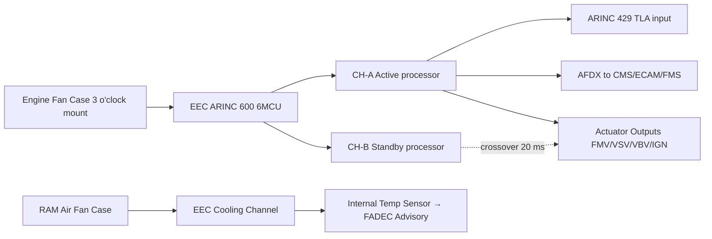
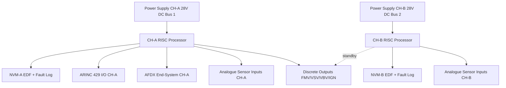

# FADEC and Electronic Engine Control

---

## §0 Hyperlink Policy

> All hyperlinks in this document are **relative** (five directory levels: `../../../../../`).
> Absolute URLs are forbidden.

---

## §1 Purpose

This document defines the agnostic ATLAS standard-level architecture context for `FADEC and Electronic Engine Control`.

It describes the controlled scope, functions, interfaces, safety considerations, lifecycle traceability, and S1000D/CSDB mapping logic that programme implementations shall instantiate when this node is applicable.

This document is not a programme design baseline. Programme-specific capacities, locations, part numbers, effectivity, operating limits, maintenance references, and data module codes shall be defined only inside the applicable programme implementation branch.
## §2 Applicability

| Applicability Level | Rule |
|---|---|
| Standard taxonomy | Applies to the ATLAS node `067` |
| Programme implementation | Conditional; determined by programme architecture, trade studies, certification basis, and applicability model |
| Product configuration | Defined in the programme-specific configuration baseline |
| Effectivity | Defined in the programme CSDB / applicability layer |
| Non-applicability | Must be explicitly stated in the programme impact-study branch when excluded |
## §3 Functional Description ![DRAFT]

**EEC hardware:** Dual-channel single enclosure. Channel A board and Channel B board are physically separated within the EEC box, each with its own processor (32-bit RISC), RAM, NVM (for EDF storage and fault logs), ARINC 429 transceivers, AFDX end-system, analogue I/O (sensor inputs), discrete I/O (actuator enables, ignition commands), and power supply module. The two boards share no hardware components except the EEC housing and the fan-case mounting bracket.

**Cooling:** Passive RAM-air cooling via a dedicated cooling channel through the EEC enclosure. A temperature sensor inside the EEC monitors internal temperature; if internal temperature exceeds 95 °C, FADEC logs an advisory. No liquid cooling or thermoelectric cooling required.

**Communications:** CH-A (active) communicates to aircraft via: ARINC 429 (TLA, N1 target, discrete engine state) and AFDX (CMS health data, ECAM thrust data, FMS speed schedule). CH-B shadows CH-A I/O and is ready to command immediately on CH-A failure. After crossover, CH-B becomes commanding and CH-A becomes monitoring.

---

## §4 Functional Breakdown

| ID | Name | Description | Lead Division |
|---|---|---|---|
| F-001 | EEC CH-A processor and I/O | Primary command processor; 32-bit RISC; full actuator output authority | Q-GREENTECH |
| F-002 | EEC CH-B processor and I/O | Shadow processor; monitors CH-A; ready for 20 ms crossover | Q-MECHANICS |
| F-003 | EEC NVM (EDF + fault log) | Stores engine model data file and last 500 fault events | Q-MECHANICS |
| F-004 | EEC cooling channel | Passive RAM-air; fan case 3 o'clock mounting; internal temp sensor | Q-AIR |
| F-005 | AFDX end-system (EEC) | Provides ARINC 664 P7 connectivity to aircraft network | Q-INDUSTRY |

---

## §5 System Context — Mermaid Diagram

---

## §6 Internal Architecture — Mermaid Diagram

---

## §7 Components and LRUs

| Component | Part Number | Qty | Location | Maintenance Interval | Notes |
|---|---|---|---|---|---|
| EEC (complete LRU) | EEC-LRU-PN-TBD | 2 (one per engine) | Fan case 3 o'clock | On condition / software update per SB | ARINC 600 6MCU; ~7 kg; DO-178C DAL A + DO-254 |
| EDF (Engine Data File) | EDF-SN-XXXXXXX | 1 per engine | EEC NVM | Update at each borescope or OEM trigger | Serial-number-specific; performance calibration |
| EEC Mounting Bracket | BKT-EEC-PN-TBD | 2 (one per engine) | Fan case 3 o'clock | Inspect C-check | Anti-vibration mounts; torque per AMM |
| EEC Cooling Inlet Screen | SCREEN-EEC-PN-TBD | 2 (one per engine) | EEC housing RAM-air inlet | Inspect A-check | Prevents FOD in cooling channel |
| EEC Harness Connector (fan case) | CONN-EEC-PN-TBD | 2 (one per engine) | Fan case breakout | Visual inspect C-check | Fire-rated; hermetically sealed |

---

## §8 Interfaces

| Interface Type | Connected System | Protocol / Medium | Data / Function |
|---|---|---|---|
| ATA 24 Electrical Power | Dual 28 V DC buses | Hardwired | Independent power to CH-A and CH-B |
| ATA 22 FMS | Flight Management System | AFDX | N1 target from auto-thrust; thrust mode |
| ATA 31 ECAM | Electronic displays | AFDX | N1, N2, EGT, FF, engine state |
| ATA 45 CMS | Central Maintenance System | AFDX | BITE faults, event log, EDF status |
| ATA 64 HMU | Hydromechanical Unit | ARINC 429 / discrete | FMV position command and feedback |

---

## §9 Operating Modes

| Mode | Trigger | System State | Actions / Consequences |
|---|---|---|---|
| Power-on self-test | EEC powered | CH-A and CH-B run BITE | BITE results to CMS; faults flagged before engine start |
| Normal operation CH-A commanding | Aircraft in service | CH-A commanding; CH-B shadowing | Full authority fuel/geometry; all limits active |
| CH-A to CH-B crossover | CH-A fault detected | CH-B commands within 20 ms | ECAM advisory FADEC CH-B active; operations continue |
| EDF update (post-borescope) | Maintenance action | EEC connected to LOADMASTER | New EDF loaded to NVM; BITE confirms integrity |
| EEC replacement | LRU swap | New EEC installed | EDF and SWPN loaded before first engine run |

---

## §10 Performance and Budgets ![DRAFT]

| Parameter | Requirement | Target / Design Value | Status |
|---|---|---|---|
| EEC frame rate | ≥ 40 Hz | 50 Hz (20 ms) | ![TBD] |
| CH-A to CH-B crossover | ≤ 20 ms | 15 ms | ![TBD] |
| EEC operating temp range | −55 °C to +95 °C (internal) | Qualified per DO-160G Cat E | ![TBD] |
| NVM fault log capacity | ≥ 200 events | 500 events | ![TBD] |
| EEC BITE coverage | ≥ 90 % | ≥ 92 % | ![TBD] |

---

## §11 Safety, Redundancy and Fault Tolerance

- Dual-channel EEC with independent power supplies: no single hardware failure can simultaneously disable both channels.
- All EEC outputs have current monitoring; stuck-at failures detected in one frame.
- EEC NVM is non-volatile: EDF and fault log survive power interruption and EEC removal.
- EEC enclosure is sealed against engine-zone fluids (fuel, oil, hydraulic fluid per DO-160G Sect 11).

---

## §12 Maintenance and Diagnostics

| Task | Interval | Access | Special Tools |
|---|---|---|---|
| EEC cooling inlet screen inspect/clean | A-check | Engine fan case external | Mirror and cleaning brush |
| FADEC BITE download | A-check | ACARS or CMS terminal | CMS terminal |
| EEC harness visual inspection | C-check | Fan case to pylon harness | Inspection mirror |
| EEC LRU replacement + EDF/SWPN load | On condition | Fan case 4-bolt EEC mount | FADEC LOADMASTER laptop + AFDX cable |

---

## §13 Footprint — Physical, Electrical, Maintenance, Data ![TBD]

| Footprint Type | Parameter | Value | Notes |
|---|---|---|---|
| Physical | EEC mass | ~7 kg | ARINC 600 6MCU |
| Physical | EEC dimensions | ARINC 600 6MCU | Standard avionics form factor |
| Electrical | EEC power per channel | ~50 W | 28 V DC |
| Maintenance | EEC swap + EDF load time | ~2 h | Fan case access; no engine run required before EDF load |
| Data | AFDX — EEC to CMS | ![TBD] | Per AFDX bus load analysis |

---

## §14 Safety and Certification References ![DRAFT]

| Standard / Document | Title | Issuing Body | Applicability |
|---|---|---|---|
| DO-178C | Software Considerations | RTCA | EEC software DAL A |
| DO-254 | Electronic Hardware Design Assurance | RTCA | EEC complex hardware (FPGA, ASIC) |
| EASA CS-E §150 | FADEC systems | EASA | Full-authority EEC certification |
| DO-160G | Environmental Conditions | RTCA | EEC fan case environment qualification |
| ARINC 600 | Electronic Equipment Cases | ARINC | EEC form factor standard |

---

## §15 V&V Approach ![TBD]

| Phase | Method | Acceptance Criterion | Status |
|---|---|---|---|
| Design | DO-178C Plan for Software Aspects of Certification (PSAC) | PSAC approved by EASA | ![TBD] |
| Integration | Iron bird — EEC to aircraft system test | All AFDX/ARINC 429 parameters correct | ![TBD] |
| Qualification | DO-160G — fan case environment test | EEC passes all applicable sections | ![TBD] |
| Certification | EASA CS-E §150 compliance | EEC type acceptance by EASA | ![TBD] |

---

## §16 Glossary

| Term | Definition |
|---|---|
| **EEC** | Electronic Engine Controller — the FADEC hardware unit. |
| **EDF** | Engine Data File — serial-number-specific performance calibration data stored in EEC NVM. |
| **SWPN** | Software Part Number — identifies the approved executable loaded in the EEC. |
| **NVM** | Non-Volatile Memory — retains data through power-off. |
| **DAL A** | Design Assurance Level A — highest criticality level per DO-178C/DO-254. |
| **ARINC 600** | Standard defining avionics enclosure sizes and connector types. |
| **6MCU** | 6 Modular Concept Unit — specific ARINC 600 box size for EEC. |
| **LOADMASTER** | FADEC ground software tool for loading EDF and SWPN into EEC NVM. |
| **Crossover** | Channel switch from CH-A to CH-B commanding authority. |
| **Shadow controller** | CH-B continuously mirrors CH-A I/O and is ready to take over instantly. |

---

## §17 Open Issues

| ID | Description | Owner | Target |
|---|---|---|---|
| OI-067-010-001 | Select FADEC OEM and confirm EEC hardware specification (CH-A/B crossover time, NVM capacity) | Q-MECHANICS | 2026-Q3 |
| OI-067-010-002 | Confirm EDF update trigger events with engine OEM (borescope findings → EDF revision criteria) | Q-AIR | 2026-Q4 |

---

## §18 Status Legend

| Badge | Meaning |
|---|---|
| `![DRAFT]` | Section is drafted but not yet reviewed |
| `![TBD]` | Content not yet started — to be defined |
| `![To Be Completed]` | Partially complete — needs additional content |
| `![APPROVED]` | Reviewed and formally approved |

---

## §19 Related Documents (Siblings in this Subsection)

- [067-000](./067-000-Engine-Controls-General.md)
- [067-020](./067-020-Throttle-Lever-and-Power-Command-Interfaces.md)
- [067-030](./067-030-Engine-Actuators-and-Servo-Control.md)
- [067-040](./067-040-Engine-Control-Sensors-and-Feedback.md)
- [067-050](./067-050-Engine-Control-Modes-and-Degraded-Operation.md)
- [067-060](./067-060-Engine-Control-Software-and-Configuration.md)
- [067-070](./067-070-Engine-Control-Test-and-Maintenance.md)
- [067-080](./067-080-Engine-Controls-Monitoring-Diagnostics-and-Control-Interfaces.md)
- [067-090](./067-090-S1000D-CSDB-Mapping-and-Traceability.md)

---

## §20 Change Log

| Rev | Date | Author | Description |
|---|---|---|---|
| 0.1 | 2026-05-11 | @copilot | Initial DRAFT — contextualized content per programme-defined aircraft type architecture |
