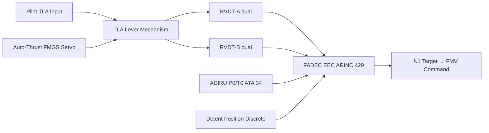
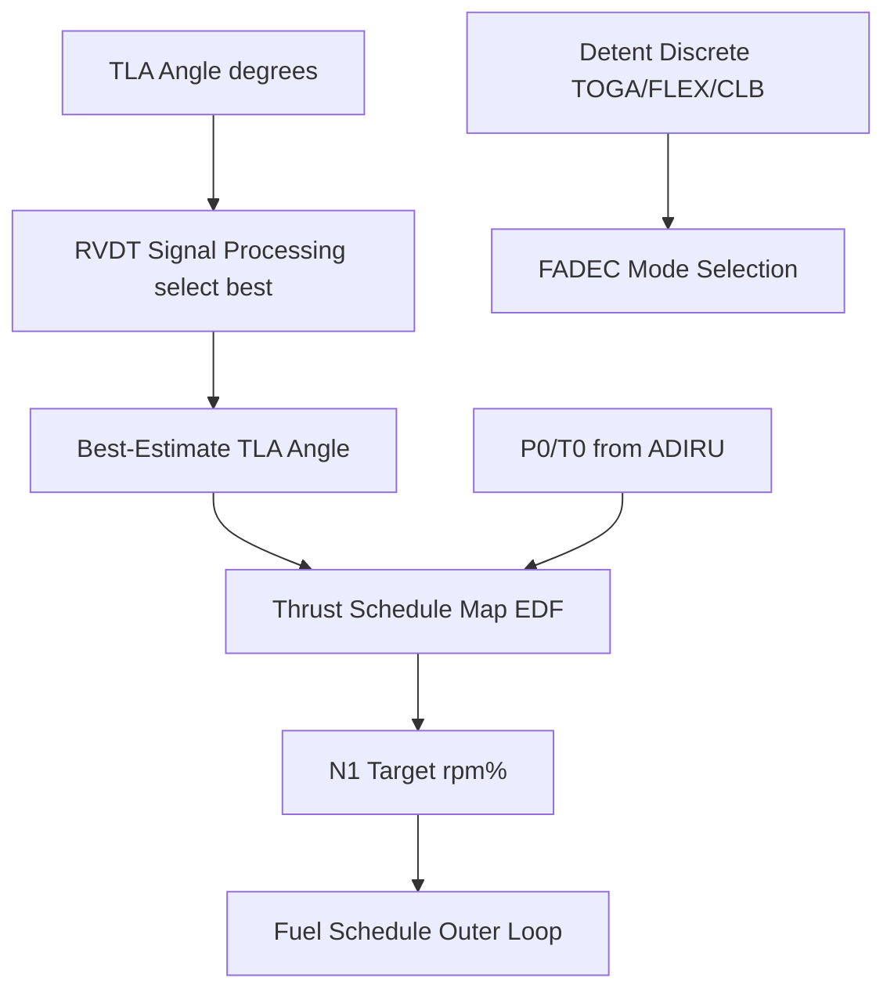

# Throttle Lever and Power Command Interfaces

---

## §0 Hyperlink Policy

> All hyperlinks in this document are **relative** (five directory levels: `../../../../../`).
> Absolute URLs are forbidden.

---
## §1 Purpose

This document defines the Throttle Lever Assembly (TLA) and the power-command signal chain from pilot input to FADEC on the AMPEL360E eWTW. The TLA is the pilot's primary mechanical interface for engine thrust management. FADEC translates TLA angle into thrust commands via a fully digital ARINC 429 / discrete signal chain — there is no mechanical cable or rod between the TLA and the engine fuel system.

---

## §2 Applicability

| Parameter | Value |
|---|---|
| Aircraft Program | AMPEL360E eWTW |
| ATA reference | ATA 67-020 — Throttle Lever and Power Command Interfaces |
| Certification basis | EASA CS-25 Amdt 27+ / CS-E §150 |
| S1000D SNS | 067-020-00 |

---

## §3 Functional Description ![DRAFT]

The TLA is a conventional two-lever side-console assembly (captain and first officer positions). Each lever has dual RVDT (Rotary Variable Differential Transformer) sensors measuring lever angle. FADEC uses both RVDT signals to compute a single best-estimate TLA angle; if one RVDT fails, FADEC uses the remaining signal with a CMS advisory.

**Detent positions (per CS-25 §25.1155):** IDLE (ground) → IDLE (flight) → CLIMB → FLEX/MCT → TOGA/GO-AROUND. Detents are tactile and defined by physical stops in the TLA mechanism. Auto-Thrust engagement connects the FMGS servo to the TLA; the levers physically move when Auto-Thrust adjusts thrust.

FADEC maps TLA angle to N1 target using a thrust schedule curve stored in the EDF (Engine Data File). The mapping is altitude- and temperature-corrected via FADEC sensor inputs (P0, T0 from ADIRU ATA 34).

---

## §4 Functional Breakdown

| ID | Name | Description | Lead Division |
|---|---|---|---|
| F-001 | TLA lever mechanism | Two-lever assembly with detents; TOGA/FLEX/CLB/IDLE defined | Q-GREENTECH |
| F-002 | TLA RVDT sensors | Dual RVDT per lever; FADEC selects best signal | Q-MECHANICS |
| F-003 | Auto-Thrust servo | Motor-driven FMGS servo physically moves levers; FADEC follows | Q-AIR |
| F-004 | TLA angle to N1 mapping | EDF stored schedule; altitude/T0 corrected via ADIRU P0/T0 | Q-MECHANICS |
| F-005 | Detent sensing | Discrete position signals for TOGA/FLEX/CLB detents to FADEC | Q-INDUSTRY |

---

## §5 System Context — Mermaid Diagram

---

## §6 Internal Architecture — Mermaid Diagram

---

## §7 Components and LRUs

| Component | Part Number | Qty | Location | Maintenance Interval | Notes |
|---|---|---|---|---|---|
| TLA Assembly (complete) | TLA-PN-TBD | 2 (one per side) | Centre pedestal | Functional check C-check | Detent forces per AMM limits |
| TLA RVDT Sensor | RVDT-TLA-PN-TBD | 4 (dual per lever) | Inside TLA mechanism | Replace on fault | Dual-redundant; FADEC best-select |
| Auto-Thrust Servo Actuator | AT-SERVO-PN-TBD | 2 (one per lever) | TLA housing | Functional check C-check | Moves lever physically; driven by FMGS |
| TLA Detent Block | DETENT-TLA-PN-TBD | 2 | TLA mechanism | Inspect C-check; replace if worn | Physical stop defining TOGA/FLEX/CLB/IDLE |
| TLA Wiring Harness | HARNESS-TLA-PN-TBD | 2 | Centre pedestal to EE bay | Inspect C-check | RVDT signals to FADEC via ARINC 429 |

---

## §8 Interfaces

| Interface Type | Connected System | Protocol / Medium | Data / Function |
|---|---|---|---|
| ATA 67 FADEC | Electronic Engine Controller | ARINC 429 (RVDT output) | TLA angle to FADEC CH-A and CH-B |
| ATA 22 FMGS | Flight Management and Guidance System | Discrete / servo control | Auto-Thrust servo to TLA |
| ATA 34 ADIRU | Air Data and Inertial Reference | ARINC 429 | P0 and T0 for thrust schedule correction |
| ATA 31 ECAM | Cockpit display | AFDX (via FADEC) | Thrust mode display; lever position indication |
| ATA 45 CMS | Central Maintenance System | AFDX (via FADEC) | RVDT fault advisory |

---

## §9 Operating Modes

| Mode | Trigger | System State | Actions / Consequences |
|---|---|---|---|
| Manual thrust | Auto-Thrust disengaged | Pilot moves lever directly | FADEC tracks TLA angle directly |
| Auto-Thrust engaged | FMGS servo active | Lever moves automatically | FADEC follows FMGS N1 target |
| TOGA detent | Lever at TOGA stop | Detent discrete to FADEC | FADEC selects TOGA N1 limit |
| FLEX detent | Lever at FLEX stop | FLEX N1 from FMS FLEX temp | FADEC applies reduced thrust limit |
| Single RVDT failure | One RVDT signal lost | FADEC uses remaining RVDT | CMS advisory; dispatch per MEL |

---

## §10 Performance and Budgets ![DRAFT]

| Parameter | Requirement | Target / Design Value | Status |
|---|---|---|---|
| RVDT accuracy | ±0.2° | ±0.15° | ![TBD] |
| TLA signal to FADEC latency | ≤ 10 ms | 8 ms | ![TBD] |
| Auto-Thrust servo response | ≤ 200 ms from command | 150 ms | ![TBD] |
| RVDT dual redundancy crossover | < 1 control frame (20 ms) | Instantaneous best-select | ![TBD] |
| Detent force (TOGA) | 45–60 N | 50 N ± 5 N | ![TBD] |

---

## §11 Safety, Redundancy and Fault Tolerance

- Dual RVDT per lever: single RVDT failure does not affect thrust control; FADEC uses remaining sensor.
- No mechanical connection between TLA and engine: no risk of jam or disconnection affecting engine thrust (all-electrical signal chain).
- TOGA detent requires deliberate force to prevent inadvertent selection (CS-25 §25.1155 intent).
- Auto-Thrust servo jam detected by FMGS torque monitoring; breakout force allows pilot to override servo.

---

## §12 Maintenance and Diagnostics

| Task | Interval | Access | Special Tools |
|---|---|---|---|
| TLA lever movement, detent force check | C-check | Centre pedestal | Force gauge per AMM |
| RVDT functional test (both sensors per lever) | C-check | FADEC GSE command | FADEC LOADMASTER or FADEC GSE terminal |
| Auto-Thrust servo functional test | C-check | FMGS GSE command | FMGS GSE |
| TLA RVDT replacement | On fault | TLA disassembly | RVDT alignment tool per AMM |

---

## §13 Footprint ![TBD]

| Footprint Type | Parameter | Value |
|---|---|---|
| Physical | TLA assembly mass | ![TBD] |
| Electrical | RVDT power (each) | ~2 W at 5 V AC excitation |
| Electrical | Auto-Thrust servo power | ~20 W at 28 V DC |
| Maintenance | TLA functional check time | ~30 min |
| Data | RVDT bandwidth | ≥ 100 Hz |

---

## §14 Safety and Certification References ![DRAFT]

| Standard / Document | Title | Issuing Body | Applicability |
|---|---|---|---|
| EASA CS-25 §25.1155 | Fuel shutoff and throttle controls | EASA | Detent force and position requirements |
| EASA CS-E §150 | FADEC systems | EASA | TLA-FADEC signal chain |
| DO-160G | Environmental Conditions | RTCA | TLA and RVDT environmental qualification |
| ARINC 429 | Digital Information Transfer | ARINC | RVDT to FADEC signal |
| ATA iSpec 2200 | Chapter 67 | ATA | Chapter scope |

---

## §15 V&V Approach ![TBD]

| Phase | Method | Acceptance Criterion | Status |
|---|---|---|---|
| Design | RVDT dual-select analysis | Single RVDT failure has no thrust effect | ![TBD] |
| Integration | TLA rig test — RVDT to FADEC | TLA angle accuracy ±0.2°; latency ≤ 10 ms | ![TBD] |
| Qualification | DO-160G — TLA environmental | Passes vibration, temperature categories | ![TBD] |
| Certification | CS-25 §25.1155 detent force demo | Force per AMM spec; pilot cannot inadvertently select TOGA | ![TBD] |

---

## §16 Glossary

| Term | Definition |
|---|---|
| **TLA** | Throttle Lever Assembly — pilot thrust control. |
| **RVDT** | Rotary Variable Differential Transformer — angle sensor. |
| **Detent** | Physical stop defining a discrete TLA position (TOGA, FLEX, CLB, IDLE). |
| **Auto-Thrust servo** | Motor that physically moves the TLA when FMGS controls thrust. |
| **EDF** | Engine Data File — stores N1 thrust schedule map. |
| **TOGA** | Take-Off/Go-Around — maximum rated thrust detent. |
| **FLEX** | Flexible Thrust — reduced TO thrust detent for noise abatement. |
| **CLB** | Climb thrust — normal climb thrust detent. |
| **Best-select** | FADEC logic choosing the more credible of two RVDT signals. |
| **Breakout force** | Force required to override Auto-Thrust servo and move lever manually. |

---

## §17 Open Issues

| ID | Description | Owner | Target |
|---|---|---|---|
| OI-067-020-001 | Confirm FLEX temperature range and N1 schedule with engine OEM | Q-MECHANICS | 2026-Q4 |
| OI-067-020-002 | Validate Auto-Thrust servo breakout force per CS-25 §25.1155 | Q-AIR | 2027-Q1 |

---

## §18 Status Legend

| Badge | Meaning |
|---|---|
| `![DRAFT]` | Section is drafted but not yet reviewed |
| `![TBD]` | Content not yet started — to be defined |
| `![To Be Completed]` | Partially complete — needs additional content |
| `![APPROVED]` | Reviewed and formally approved |

---

## §19 Related Documents (Siblings in this Subsection)

- [067-000](./067-000-Engine-Controls-General.md)
- [067-010](./067-010-FADEC-and-Electronic-Engine-Control.md)
- [067-030](./067-030-Engine-Actuators-and-Servo-Control.md)
- [067-040](./067-040-Engine-Control-Sensors-and-Feedback.md)
- [067-050](./067-050-Engine-Control-Modes-and-Degraded-Operation.md)
- [067-060](./067-060-Engine-Control-Software-and-Configuration.md)
- [067-070](./067-070-Engine-Control-Test-and-Maintenance.md)
- [067-080](./067-080-Engine-Controls-Monitoring-Diagnostics-and-Control-Interfaces.md)
- [067-090](./067-090-S1000D-CSDB-Mapping-and-Traceability.md)

---

## §20 Change Log

| Rev | Date | Author | Description |
|---|---|---|---|
| 0.1 | 2026-05-11 | @copilot | Initial DRAFT — contextualized content per AMPEL360E eWTW architecture |
