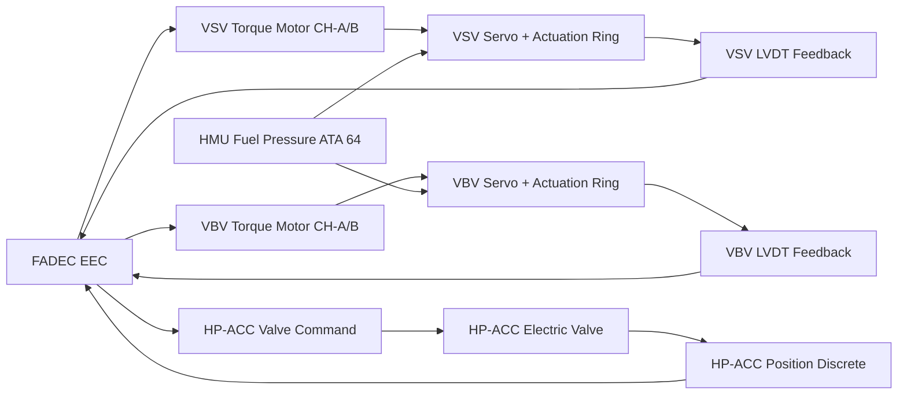
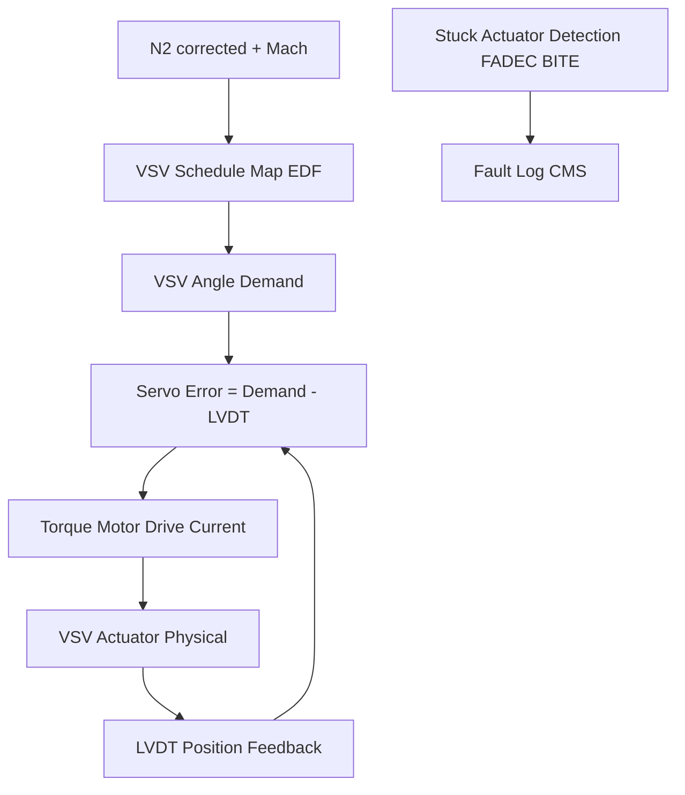

# Engine Actuators and Servo Control

---

## §0 Hyperlink Policy

> All hyperlinks in this document are **relative** (five directory levels: `../../../../../`).
> Absolute URLs are forbidden.

---
## §1 Purpose

This document covers the engine actuators commanded by the FADEC on the AMPEL360E eWTW: the Variable Stator Vane (VSV) actuators (stages 1–4), the Variable Bypass Valve (VBV) actuator, and the High-Pressure Compressor Active Clearance Control (HP-ACC) valve. The Fuel Metering Valve (FMV) is the primary fuel actuator and is described in ATA 64; this document covers geometry actuators only.

All actuators receive position commands from the FADEC EEC via torque motor or step-motor driver outputs. Each actuator provides position feedback to the FADEC via LVDT (Linear Variable Differential Transformer) or potentiometer sensors, forming a closed servo loop inside the FADEC control frame.

---

## §2 Applicability

| Parameter | Value |
|---|---|
| Aircraft Program | AMPEL360E eWTW |
| ATA reference | ATA 67-030 — Engine Actuators and Servo Control |
| Certification basis | EASA CS-E Amdt 5 / DO-160G |
| S1000D SNS | 067-030-00 |

---

## §3 Functional Description ![DRAFT]

**VSV Actuators (stages 1–4):** Four stages of variable stator vanes are scheduled by FADEC as a function of N2 corrected speed and aircraft Mach number. The VSV actuating ring is driven by a hydraulic servo powered from the Fuel Hydromechanical Unit (HMU, ATA 64) oil supply — the HMU fuel pressure provides the hydraulic source for VSV servo motion. FADEC commands the VSV servo valve torque motor and reads LVDT feedback; closed-loop accuracy ±0.5°.

**VBV Actuator:** The Variable Bypass Valve diverts LP compressor air overboard during low-power transients to prevent stall. The VBV ring actuator is also HMU fuel-pressure driven, FADEC-commanded and LVDT-monitored.

**HP-ACC Valve:** The HP Active Clearance Control valve modulates turbine tip clearance by directing cooling air to the HP turbine casing. This is an electric valve (28 V DC motor) commanded by FADEC; feedback is a position discrete. Closed at takeoff and climb; opens at cruise to reduce blade-tip clearance and improve thermal efficiency.

---

## §4 Functional Breakdown

| ID | Name | Description | Lead Division |
|---|---|---|---|
| F-001 | VSV servo actuator (stages 1–4) | HMU fuel-pressure driven; FADEC torque motor command; LVDT feedback | Q-GREENTECH |
| F-002 | VBV actuator | HMU fuel-pressure driven; FADEC command; LVDT feedback | Q-MECHANICS |
| F-003 | HP-ACC valve | 28 V DC electric motor; FADEC position discrete command | Q-AIR |
| F-004 | VSV position closed loop | FADEC inner servo loop 20 ms; accuracy ±0.5° | Q-MECHANICS |
| F-005 | Actuator BITE | FADEC monitors LVDT reasonableness; stuck/runaway detection | Q-INDUSTRY |

---

## §5 System Context — Mermaid Diagram

---

## §6 Internal Architecture — Mermaid Diagram

---

## §7 Components and LRUs

| Component | Part Number | Qty | Location | Maintenance Interval | Notes |
|---|---|---|---|---|---|
| VSV Actuator Assembly (stages 1–4) | VSV-ACT-PN-TBD | 4 (per engine) | HP compressor case | Functional check C-check; replace on LVDT fault | HMU fuel-pressure driven; FADEC torque motor |
| VBV Actuator Assembly | VBV-ACT-PN-TBD | 1 (per engine) | LP compressor case | Functional check C-check | Same servo architecture as VSV |
| HP-ACC Electric Valve | HPACC-VALVE-PN-TBD | 1 (per engine) | HP turbine casing | Replace on fault (on-condition) | 28 V DC motor; FADEC discrete command |
| VSV LVDT Sensor | LVDT-VSV-PN-TBD | 4 (per engine) | VSV actuation ring | Replace on fault | Dual-redundant per stage; FADEC best-select |
| VBV LVDT Sensor | LVDT-VBV-PN-TBD | 1 (per engine) | VBV ring | Replace on fault | Single LVDT; fault → FADEC uses schedule |

---

## §8 Interfaces

| Interface Type | Connected System | Protocol / Medium | Data / Function |
|---|---|---|---|
| ATA 64 HMU | Hydromechanical Unit | Fuel pressure servo circuit | Servo power for VSV and VBV actuators |
| ATA 24 Electrical Power | 28 V DC | Hardwired | HP-ACC valve motor power |
| ATA 45 CMS | Central Maintenance System | AFDX (via FADEC) | Actuator BITE faults, LVDT health |
| ATA 31 ECAM | Engine display | AFDX (via FADEC) | Actuator fault indication (maintenance page) |
| FADEC EEC | Internal control | Torque motor drive + LVDT input | Closed-loop servo control |

---

## §9 Operating Modes

| Mode | Trigger | System State | Actions / Consequences |
|---|---|---|---|
| Normal schedule | Engine running | VSV, VBV, HP-ACC per schedule | All actuators at schedule positions |
| VSV LVDT fault (one sensor) | LVDT signal lost on one stage | FADEC uses remaining dual LVDT; advisory | Dispatch per MEL; schedule maintained |
| VBV LVDT fault | VBV LVDT signal lost | FADEC uses open-loop schedule (N2 only) | Advisory; stall protection slightly reduced |
| HP-ACC stuck open | HP-ACC position discrete fault | FADEC logs fault; no thrust effect | EGT may be slightly elevated at cruise |
| Actuator runaway | LVDT exceeds schedule limit | FADEC cuts torque motor drive; default | FADEC holds last good position; fault logged |

---

## §10 Performance and Budgets ![DRAFT]

| Parameter | Requirement | Target / Design Value | Status |
|---|---|---|---|
| VSV position accuracy (closed loop) | ±0.5° | ±0.3° | ![TBD] |
| VSV servo response (step to 90 %) | ≤ 200 ms | 150 ms | ![TBD] |
| VBV response (full open) | ≤ 500 ms | 300 ms | ![TBD] |
| HP-ACC valve position time | ≤ 2 s full travel | 1.5 s | ![TBD] |
| FADEC BITE actuator coverage | ≥ 90 % | ≥ 92 % | ![TBD] |

---

## §11 Safety, Redundancy and Fault Tolerance

- Dual LVDT on each VSV stage: single failure does not affect schedule; FADEC best-select.
- VSV/VBV runaway detection (LVDT vs commanded position divergence) prevents blade-tip rub.
- HP-ACC stuck-closed: worst case is elevated blade-tip clearance and slight EGT increase — acceptable safety state.
- HMU fuel pressure provides robust servo power without electrical actuator; VSV position maintained passively if servo valve fails (last position held by hydraulic lock).

---

## §12 Maintenance and Diagnostics

| Task | Interval | Access | Special Tools |
|---|---|---|---|
| VSV actuation ring sweep test (FADEC GSE) | C-check | Engine access stand | FADEC GSE terminal |
| VBV functional test (full open/close) | C-check | Engine access stand | FADEC GSE terminal |
| HP-ACC valve position discrete check | C-check | FADEC GSE command | FADEC GSE terminal |
| LVDT signal calibration check | C-check | FADEC GSE | Calibrated angle reference tool |

---

## §13 Footprint ![TBD]

| Footprint Type | Parameter | Value |
|---|---|---|
| Physical | VSV actuator mass (each stage) | ![TBD] |
| Electrical | HP-ACC valve power | ~10 W at 28 V DC |
| Maintenance | VSV sweep test time | ~20 min per engine |
| Data | LVDT health parameter stream | Per FADEC AFDX allocation |

---

## §14 Safety and Certification References ![DRAFT]

| Standard / Document | Title | Issuing Body | Applicability |
|---|---|---|---|
| EASA CS-E §810 | Engine compressor variable geometry | EASA | VSV/VBV actuator requirements |
| DO-160G | Environmental Conditions | RTCA | Actuator engine environment qualification |
| SAE AIR1168/4 | Engine Bleed Air Systems | SAE International | VBV overboard bleed interface |
| ATA iSpec 2200 | Chapter 67 | ATA | Chapter scope |
| EASA CS-E §850 | Turbine clearance control | EASA | HP-ACC system requirements |

---

## §15 V&V Approach ![TBD]

| Phase | Method | Acceptance Criterion | Status |
|---|---|---|---|
| Design | Servo loop analysis | VSV accuracy ±0.5°; response ≤ 200 ms | ![TBD] |
| Integration | Engine test cell — actuator sweep | All actuators move per FADEC schedule | ![TBD] |
| Qualification | DO-160G — engine case environment | Actuators survive temperature/vibration | ![TBD] |
| Certification | CS-E §810/§850 compliance | VSV/VBV stall-free; HP-ACC clearance benefit | ![TBD] |

---

## §16 Glossary

| Term | Definition |
|---|---|
| **VSV** | Variable Stator Vane — adjustable compressor stage geometry. |
| **VBV** | Variable Bypass Valve — overboard bleed for LP compressor stall protection. |
| **HP-ACC** | High-Pressure Active Clearance Control — reduces turbine tip clearance at cruise. |
| **LVDT** | Linear Variable Differential Transformer — linear position sensor. |
| **Torque motor** | Small electromagnetic actuator converting FADEC current command to servo valve position. |
| **Servo valve** | Fluidic valve controlling fuel pressure to actuator; commanded by torque motor. |
| **Runaway** | Actuator moving beyond commanded position — FADEC detects via LVDT vs demand divergence. |
| **HMU** | Hydromechanical Unit (ATA 64) — provides fuel-pressure servo power for VSV/VBV. |
| **Best-select** | FADEC choosing more credible of dual LVDT signals. |
| **HP turbine casing** | Engine casing surrounding HP turbine rotor; cooled by HP-ACC to tighten blade-tip clearance. |

---

## §17 Open Issues

| ID | Description | Owner | Target |
|---|---|---|---|
| OI-067-030-001 | Confirm VSV stage count and actuation ring design with engine OEM | Q-MECHANICS | 2026-Q3 |
| OI-067-030-002 | Define HP-ACC schedule (cruise open vs altitude threshold) | Q-AIR | 2026-Q4 |

---

## §18 Status Legend

| Badge | Meaning |
|---|---|
| `![DRAFT]` | Section is drafted but not yet reviewed |
| `![TBD]` | Content not yet started — to be defined |
| `![To Be Completed]` | Partially complete — needs additional content |
| `![APPROVED]` | Reviewed and formally approved |

---

## §19 Related Documents (Siblings in this Subsection)

- [067-000](./067-000-Engine-Controls-General.md)
- [067-010](./067-010-FADEC-and-Electronic-Engine-Control.md)
- [067-020](./067-020-Throttle-Lever-and-Power-Command-Interfaces.md)
- [067-040](./067-040-Engine-Control-Sensors-and-Feedback.md)
- [067-050](./067-050-Engine-Control-Modes-and-Degraded-Operation.md)
- [067-060](./067-060-Engine-Control-Software-and-Configuration.md)
- [067-070](./067-070-Engine-Control-Test-and-Maintenance.md)
- [067-080](./067-080-Engine-Controls-Monitoring-Diagnostics-and-Control-Interfaces.md)
- [067-090](./067-090-S1000D-CSDB-Mapping-and-Traceability.md)

---

## §20 Change Log

| Rev | Date | Author | Description |
|---|---|---|---|
| 0.1 | 2026-05-11 | @copilot | Initial DRAFT — contextualized content per AMPEL360E eWTW architecture |
