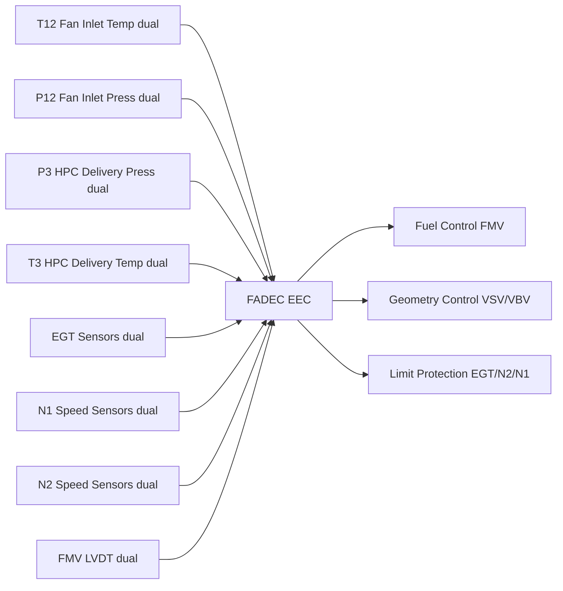
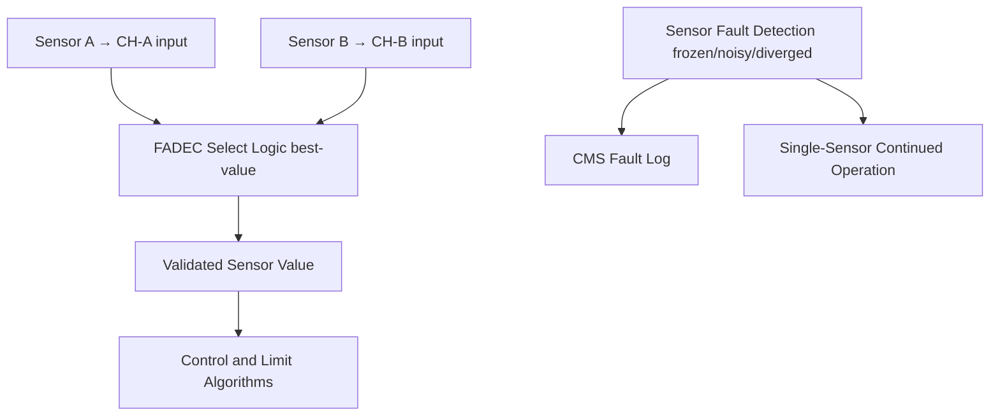

# Engine Control Sensors and Feedback

---

## §0 Hyperlink Policy

> All hyperlinks in this document are **relative** (five directory levels: `../../../../../`).
> Absolute URLs are forbidden.

---
## §1 Purpose

This document defines the agnostic ATLAS standard-level architecture context for `Engine Control Sensors and Feedback`.

It describes the controlled scope, functions, interfaces, safety considerations, lifecycle traceability, and S1000D/CSDB mapping logic that programme implementations shall instantiate when this node is applicable.

This document is not a programme design baseline. Programme-specific capacities, locations, part numbers, effectivity, operating limits, maintenance references, and data module codes shall be defined only inside the applicable programme implementation branch.
## §2 Applicability

| Applicability Level | Rule |
|---|---|
| Standard taxonomy | Applies to the ATLAS node `067` |
| Programme implementation | Conditional; determined by programme architecture, trade studies, certification basis, and applicability model |
| Product configuration | Defined in the programme-specific configuration baseline |
| Effectivity | Defined in the programme CSDB / applicability layer |
| Non-applicability | Must be explicitly stated in the programme impact-study branch when excluded |
## §3 Functional Description ![DRAFT]

Key sensor types and their FADEC usage:

| Sensor | Symbol | Location | Qty | FADEC Use |
|---|---|---|---|---|
| Fan inlet total temperature | T12 | Fan inlet | 2 | Thermal correction for N1 target |
| Fan inlet total pressure | P12 | Fan inlet | 2 | N1 corrected speed calculation |
| HP compressor delivery pressure | P3 | HPC exit | 2 | VSV/VBV schedule; fuel trimming |
| HP compressor delivery temperature | T3 | HPC exit | 2 | Fuel schedule; EGT limit model |
| Combustor inlet pressure | P4 | Combustor | 1 | Surge detection reference |
| EGT (exhaust gas temperature) | EGT | LP turbine exit | 2 | Limit protection; health monitoring |
| N1 fan speed | N1 | Fan shaft | 2 | Primary thrust parameter; limit protection |
| N2 HP speed | N2 | HP shaft | 2 | VSV/VBV schedule; overspeed protection |
| Fuel metering valve position | FMV_LVDT | HMU | 2 | Closed-loop fuel control feedback |
| Oil pressure | Poil | Oil scavenge | 1 | Engine health advisory (not FADEC control) |

All sensors interface to the FADEC EEC via ARINC 429 or hardwired analogue (thermocouples, LVDT). Dual sensors are wired to CH-A and CH-B independently.

---

## §4 Functional Breakdown

| ID | Name | Description | Lead Division |
|---|---|---|---|
| F-001 | Fan inlet sensors T12/P12 | Dual per measurement; FADEC N1 correction | Q-GREENTECH |
| F-002 | HP compressor sensors P3/T3 | Dual; VSV/VBV + fuel trim | Q-MECHANICS |
| F-003 | EGT sensors | Dual thermocouple harness; FADEC limit protection | Q-AIR |
| F-004 | N1/N2 speed sensors | Dual phonic wheel + proximity probe; overspeed protection | Q-MECHANICS |
| F-005 | FMV LVDT | Dual; closed-loop fuel control feedback | Q-INDUSTRY |

---

## §5 System Context — Mermaid Diagram

---

## §6 Internal Architecture — Mermaid Diagram

---

## §7 Components and LRUs

| Sensor | PN | Qty | Location | Interval | Notes |
|---|---|---|---|---|---|
| T12 total temperature probe | T12-PN-TBD | 2/engine | Fan inlet | C-check function test | Dual; CH-A and CH-B wiring |
| P12 total pressure probe | P12-PN-TBD | 2/engine | Fan inlet | C-check function test | Pitot-type |
| P3 pressure transducer | P3-PN-TBD | 2/engine | HPC exit | C-check calibration | High-pressure rated |
| T3 thermocouple | T3-PN-TBD | 2/engine | HPC exit | C-check | Type K or N |
| EGT thermocouple harness | EGT-PN-TBD | 2 harnesses/engine | LP turbine exit | C-check / replace on exceedance | Each harness has multiple junctions averaged |
| N1 phonic wheel sensor | N1-PN-TBD | 2/engine | Fan shaft | C-check gap check | Proximity probe |
| N2 phonic wheel sensor | N2-PN-TBD | 2/engine | HP shaft | C-check gap check | Proximity probe |

---

## §8 Interfaces

| Interface | Connected | Protocol | Data |
|---|---|---|---|
| FADEC EEC | All engine sensors | ARINC 429 / analogue hardwired | All engine control parameters |
| ATA 45 CMS | Sensor BITE faults | AFDX | Sensor fault codes and trends |
| ATA 31 ECAM | Engine display | AFDX (via FADEC) | N1, N2, EGT displayed |
| ATA 34 ADIRU | P0/T0 correction | ARINC 429 | Ambient air data for N1 correction |

---

## §9 Operating Modes

| Mode | Trigger | State | Consequences |
|---|---|---|---|
| Normal dual-sensor | Both sensors healthy | FADEC uses best-select | Full closed-loop accuracy |
| Single-sensor (one failed) | FADEC BITE detects fault | Remaining sensor used | Advisory to CMS; dispatch per MEL |
| Both sensors failed (single point) | Both diverged | FADEC uses modelled estimate | EGT/N2 limits tightened; ECAM alert |
| Sensor freeze | Signal stuck for > 2 frames | FADEC freezes last good value then uses model | Advisory to CMS |

---

## §10 Performance and Budgets ![DRAFT]

| Parameter | Requirement | Value | Status |
|---|---|---|---|
| T12 accuracy | ±1 °C | ±0.8 °C | ![TBD] |
| P3 accuracy | ±0.5 % FS | ±0.3 % FS | ![TBD] |
| EGT accuracy | ±3 °C | ±2 °C | ![TBD] |
| N1/N2 speed accuracy | ±0.2 % | ±0.15 % | ![TBD] |
| FMV LVDT accuracy | ±0.3 % FS | ±0.2 % FS | ![TBD] |

---

## §11 Safety, Redundancy and Fault Tolerance

- All limit-protection sensors (EGT, N1, N2) are dual-redundant; FADEC uses either sensor to protect the limit regardless of the other.
- Single sensor failure → advisory + single sensor operation; no thrust impact.
- Dual EGT failure is an Extremely Improbable event (independent probe locations, independent wiring, independent FADEC channels).

---

## §12 Maintenance and Diagnostics

| Task | Interval | Access | Tools |
|---|---|---|---|
| FADEC sensor BITE download | A-check | CMS terminal | CMS terminal |
| EGT harness continuity check | C-check | LP turbine exhaust zone | Resistance meter |
| N1/N2 probe gap check | C-check | Engine access | Feeler gauge per AMM |
| Pressure transducer calibration | C-check | HPC case | Calibrated reference |

---

## §13 Footprint ![TBD]

| Type | Parameter | Value |
|---|---|---|
| Electrical | Total sensor current (all FADEC inputs) | ![TBD] |
| Maintenance | Sensor harness total replacement time | ![TBD] |
| Data | FADEC sensor frame rate | 50 Hz (20 ms) |

---

## §14 Safety and Certification References ![DRAFT]

| Document | Body | Applicability |
|---|---|---|
| EASA CS-E §150 | EASA | FADEC sensor requirements |
| DO-160G | RTCA | Sensor environmental qualification |
| ATA iSpec 2200 Ch 67 | ATA | Chapter scope |

---

## §15 V&V Approach ![TBD]

| Phase | Method | Criterion | Status |
|---|---|---|---|
| Design | Sensor accuracy budget | All accuracies met per §10 | ![TBD] |
| Integration | Engine cell sensor verification | All parameters correct range and accuracy | ![TBD] |
| Certification | Flight test EGT/N1/N2 accuracy | Within certified limits | ![TBD] |

---

## §16 Glossary

| Term | Definition |
|---|---|
| **T12** | Fan inlet total temperature |
| **P12** | Fan inlet total pressure |
| **P3** | HP compressor delivery pressure |
| **T3** | HP compressor delivery temperature |
| **EGT** | Exhaust Gas Temperature |
| **N1** | Fan speed (%) |
| **N2** | HP compressor speed (%) |
| **Phonic wheel** | Toothed wheel generating pulses for speed measurement |
| **Best-select** | FADEC choosing the more credible of two sensor values |
| **Type K** | Chromel-Alumel thermocouple type, common for engine temperature |

---

## §17 Open Issues

| ID | Description | Owner | Target |
|---|---|---|---|
| OI-067-040-001 | Confirm sensor supplier and accuracy specs with engine OEM | Q-MECHANICS | 2026-Q3 |
| OI-067-040-002 | Define dual-EGT failure mode in FADEC SSA | Q-AIR | 2027-Q1 |

---

## §18 Status Legend

| Badge | Meaning |
|---|---|
| `![DRAFT]` | Section is drafted but not yet reviewed |
| `![TBD]` | Content not yet started — to be defined |
| `![APPROVED]` | Reviewed and formally approved |

---

## §19 Related Documents (Siblings in this Subsection)

- [067-000](./067-000-Engine-Controls-General.md)
- [067-010](./067-010-FADEC-and-Electronic-Engine-Control.md)
- [067-020](./067-020-Throttle-Lever-and-Power-Command-Interfaces.md)
- [067-030](./067-030-Engine-Actuators-and-Servo-Control.md)
- [067-050](./067-050-Engine-Control-Modes-and-Degraded-Operation.md)
- [067-060](./067-060-Engine-Control-Software-and-Configuration.md)
- [067-070](./067-070-Engine-Control-Test-and-Maintenance.md)
- [067-080](./067-080-Engine-Controls-Monitoring-Diagnostics-and-Control-Interfaces.md)
- [067-090](./067-090-S1000D-CSDB-Mapping-and-Traceability.md)

---

## §20 Change Log

| Rev | Date | Author | Description |
|---|---|---|---|
| 0.1 | 2026-05-11 | @copilot | Initial DRAFT — contextualized content per programme-defined aircraft type architecture |
