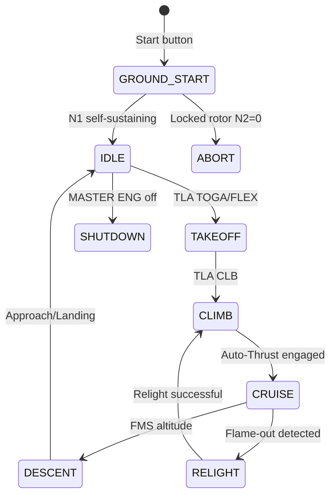
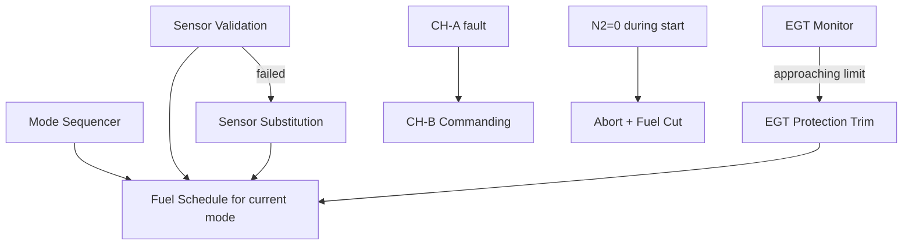

# Engine Control Modes and Degraded Operation

---

## §0 Hyperlink Policy

> All hyperlinks in this document are **relative** (five directory levels: `../../../../../`).
> Absolute URLs are forbidden.

---
## §1 Purpose

This document defines all FADEC operating modes and degraded-operation states on the AMPEL360E eWTW. The FADEC does not have a hydromechanical backup mode — operation is full-authority digital in all states. Degraded modes are handled by the FADEC internally via sensor substitution, reduced-authority schedules, and conservative fuel trimming. Crew actions per ECAM NON-NORMAL procedures are linked to the relevant degraded mode.

---

## §2 Applicability

| Parameter | Value |
|---|---|
| Aircraft Program | AMPEL360E eWTW |
| ATA reference | ATA 67-050 — Engine Control Modes and Degraded Operation |
| Certification basis | EASA CS-E §150 |
| S1000D SNS | 067-050-00 |

---

## §3 Functional Description ![DRAFT]

**Normal modes:**

| Mode | Entry Condition | FADEC State |
|---|---|---|
| Ground Start | Start button pressed; N2 < idle | FADEC arms igniters; opens FMV per start schedule |
| Idle | TLA at idle; engine self-sustaining | FADEC holds minimum fuel flow; all actuators at idle schedule |
| Takeoff | TLA at TOGA/FLEX | FADEC advances to max rated N1; TRT active |
| Climb | TLA at CLB | FADEC tracks CLB N1 with temperature and altitude correction |
| Cruise / Descent | Auto-Thrust engaged | FADEC tracks FMS N1 target |
| In-flight relight | Flame-out detected (EGT drop + N1 decay) | FADEC activates both igniters; FMV to relight schedule |
| Shutdown | MASTER ENG switch off | FADEC closes FMV and disables igniters |

**Degraded modes:**

| Mode | Entry Condition | FADEC Action | Crew Effect |
|---|---|---|---|
| Sensor substitution | One sensor failed | FADEC uses remaining sensor or model estimate | CMS advisory; dispatch per MEL |
| EEC CH-B commanding | CH-A fault | CH-B takes authority (20 ms crossover) | ECAM FADEC FAULT — CH-B advisory |
| Reduced-authority schedule | Multiple sensor failures | FADEC uses conservative fuel trim; max N1 reduced 3 % | ECAM advisory; performance slightly reduced |
| Engine protection mode | EGT approaching limit | FADEC reduces fuel flow to hold EGT ≤ T4.5 limit | ECAM EGT HIGH caution; crew monitors |
| Locked rotor | N2 = 0 detected during start | FADEC aborts start; disarms ignition; closes FMV | ECAM ENGINE START FAULT |

---

## §4 Functional Breakdown

| ID | Name | Description | Lead Division |
|---|---|---|---|
| F-001 | Normal mode sequencer | Start / Idle / TO / CLB / CRZ / Relight / Shutdown | Q-GREENTECH |
| F-002 | CH-A/B crossover logic | Fault detection; bumpless handover | Q-MECHANICS |
| F-003 | Sensor substitution | Reasonableness check; model substitution on fail | Q-AIR |
| F-004 | EGT protection trim | Continuous fuel reduction as EGT approaches limit | Q-MECHANICS |
| F-005 | Locked rotor / abort logic | N2 = 0 during start → abort + fuel cut | Q-INDUSTRY |

---

## §5 System Context — Mermaid Diagram

---

## §6 Internal Architecture — Mermaid Diagram

---

## §7 Components and LRUs

*Degraded operation logic is implemented in FADEC EEC software (DO-178C DAL A). No additional hardware LRUs — see 067-010 for EEC hardware.*

---

## §8 Interfaces

| Interface | System | Protocol | Data |
|---|---|---|---|
| ATA 31 ECAM | Cockpit display | AFDX | Mode status; degraded mode alerts |
| ATA 45 CMS | Maintenance | AFDX | Degraded mode events and freeze-frames |
| ATA 22 FMS | Flight Management | AFDX | N1 target per flight phase |
| ATA 34 ADIRU | Air data | ARINC 429 | Altitude/temperature for mode corrections |

---

## §9 Operating Modes

*(All modes defined in §3 Functional Description above.)*

---

## §10 Performance and Budgets ![DRAFT]

| Parameter | Requirement | Value | Status |
|---|---|---|---|
| Start time (N1 self-sustaining) | ≤ 35 s at sea level ISA | 28 s design | ![TBD] |
| In-flight relight altitude | Up to FL310 | FL310 windmill envelope | ![TBD] |
| EGT protection response time | ≤ 100 ms | 60 ms | ![TBD] |
| Locked-rotor abort time | ≤ 2 s from detection | 1.5 s | ![TBD] |

---

## §11 Safety, Redundancy and Fault Tolerance

- No hydromechanical backup: safety justified by DAL A software + dual-channel hardware.
- EGT protection operates independently in CH-A and CH-B; either channel can execute fuel reduction.
- In-flight relight: both igniters commanded simultaneously; if relight fails within 30 s, FADEC closes FMV and logs unrelight event.

---

## §12 Maintenance and Diagnostics

| Task | Interval | Access | Tools |
|---|---|---|---|
| FADEC mode/degraded event log review | A-check | CMS terminal | CMS terminal |
| Locked-rotor protection test (dry crank inhibit) | C-check | FADEC GSE | FADEC GSE terminal |
| EGT trim function test (simulated approach to limit) | C-check | FADEC GSE | FADEC GSE terminal |

---

## §13 Footprint ![TBD]

*All mode logic is software — no additional mass or electrical footprint beyond EEC.*

---

## §14 Safety and Certification References ![DRAFT]

| Document | Body | Applicability |
|---|---|---|
| EASA CS-E §150 | EASA | Full-authority FADEC mode requirements |
| DO-178C | RTCA | DAL A mode sequencer software |
| SAE ARP4761 | SAE | FHA for degraded modes |
| ATA iSpec 2200 Ch 67 | ATA | Chapter scope |

---

## §15 V&V Approach ![TBD]

| Phase | Method | Criterion | Status |
|---|---|---|---|
| Design | FMEA for all degraded modes | Each degraded mode safe-state confirmed | ![TBD] |
| Integration | Iron bird — fault injection tests | Correct degraded mode entry and ECAM alerts | ![TBD] |
| Certification | EASA CS-E §150 compliance demo | All modes demonstrated in engine test | ![TBD] |

---

## §16 Glossary

| Term | Definition |
|---|---|
| **TRT** | Thrust Rating Trim — FADEC adjustment for engine-to-engine variance |
| **Relight** | Re-ignition after in-flight flame-out |
| **Sensor substitution** | FADEC using a model estimate when a physical sensor fails |
| **Reduced-authority schedule** | Conservative fuel schedule used when multiple sensors degrade |
| **Locked rotor** | Engine rotor cannot turn — FADEC aborts start to prevent damage |
| **Bumpless handover** | CH-A to CH-B transfer with no output spike |
| **FMV** | Fuel Metering Valve |
| **N1** | Fan speed |
| **EGT** | Exhaust Gas Temperature |
| **DAL A** | DO-178C Design Assurance Level A |

---

## §17 Open Issues

| ID | Description | Owner | Target |
|---|---|---|---|
| OI-067-050-001 | Define in-flight relight envelope (altitude vs Mach) with engine OEM | Q-MECHANICS | 2026-Q4 |
| OI-067-050-002 | Validate EGT protection trim authority in FHA for overheat scenario | Q-AIR | 2027-Q1 |

---

## §18 Status Legend

| Badge | Meaning |
|---|---|
| `![DRAFT]` | Section is drafted but not yet reviewed |
| `![TBD]` | Content not yet started — to be defined |
| `![APPROVED]` | Reviewed and formally approved |

---

## §19 Related Documents (Siblings in this Subsection)

- [067-000](./067-000-Engine-Controls-General.md)
- [067-010](./067-010-FADEC-and-Electronic-Engine-Control.md)
- [067-020](./067-020-Throttle-Lever-and-Power-Command-Interfaces.md)
- [067-030](./067-030-Engine-Actuators-and-Servo-Control.md)
- [067-040](./067-040-Engine-Control-Sensors-and-Feedback.md)
- [067-060](./067-060-Engine-Control-Software-and-Configuration.md)
- [067-070](./067-070-Engine-Control-Test-and-Maintenance.md)
- [067-080](./067-080-Engine-Controls-Monitoring-Diagnostics-and-Control-Interfaces.md)
- [067-090](./067-090-S1000D-CSDB-Mapping-and-Traceability.md)

---

## §20 Change Log

| Rev | Date | Author | Description |
|---|---|---|---|
| 0.1 | 2026-05-11 | @copilot | Initial DRAFT — contextualized content per AMPEL360E eWTW architecture |
