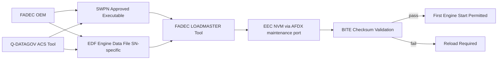
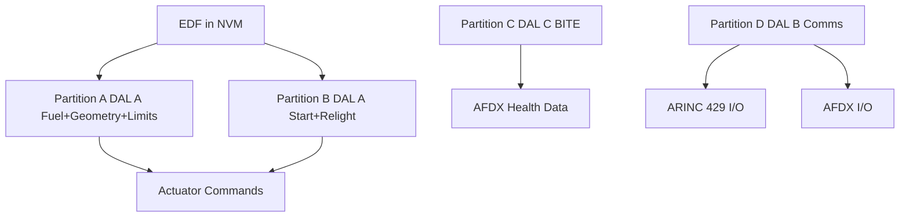

# Engine Control Software and Configuration

---

## §0 Hyperlink Policy

> All hyperlinks in this document are **relative** (five directory levels: `../../../../../`).
> Absolute URLs are forbidden.

---
## §1 Purpose

This document defines the agnostic ATLAS standard-level architecture context for `Engine Control Software and Configuration`.

It describes the controlled scope, functions, interfaces, safety considerations, lifecycle traceability, and S1000D/CSDB mapping logic that programme implementations shall instantiate when this node is applicable.

This document is not a programme design baseline. Programme-specific capacities, locations, part numbers, effectivity, operating limits, maintenance references, and data module codes shall be defined only inside the applicable programme implementation branch.
## §2 Applicability

| Applicability Level | Rule |
|---|---|
| Standard taxonomy | Applies to the ATLAS node `067` |
| Programme implementation | Conditional; determined by programme architecture, trade studies, certification basis, and applicability model |
| Product configuration | Defined in the programme-specific configuration baseline |
| Effectivity | Defined in the programme CSDB / applicability layer |
| Non-applicability | Must be explicitly stated in the programme impact-study branch when excluded |
## §3 Functional Description ![DRAFT]

**Software architecture:**
The EEC software is structured in four partitions following a modified ARINC 653 approach (no hypervisor — bare-metal dual-channel):
- **Partition A (primary):** Fuel control, VSV/VBV schedule, limit protection, sensor validation (DAL A).
- **Partition B (start and relight):** Start sequencing, relight logic, motoring/crank (DAL A).
- **Partition C (BITE and health monitoring):** BITE algorithms, fault logging, AFDX data publishing (DAL C).
- **Partition D (communications):** ARINC 429 and AFDX I/O handling (DAL B).

Partition A and B are identical in CH-A and CH-B boards. Partition C and D run on both boards but output only from the commanding channel.

**EDF (Engine Data File):** Serial-number-specific calibration table covering: N1/N2 performance trim, EGT limit correction, VSV schedule bias, fuel flow transducer correction. EDF is generated by the engine OEM from acceptance test data and is part number controlled. Each EDF is validated by a BITE checksum before the first engine start after loading.

**Configuration management:** Software and EDF loads are tracked in the Q-DATAGOV Aircraft Configuration Status (ACS) tool. Any unintended version change is reported as a configuration deviation and investigated before dispatch.

---

## §4 Functional Breakdown

| ID | Name | Description | Lead Division |
|---|---|---|---|
| F-001 | Partition A (primary control) | DO-178C DAL A; fuel + geometry + limits | Q-GREENTECH |
| F-002 | Partition B (start/relight) | DO-178C DAL A; start and relight sequences | Q-MECHANICS |
| F-003 | Partition C (BITE) | DO-178C DAL C; diagnostics and fault logging | Q-AIR |
| F-004 | Partition D (comms) | DO-178C DAL B; ARINC 429 + AFDX I/O | Q-MECHANICS |
| F-005 | EDF and configuration management | Engine-specific calibration; EASA-approved; ACS tracked | Q-INDUSTRY |

---

## §5 System Context — Mermaid Diagram

---

## §6 Internal Architecture — Mermaid Diagram

---

## §7 Components and LRUs

| Component | PN | Qty | Location | Interval | Notes |
|---|---|---|---|---|---|
| EEC Executable (SWPN) | SWPN-XXXXXX | 1 per EEC | EEC NVM | Per SB | DO-178C DAL A; EASA ETSO approved |
| EDF (Engine Data File) | EDF-SN-XXXXXXX | 1 per engine | EEC NVM | Per OEM trigger (borescope/LLP change) | Unique per engine S/N |
| FADEC LOADMASTER Tool | SW-LOADMASTER | Ground tool | MRO kit | Annual calibration | Laptop + AFDX adaptor; loads SWPN and EDF |
| ACS Configuration Record | Q-DATAGOV ACS | Per aircraft | IT system | Continuous | Tracks current SWPN and EDF PN per engine |

---

## §8 Interfaces

| Interface | System | Protocol | Data |
|---|---|---|---|
| EEC NVM | FADEC hardware | AFDX maintenance port | SWPN and EDF load |
| ACS Tool | Q-DATAGOV IT | Web/API | Config status tracking |
| ATA 45 CMS | CMS | AFDX | SWPN version broadcast; EDF PN in config data |
| EASA Type Certificate | Authority | Document | Approved SWPN and EDF PN list |

---

## §9 Operating Modes

| Mode | Trigger | State | Consequences |
|---|---|---|---|
| Normal | SWPN + EDF valid and matched | Engine runs per schedule | Full authority |
| SWPN mismatch | Wrong SWPN loaded | EEC BITE fails; engine start inhibited | Reload correct SWPN before start |
| EDF mismatch | Wrong EDF for this S/N | EEC BITE warns; start possible with ECAM caution | EDF re-load at next maintenance opportunity |
| Software update (SB) | SB issued | LOADMASTER session | Old SWPN archived; new SWPN loaded |

---

## §10 Performance and Budgets ![DRAFT]

| Parameter | Requirement | Value | Status |
|---|---|---|---|
| SWPN load time | ≤ 30 min | 20 min | ![TBD] |
| EDF checksum validation time | ≤ 2 min | 1 min | ![TBD] |
| DO-178C structural coverage | MC/DC for DAL A | 100 % MC/DC Partition A and B | ![TBD] |
| Config deviation resolution | ≤ 5 working days | Target 3 days | ![TBD] |

---

## §11 Safety, Redundancy and Fault Tolerance

- SWPN is loaded identically to CH-A and CH-B NVM; BITE compares both copies at power-on.
- EDF checksum prevents operation with corrupted calibration data.
- All SWPN and EDF changes are EASA-approved; no field modification permitted.

---

## §12 Maintenance and Diagnostics

| Task | Interval | Access | Tools |
|---|---|---|---|
| SWPN version check | A-check | CMS terminal | CMS terminal (config page) |
| EDF version check | A-check | CMS terminal | CMS terminal |
| SWPN update (per SB) | Per SB issue | FADEC LOADMASTER | LOADMASTER laptop + AFDX cable |
| EDF update (post-borescope) | Per OEM trigger | FADEC LOADMASTER | LOADMASTER laptop + AFDX cable |

---

## §13 Footprint ![TBD]

| Type | Parameter | Value |
|---|---|---|
| Data | SWPN size | ![TBD] |
| Data | EDF size | ![TBD] |
| Maintenance | SWPN load time | ~20 min |
| Maintenance | EDF load time | ~10 min |

---

## §14 Safety and Certification References ![DRAFT]

| Document | Body | Applicability |
|---|---|---|
| DO-178C | RTCA | DAL A software lifecycle |
| DO-254 | RTCA | Complex hardware DAL A |
| EASA CS-E §150 | EASA | FADEC software approval |
| EASA Part 21 | EASA | Approved SWPN and EDF control |

---

## §15 V&V Approach ![TBD]

| Phase | Method | Criterion | Status |
|---|---|---|---|
| Design | DO-178C PSAC, SDP, SVP | All DAL A plans approved by EASA | ![TBD] |
| Integration | Software integration test on EEC | All 4 partitions coexist without interference | ![TBD] |
| Certification | EASA DO-178C compliance review | Final SOI-4 passed | ![TBD] |

---

## §16 Glossary

| Term | Definition |
|---|---|
| **SWPN** | Software Part Number — identifies the approved executable binary |
| **EDF** | Engine Data File — per-S/N calibration table |
| **PSAC** | Plan for Software Aspects of Certification |
| **MC/DC** | Modified Condition/Decision Coverage — DO-178C DAL A coverage criterion |
| **SOI** | Stage of Involvement — EASA review milestone |
| **ACS** | Aircraft Configuration Status tool |
| **LOADMASTER** | FADEC software load tool |
| **NVM** | Non-Volatile Memory |
| **DAL** | Design Assurance Level |
| **Structural coverage** | Test coverage metric for DO-178C |

---

## §17 Open Issues

| ID | Description | Owner | Target |
|---|---|---|---|
| OI-067-060-001 | Agree FADEC OEM SWPN update SB process and ACS integration | Q-DATAGOV | 2026-Q4 |
| OI-067-060-002 | Define EDF update trigger criteria (borescope findings threshold) with engine OEM | Q-MECHANICS | 2026-Q3 |

---

## §18 Status Legend

| Badge | Meaning |
|---|---|
| `![DRAFT]` | Section is drafted but not yet reviewed |
| `![TBD]` | Content not yet started — to be defined |
| `![APPROVED]` | Reviewed and formally approved |

---

## §19 Related Documents (Siblings in this Subsection)

- [067-000](./067-000-Engine-Controls-General.md)
- [067-010](./067-010-FADEC-and-Electronic-Engine-Control.md)
- [067-020](./067-020-Throttle-Lever-and-Power-Command-Interfaces.md)
- [067-030](./067-030-Engine-Actuators-and-Servo-Control.md)
- [067-040](./067-040-Engine-Control-Sensors-and-Feedback.md)
- [067-050](./067-050-Engine-Control-Modes-and-Degraded-Operation.md)
- [067-070](./067-070-Engine-Control-Test-and-Maintenance.md)
- [067-080](./067-080-Engine-Controls-Monitoring-Diagnostics-and-Control-Interfaces.md)
- [067-090](./067-090-S1000D-CSDB-Mapping-and-Traceability.md)

---

## §20 Change Log

| Rev | Date | Author | Description |
|---|---|---|---|
| 0.1 | 2026-05-11 | @copilot | Initial DRAFT — contextualized content per programme-defined aircraft type architecture |
