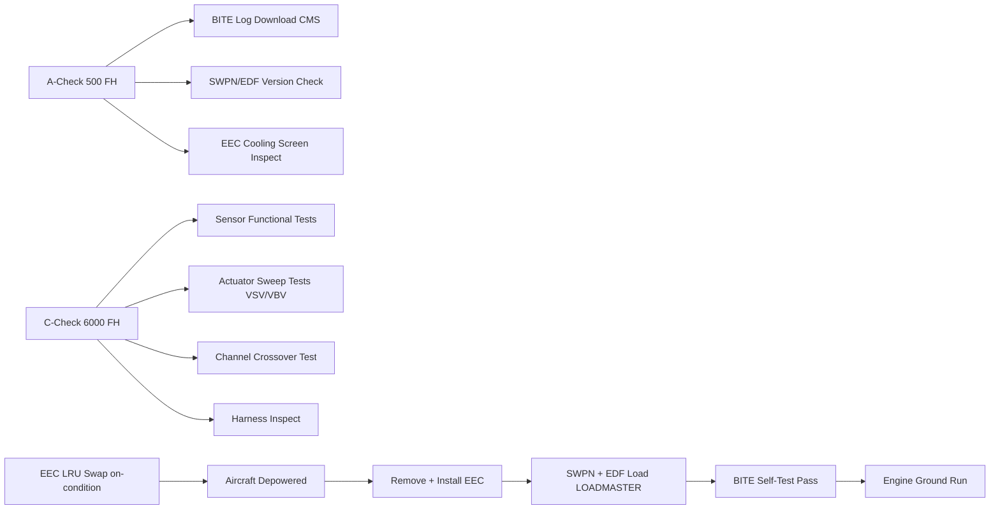
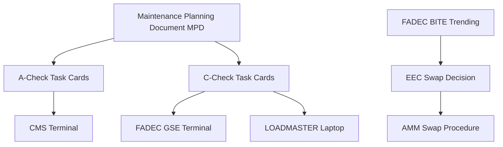

# Engine Control Test and Maintenance

---

## §0 Hyperlink Policy

> All hyperlinks in this document are **relative** (five directory levels: `../../../../../`).
> Absolute URLs are forbidden.

---
## §1 Purpose

This document defines the agnostic ATLAS standard-level architecture context for `Engine Control Test and Maintenance`.

It describes the controlled scope, functions, interfaces, safety considerations, lifecycle traceability, and S1000D/CSDB mapping logic that programme implementations shall instantiate when this node is applicable.

This document is not a programme design baseline. Programme-specific capacities, locations, part numbers, effectivity, operating limits, maintenance references, and data module codes shall be defined only inside the applicable programme implementation branch.
## §2 Applicability

| Applicability Level | Rule |
|---|---|
| Standard taxonomy | Applies to the ATLAS node `067` |
| Programme implementation | Conditional; determined by programme architecture, trade studies, certification basis, and applicability model |
| Product configuration | Defined in the programme-specific configuration baseline |
| Effectivity | Defined in the programme CSDB / applicability layer |
| Non-applicability | Must be explicitly stated in the programme impact-study branch when excluded |
## §3 Functional Description ![DRAFT]

**A-Check tasks (~500 FH):**
- FADEC BITE log download (CMS terminal / ACARS) — 5 min
- SWPN and EDF version check (CMS config page) — 5 min
- EEC cooling inlet screen inspect/clean — 10 min

**C-Check tasks (~6 000 FH):**
- EEC harness visual inspection and continuity check
- All sensor functional checks (T12, P12, P3, T3, EGT, N1, N2) via FADEC GSE
- VSV and VBV actuator sweep test (FADEC GSE command)
- ASBV and ignition enable test (cross-reference ATA 65 and ATA 66)
- TLA RVDT dual-sensor check (FADEC GSE)
- FADEC channel crossover test (demand BITE — CH-A fault injection)
- HP-ACC valve position check

**EEC LRU replacement:**
- HVDC/28 V DC isolation (aircraft depowered)
- Remove 4 bolts, disconnect harness
- Install new EEC; reconnect harness; torque bolts per AMM
- SWPN and EDF load via LOADMASTER (~30 min)
- BITE power-on self-test pass before engine start

---

## §4 Functional Breakdown

| ID | Name | Description | Lead Division |
|---|---|---|---|
| F-001 | A-check FADEC tasks | BITE log, SWPN/EDF check, screen inspect | Q-GREENTECH |
| F-002 | C-check FADEC tasks | Full sensor and actuator test suite | Q-MECHANICS |
| F-003 | EEC LRU replacement | Depowered swap + SWPN/EDF load + BITE | Q-MECHANICS |
| F-004 | FADEC GSE command interface | Ground test commands for sensor/actuator testing | Q-AIR |
| F-005 | Post-maintenance engine ground run | Verify all parameters in range before revenue service | Q-INDUSTRY |

---

## §5 System Context — Mermaid Diagram

---

## §6 Internal Architecture — Mermaid Diagram

---

## §7 Components and LRUs

| Component | PN | Qty | Location | Interval | Notes |
|---|---|---|---|---|---|
| EEC (complete LRU) | EEC-LRU-PN-TBD | 2 | Fan case | On condition | ~2 h swap; no cal required; SWPN+EDF needed |
| FADEC GSE Terminal | GSE-FADEC | Ground tool | MRO/line kit | Annual calibration | Portable; AFDX adaptor; FADEC commands |
| LOADMASTER Software | SW-LOADMASTER | Ground tool | MRO laptop | Version per SB | SWPN and EDF load tool |
| EEC Cooling Inlet Screen | SCREEN-EEC-PN-TBD | 2 | Fan case | A-check inspect | Clean or replace |
| EEC Harness Connector | CONN-EEC-PN-TBD | 2 | Fan case breakout | C-check visual | Fire-rated; hermetically sealed |

---

## §8 Interfaces

| Interface | System | Protocol | Data |
|---|---|---|---|
| ATA 45 CMS | Central Maintenance | AFDX | BITE log download |
| FADEC GSE | Ground test tool | AFDX maintenance port | Sensor and actuator test commands |
| LOADMASTER | Software load | AFDX maintenance port | SWPN and EDF load |
| ATA 24 HVDC | Electrical isolation | Physical LOTO | Required before EEC removal |

---

## §9 Operating Modes

| Mode | Trigger | State | Consequences |
|---|---|---|---|
| Normal in-service | Revenue operation | FADEC background BITE active | Alerts if limits exceeded |
| A-check maintenance | 500 FH | Aircraft grounded 30 min EEC tasks | BITE log and version checks |
| C-check maintenance | 6 000 FH | Aircraft grounded 4 h EEC tasks | Full test suite + harness |
| EEC LRU swap | BITE fault or OC decision | Aircraft depowered 2 h | Swap + load + BITE + ground run |
| SWPN update | SB issued | Aircraft grounded 1 h | LOADMASTER + BITE + CMS config update |

---

## §10 Performance and Budgets ![DRAFT]

| Parameter | Requirement | Value | Status |
|---|---|---|---|
| EEC swap time | ≤ 3 h | ~2 h | ![TBD] |
| A-check EEC task time | ≤ 30 min | 20 min | ![TBD] |
| C-check EEC task time | ≤ 5 h | 4 h | ![TBD] |
| Post-swap ground run time | ≤ 1 h | 45 min | ![TBD] |

---

## §11 Safety, Redundancy and Fault Tolerance

- LOTO required before EEC removal: 28 V DC and HVDC bus isolation; residual energy dissipates within 2 min.
- BITE self-test after SWPN load confirms load integrity before any engine run.
- Engine ground run after EEC swap confirms all sensor parameters within expected range before revenue service.

---

## §12 Maintenance and Diagnostics

| Task | Interval | Access | Tools |
|---|---|---|---|
| FADEC BITE log download | A-check | CMS terminal or ACARS | CMS terminal |
| SWPN/EDF version check | A-check | CMS config page | CMS terminal |
| EEC cooling screen inspect | A-check | Fan case external | Mirror and brush |
| FADEC full sensor/actuator test | C-check | FADEC GSE | FADEC GSE terminal |
| EEC LRU swap | On condition | Fan case; LOTO required | FADEC GSE; LOADMASTER; torque set |

---

## §13 Footprint ![TBD]

| Type | Parameter | Value |
|---|---|---|
| Maintenance | A-check EEC man-hours | ~0.33 h/aircraft |
| Maintenance | C-check EEC man-hours | ~4 h/engine |
| Maintenance | EEC swap man-hours | ~2 h/engine |
| Electrical | LOTO isolation time | 2 min min after depower |

---

## §14 Safety and Certification References ![DRAFT]

| Document | Body | Applicability |
|---|---|---|
| EASA CS-25 §25.1529 | EASA | ICA requirement for FADEC AMM |
| EASA CS-E §150 | EASA | FADEC maintenance requirements |
| DO-178C | RTCA | SWPN load and verification |
| IEC 60900 | IEC | HVDC LOTO safety |
| ATA iSpec 2200 Ch 67 | ATA | AMM chapter scope |

---

## §15 V&V Approach ![TBD]

| Phase | Method | Criterion | Status |
|---|---|---|---|
| Design | Maintainability analysis | EEC swap ≤ 3 h; no special tools beyond kit | ![TBD] |
| Integration | First-article maintenance demo | All C-check tasks per AMM in target time | ![TBD] |
| Certification | CS-25 §25.1529 ICA review | AMM approved by EASA | ![TBD] |

---

## §16 Glossary

| Term | Definition |
|---|---|
| **MPD** | Maintenance Planning Document |
| **LOTO** | Lock-Out Tag-Out — electrical isolation safety procedure |
| **LOADMASTER** | FADEC software load tool |
| **GSE** | Ground Support Equipment |
| **OC** | On-Condition maintenance |
| **SWPN** | Software Part Number |
| **EDF** | Engine Data File |
| **BITE** | Built-In Test Equipment |
| **SB** | Service Bulletin |
| **CMS** | Central Maintenance System (ATA 45) |

---

## §17 Open Issues

| ID | Description | Owner | Target |
|---|---|---|---|
| OI-067-070-001 | Finalise MPD task intervals with FADEC OEM and CAMO | Q-MECHANICS | 2026-Q4 |
| OI-067-070-002 | Define FADEC GSE availability at line maintenance stations | Q-INDUSTRY | 2026-Q3 |

---

## §18 Status Legend

| Badge | Meaning |
|---|---|
| `![DRAFT]` | Section is drafted but not yet reviewed |
| `![TBD]` | Content not yet started — to be defined |
| `![APPROVED]` | Reviewed and formally approved |

---

## §19 Related Documents (Siblings in this Subsection)

- [067-000](./067-000-Engine-Controls-General.md)
- [067-010](./067-010-FADEC-and-Electronic-Engine-Control.md)
- [067-020](./067-020-Throttle-Lever-and-Power-Command-Interfaces.md)
- [067-030](./067-030-Engine-Actuators-and-Servo-Control.md)
- [067-040](./067-040-Engine-Control-Sensors-and-Feedback.md)
- [067-050](./067-050-Engine-Control-Modes-and-Degraded-Operation.md)
- [067-060](./067-060-Engine-Control-Software-and-Configuration.md)
- [067-080](./067-080-Engine-Controls-Monitoring-Diagnostics-and-Control-Interfaces.md)
- [067-090](./067-090-S1000D-CSDB-Mapping-and-Traceability.md)

---

## §20 Change Log

| Rev | Date | Author | Description |
|---|---|---|---|
| 0.1 | 2026-05-11 | @copilot | Initial DRAFT — contextualized content per programme-defined aircraft type architecture |
