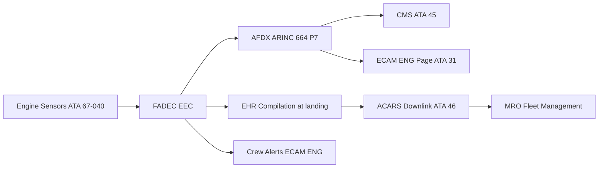
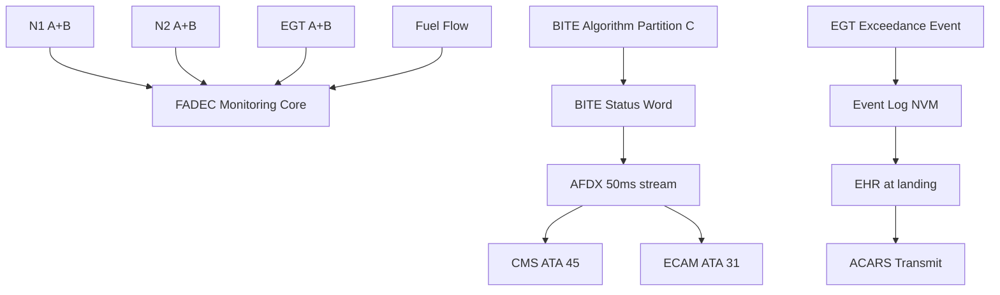

# Engine Controls Monitoring, Diagnostics and Control Interfaces

---

## §0 Hyperlink Policy

> All hyperlinks in this document are **relative** (five directory levels: `../../../../../`).
> Absolute URLs are forbidden.

---
## §1 Purpose

This document defines the agnostic ATLAS standard-level architecture context for `Engine Controls Monitoring, Diagnostics and Control Interfaces`.

It describes the controlled scope, functions, interfaces, safety considerations, lifecycle traceability, and S1000D/CSDB mapping logic that programme implementations shall instantiate when this node is applicable.

This document is not a programme design baseline. Programme-specific capacities, locations, part numbers, effectivity, operating limits, maintenance references, and data module codes shall be defined only inside the applicable programme implementation branch.
## §2 Applicability

| Applicability Level | Rule |
|---|---|
| Standard taxonomy | Applies to the ATLAS node `067` |
| Programme implementation | Conditional; determined by programme architecture, trade studies, certification basis, and applicability model |
| Product configuration | Defined in the programme-specific configuration baseline |
| Effectivity | Defined in the programme CSDB / applicability layer |
| Non-applicability | Must be explicitly stated in the programme impact-study branch when excluded |
## §3 Functional Description ![DRAFT]

**Parameters transmitted by FADEC to CMS (AFDX, 50 ms base rate):**

| Parameter | Symbol | Rate | CMS Use |
|---|---|---|---|
| Fan speed | N1_A, N1_B | 50 ms | Thrust confirmation; trend |
| HP compressor speed | N2_A, N2_B | 50 ms | VSV schedule monitoring |
| Exhaust gas temperature | EGT_A, EGT_B | 50 ms | Limit monitoring; trend |
| Fuel flow | FF_A, FF_B | 50 ms | Fuel consumption accounting |
| Active channel | CH_CMD | 50 ms | CH-A or CH-B commanding |
| BITE status word | BITE_WORD | 50 ms | Fault classification |
| EGT exceedance flag | EGT_EXC | Event | Crew notification; maintenance action |
| N1/N2 overspeed flag | OVSPD_FLAG | Event | Engine protection log |
| SWPN / EDF PN | CFG_WORD | 1 Hz | Configuration management |

**BITE classification:** FADEC BITE classifies faults as GO (no restriction), MEL (dispatch with restriction), NO-GO (engine non-operational), and ADVISORY (maintenance required). BITE coverage ≥ 92 % of FMEA failure modes (DAL A requirement).

**ACARS downlink:** At each landing, FADEC compiles an Engine Health Report (EHR) including: max EGT, max N1, N2 at max EGT, exceedance flags, active channel, and BITE fault count. EHR is downlinked via ACARS for MRO fleet management.

**ECAM ENG page:** N1, N2, EGT, FF displayed per engine on primary ECAM ENG page. Limit exceedances trigger amber/red boxed values. Maintenance page shows FADEC BITE summary.

---

## §4 Functional Breakdown

| ID | Name | Description | Lead Division |
|---|---|---|---|
| F-001 | FADEC BITE (DAL A partition C) | Continuous fault detection; ≥ 92 % coverage | Q-GREENTECH |
| F-002 | AFDX parameter stream | 50 ms FADEC → CMS; 15+ parameters | Q-MECHANICS |
| F-003 | ECAM ENG page | N1/N2/EGT/FF display; exceedance boxing | Q-AIR |
| F-004 | EHR ACARS downlink | Per-landing health report; MRO fleet management | Q-MECHANICS |
| F-005 | Config word (SWPN/EDF PN) | 1 Hz broadcast to CMS for config tracking | Q-INDUSTRY |

---

## §5 System Context — Mermaid Diagram

---

## §6 Internal Architecture — Mermaid Diagram

---

## §7 Components and LRUs

| Component | PN | Qty | Location | Interval | Notes |
|---|---|---|---|---|---|
| FADEC EEC (monitoring embedded) | EEC-LRU-PN-TBD | 2 | Fan case | On condition | BITE + monitoring in EEC Partition C |
| AFDX End-System (EEC) | AFDX-EEC-PN-TBD | 2 | Inside EEC | With EEC | ARINC 664 P7 connectivity |
| ECAM ENG Display Module | SW-ECAM-ENG | — | ECAM processing | Per SB | N1/N2/EGT/FF page; FADEC BITE summary |
| EHR Compiler (FADEC SW) | Partition C NVM | — | EEC NVM | Per SB | EHR compiled per flight; ACARS triggerable |

---

## §8 Interfaces

| Interface | System | Protocol | Data |
|---|---|---|---|
| ATA 45 CMS | Central Maintenance | AFDX | 15+ FADEC parameters; BITE faults; config word |
| ATA 31 ECAM | Cockpit display | AFDX | N1/N2/EGT/FF; exceedance indications |
| ATA 46 ACARS | Aircraft comms | ACARS RF/SATCOM | EHR per landing |
| ATA 22 FMS | Flight Management | AFDX | Auto-Thrust feedback; N1 margin |
| FADEC GSE | Ground tool | AFDX maint port | BITE demand test; parameter readout |

---

## §9 Operating Modes

| Mode | Trigger | State | Consequences |
|---|---|---|---|
| Normal monitoring | Engine running | FADEC Partition C active | All parameters logged; 50 ms AFDX |
| Exceedance detected | EGT or N1/N2 beyond limit | Event flag set; EHR flagged | ECAM alert; maintenance inspection required |
| ACARS EHR download | Weight-on-wheels off → on | EHR compiled and transmitted | MRO receives health report per flight |
| Demand BITE test | FADEC GSE command | Full BITE sequence < 5 min | All fault codes tested; results on GSE |
| Config mismatch | Wrong SWPN/EDF PN detected | CMS config alert | Maintenance investigates before next flight |

---

## §10 Performance and Budgets ![DRAFT]

| Parameter | Requirement | Value | Status |
|---|---|---|---|
| BITE coverage | ≥ 90 % (DAL A) | ≥ 92 % | ![TBD] |
| AFDX parameter rate | 50 ms | 50 ms | ![TBD] |
| EHR size per flight | ≤ 2 kB | < 1 kB | ![TBD] |
| Exceedance detection latency | ≤ 100 ms | 60 ms | ![TBD] |
| Demand BITE duration | ≤ 10 min | < 5 min | ![TBD] |

---

## §11 Safety, Redundancy and Fault Tolerance

- EGT exceedance flag persists in NVM through power-off; cannot be cleared without maintenance action and CMS acknowledgement.
- AFDX failure between EEC and CMS does not affect engine control (monitoring loss only); ECAM advisory.
- Config word mismatch detected before each flight via CMS pre-flight check; crew cannot depart without resolution.

---

## §12 Maintenance and Diagnostics

| Task | Interval | Access | Tools |
|---|---|---|---|
| BITE log download | A-check | CMS terminal | CMS terminal |
| EHR review (fleet trending) | Weekly (MRO) | ACARS server / fleet system | Fleet management tool |
| Demand BITE test | C-check | FADEC GSE | FADEC GSE terminal |
| Exceedance inspection | On event | FADEC BITE download + borescope | CMS terminal + borescope kit |

---

## §13 Footprint ![TBD]

| Type | Parameter | Value |
|---|---|---|
| Data | AFDX bandwidth (FADEC to CMS) | ![TBD] |
| Data | EHR size per flight | < 1 kB |
| Maintenance | BITE log size (NVM) | 500 events |
| Data | ACARS EHR frequency | Per landing |

---

## §14 Safety and Certification References ![DRAFT]

| Document | Body | Applicability |
|---|---|---|
| DO-178C | RTCA | BITE Partition C DAL C |
| ARINC 664 P7 | ARINC | FADEC to CMS AFDX |
| EASA CS-E §150 | EASA | FADEC monitoring requirements |
| ATA iSpec 2200 Ch 45/67 | ATA | CMS and ATA 67 integration |
| SAE ARP4761 | SAE | BITE classification methodology |

---

## §15 V&V Approach ![TBD]

| Phase | Method | Criterion | Status |
|---|---|---|---|
| Design | BITE fault model analysis | Coverage ≥ 90 % of FMEA modes | ![TBD] |
| Integration | HIL + CMS test | All 15+ parameters at 50 ms | ![TBD] |
| Certification | Flight test ECAM validation | N1/N2/EGT correct in all phases | ![TBD] |

---

## §16 Glossary

| Term | Definition |
|---|---|
| **EHR** | Engine Health Report — per-flight summary compiled by FADEC |
| **BITE** | Built-In Test Equipment |
| **AFDX** | Avionics Full-Duplex Switched Ethernet (ARINC 664 P7) |
| **CMS** | Central Maintenance System (ATA 45) |
| **ECAM** | Electronic Centralised Aircraft Monitor |
| **ACARS** | Aircraft Communications Addressing and Reporting System |
| **Config word** | FADEC broadcast of current SWPN and EDF part numbers |
| **Exceedance flag** | Persistent NVM flag set when EGT or N1/N2 exceeds limit |
| **Demand BITE** | BITE sequence initiated by ground command (FADEC GSE) |
| **Fleet trending** | MRO analysis of EHR data across multiple aircraft |

---

## §17 Open Issues

| ID | Description | Owner | Target |
|---|---|---|---|
| OI-067-080-001 | Finalise AFDX bus load allocation for FADEC parameter stream vs ECS and other systems | Q-MECHANICS | 2026-Q4 |
| OI-067-080-002 | Define EHR format and ACARS protocol with MRO fleet management system | Q-INDUSTRY | 2026-Q3 |

---

## §18 Status Legend

| Badge | Meaning |
|---|---|
| `![DRAFT]` | Section is drafted but not yet reviewed |
| `![TBD]` | Content not yet started — to be defined |
| `![APPROVED]` | Reviewed and formally approved |

---

## §19 Related Documents (Siblings in this Subsection)

- [067-000](./067-000-Engine-Controls-General.md)
- [067-010](./067-010-FADEC-and-Electronic-Engine-Control.md)
- [067-020](./067-020-Throttle-Lever-and-Power-Command-Interfaces.md)
- [067-030](./067-030-Engine-Actuators-and-Servo-Control.md)
- [067-040](./067-040-Engine-Control-Sensors-and-Feedback.md)
- [067-050](./067-050-Engine-Control-Modes-and-Degraded-Operation.md)
- [067-060](./067-060-Engine-Control-Software-and-Configuration.md)
- [067-070](./067-070-Engine-Control-Test-and-Maintenance.md)
- [067-090](./067-090-S1000D-CSDB-Mapping-and-Traceability.md)

---

## §20 Change Log

| Rev | Date | Author | Description |
|---|---|---|---|
| 0.1 | 2026-05-11 | @copilot | Initial DRAFT — contextualized content per programme-defined aircraft type architecture |
