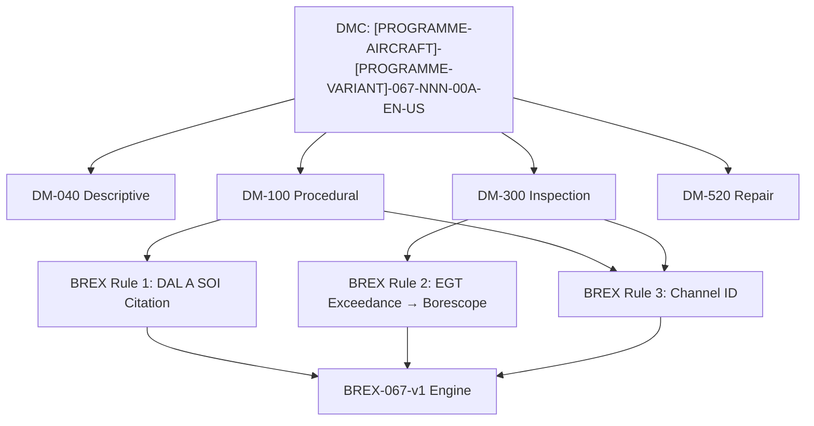

# S1000D / CSDB Mapping and Traceability


---

## §0 Hyperlink Policy

> All hyperlinks in this document are **relative** (five directory levels: `../../../../../`).
> Absolute URLs are forbidden.

---
## §1 Purpose

This document defines the agnostic ATLAS standard-level architecture context for `S1000D / CSDB Mapping and Traceability`.

It describes the controlled scope, functions, interfaces, safety considerations, lifecycle traceability, and S1000D/CSDB mapping logic that programme implementations shall instantiate when this node is applicable.

This document is not a programme design baseline. Programme-specific capacities, locations, part numbers, effectivity, operating limits, maintenance references, and data module codes shall be defined only inside the applicable programme implementation branch.

## §2 Applicability

| Applicability Level | Rule |
|---|---|
| Standard taxonomy | Applies to the ATLAS node `067` |
| Programme implementation | Conditional; determined by programme architecture, trade studies, certification basis, and applicability model |
| Product configuration | Defined in the programme-specific configuration baseline |
| Effectivity | Defined in the programme CSDB / applicability layer |
| Non-applicability | Must be explicitly stated in the programme impact-study branch when excluded |

## §3 Functional Description ![DRAFT]

**BREX [PROGRAMME-AIRCRAFT]-BREX-067-v1 enforces three constraints:**

1. **DAL A software citation rule:** All procedural DMs (DM-100) that involve FADEC software actions (SWPN load, EDF load, BITE test) must cite the applicable DO-178C stage of involvement (SOI) reference. This prevents maintenance DMs from being issued without traceability to the approved software lifecycle.

2. **EGT exceedance inspection trigger rule:** All DMs for post-exceedance inspection must include a mandatory borescope task referencing ATA 72 (engine borescope) before the engine is returned to service. This ensures no exceedance is cleared without visual inspection.

3. **Dual-channel identification rule:** All DMs referencing FADEC commands or BITE procedures must identify which EEC channel (CH-A or CH-B) is the active commanding channel for the procedure context. This prevents channel confusion during single-channel maintenance.

---

## §4 Functional Breakdown

| ID | Name | Description | Lead Division |
|---|---|---|---|
| F-001 | DMRL management ATA 67 | 32 DMs tracked; Q-DATAGOV managed | Q-DATAGOV |
| F-002 | BREX-067-v1 validation | Three constraints checked at CSDB ingestion | Q-DATAGOV |
| F-003 | ICN registry ATA 67 | EEC figures, VSV diagrams, FADEC architecture schematics | Q-DATAGOV |
| F-004 | DM-040 system description | EEC, FADEC, TLA, sensors, actuators | Q-MECHANICS |
| F-005 | DM-300 inspection/check | Sensor tests, actuator sweeps, BITE, EEC swap | Q-AIR |

---

## §5 System Context — Mermaid Diagram

```mermaid
flowchart LR
    ATLAS_067[ATLAS ATA 67 Subsubjects 000-090] --> DMRL_67[DMRL 32 DMs]
    DMRL_67 --> CSDB[[PROGRAMME-AIRCRAFT] CSDB]
    CSDB --> BREX_67[BREX-067-v1 Validation]
    BREX_67 --> DM_OK[DM Approved for Publication]
    DM_OK --> IETP[IETP / AMM Publication]
    BREX_67 -- "rule violation" --> DM_REJECT[DM Rejected for Rework]
```

---

## §6 Internal Architecture — Mermaid Diagram



---

## §7 Components and LRUs

| Component | PN | Qty | Location | Interval | Notes |
|---|---|---|---|---|---|
| S1000D Issue 5.0 | S1000D.org | CSDB | IT | Per S1000D issue update | XML DM authoring standard |
| BREX-067-v1 | Programme doc | CSDB validator | IT | Per programme revision | Three ATA 67 domain rules |
| DMRL — 32 DMs | Q-DATAGOV tracker | PMO | PMO tool | Monthly | All 32 DMs status tracked |
| ICN registry ATA 67 | Q-DATAGOV DB | CSDB | IT | Continuous | All engine control illustrations traced |
| EGT Exceedance Log (cross-ref ATA 72) | FADEC NVM / CMS | Per aircraft | CMS | Per event | Links BREX Rule 2 to borescope task DM |

---

## §8 Interfaces

| Interface | System | Protocol | Data |
|---|---|---|---|
| ATA 45 CMS | Maintenance system | AFDX | BITE fault codes cross-ref to DM-300 task codes |
| ATA 72 Engine (borescope) | Engine inspection | Document cross-reference | BREX Rule 2: EGT exceedance → ATA 72 borescope DM |
| S1000D CSDB | DataBase | XML/HTTP | DM storage, validation, publication |
| IETP | Technical publication | HTML5/XML | Technician access |
| EASA Type Certificate | Authority | Document | Approved SWPN and EDF PN — BREX Rule 1 reference |

---

## §9 Operating Modes

| Mode | Trigger | State | Consequences |
|---|---|---|---|
| DMRL baseline | PDR milestone | 32 DM codes allocated | Q-DATAGOV issues DMRL-067-v0 |
| DM authoring | Programme schedule | Authors create DMs | BREX-067-v1 checked at ingestion |
| BREX violation | Any of 3 rules triggered | DM rejected | Author corrects; re-submit |
| CSDB milestone review | Per programme gate | All DMs reviewed | Q-DATAGOV reports completion % |
| IETP publication | Certification | All DMs approved | IETP to airlines |

---

## §10 Performance and Budgets ![DRAFT]

| Parameter | Requirement | Value | Status |
|---|---|---|---|
| DMRL completeness at CDR | ≥ 80 % in DRAFT | 90 % target | ![TBD] |
| BREX pass rate | 100 % at final | 100 % | ![TBD] |
| ICN coverage | 100 % | 100 % | ![TBD] |
| DM review cycle | ≤ 10 days | 7 days | ![TBD] |

---

## §11 Safety, Redundancy and Fault Tolerance

- BREX Rule 2 (EGT exceedance → borescope) is safety-relevant: prevents return to service after potential hot-section damage without inspection.
- BREX Rule 1 (DAL A SOI citation) ensures maintenance procedures reference the approved DO-178C lifecycle — no unauthorised software actions.
- Version control in CSDB ensures only approved DMs are published.

---

## §12 Maintenance and Diagnostics

| Task | Interval | Access | Tools |
|---|---|---|---|
| DMRL status review | Monthly | Q-DATAGOV PMO | PMO tracker |
| BREX validation on all 32 DMs | Each CSDB milestone | CSDB BREX engine | CSDB tool |
| SWPN/EDF approved PN verification | Per SB | Q-DATAGOV doc control | TC holder document |
| ICN registry audit | Annually | Q-DATAGOV DB | ICN tool |

---

## §13 Footprint ![TBD]

| Type | Parameter | Value |
|---|---|---|
| Data | Total DMs ATA 67 | 32 DMs |
| Data | DM types | 040/100/300/520 |
| Maintenance | DMRL review man-hours | ~2 h/month |
| Data | BREX rules count | 3 rules |

---

## §14 Safety and Certification References ![DRAFT]

| Document | Body | Applicability |
|---|---|---|
| S1000D Issue 5.0 | S1000D.org | DM authoring |
| ATA iSpec 2200 Ch 67 | ATA | SNS reference |
| EASA CS-25 §25.1529 | EASA | ICA driving DM content |
| [PROGRAMME-AIRCRAFT] GP-CSDB-001 | Q-DATAGOV | CSDB governance |
| DO-178C | RTCA | BREX Rule 1 SOI reference |

---

## §15 V&V Approach ![TBD]

| Phase | Method | Criterion | Status |
|---|---|---|---|
| Design | DMRL review at PDR | All 32 codes allocated | ![TBD] |
| Integration | BREX validation at CDR | Zero violations | ![TBD] |
| Qualification | Full CSDB review | All 32 DMs REVIEW or APPROVED | ![TBD] |
| Certification | EASA ICA review | AMM/CMM approved | ![TBD] |

---

## §16 Glossary

| Term | Definition |
|---|---|
| **DMC** | Data Module Code |
| **DMRL** | Data Module Requirement List |
| **BREX** | Business Rules eXchange |
| **ICN** | Illustration Control Number |
| **CSDB** | Common Source DataBase |
| **IETP** | Interactive Electronic Technical Publication |
| **SOI** | Stage of Involvement (DO-178C EASA review) |
| **EGT exceedance** | Engine temperature limit exceeded — triggers mandatory inspection |
| **DM-040/100/300/520** | S1000D DM type codes |
| **TC** | Type Certificate |

---

## §17 Open Issues

| ID | Description | Owner | Target |
|---|---|---|---|
| OI-067-090-001 | Confirm ATA 72 borescope DM linkage for BREX Rule 2 with ATA 72 CSDB team | Q-DATAGOV | 2026-Q4 |
| OI-067-090-002 | Agree BREX-067-v1 rule wording with FADEC OEM technical publications | Q-DATAGOV | 2026-Q3 |

---

## §18 Status Legend

| Badge | Meaning |
|---|---|
| `![DRAFT]` | Section is drafted but not yet reviewed |
| `![TBD]` | Content not yet started — to be defined |
| `![APPROVED]` | Reviewed and formally approved |

---

## §19 Related Documents (Siblings in this Subsection)

- [067-000](./067-000-Engine-Controls-General.md)
- [067-010](./067-010-FADEC-and-Electronic-Engine-Control.md)
- [067-020](./067-020-Throttle-Lever-and-Power-Command-Interfaces.md)
- [067-030](./067-030-Engine-Actuators-and-Servo-Control.md)
- [067-040](./067-040-Engine-Control-Sensors-and-Feedback.md)
- [067-050](./067-050-Engine-Control-Modes-and-Degraded-Operation.md)
- [067-060](./067-060-Engine-Control-Software-and-Configuration.md)
- [067-070](./067-070-Engine-Control-Test-and-Maintenance.md)
- [067-080](./067-080-Engine-Controls-Monitoring-Diagnostics-and-Control-Interfaces.md)

---

## §20 Change Log

| Rev | Date | Author | Description |
|---|---|---|---|
| 0.1 | 2026-05-11 | @copilot | Initial DRAFT — contextualized content per programme-defined aircraft type architecture |
