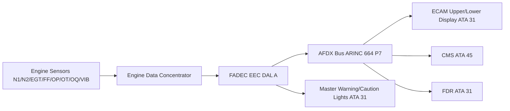
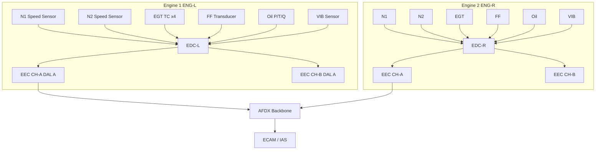

<!-- ──────────────────────────────────────────────────────────────────────────
     QATL-ATLAS-1000-ATLAS-060-069-068-000-ENGINE-INDICATING-GENERAL
     ATA 68 · Engine Indicating General
     programme-defined aircraft type — ATLAS Register 1000
────────────────────────────────────────────────────────────────────────────── -->

# Engine Indicating General

---

## §0 Hyperlink Policy

> All hyperlinks in this document are **relative** (five directory levels: `../../../../../`).
> Absolute URLs are forbidden. Every linked document must exist in the Q+ATLANTIDE repository
> before the link is activated. Broken links are treated as open issues and must be resolved
> before the document is promoted from `DRAFT` to `APPROVED`.

---

## §1 Purpose

This document defines the agnostic ATLAS standard-level architecture context for `Engine Indicating General`.

It describes the controlled scope, functions, interfaces, safety considerations, lifecycle traceability, and S1000D/CSDB mapping logic that programme implementations shall instantiate when this node is applicable.

This document is not a programme design baseline. Programme-specific capacities, locations, part numbers, effectivity, operating limits, maintenance references, and data module codes shall be defined only inside the applicable programme implementation branch.
## §2 Applicability

| Applicability Level | Rule |
|---|---|
| Standard taxonomy | Applies to the ATLAS node `068` |
| Programme implementation | Conditional; determined by programme architecture, trade studies, certification basis, and applicability model |
| Product configuration | Defined in the programme-specific configuration baseline |
| Effectivity | Defined in the programme CSDB / applicability layer |
| Non-applicability | Must be explicitly stated in the programme impact-study branch when excluded |
## §3 Functional Description ![DRAFT]

The ATA 68 Engine Indicating System (EIS) on the programme-defined aircraft type acquires, processes, and displays the following primary engine parameters for each of the two CFM LEAP-1A-derived turbofan engines:

- **N1** — Low-pressure spool speed (% RPM)
- **N2** — High-pressure spool speed (% RPM)
- **EGT** — Exhaust Gas Temperature (°C)
- **FF** — Fuel Flow (kg/h)
- **OP** — Oil Pressure (bar)
- **OT** — Oil Temperature (°C)
- **OQ** — Oil Quantity (%)
- **VIB** — Engine Vibration broadband (mm/s)
- **EPR/TLA** — Engine Pressure Ratio or Thrust Lever Angle command position

Data is acquired at the Engine Data Concentrator (EDC), processed by the dual-channel FADEC EEC (Electronic Engine Controller), and transmitted to the Integrated Avionics System (IAS) over AFDX. ECAM engine synoptic page (upper ECAM display) shows primary parameters in a compact format; lower ECAM shows secondary parameters on demand. All exceedances are latched in non-volatile memory within FADEC and downloadable via the Central Maintenance System (ATA 45) Ground Station.

---

## §4 Functional Breakdown

| ID | Name | Description | Lead Division |
|---|---|---|---|
| F-001 | Primary Parameter Indication | N1, N2, EGT, FF displayed on upper ECAM | Q-GREENTECH |
| F-002 | Secondary Parameter Indication | OP, OT, OQ, VIB on lower ECAM synoptic | Q-MECHANICS |
| F-003 | Engine Warning & Caution | ECAM alert messages, master warning/caution lights | Q-AIR |
| F-004 | Engine Data Concentrator (EDC) | Sensor aggregation; data conversion to AFDX | Q-MECHANICS |
| F-005 | Engine Health Monitoring (EHM) | Trend analysis, exceedance logs, predictive maintenance data | Q-INDUSTRY |

---

## §5 System Context — Mermaid Diagram

---

## §6 Internal Architecture — Mermaid Diagram

---

## §7 Components and LRUs

| Component | Part Number | Qty | Location | Maintenance Interval | Notes |
|---|---|---|---|---|---|
| Engine Data Concentrator (EDC) | EDC-PN-TBD | 2 (1/engine) | Engine pylon forward zone | On condition; BITE at every power-up | Ruggedised; DO-160G Cat F vibration |
| N1 Speed Sensor | N1-PN-TBD | 2 (1/engine) | Fan frame | 25 000 FH / on condition | Phonic wheel + magnetic pickup |
| N2 Speed Sensor | N2-PN-TBD | 2 (1/engine) | HPC case | 25 000 FH / on condition | Redundant dual-element |
| EGT Thermocouple Harness | EGT-PN-TBD | 8 (4/engine) | Turbine exhaust frame | 6 000 FH inspection | K-type TC x4 averaged by FADEC |
| Engine Vibration Sensor | VIB-PN-TBD | 4 (2/engine) | Fan frame + LPT frame | 12 000 FH / on condition | Broadband accelerometer |

---

## §8 Interfaces

| Interface Type | Connected System | Protocol / Medium | Data / Function |
|---|---|---|---|
| ATA 31 ECAM/IAS | Integrated Avionics System | AFDX ARINC 664 P7 | Engine parameter display, alert annunciation |
| ATA 45 CMS | Central Maintenance System | AFDX | BITE faults, exceedance logs, trend data download |
| ATA 73 FADEC | Full Authority Digital Engine Control | FADEC internal bus + AFDX | Raw parameter source; EIS is downstream consumer |
| ATA 31 FDR | Flight Data Recorder | AFDX | Engine parameters archived at ≥ 1 Hz per CS-25 |
| Cockpit MWS | Master Warning System | Discrete + AFDX | ECAM alert triggers, master caution/warning lights |

---

## §9 Operating Modes

| Mode | Trigger | System State | Actions / Consequences |
|---|---|---|---|
| Normal indication | Both engines running, IAS healthy | All primary/secondary parameters displayed | ECAM upper shows N1/N2/EGT/FF; lower shows oil/VIB |
| Exceedance latch | Parameter exceeds limit for > 1 s | FADEC latches event in NVM | ECAM amber/red message; CMS log entry created |
| Degraded indication | One AFDX path failed | IAS switches to redundant AFDX path | Amber advisory; no data loss expected |
| Ground maintenance | Aircraft on ground, CMS connected | FADEC test mode enabled | Full BITE cycle; sensor calibration check possible |
| Engine-out | One engine shutdown | Live parameters frozen at last valid value | ECAM ENGINE FAIL alert; INOP flag on affected engine page |

---

## §10 Performance and Budgets ![DRAFT]

| Parameter | Requirement | Target / Design Value | Status |
|---|---|---|---|
| N1/N2 display update rate | ≥ 4 Hz | 8 Hz | ![TBD] |
| EGT display accuracy | ±5 °C | ±3 °C | ![TBD] |
| Exceedance latch time | ≤ 1 s from onset | < 500 ms | ![TBD] |
| BITE fault detection coverage | ≥ 95 % | ≥ 97 % target | ![TBD] |
| Data latency (sensor → ECAM) | ≤ 500 ms | ≤ 300 ms | ![TBD] |

---

## §11 Safety, Redundancy and Fault Tolerance

- Dual AFDX paths (VL-A and VL-B) ensure no single network failure causes loss of engine indication.
- FADEC dual-channel (CH-A / CH-B) architecture means indicating data survives single-channel failure.
- Loss of all engine indication on both engines simultaneously is classified as a Hazardous condition under CS-25 §25.1305; mitigated by FADEC dual-channel plus independent standby analogue N1 indicator.
- Exceedance recording is non-volatile (NVM in FADEC); retained through power interruption for maintenance download.

---

## §12 Maintenance and Diagnostics

| Task | Interval | Access | Special Tools |
|---|---|---|---|
| BITE download and review (FADEC) | A-check | CMS terminal or ACARS | CMS ground station |
| EGT thermocouple harness inspection | 6 000 FH | Engine cowl access | TC continuity tester |
| Vibration sensor check and calibration | 12 000 FH | Fan cowl access | Calibration shaker |
| EDC LRU replacement | On condition | Pylon forward zone | ESD kit; FADEC pin-out tool |

---

## §13 Footprint — Physical, Electrical, Maintenance, Data ![TBD]

| Footprint Type | Parameter | Value | Notes |
|---|---|---|---|
| Physical | EDC mass (each) | ![TBD] | Ruggedised aluminium housing |
| Electrical | EDC power draw | ![TBD] | Low-voltage from FADEC power supply |
| Maintenance | EDC access category | Pylon forward zone — line maintenance | Per AMM |
| Data | AFDX bandwidth (EIS to IAS) | ![TBD] | Per AFDX bus load analysis |

---

## §14 Safety and Certification References ![DRAFT]

| Standard / Document | Title | Issuing Body | Applicability |
|---|---|---|---|
| EASA CS-25 §25.1305 | Powerplant instruments | EASA | Required engine indicating parameters |
| EASA CS-25 §25.1321 | Arrangement and visibility | EASA | Instrument layout and readability |
| DO-178C | Software Considerations in Airborne Systems | RTCA | FADEC EEC software DAL A |
| DO-160G | Environmental Conditions and Test Procedures | RTCA | EDC and sensor environmental qualification |
| ATA iSpec 2200 | Chapter 68 — Engine Indicating | ATA | ATA chapter scope definition |

---

## §15 V&V Approach ![TBD]

| Phase | Method | Acceptance Criterion | Status |
|---|---|---|---|
| Design | Analysis and simulation | All required parameters per CS-25 §25.1305 captured | ![TBD] |
| Integration | Ground functional test | ECAM displays correct values; BITE all-pass | ![TBD] |
| Qualification | DO-160G environmental test | EDC and sensors pass temperature, vibration, EMI | ![TBD] |
| Certification | CS-25 §25.1305 compliance demo | Flight test with parameter recording at required accuracy | ![TBD] |

---

## §16 Glossary

| Term | Definition |
|---|---|
| **EIS** | Engine Indicating System — integrated system for engine parameter acquisition, processing, and display. |
| **EDC** | Engine Data Concentrator — LRU aggregating sensor signals and converting to AFDX data packets. |
| **EGT** | Exhaust Gas Temperature — key engine health and performance indicator; directly limits TET. |
| **N1** | Low-pressure spool speed (fan speed) expressed as % of rated RPM. |
| **N2** | High-pressure spool speed expressed as % of rated RPM. |
| **FF** | Fuel Flow — instantaneous fuel consumption rate in kg/h. |
| **VIB** | Engine vibration broadband level in mm/s; key indicator of imbalance or bearing wear. |
| **ECAM** | Electronic Centralised Aircraft Monitor — primary crew interface for system monitoring and alert display. |
| **Exceedance** | A parameter exceedance event recorded in FADEC NVM when a monitored limit is exceeded for a defined duration. |
| **NVM** | Non-Volatile Memory — retained through power interruptions; stores FADEC BITE and exceedance data. |

---

## §17 Open Issues

| ID | Description | Owner | Target |
|---|---|---|---|
| OI-068-000-001 | Confirm final AFDX VL allocation for EDC → IAS data path | Q-MECHANICS | 2026-Q4 |
| OI-068-000-002 | Finalise standby analogue N1 indicator requirement (CS-25 §25.1305) | Q-AIR / safety | 2027-Q1 |

---

## §18 Status Legend

| Badge | Meaning |
|---|---|
| `![DRAFT]` | Section is drafted but not yet reviewed |
| `![TBD]` | Content not yet started — to be defined |
| `![To Be Completed]` | Partially complete — needs additional content |
| `![APPROVED]` | Reviewed and formally approved |

---

## §19 Related Documents (Siblings in this Subsection)

- [068-010](./068-010-Engine-Parameter-Indication.md)
- [068-020](./068-020-Engine-Warning-and-Caution-Indication.md)
- [068-030](./068-030-Engine-Sensors-and-Transducers.md)
- [068-040](./068-040-Engine-Data-Concentrators-and-Acquisition.md)
- [068-050](./068-050-Engine-Health-and-Trend-Monitoring.md)
- [068-060](./068-060-Engine-Display-and-Crew-Interface.md)
- [068-070](./068-070-Engine-Indicating-Test-and-Maintenance.md)
- [068-080](./068-080-Engine-Indicating-Monitoring-Diagnostics-and-Control-Interfaces.md)
- [068-090](./068-090-S1000D-CSDB-Mapping-and-Traceability.md)

---

## §20 Change Log

| Rev | Date | Author | Description |
|---|---|---|---|
| 0.1 | 2026-05-11 | @copilot | Initial DRAFT — contextualized content per programme-defined aircraft type architecture |
