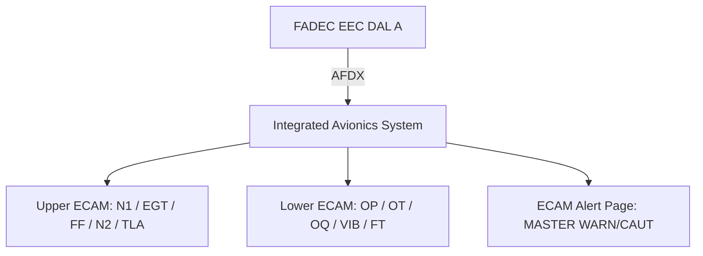

# Engine Parameter Indication

---

## §1 Purpose

Defines the set of primary and secondary engine parameters displayed to the flight crew on the AMPEL360E eWTW ECAM. Primary parameters (N1, EGT, FF, N2) are displayed on the upper ECAM engine page at all times during flight; secondary parameters (oil, vibration, fuel temperature) are displayed on the lower ECAM synoptic.

---

## §2 Applicability

| Parameter | Value |
|---|---|
| Aircraft Program | AMPEL360E eWTW |
| ATA reference | ATA 68-010 |
| S1000D SNS | 068-010-00 |

---

## §3 Primary Engine Parameters ![DRAFT]

| Parameter | Symbol | Range | Unit | Display Location | Update Rate |
|---|---|---|---|---|---|
| Fan Speed | N1 | 0–110 % | % RPM | Upper ECAM — analogue arc + digital | 8 Hz |
| Core Speed | N2 | 0–110 % | % RPM | Upper ECAM — digital only | 8 Hz |
| Exhaust Gas Temperature | EGT | 0–1 200 | °C | Upper ECAM — analogue arc + digital | 4 Hz |
| Fuel Flow | FF | 0–10 000 | kg/h | Upper ECAM — digital | 4 Hz |
| Thrust Lever Angle | TLA | 0–90 | ° | Upper ECAM — position reference bar | 8 Hz |

---

## §4 Secondary Engine Parameters ![DRAFT]

| Parameter | Symbol | Range | Unit | Display Location |
|---|---|---|---|---|
| Oil Pressure | OP | 0–10 | bar | Lower ECAM engine synoptic |
| Oil Temperature | OT | 0–200 | °C | Lower ECAM engine synoptic |
| Oil Quantity | OQ | 0–100 | % | Lower ECAM engine synoptic |
| Engine Vibration (fan) | VIB-N1 | 0–10 | mm/s | Lower ECAM engine synoptic |
| Engine Vibration (core) | VIB-N2 | 0–10 | mm/s | Lower ECAM engine synoptic |
| Fuel Temperature | FT | −60 to +80 | °C | Lower ECAM synoptic (advisory) |

---

## §5 ECAM Display Architecture — Mermaid Diagram

---

## §6 Limit Values and Colour Coding

| Parameter | Normal | Caution (Amber) | Warning (Red) |
|---|---|---|---|
| N1 | 0–100 % | 100–105 % | > 105 % |
| N2 | 0–100 % | 100–105 % | > 105 % |
| EGT (climb) | < 900 °C | 900–960 °C | > 960 °C |
| EGT (start) | < 635 °C | 635–700 °C | > 700 °C |
| Oil Pressure | 1.5–8 bar | 1.0–1.5 / 8–9 bar | < 1.0 / > 9 bar |
| VIB | < 3 mm/s | 3–6 mm/s | > 6 mm/s |

---

## §7 Interfaces

| Interface | Connected System | Data |
|---|---|---|
| FADEC (ATA 73) | Engine data source | All primary/secondary parameters |
| ECAM / IAS (ATA 31) | Display consumer | Formatted engine data for crew |
| CMS (ATA 45) | Maintenance | Exceedance records and BITE |

---

## §8 Open Issues

| ID | Description | Owner | Target |
|---|---|---|---|
| OI-068-010-001 | Confirm colour break-points with EASA CS-25 §25.1305 compliance review | Q-AIR | 2026-Q4 |

---

## §9 Change Log

| Rev | Date | Author | Description |
|---|---|---|---|
| 0.1 | 2026-05-11 | @copilot | Initial DRAFT — AMPEL360E eWTW contextualization |
