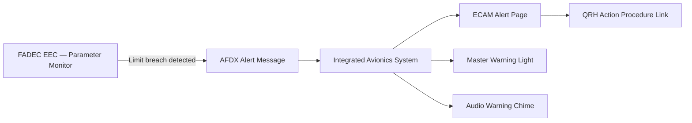

# Engine Warning and Caution Indication

---

## §1 Purpose

This document defines the agnostic ATLAS standard-level architecture context for `Engine Warning and Caution Indication`.

It describes the controlled scope, functions, interfaces, safety considerations, lifecycle traceability, and S1000D/CSDB mapping logic that programme implementations shall instantiate when this node is applicable.

This document is not a programme design baseline. Programme-specific capacities, locations, part numbers, effectivity, operating limits, maintenance references, and data module codes shall be defined only inside the applicable programme implementation branch.
## §2 Applicability

| Applicability Level | Rule |
|---|---|
| Standard taxonomy | Applies to the ATLAS node `068` |
| Programme implementation | Conditional; determined by programme architecture, trade studies, certification basis, and applicability model |
| Product configuration | Defined in the programme-specific configuration baseline |
| Effectivity | Defined in the programme CSDB / applicability layer |
| Non-applicability | Must be explicitly stated in the programme impact-study branch when excluded |
## §3 Alert Classification ![DRAFT]

| Level | Colour | Audio | Crew Action |
|---|---|---|---|
| Warning (L3) | Red | Continuous chime | Immediate action per QRH |
| Caution (L2) | Amber | Single chime | Timely action per QRH |
| Advisory (L1) | Amber (advisory colour) | No audio | Monitor; log for maintenance |

---

## §4 Engine ECAM Alert Catalogue (Primary) ![DRAFT]

| ECAM Message | Trigger | Level | Crew Action |
|---|---|---|---|
| ENG 1 (2) EGT OVERLIMIT | EGT > 960 °C for > 1 s | Warning | FADEC auto-derate; QRH engine overlimit procedure |
| ENG 1 (2) OIL LO PR | Oil pressure < 1.0 bar | Warning | Monitor RPM reduction; if confirmed: engine shutdown |
| ENG 1 (2) VIB HI | VIB > 6 mm/s | Warning | Reduce thrust; QRH vibration procedure |
| ENG 1 (2) N1 OVERLIMIT | N1 > 105 % | Warning | FADEC protection; QRH overlimit procedure |
| ENG 1 (2) FAIL | FADEC detects engine flame-out | Warning | Engine restart or shutdown per QRH |
| ENG 1 (2) OIL LO QTY | OQ < 20 % | Caution | Monitor; land at nearest suitable airport |
| ENG 1 (2) EGT HI | EGT 900–960 °C sustained | Caution | Monitor; FADEC derate advisory |
| ENG 1 (2) FADEC FAULT | FADEC CH-A or CH-B fail | Caution | Confirm thrust available; QRH FADEC fault procedure |

---

## §5 Alert Generation Flow — Mermaid Diagram

---

## §6 Interfaces

| Interface | Connected System | Data |
|---|---|---|
| FADEC (ATA 73) | Alert source | Limit breach flags |
| ECAM / IAS (ATA 31) | Alert display | Level/colour/audio outputs |
| MWS (ATA 31) | Crew attention | Master warning/caution light activation |
| CMS (ATA 45) | Maintenance log | Alert event timestamps |

---

## §7 Open Issues

| ID | Description | Owner | Target |
|---|---|---|---|
| OI-068-020-001 | Finalise full ECAM alert catalogue (50+ engine messages) | Q-AIR / safety | 2027-Q1 |

---

## §8 Change Log

| Rev | Date | Author | Description |
|---|---|---|---|
| 0.1 | 2026-05-11 | @copilot | Initial DRAFT — programme-defined aircraft type contextualization |
