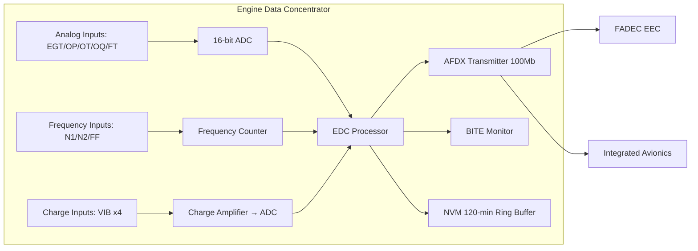

# Engine Data Concentrators and Acquisition

---

## §1 Purpose

This document defines the agnostic ATLAS standard-level architecture context for `Engine Data Concentrators and Acquisition`.

It describes the controlled scope, functions, interfaces, safety considerations, lifecycle traceability, and S1000D/CSDB mapping logic that programme implementations shall instantiate when this node is applicable.

This document is not a programme design baseline. Programme-specific capacities, locations, part numbers, effectivity, operating limits, maintenance references, and data module codes shall be defined only inside the applicable programme implementation branch.
## §2 Applicability

| Applicability Level | Rule |
|---|---|
| Standard taxonomy | Applies to the ATLAS node `068` |
| Programme implementation | Conditional; determined by programme architecture, trade studies, certification basis, and applicability model |
| Product configuration | Defined in the programme-specific configuration baseline |
| Effectivity | Defined in the programme CSDB / applicability layer |
| Non-applicability | Must be explicitly stated in the programme impact-study branch when excluded |
## §3 EDC Architecture ![DRAFT]

The EDC is a single-LRU unit per engine, mounted on the pylon forward zone (fireproof zone boundary). It accepts analogue and frequency inputs from all engine sensors and converts them to an AFDX ARINC 664 Part 7 data stream at 100 Mbit/s.

**Key EDC Functions:**
- Signal conditioning (filtering, amplification) for thermocouple, RTD, frequency, and current-loop inputs
- 16-bit analogue-to-digital conversion at ≥ 100 samples/second per channel
- AFDX Virtual Link (VL) formatting and transmission
- Built-In Test (BITE) — sensor open-circuit and out-of-range detection
- NVM storage of last-flight parameter snapshot (ring buffer, 120 minutes)

---

## §4 EDC Interface Connectivity — Mermaid Diagram

---

## §5 EDC Specifications ![TBD]

| Specification | Requirement | Value | Status |
|---|---|---|---|
| Analogue input channels | ≥ 8 | 12 | ![TBD] |
| Frequency input channels | ≥ 3 | 3 | ![TBD] |
| ADC resolution | ≥ 14 bit | 16 bit | ![TBD] |
| AFDX VL count | ≥ 4 | 6 | ![TBD] |
| NVM retention | ≥ 30 min | 120 min | ![TBD] |
| Operating temperature | −55 °C to +85 °C | Per DO-160G Cat U | ![TBD] |

---

## §6 Interfaces

| Interface | Connected System | Data |
|---|---|---|
| Engine sensors (ATA 68-030) | All sensor types | Analogue/frequency/charge signals |
| FADEC EEC (ATA 73) | Engine controller | AFDX sensor data stream |
| IAS / ECAM (ATA 31) | Display system | AFDX engine parameter Virtual Links |
| CMS (ATA 45) | Maintenance | BITE faults; NVM snapshot download |

---

## §7 Open Issues

| ID | Description | Owner | Target |
|---|---|---|---|
| OI-068-040-001 | Confirm EDC AFDX VL allocation with AFDX network designer | Q-MECHANICS | 2026-Q4 |

---

## §8 Change Log

| Rev | Date | Author | Description |
|---|---|---|---|
| 0.1 | 2026-05-11 | @copilot | Initial DRAFT — programme-defined aircraft type contextualization |
