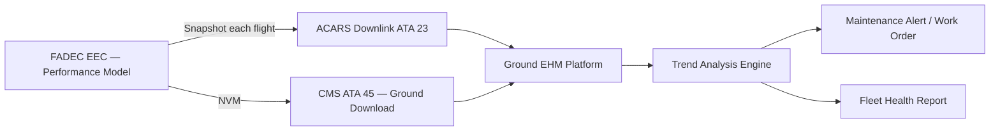

# Engine Health and Trend Monitoring

---

## §1 Purpose

Specifies the Engine Health Monitoring (EHM) and trend analysis capability for the AMPEL360E eWTW. EHM provides predictive maintenance data by tracking long-term parameter trends, detecting performance deterioration, and alerting ground maintenance teams before in-flight anomalies develop.

---

## §2 Applicability

| Parameter | Value |
|---|---|
| Aircraft Program | AMPEL360E eWTW |
| ATA reference | ATA 68-050 |
| S1000D SNS | 068-050-00 |

---

## §3 EHM Monitored Parameters ![DRAFT]

| Parameter | Trend Metric | Alert Threshold | Action |
|---|---|---|---|
| EGT margin (EGTM) | EGTM reduction vs baseline | −10 °C from baseline | Workshop inspection advisory |
| N1 shaft vibration trend | Rolling 50-flight average | > 4 mm/s average | Vibration survey due |
| Oil consumption rate | OQ change per flight hour | > 0.2 L/FH | Oil system inspection |
| Compressor efficiency index | FADEC performance model | > 2 % efficiency loss | Borescope inspection |
| HPT blade tip clearance (indirect) | EGT vs N2 correlation | Deviation > 5 °C at same N2 | HPT inspection |

---

## §4 EHM Data Flow — Mermaid Diagram

---

## §5 FADEC Performance Model

The FADEC EEC incorporates a gas-path analysis performance model (installed as part of FADEC SW, DO-178C DAL B). At each cruise stabilisation snapshot (N1 stable ± 0.5 % for > 5 minutes), the model computes:
- Corrected fan speed (N1C) and corrected core speed (N2C)
- Corrected fuel flow (FFC)
- EGT margin (EGTM = EGT_redline − EGT_observed)
- TSFC (Thrust-Specific Fuel Consumption) index

These values are transmitted via AFDX to the CMS and optionally via ACARS to the ground EHM platform.

---

## §6 Integration with Ground Maintenance Systems

EHM data is compatible with industry-standard engine health monitoring platforms (e.g., CFM TEAM+, GE Predix, or operator proprietary system). Data format follows ATA MSG-3 and SPEC2000 Chapter 11 standards.

---

## §7 Interfaces

| Interface | Connected System | Data |
|---|---|---|
| FADEC (ATA 73) | Performance model compute | Raw and corrected parameters |
| CMS (ATA 45) | Ground maintenance | NVM health snapshot download |
| ACARS (ATA 23) | Airborne comms | In-flight trend data downlink |
| Ground EHM platform | Airline/OEM MRO | Fleet trend analysis |

---

## §8 Open Issues

| ID | Description | Owner | Target |
|---|---|---|---|
| OI-068-050-001 | Select and contract ground EHM platform vendor | Q-INDUSTRY | 2027-Q2 |

---

## §9 Change Log

| Rev | Date | Author | Description |
|---|---|---|---|
| 0.1 | 2026-05-11 | @copilot | Initial DRAFT — AMPEL360E eWTW contextualization |
