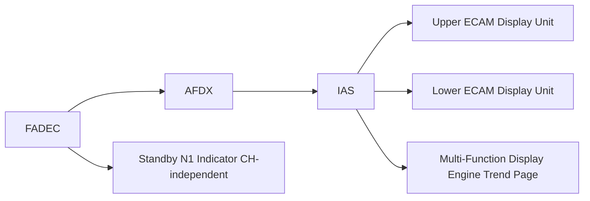

# Engine Display and Crew Interface

---

## §1 Purpose

This document defines the agnostic ATLAS standard-level architecture context for `Engine Display and Crew Interface`.

It describes the controlled scope, functions, interfaces, safety considerations, lifecycle traceability, and S1000D/CSDB mapping logic that programme implementations shall instantiate when this node is applicable.

This document is not a programme design baseline. Programme-specific capacities, locations, part numbers, effectivity, operating limits, maintenance references, and data module codes shall be defined only inside the applicable programme implementation branch.
## §2 Applicability

| Applicability Level | Rule |
|---|---|
| Standard taxonomy | Applies to the ATLAS node `068` |
| Programme implementation | Conditional; determined by programme architecture, trade studies, certification basis, and applicability model |
| Product configuration | Defined in the programme-specific configuration baseline |
| Effectivity | Defined in the programme CSDB / applicability layer |
| Non-applicability | Must be explicitly stated in the programme impact-study branch when excluded |
## §3 ECAM Engine Page Layout ![DRAFT]

**Upper ECAM (always displayed in flight):**
- Left engine column: N1 arc, EGT arc, digital FF, N2 digital, TLA position bar
- Right engine column: mirror layout
- Colour state: green (normal), amber (caution), red (warning)
- Max EGT line: fixed red arc boundary

**Lower ECAM (engine synoptic — displayed on demand or on engine alert):**
- Oil pressure gauges (both engines)
- Oil temperature
- Oil quantity
- Vibration trend bar (N1/N2)
- Fuel temperature advisory

---

## §4 Standby Engine Indication

Per CS-25 §25.1305, a standby independent N1 indicator is provided for each engine. The standby indicator is:
- Direct-driven from FADEC backup power (independent of AFDX IAS)
- Located on the centre instrument panel, below the main ECAM
- Colour LCD, 50 mm diameter, sunlight-readable

---

## §5 Display System Interface — Mermaid Diagram

---

## §6 Interfaces

| Interface | Connected System | Data |
|---|---|---|
| IAS / ECAM (ATA 31) | Primary display | Engine parameter Virtual Links |
| FADEC (ATA 73) | Standby N1 source | Independent N1 backup channel |
| MFD (ATA 31) | EHM trend display | Performance trend pages |

---

## §7 Open Issues

| ID | Description | Owner | Target |
|---|---|---|---|
| OI-068-060-001 | Complete CS-25 §25.1321 legibility analysis (luminance, contrast) | Q-AIR | 2026-Q4 |

---

## §8 Change Log

| Rev | Date | Author | Description |
|---|---|---|---|
| 0.1 | 2026-05-11 | @copilot | Initial DRAFT — programme-defined aircraft type contextualization |
