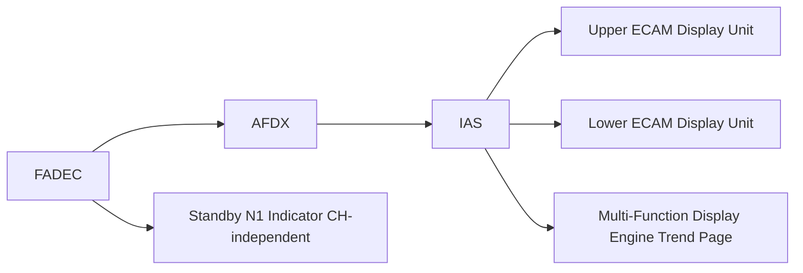

# Engine Display and Crew Interface

---

## §1 Purpose

Defines the crew interface to engine indicating on the AMPEL360E eWTW, including ECAM page layout, display logic, control panel interface, and standby instrument provisions per CS-25 §25.1305 and §25.1321.

---

## §2 Applicability

| Parameter | Value |
|---|---|
| Aircraft Program | AMPEL360E eWTW |
| ATA reference | ATA 68-060 |
| S1000D SNS | 068-060-00 |

---

## §3 ECAM Engine Page Layout ![DRAFT]

**Upper ECAM (always displayed in flight):**
- Left engine column: N1 arc, EGT arc, digital FF, N2 digital, TLA position bar
- Right engine column: mirror layout
- Colour state: green (normal), amber (caution), red (warning)
- Max EGT line: fixed red arc boundary

**Lower ECAM (engine synoptic — displayed on demand or on engine alert):**
- Oil pressure gauges (both engines)
- Oil temperature
- Oil quantity
- Vibration trend bar (N1/N2)
- Fuel temperature advisory

---

## §4 Standby Engine Indication

Per CS-25 §25.1305, a standby independent N1 indicator is provided for each engine. The standby indicator is:
- Direct-driven from FADEC backup power (independent of AFDX IAS)
- Located on the centre instrument panel, below the main ECAM
- Colour LCD, 50 mm diameter, sunlight-readable

---

## §5 Display System Interface — Mermaid Diagram

---

## §6 Interfaces

| Interface | Connected System | Data |
|---|---|---|
| IAS / ECAM (ATA 31) | Primary display | Engine parameter Virtual Links |
| FADEC (ATA 73) | Standby N1 source | Independent N1 backup channel |
| MFD (ATA 31) | EHM trend display | Performance trend pages |

---

## §7 Open Issues

| ID | Description | Owner | Target |
|---|---|---|---|
| OI-068-060-001 | Complete CS-25 §25.1321 legibility analysis (luminance, contrast) | Q-AIR | 2026-Q4 |

---

## §8 Change Log

| Rev | Date | Author | Description |
|---|---|---|---|
| 0.1 | 2026-05-11 | @copilot | Initial DRAFT — AMPEL360E eWTW contextualization |
