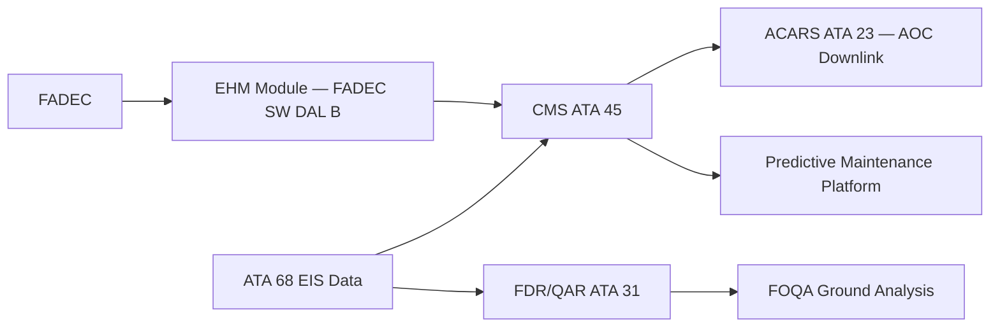

# Engine Indicating — Monitoring, Diagnostics and Control Interfaces

---

## §1 Purpose

Defines the ATA 68 Engine Indicating System integration with the AMPEL360E eWTW-wide monitoring, diagnostics, and control architecture. This includes AFDX Virtual Link assignments, CMS fault codes, and interfaces to cross-system health management.

---

## §2 Applicability

| Parameter | Value |
|---|---|
| Aircraft Program | AMPEL360E eWTW |
| ATA reference | ATA 68-080 |
| S1000D SNS | 068-080-00 |

---

## §3 AFDX Virtual Link Assignments ![TBD]

| Virtual Link ID | Source | Destination | Data | BAG (ms) | Max Frame |
|---|---|---|---|---|---|
| VL-0681 | EDC-L | FADEC EEC-L CH-A | Engine 1 sensor data | 4 ms | 1518 B |
| VL-0682 | EDC-R | FADEC EEC-R CH-A | Engine 2 sensor data | 4 ms | 1518 B |
| VL-0683 | FADEC EEC-L | IAS ECAM | Engine 1 display data | 8 ms | 1518 B |
| VL-0684 | FADEC EEC-R | IAS ECAM | Engine 2 display data | 8 ms | 1518 B |
| VL-0685 | FADEC EEC-L/R | CMS | BITE and health data | 128 ms | 512 B |

---

## §4 CMS Fault Code Catalogue (ATA 68) ![TBD]

| Fault Code | Description | Subsystem | Severity |
|---|---|---|---|
| 068-001 | EDC-L sensor channel A/D fail | EDC-L | Caution |
| 068-002 | EDC-R sensor channel A/D fail | EDC-R | Caution |
| 068-003 | EGT TC-1 open circuit ENG-L | ENG-L EGT | Advisory |
| 068-004 | N1 speed sensor stale data ENG-L | ENG-L N1 | Caution |
| 068-005 | VIB-N1 sensor high reading ENG-R | ENG-R VIB | Warning |
| 068-006 | AFDX VL-0683 timeout | IAS link | Caution |

---

## §5 Cross-System Health Management Interface — Mermaid Diagram

---

## §6 Interfaces

| Interface | Connected System | Data |
|---|---|---|
| CMS (ATA 45) | Central Maintenance | All ATA 68 fault codes |
| ACARS (ATA 23) | Ground ops | In-service fault downlink |
| FDR/QAR (ATA 31) | Flight recorder | Engine parameter archival |
| EHM (FADEC SW) | Performance management | Trend parameter export |

---

## §7 Open Issues

| ID | Description | Owner | Target |
|---|---|---|---|
| OI-068-080-001 | Assign final VL IDs with AFDX network designer | Q-MECHANICS | 2026-Q4 |

---

## §8 Change Log

| Rev | Date | Author | Description |
|---|---|---|---|
| 0.1 | 2026-05-11 | @copilot | Initial DRAFT — AMPEL360E eWTW contextualization |
