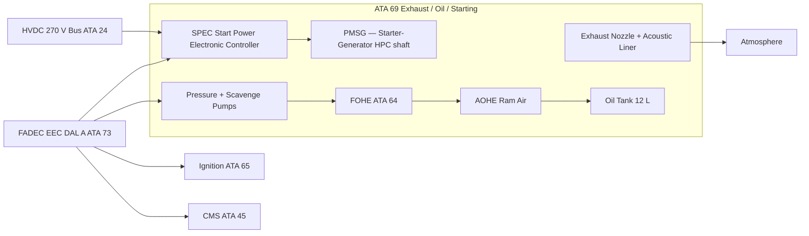
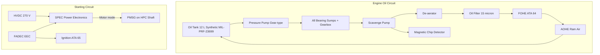

<!-- ──────────────────────────────────────────────────────────────────────────
     QATL-ATLAS-1000-ATLAS-060-069-069-000-EXHAUST-OIL-AND-STARTING-GENERAL
     ATA 69 · Exhaust, Oil and Starting General
     AMPEL360E eWTW — ATLAS Register 1000
────────────────────────────────────────────────────────────────────────────── -->

# Exhaust, Oil and Starting General

---

## §0 Hyperlink Policy

> All hyperlinks in this document are **relative** (five directory levels: `../../../../../`).
> Absolute URLs are forbidden. Every linked document must exist in the Q+ATLANTIDE repository
> before the link is activated. Broken links are treated as open issues and must be resolved
> before the document is promoted from `DRAFT` to `APPROVED`.

---

## §1 Purpose

ATA Chapter 69 covers the Exhaust System, Engine Oil System, and Engine Starting System of the AMPEL360E eWTW. These three subsystems are grouped together in ATA 69 and collectively represent the tail-end of the power-plant lifecycle: exhaust gas discharge from the turbofan, turbofan lubrication by the engine oil circuit, and the electro-mechanical starting sequence that accelerates the core to self-sustaining idle.

On the AMPEL360E eWTW the ATA 69 architecture reflects the bleed-less all-electric design:

- **Exhaust system (ATA 69-010):** Fixed convergent-divergent exhaust nozzle; no thrust reverser on the eWTW baseline; acoustic treatment lined inner duct; mixer nozzle for core and bypass streams.
- **Oil system (ATA 69-020 to 069-040):** Full-authority dry-sump oil system with titanium-alloy scavenge pump; synthetic oil MIL-PRF-23699; air–oil heat exchanger (AOHE) and fuel–oil heat exchanger (FOHE, ATA 64); oil tank capacity approx. 12 L; FADEC-monitored oil health (ATA 68-050).
- **Starting system (ATA 69-050 to 069-060):** All-electric starter using the Permanent-Magnet Starter-Generator (PMSG) integrated on the HPC shaft. The PMSG operates in motor mode during start, powered by the HVDC 270 V bus via the Start Power Electronic Controller (SPEC). No separate pneumatic starter or dedicated starter cartridge.

This document establishes the top-level scope and architecture for ATA 69. All subsubject documents (069-010 through 069-090) are subordinate to this baseline.

---

## §2 Applicability

| Parameter | Value |
|---|---|
| Aircraft Program | AMPEL360E eWTW |
| ATA reference | ATA 69-000 — Exhaust, Oil and Starting General |
| Certification basis | EASA CS-25 Amdt 27+; CS-E Amdt 6 |
| S1000D SNS | 069-000-00 |

---

## §3 Functional Description ![DRAFT]

### Exhaust System
The AMPEL360E eWTW turbofan exhausts through a fixed convergent nozzle (no active variable area nozzle on baseline). The exhaust duct incorporates acoustic absorptive liners on the inner annulus to meet ICAO Annex 16 Chapter 14 noise targets. An integrated fan/core mixer nozzle minimises the jet noise signature. The exhaust system is fabricated from Inconel 625 and titanium alloy panels; all joints are flanged and sealed for gas-tightness per CS-E §E 500.

### Oil System
The engine dry-sump oil system maintains lubrication and cooling of all rotating bearing assemblies and gearbox. The oil is drawn from the tank by the main pressure pump (gear-type), distributed to all bearing sumps, and returned by the scavenge pump system. Air is separated by the oil de-aerator, and excess heat rejected through the FOHE (fuel–oil heat exchanger, ATA 64) and the AOHE (air–oil heat exchanger, ram-air cooled). Oil state (pressure, temperature, quantity) is monitored continuously by the FADEC and reported to ECAM. A magnetic plug in the scavenge circuit provides chip detection.

### Starting System
Engine start is accomplished by the PMSG (Permanent-Magnet Starter-Generator) on the HPC shaft. On ground start command, the Start Power Electronic Controller (SPEC) draws power from the HVDC 270 V bus (APU or GPU) and drives the PMSG in motor mode, cranking the HPC to N2 ≥ 15 % before fuel is introduced and ignition energised (ATA 65). The FADEC manages the full start sequence including abort on hung start (N2 growth < 1 %/2 s) and hot start (EGT > start limit). In flight, windmill relight is available at N2 > 8 %.

---

## §4 Functional Breakdown

| ID | Name | Description | Lead Division |
|---|---|---|---|
| F-001 | Exhaust System | Fixed convergent nozzle; acoustic liner; fan-core mixer | Q-GREENTECH |
| F-002 | Oil Storage and Distribution | Dry-sump tank (12 L); pressure and scavenge pumps; chip detector | Q-MECHANICS |
| F-003 | Oil Cooling and Conditioning | FOHE (ATA 64) + AOHE; de-aerator; oil filter | Q-MECHANICS |
| F-004 | Oil Indicating and Monitoring | OP/OT/OQ sensors; FADEC monitoring; ECAM display (ATA 68) | Q-AIR |
| F-005 | Engine Starting | PMSG motor mode; SPEC; FADEC start sequence control | Q-GREENTECH |
| F-006 | Starter Control and Protection | Hung/hot start protection; abort logic; in-flight relight | Q-AIR |

---

## §5 System Context — Mermaid Diagram

---

## §6 Internal Architecture — Mermaid Diagram

---

## §7 Components and LRUs

| Component | Part Number | Qty | Location | Maintenance Interval | Notes |
|---|---|---|---|---|---|
| Exhaust Nozzle Assembly | EXH-PN-TBD | 2 (1/engine) | Aft nacelle | 25 000 FH visual inspection | Inconel 625 + Ti panels |
| Oil Tank | OT-PN-TBD | 2 (1/engine) | Engine gearbox zone | 500 FH — quantity/quality check | Synthetic oil fill point on cowl |
| Oil Pressure/Scavenge Pump | PUMP-PN-TBD | 2 sets | Accessory Gearbox | On condition / C-check | Integral gear-driven pump |
| Magnetic Chip Detector (MCD) | MCD-PN-TBD | 2 (1/engine) | Main scavenge line | A-check inspection | Fuzz burn-off circuit; FADEC monitored |
| Oil Filter Element | FILT-PN-TBD | 2 (1/engine) | Gearbox filter housing | 3 000 FH replacement | 15-micron by-pass protection |
| PMSG Starter-Generator | PMSG-PN-TBD | 2 (1/engine) | HPC shaft — gearbox drive | On condition — 25 000 FH service life limit | Dual-mode: motor (start) + generator |
| SPEC Start Power Electronic Controller | SPEC-PN-TBD | 2 (1/engine) | EE bay rack ATA 24 zone | Software update per FADEC/SPEC SB | DO-178C DAL B; DO-160G |
| Acoustic Exhaust Liner | AEL-PN-TBD | 4 panels/engine | Inner exhaust duct annulus | C-check visual inspection; bond check | Honeycomb absorptive liner |

---

## §8 Interfaces

| Interface Type | Connected System | Protocol / Medium | Data / Function |
|---|---|---|---|
| ATA 24 Electrical Power | HVDC 270 V primary bus | HVDC cable | SPEC/PMSG power — up to 200 kW during start |
| ATA 64 Engine Fuel and Control | FOHE | Oil-to-fuel heat exchange | Oil cooling; fuel heating |
| ATA 65 Ignition | Ignition exciter | Discrete command from FADEC | Ignition energise during start |
| ATA 73 FADEC | Engine control | AFDX + discrete | Start sequence; oil monitoring; exhaust temperature |
| ATA 45 CMS | Central Maintenance | AFDX | BITE faults, oil exceedances, chip detection log |
| ATA 31 ECAM | Cockpit display | AFDX | Oil pressure/temperature/quantity, start status |

---

## §9 Operating Modes

| Mode | Trigger | System State | Actions / Consequences |
|---|---|---|---|
| Ground start | Crew start selection; FADEC initiates | SPEC energises PMSG motor; N2 grows to 15 %; fuel + ignition | FADEC monitors EGT and N2 growth; abort on hung/hot start |
| In-flight relight | Engine flame-out; windmill N2 > 8 % | FADEC commands ignition + fuel; SPEC not required above idle speed | Windmill energy sufficient for ignition; ECAM ENGINE FAIL cleared on relight |
| Normal run | Engine at idle to T/O thrust | Oil system in normal flow; PMSG in generator mode | Oil P/T/Q parameters on ECAM lower synoptic |
| Chip detection alert | MCD detects metallic particle | FADEC logs event; ECAM advisory | Land at nearest suitable; oil analysis at turn-round |
| Maintenance — oil servicing | Aircraft on ground; engine shutdown | Oil system depressurised; fill point accessible | Hot oil warning — 60-minute cooling required post-shutdown |

---

## §10 Performance and Budgets ![DRAFT]

| Parameter | Requirement | Target / Design Value | Status |
|---|---|---|---|
| Start time (ground, ISA, SL) | ≤ 40 s from initiation to idle | ≤ 35 s | ![TBD] |
| PMSG start power (peak) | ≤ 200 kW | 180 kW | ![TBD] |
| Oil consumption (max) | ≤ 0.3 L/FH | ≤ 0.2 L/FH | ![TBD] |
| Oil temperature (max) | ≤ 163 °C | ≤ 155 °C at cruise | ![TBD] |
| Exhaust nozzle Cv (velocity coefficient) | ≥ 0.99 | 0.995 | ![TBD] |

---

## §11 Safety, Redundancy and Fault Tolerance

- Hung and hot start are detected and aborted by FADEC within defined thresholds (N2 growth rate < 1 %/2 s; EGT > start limit per CS-E §E 1040).
- Loss of oil pressure below 1.0 bar triggers immediate ECAM Warning and FADEC records exceedance; crew action: reduce thrust and monitor for engine shutdown.
- Chip detection circuit provides early warning of bearing wear; FADEC records detection event in NVM.
- SPEC is DO-178C DAL B; loss of both SPEC units (one per engine) is shown to be Extremely Improbable.
- Exhaust nozzle is fixed (no moving parts); failure mode is structural damage only, inspected per AMM.

---

## §12 Maintenance and Diagnostics

| Task | Interval | Access | Special Tools |
|---|---|---|---|
| Oil quantity and quality check | 500 FH / transit | Oil fill point cowl panel | Oil analysis kit |
| Oil filter element replacement | 3 000 FH | Filter housing access panel | Filter housing wrench |
| Magnetic chip detector inspection | A-check | Scavenge line access | MCD extraction tool |
| SPEC BITE download | A-check | CMS terminal | CMS GSE |
| Exhaust nozzle visual inspection | C-check | Nacelle open | Borescope (inner duct liner) |
| PMSG service life check | 25 000 FH | Engine removal from pylon | Gearbox drive shaft tool |

---

## §13 Footprint — Physical, Electrical, Maintenance, Data ![TBD]

| Footprint Type | Parameter | Value | Notes |
|---|---|---|---|
| Physical | PMSG mass (each) | ![TBD] | Integrated on gearbox |
| Electrical | SPEC peak power draw | 180 kW per engine | HVDC 270 V bus peak load during start |
| Maintenance | Oil fill interval | 500 FH | Synthetic oil MIL-PRF-23699 |
| Data | AFDX bandwidth (FADEC/SPEC to CMS) | ![TBD] | Per AFDX bus load analysis |

---

## §14 Safety and Certification References ![DRAFT]

| Standard / Document | Title | Issuing Body | Applicability |
|---|---|---|---|
| EASA CS-E §E 500 | Engine exhaust system | EASA | Exhaust nozzle structural and gas-tightness requirements |
| EASA CS-E §E 1040 | Starting | EASA | Hung/hot start limits; relight envelope |
| EASA CS-25 §25.1185 | Flammable fluids | EASA | Oil system fire zone drainage |
| DO-178C | Software Considerations in Airborne Systems | RTCA | SPEC software DO-178C DAL B |
| DO-160G | Environmental Conditions and Test Procedures | RTCA | SPEC and PMSG environmental qualification |
| ICAO Annex 16 Ch. 14 | Aircraft Noise — Chapter 14 | ICAO | Exhaust noise targets for AMPEL360E eWTW |

---

## §15 V&V Approach ![TBD]

| Phase | Method | Acceptance Criterion | Status |
|---|---|---|---|
| Design | Analysis and CFD | Exhaust Cv ≥ 0.99; oil system thermal model | ![TBD] |
| Integration | Ground start test | Start time ≤ 35 s; no hung/hot start in test envelope | ![TBD] |
| Qualification | DO-160G SPEC/PMSG test | All applicable categories pass | ![TBD] |
| Certification | CS-E §E 1040 compliance | Engine start and relight flight test | ![TBD] |

---

## §16 Glossary

| Term | Definition |
|---|---|
| **PMSG** | Permanent-Magnet Starter-Generator — dual-role machine used as motor during start and generator in flight. |
| **SPEC** | Start Power Electronic Controller — power electronics unit converting HVDC 270 V to variable-frequency AC for PMSG motor mode. |
| **Dry-sump** | Oil system where oil is stored in a remote tank, not in an engine sump; allows inverted flight tolerance. |
| **FOHE** | Fuel–Oil Heat Exchanger — exchanges heat between engine oil and fuel, cooling oil while heating fuel. |
| **AOHE** | Air–Oil Heat Exchanger — rejects oil heat to ram air; secondary cooling path. |
| **MCD** | Magnetic Chip Detector — magnetic plug in scavenge line that captures metallic debris; indicates bearing wear. |
| **Hung start** | Engine start condition where N2 fails to accelerate at expected rate; FADEC aborts start. |
| **Hot start** | Engine start condition where EGT exceeds start limit; FADEC aborts start. |
| **Windmill relight** | In-flight engine restart using windmill airflow to crank N2 above minimum relight speed. |
| **Cv** | Exhaust nozzle velocity coefficient — ratio of actual jet velocity to ideal isentropic velocity. |

---

## §17 Open Issues

| ID | Description | Owner | Target |
|---|---|---|---|
| OI-069-000-001 | Confirm PMSG start power budget against HVDC bus during simultaneous start of both engines | Q-MECHANICS | 2026-Q4 |
| OI-069-000-002 | Complete CS-E §E 1040 hot/hung start analysis and compliance document | Q-AIR / safety | 2027-Q1 |

---

## §18 Status Legend

| Badge | Meaning |
|---|---|
| `![DRAFT]` | Section is drafted but not yet reviewed |
| `![TBD]` | Content not yet started — to be defined |
| `![To Be Completed]` | Partially complete — needs additional content |
| `![APPROVED]` | Reviewed and formally approved |

---

## §19 Related Documents (Siblings in this Subsection)

- [069-010](./069-010-Exhaust-System.md)
- [069-020](./069-020-Oil-Storage-and-Distribution.md)
- [069-030](./069-030-Oil-Cooling-Filtration-and-Conditioning.md)
- [069-040](./069-040-Oil-Indication-and-Monitoring.md)
- [069-050](./069-050-Engine-Starting-System.md)
- [069-060](./069-060-Starter-Air-Electric-and-Control-Interfaces.md)
- [069-070](./069-070-Exhaust-Oil-Starting-Inspection-and-Maintenance.md)
- [069-080](./069-080-Exhaust-Oil-Starting-Monitoring-Diagnostics-and-Control-Interfaces.md)
- [069-090](./069-090-S1000D-CSDB-Mapping-and-Traceability.md)

---

## §20 Change Log

| Rev | Date | Author | Description |
|---|---|---|---|
| 0.1 | 2026-05-11 | @copilot | Initial DRAFT — contextualized content per AMPEL360E eWTW architecture |
