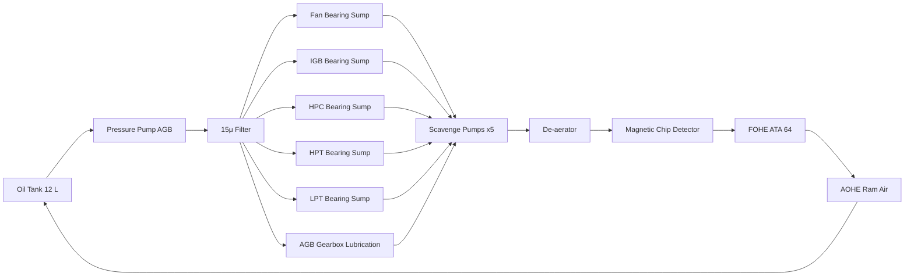

# Oil Storage and Distribution

---

## §1 Purpose

Specifies the oil tank, supply pump, and distribution network for the AMPEL360E eWTW turbofan dry-sump oil system. Synthetic oil (MIL-PRF-23699) is stored in a gearbox-mounted tank and distributed under pressure to all bearing sumps.

---

## §2 Applicability

| Parameter | Value |
|---|---|
| Aircraft Program | AMPEL360E eWTW |
| ATA reference | ATA 69-020 |
| S1000D SNS | 069-020-00 |

---

## §3 Oil System Architecture ![DRAFT]

| Component | Specification | Location |
|---|---|---|
| Oil tank | 12 L capacity; aluminium alloy; pressurised headspace (2 kPa) | Accessory Gearbox (AGB) zone |
| Pressure pump | Gear-type; flow rate ![TBD] L/min at idle / max | AGB gear train |
| Scavenge pump | Multi-element gear-type; combined flow ≥ 2× pressure pump | AGB gear train |
| Oil filter | 15-micron bypass protected; differential pressure indicator (DPI) | AGB filter housing |
| Magnetic Chip Detector (MCD) | Fuzz burn-off circuit; FADEC-monitored | Main scavenge return line |
| Oil fill/drain point | External; cowl-accessible; level sight glass | AGB forward face |

---

## §4 Oil Distribution Schematic — Mermaid Diagram

---

## §5 Oil Specification

| Property | Value |
|---|---|
| Oil type | Synthetic turbine oil MIL-PRF-23699 Type II or equivalent |
| Viscosity (40 °C) | ~5 cSt |
| Flash point | > 250 °C |
| Auto-ignition temp | > 350 °C |
| Change interval | 3 000 FH or 2 years (whichever sooner) |

---

## §6 Interfaces

| Interface | Connected System | Data |
|---|---|---|
| Oil filter housing (ATA 69-030) | Cooling and filtration | Oil-out to coolers |
| FADEC (ATA 73) | Engine control | Oil pressure/temperature monitoring |
| FOHE (ATA 64) | Fuel–oil heat exchanger | Thermal load exchange |

---

## §7 Open Issues

| ID | Description | Owner | Target |
|---|---|---|---|
| OI-069-020-001 | Confirm oil tank capacity (12 L) and scavenge-to-pressure pump ratio with OEM | Q-MECHANICS | 2026-Q4 |

---

## §8 Change Log

| Rev | Date | Author | Description |
|---|---|---|---|
| 0.1 | 2026-05-11 | @copilot | Initial DRAFT — AMPEL360E eWTW contextualization |
