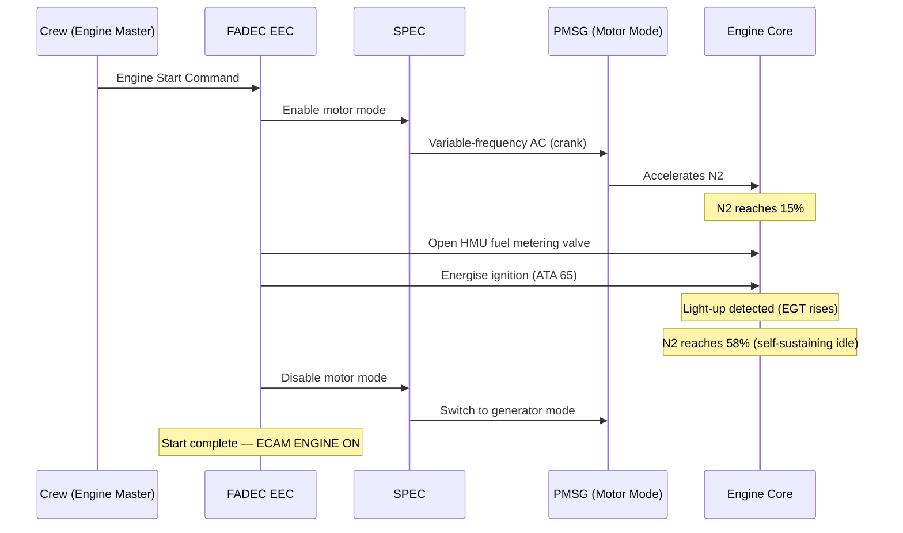

# Engine Starting System

---

## §1 Purpose

This document defines the agnostic ATLAS standard-level architecture context for `Engine Starting System`.

It describes the controlled scope, functions, interfaces, safety considerations, lifecycle traceability, and S1000D/CSDB mapping logic that programme implementations shall instantiate when this node is applicable.

This document is not a programme design baseline. Programme-specific capacities, locations, part numbers, effectivity, operating limits, maintenance references, and data module codes shall be defined only inside the applicable programme implementation branch.
## §2 Applicability

| Applicability Level | Rule |
|---|---|
| Standard taxonomy | Applies to the ATLAS node `069` |
| Programme implementation | Conditional; determined by programme architecture, trade studies, certification basis, and applicability model |
| Product configuration | Defined in the programme-specific configuration baseline |
| Effectivity | Defined in the programme CSDB / applicability layer |
| Non-applicability | Must be explicitly stated in the programme impact-study branch when excluded |
## §3 Starting System Architecture ![DRAFT]

| Component | Role | Specification |
|---|---|---|
| PMSG | Motor during start; generator in flight | Permanent-magnet synchronous machine; HPC shaft gearbox drive; rated 150 kW continuous |
| SPEC | Power converter; motor control | HVDC 270 V input; variable-frequency 3-phase AC output; DO-178C DAL B; DO-160G |
| FADEC EEC | Start sequence master controller | Manages N2 target, fuel scheduling, ignition timing, and abort logic |
| APU / GPU | HVDC 270 V source for ground start | APU HVDC 270 V output (ATA 49) or Ground Power Unit (ATA 24) |

---

## §4 Start Sequence — Mermaid Diagram

---

## §5 Start Envelope

| Condition | N2 at fuel-on | Max EGT (start limit) | Max start time |
|---|---|---|---|
| Ground start — ISA SL | 15 % N2 | 635 °C | 40 s |
| Ground start — Hot day +15 °C | 15 % N2 | 635 °C | 45 s |
| In-flight relight (windmill) | 8 % N2 (windmill) | 635 °C | 60 s |
| In-flight relight (SPEC assist) | N2 < 8 % | 635 °C | 90 s (SPEC cranks to 15 %) |

---

## §6 Abort Conditions

| Abort Trigger | FADEC Action |
|---|---|
| Hung start: N2 growth < 1 %/2 s | Cut fuel + ignition; open starter isolation |
| Hot start: EGT > 635 °C during start | Cut fuel + ignition; open starter isolation; ECAM `ENG x HOT START` |
| SPEC fault | Cut fuel; inhibit start; ECAM `ENG x SPEC FAULT` |
| N2 not reached within 40 s | Abort sequence; ECAM advisory |

---

## §7 Interfaces

| Interface | Connected System | Data |
|---|---|---|
| HVDC 270 V (ATA 24) | Power supply | 270 V DC to SPEC during start |
| APU (ATA 49) | Ground start power source | HVDC 270 V from APU PMSG |
| FADEC (ATA 73) | Start sequence control | SPEC enable/disable; N2 target |
| Ignition (ATA 65) | Spark ignition | FADEC-timed ignition command |

---

## §8 Open Issues

| ID | Description | Owner | Target |
|---|---|---|---|
| OI-069-050-001 | Confirm PMSG/SPEC start peak current vs HVDC bus voltage during single and dual start | Q-MECHANICS | 2026-Q4 |

---

## §9 Change Log

| Rev | Date | Author | Description |
|---|---|---|---|
| 0.1 | 2026-05-11 | @copilot | Initial DRAFT — programme-defined aircraft type contextualization |
