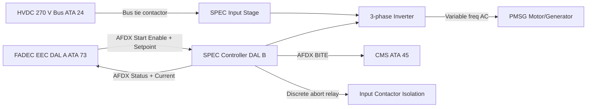

# Starter — Electric and Control Interfaces

---

## §1 Purpose

This document defines the agnostic ATLAS standard-level architecture context for `Starter — Electric and Control Interfaces`.

It describes the controlled scope, functions, interfaces, safety considerations, lifecycle traceability, and S1000D/CSDB mapping logic that programme implementations shall instantiate when this node is applicable.

This document is not a programme design baseline. Programme-specific capacities, locations, part numbers, effectivity, operating limits, maintenance references, and data module codes shall be defined only inside the applicable programme implementation branch.
## §2 Applicability

| Applicability Level | Rule |
|---|---|
| Standard taxonomy | Applies to the ATLAS node `069` |
| Programme implementation | Conditional; determined by programme architecture, trade studies, certification basis, and applicability model |
| Product configuration | Defined in the programme-specific configuration baseline |
| Effectivity | Defined in the programme CSDB / applicability layer |
| Non-applicability | Must be explicitly stated in the programme impact-study branch when excluded |
## §3 SPEC Electrical Interfaces ![DRAFT]

| Interface | Bus / Medium | Function |
|---|---|---|
| HVDC 270 V input | HVDC cable — bus tie contactor controlled | Power supply for motor mode |
| 3-phase AC output to PMSG | Heavy-gauge shielded cable (nacelle routed) | Variable-frequency motor drive |
| AFDX data link (FADEC → SPEC) | AFDX VL (ATA 73) | Start enable, speed setpoint, abort |
| AFDX data link (SPEC → FADEC) | AFDX VL | SPEC status, motor current, fault flags |
| AFDX data link (SPEC → CMS) | AFDX VL | BITE, start event log |
| Discrete — start isolation relay | Hardwired discrete | FADEC hardware-controlled isolation on abort |

---

## §4 SPEC Control Modes

| Mode | Trigger | SPEC State |
|---|---|---|
| Motor mode (start) | FADEC start command + HVDC healthy | SPEC converts HVDC 270 V → variable AC; ramps N2 to target |
| Generator mode (flight) | N2 > 58 % self-sustaining + FADEC command | SPEC transitions to rectifier mode; PMSG → HVDC feed |
| Standby | Engine running, no start active | SPEC in low-power standby; ready for relight |
| Abort isolation | FADEC abort command | SPEC opens input contactor; HVDC disconnected within 50 ms |

---

## §5 Interface Block Diagram — Mermaid Diagram

---

## §6 SPEC Specifications ![TBD]

| Specification | Requirement | Value | Status |
|---|---|---|---|
| Input voltage range | 250–300 V DC | HVDC 270 V nominal | ![TBD] |
| Peak output power | ≤ 200 kW | 180 kW | ![TBD] |
| Efficiency (motor mode) | ≥ 96 % | ≥ 97 % target | ![TBD] |
| DO-178C level | DAL B | DAL B | Confirmed |
| Operating temperature | −55 °C to +70 °C | Per DO-160G Cat U | ![TBD] |

---

## §7 Interfaces

| Interface | Connected System | Data |
|---|---|---|
| HVDC 270 V (ATA 24) | Bus power | Start current draw |
| FADEC (ATA 73) | Controller | Start sequence command |
| CMS (ATA 45) | Maintenance | BITE, start event log |
| PMSG (ATA 69-050) | Machine | AC motor drive current |

---

## §8 Open Issues

| ID | Description | Owner | Target |
|---|---|---|---|
| OI-069-060-001 | Confirm SPEC DO-178C DAL B SW development plan and supplier | Q-GREENTECH | 2027-Q1 |

---

## §9 Change Log

| Rev | Date | Author | Description |
|---|---|---|---|
| 0.1 | 2026-05-11 | @copilot | Initial DRAFT — programme-defined aircraft type contextualization |
