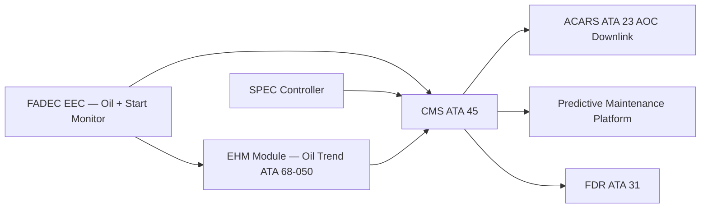

# Exhaust, Oil and Starting — Monitoring, Diagnostics and Control Interfaces

---

## §1 Purpose

This document defines the agnostic ATLAS standard-level architecture context for `Exhaust, Oil and Starting — Monitoring, Diagnostics and Control Interfaces`.

It describes the controlled scope, functions, interfaces, safety considerations, lifecycle traceability, and S1000D/CSDB mapping logic that programme implementations shall instantiate when this node is applicable.

This document is not a programme design baseline. Programme-specific capacities, locations, part numbers, effectivity, operating limits, maintenance references, and data module codes shall be defined only inside the applicable programme implementation branch.
## §2 Applicability

| Applicability Level | Rule |
|---|---|
| Standard taxonomy | Applies to the ATLAS node `069` |
| Programme implementation | Conditional; determined by programme architecture, trade studies, certification basis, and applicability model |
| Product configuration | Defined in the programme-specific configuration baseline |
| Effectivity | Defined in the programme CSDB / applicability layer |
| Non-applicability | Must be explicitly stated in the programme impact-study branch when excluded |
## §3 AFDX Virtual Link Assignments ![TBD]

| Virtual Link ID | Source | Destination | Data | BAG (ms) |
|---|---|---|---|---|
| VL-0691 | FADEC EEC-L | ECAM IAS | Oil parameters ENG-L | 16 ms |
| VL-0692 | FADEC EEC-R | ECAM IAS | Oil parameters ENG-R | 16 ms |
| VL-0693 | SPEC-L | FADEC EEC-L | SPEC status, motor current | 4 ms |
| VL-0694 | SPEC-R | FADEC EEC-R | SPEC status, motor current | 4 ms |
| VL-0695 | FADEC EEC-L/R | CMS | Oil and start BITE, exceedances | 128 ms |

---

## §4 CMS Fault Code Catalogue (ATA 69) ![TBD]

| Fault Code | Description | Subsystem | Severity |
|---|---|---|---|
| 069-001 | ENG-L OIL LO PRESS | Oil system | Warning |
| 069-002 | ENG-R OIL HI TEMP | Oil system | Caution |
| 069-003 | ENG-L OIL CHIP DET | Oil chip detector | Advisory / Caution |
| 069-004 | ENG-L OIL FILTER BYPASS | Oil filter | Caution |
| 069-005 | ENG-L SPEC FAULT | SPEC starting | Caution |
| 069-006 | ENG-L HOT START | Start sequence | Warning |
| 069-007 | ENG-R HUNG START | Start sequence | Warning |
| 069-008 | ENG-L OIL LO QTY | Oil quantity | Caution |

---

## §5 Cross-System Health Management — Mermaid Diagram

---

## §6 Interfaces

| Interface | Connected System | Data |
|---|---|---|
| CMS (ATA 45) | Central Maintenance | All ATA 69 fault codes |
| ACARS (ATA 23) | Ground ops | In-service fault downlink |
| FADEC (ATA 73) | Engine controller | Oil and start parameter source |
| SPEC (ATA 69-060) | Starting controller | Start event data, SPEC BITE |
| EHM (ATA 68-050) | Engine health | Oil consumption trend |

---

## §7 Open Issues

| ID | Description | Owner | Target |
|---|---|---|---|
| OI-069-080-001 | Assign final VL IDs for SPEC and oil monitoring with AFDX network designer | Q-MECHANICS | 2026-Q4 |

---

## §8 Change Log

| Rev | Date | Author | Description |
|---|---|---|---|
| 0.1 | 2026-05-11 | @copilot | Initial DRAFT — programme-defined aircraft type contextualization |
