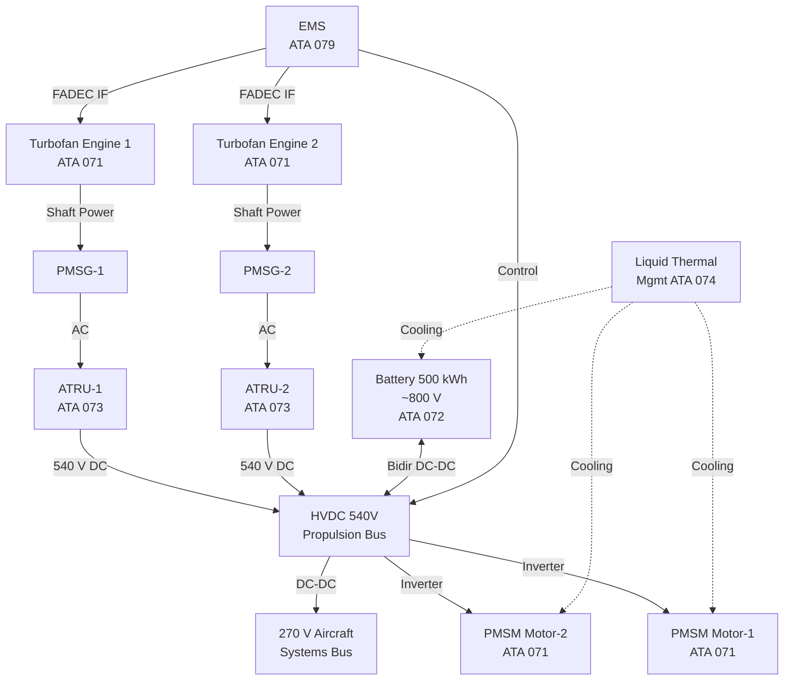
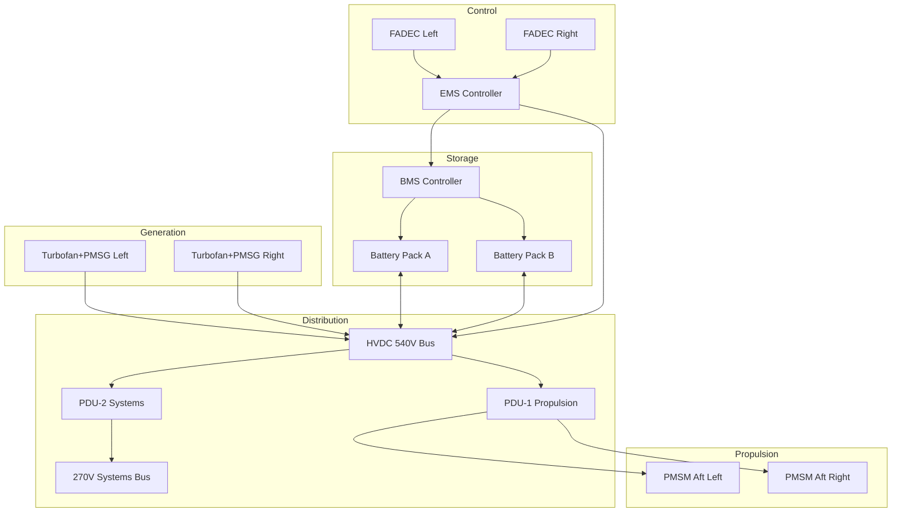

# Hybrid-Electric Architecture Overview — General

---

## §0 Hyperlink Policy
All hyperlinks in this document are **relative**. Absolute URLs are forbidden.

---

## §1 Purpose
This document provides the top-level system integration overview of the AMPEL360E eWTW hybrid-electric architecture, defining the boundaries, interrelationships, and governing design philosophy of all propulsion and energy subsystems. It serves as the master reference from which all lower-level subsystem specifications under ATA 070–079 are derived and to which they trace. It establishes the architectural baseline for certification, design authority, and integrated system verification.

## §2 Applicability
| Aircraft | Variant | MSN Range | Effectivity |
|---|---|---|---|
| AMPEL360E | eWTW | All | From EIS |

## §3 Functional Description 

The AMPEL360E eWTW employs a series-parallel hybrid-electric propulsion architecture that combines two underwing turbofan engines with two aft-fuselage Permanent Magnet Synchronous Motor (PMSM) electric drive units. The turbofans serve dual roles as primary thrust generators during climb and cruise, and as shaft-power offtakes driving high-power Permanent Magnet Synchronous Generators (PMSGs) that feed the High-Voltage Direct-Current (HVDC) 540 V propulsion bus. The aft PMSM motors draw from this bus during boost, urban-area climb, and low-noise approach phases, providing supplemental thrust augmentation and Boundary Layer Ingestion (BLI) efficiency gains.

The energy storage system comprises a 500 kWh, ~800 V lithium-ion battery pack suite integrated with the HVDC bus via bidirectional DC-DC converters, enabling peak-power shaving during take-off, energy recovery during descent through regenerative braking, and full-electric low-emission taxi operations. The battery architecture is managed by a distributed Battery Management System (BMS) operating under the authority of the Hybrid Energy Management System (EMS, ATA 079).

The power distribution network is structured around two voltage domains: the 540 V HVDC propulsion bus serving all traction loads, and the 270 V aircraft-systems bus supplying avionics, flight controls, and non-propulsive electrical loads. The elimination of bleed air in favour of Electric Air Compressors (EACs, ATA 066) simplifies the pneumatic architecture and reduces engine pressure-ratio penalties. Liquid cooling loops serving the battery, power electronics, and electric motors are consolidated under ATA 074, forming a fully integrated thermal management network. The entire power-split and mode-selection logic is governed by the EMS (ATA 079), which interfaces with both FADEC channels and the Flight Management Computer (FMC) to optimise efficiency, safety, and noise footprint across all flight phases.

## §4 Functional Breakdown
| ID | Function | Description | Owner | DAL |
|---|---|---|---|---|
| F-070-000-01 | Hybrid Power Generation | Convert turbofan shaft power to HVDC electrical power via PMSG | Q-MECHANICS | DAL-B |
| F-070-000-02 | Electric Thrust Augmentation | Provide supplemental aft thrust via PMSM motors fed from HVDC bus | Q-MECHANICS | DAL-B |
| F-070-000-03 | Energy Storage Management | Buffer peak loads, enable regen recovery, and support electric taxi via battery | Q-GREENTECH | DAL-B |
| F-070-000-04 | Power Distribution & Conversion | Distribute 540 V and 270 V to all loads with fault isolation | Q-INDUSTRY | DAL-A |
| F-070-000-05 | Hybrid Energy Management | Optimise power-split across all modes under EMS authority | Q-HPC | DAL-A |

## §5 System Context — Architecture

## §6 Internal Architecture

## §7 Components and LRUs
| LRU ID | Name | P/N | Qty | Location |
|---|---|---|---|---|
| LRU-070-000-01 | Hybrid EMS Controller | TBD | 2 | Avionics Bay |
| LRU-070-000-02 | HVDC 540V Power Distribution Unit | TBD | 2 | Forward Equipment Bay |
| LRU-070-000-03 | 270V Systems Power Distribution Unit | TBD | 2 | Aft Equipment Bay |
| LRU-070-000-04 | System Integration Test Unit (SITU) | TBD | 1 | Maintenance Bay |
| LRU-070-000-05 | Architecture Health Monitor (AHM) | TBD | 2 | Avionics Bay |

## §8 Interfaces
| Interface | Source | Destination | Protocol | Notes |
|---|---|---|---|---|
| IF-070-000-01 | EMS | FADEC (Left/Right) | ARINC 429 / AFDX | Power-split commands, engine throttle advisory |
| IF-070-000-02 | HVDC Bus | PMSM Inverter Units | HVDC 540 V | Propulsion power feed |
| IF-070-000-03 | BMS | EMS | CAN FD | SoC, SoH, thermal state |
| IF-070-000-04 | EMS | FMC | AFDX (ARINC 664) | Flight phase, mission profile input |
| IF-070-000-05 | AHM | ACARS/ACMS | ARINC 717 | Health trending, predictive maintenance data |

## §9 Operating Modes
| Mode | Trigger | Description | Power State | Notes |
|---|---|---|---|---|
| Full Hybrid | Normal climb/cruise | Both turbofans + battery buffer active; EMS optimises split | High generation | Primary operational mode |
| Electric Boost | Take-off / go-around | Turbofans at max thrust + PMSM at full power from battery | Peak draw | Short duration; SoC gated |
| Electric Taxi | Ground taxi | Battery-only to PMSM; turbofans off or idle | Storage discharge | Zero local emissions |
| Regenerative Descent | Descent / approach | PMSM motors act as generators, recharging battery | Storage charge | Subject to grid connection authority |
| Emergency Electric | Turbofan failure | Remaining turbofan + battery sustain flight; PMSM off or reduced | Reduced | DAL-A EMS failsafe path |

## §10 Performance and Budgets 
| Parameter | Requirement | Current Estimate | Unit | Status |
|---|---|---|---|---|
| Total installed electric power | ≥ 4 000 | 4 200 | kW |  |
| Battery usable energy | ≥ 450 | 480 | kWh |  |
| System efficiency (cruise) | ≥ 55 | 57 | % |  |
| CO₂ reduction vs. baseline | ≥ 30 | 32 | % |  |
| HVDC bus availability | ≥ 99.999 | — | % dispatch |  |

## §11 Safety, Redundancy and Fault Tolerance
- The HVDC 540 V bus is split into two independently isolated segments with cross-tie contactors, ensuring no single fault propagates across the full bus.
- The EMS operates on dual-redundant processing lanes (DAL-A), with automatic lane switchover on primary lane failure, validated against DO-178C.
- Each turbofan-PMSG generation channel is isolated by solid-state protection devices; loss of one channel is a dispatch-permissive failure (MEL-070-G1).
- Battery packs A and B are diode-isolated at the bus interface; BMS provides cell-level over-current, over-temperature, and over-voltage protection with automatic contactor trip.
- All power-path hardware meets DO-160G environmental qualification requirements; arc-flash containment is sized per MIL-STD-461G conducted emissions limits.

## §12 Maintenance and Diagnostics
| Task | Interval | Tool | Reference |
|---|---|---|---|
| HVDC bus insulation resistance check | 600 FH | ISOL-CHECK-540 | AMM 070-000-001 |
| EMS software version verification | 300 FH or A-Check | CMCS terminal | SB-EMS-070-001 |
| LRU functional self-test (BITE) | Pre-flight / on-demand | ECAM CMS | FCOM 070-00-10 |
| Architecture health report download | Monthly / C-Check | ACMS / AGSE-070 | MPD 070-000-C1 |

## §13 Footprint
| Metric | Physical | Electrical | Maintenance | Data |
|---|---|---|---|---|
| Architecture mass (electric) |  kg | — | — | — |
| HVDC bus length |  m | 540 V / 800 A cont. | Standard harness tools | AFDX / CAN FD |
| Battery volume |  m³ | 800 V / 625 A | Specialised HVDC PPE | BMS data bus |
| EMS controller size | 2 × 3 ATR | — | Standard avionics tools | ARINC 429 / AFDX |

## §14 Safety and Certification References
| Standard | Requirement | Applicability | Status | Notes |
|---|---|---|---|---|
| DO-178C | Software life cycle — DAL-A (EMS) | EMS Controller | Planned | Full DO-178C SW process required |
| DO-254 | Hardware design assurance — DAL-A | HVDC PDUs, EMS FPGA | Planned | ASIC/PLD coverage |
| ARP4754A | System development process | Hybrid architecture system level | Planned | System safety assessment per ARP4761 |
| CS-25 | Large aeroplane airworthiness | Entire hybrid system | Planned | CS-25.1309 special conditions for HVDC |
| FAR Part 25 | US airworthiness — §25.1309 | Entire hybrid system | Planned | Equivalent to CS-25 for FAA certification |

## §15 V&V Approach
| Phase | Method | Tool/Facility | Status |
|---|---|---|---|
| Requirements V&V | MBSE model review + peer review | Cameo/DOORS |  |
| Component HIL test | Hardware-in-the-loop simulation | HPS-070 HIL Rig |  |
| Iron-bird integration test | Full power-on architecture test | Iron Bird Facility |  |
| Flight test certification | FAA/EASA witness test programme | AMPEL360E FTB-001 |  |

## §16 Glossary
| Term | Definition |
|---|---|
| AMPEL360E | Advanced Multi-mission Passenger Electric L-class 360 Extended — the aircraft programme |
| eWTW | Electric Wing-Tip-to-Wing (variant designation implying full-span hybrid integration) |
| HVDC | High-Voltage Direct Current; here 540 V propulsion bus and ~800 V battery bus |
| PMSM | Permanent Magnet Synchronous Motor — used for aft electric propulsion units |
| PMSG | Permanent Magnet Synchronous Generator — driven by turbofan to produce AC |
| ATRU | Auto-Transformer Rectifier Unit — converts PMSG AC output to 540 V DC |
| EMS | Hybrid Energy Management System — governs power-split and mode selection |
| BMS | Battery Management System — monitors and protects lithium-ion cell arrays |
| DAL | Design Assurance Level (per ARP4754A / DO-178C); A = most critical |
| SoC | State of Charge — percentage of available battery capacity remaining |

## §17 Open Issues
| ID | Description | Owner | Priority | Status |
|---|---|---|---|---|
| OI-070-000-001 | Define special condition text for HVDC 540V bus per CS-25 Amendment 28 | @copilot | High | Open |
| OI-070-000-002 | Confirm battery bus voltage (800 V nominal vs 850 V peak) with ATA 072 lead | @copilot | Medium | Open |

## §18 Status Legend
| Badge | Meaning |
|---|---|
|  | Content under active development |
|  | Value or content to be determined |
|  | Approved and baselined |
|  | Placeholder, not yet populated |

## §19 Related Documents
| Code | Title | Link |
|---|---|---|
| 070-010 | Architecture Modes and Power Flow | [070-010-Architecture-Modes-and-Power-Flow.md](070-010-Architecture-Modes-and-Power-Flow.md) |
| 070-020 | Turbofan-Electric Integration | [070-020-Turbofan-Electric-Integration.md](070-020-Turbofan-Electric-Integration.md) |
| 070-030 | Electric Propulsion Integration | [070-030-Electric-Propulsion-Integration.md](070-030-Electric-Propulsion-Integration.md) |
| 070-040 | Energy Storage Integration | [070-040-Energy-Storage-Integration.md](070-040-Energy-Storage-Integration.md) |
| 070-050 | Power Electronics and Conversion | [070-050-Power-Electronics-and-Conversion.md](070-050-Power-Electronics-and-Conversion.md) |
| 070-060 | Hybrid Control Architecture | [070-060-Hybrid-Control-Architecture.md](070-060-Hybrid-Control-Architecture.md) |
| 070-070 | Safety, Redundancy and Fault Tolerance Architecture | [070-070-Safety-Redundancy-and-Fault-Tolerance-Architecture.md](070-070-Safety-Redundancy-and-Fault-Tolerance-Architecture.md) |
| 070-080 | Hybrid System Monitoring, Diagnostics and Control Interfaces | [070-080-Hybrid-System-Monitoring-Diagnostics-and-Control-Interfaces.md](070-080-Hybrid-System-Monitoring-Diagnostics-and-Control-Interfaces.md) |
| 070-090 | S1000D CSDB Mapping and Traceability | [070-090-S1000D-CSDB-Mapping-and-Traceability.md](070-090-S1000D-CSDB-Mapping-and-Traceability.md) |

## §20 Change Log
| Rev | Date | Author | Summary |
|---|---|---|---|
| 0.1 | 2026-05-11 | @copilot | Initial creation |
