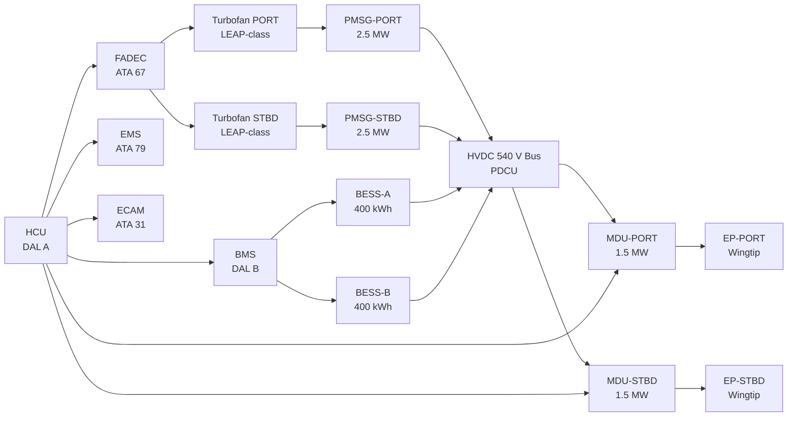
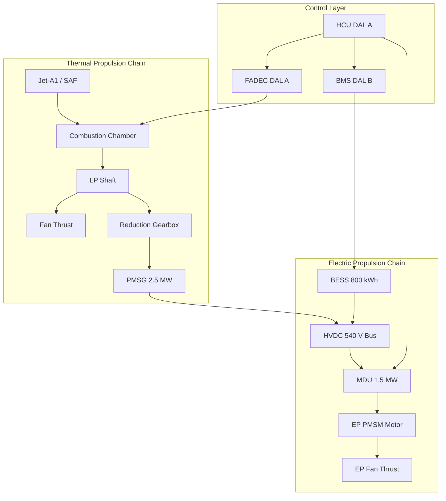

<!-- ──────────────────────────────────────────────────────────────────────────
     QATL-ATLAS-1000-ATLAS-070-079-070-000-HYBRID-ELECTRIC-ARCHITECTURE-OVERVIEW-GENERAL
     ATA 70 · Hybrid-Electric Architecture Overview — General
     AMPEL360E eWTW — ATLAS Register 1000
────────────────────────────────────────────────────────────────────────────── -->

# Hybrid-Electric Architecture Overview — General

---

## §0 Hyperlink Policy

> All hyperlinks in this document are **relative** (five directory levels: `../../../../../`).
> Absolute URLs are forbidden. Every linked document must exist in the Q+ATLANTIDE repository
> before the link is activated. Broken links are treated as open issues and must be resolved
> before the document is promoted from `DRAFT` to `APPROVED`.

---

## §1 Purpose

ATA Chapter 70 on the AMPEL360E eWTW defines the integrated hybrid-electric propulsion architecture: the combination of two conventional turbofan engines (with integral Permanent-Magnet Synchronous Generators, PMSG) providing primary thrust and electrical generation, two wingtip-mounted Electric Propulsors (EP) delivering supplementary and trim thrust, a Battery Energy Storage System (BESS) buffering electrical energy, an HVDC 540 V power distribution backbone, and the Hybrid Controller Unit (HCU) that orchestrates the thrust and power split in real time.

This document is the apex baseline for all subsubjects 070-010 through 070-090. All lower-level documents inherit the architecture definitions, acronyms, safety classification, and governance established here. Changes to this document require formal Configuration Control Board (CCB) approval under the Q+ATLANTIDE baseline governance.

---

## §2 Applicability

| Parameter | Value |
|---|---|
| Aircraft Program | AMPEL360E eWTW |
| ATA reference | ATA 70-000 — Hybrid-Electric Architecture Overview General |
| Certification basis | EASA CS-25 Amdt 27 + SC-Hybrid-Electric |
| S1000D SNS | 070-000-00 |

---

## §3 Functional Description ![DRAFT]

The AMPEL360E eWTW hybrid-electric propulsion system integrates five major subsystems into a unified propulsion architecture:

**1. Turbofan + PMSG Units (TF-PORT, TF-STBD)**
Two LEAP-1A-class turbofans mounted on wing pylons (ATA 71/54). Each LP shaft drives a 2.5 MW Permanent-Magnet Synchronous Generator (PMSG) via a reduction gearbox. The PMSGs supply the HVDC 540 V backbone at all power settings above idle. Net thrust per engine: ~120 kN at sea-level take-off.

**2. Electric Propulsor Array (EP-PORT, EP-STBD)**
Two ducted-fan electric propulsors integrated into the extended wingtip structure (y ≈ ±34 m). Each EP is driven by a 1.5 MW PMSM motor fed by a dedicated Motor Drive Unit (MDU) from the HVDC 540 V bus. EP thrust is used for boost at take-off, cruise trim, asymmetric yaw compensation, and roll augmentation.

**3. Battery Energy Storage System (BESS)**
Two independent Li-S chemistry BESS packs (BESS-A, BESS-B) totalling ≥ 800 kWh usable energy. Located in the aft belly fairing structural bays. Each pack managed by a dual-channel Battery Management System (BMS, DAL B). BESS supplies EP during All-Electric Taxi (AET) and Boosted Take-Off (BTO) when PMSG output alone is insufficient.

**4. HVDC 540 V Power Distribution**
Single HVDC 540 V backbone bus with port and starboard segments interconnected via a normally-closed bus-tie contactor. Power sources: PMSG-PORT, PMSG-STBD, BESS-A, BESS-B. Power consumers: EP-PORT MDU, EP-STBD MDU, and secondary LVDC 28 V converters. The Power Distribution and Control Unit (PDCU) manages bus protection and source priority.

**5. Hybrid Controller Unit (HCU)**
Dual-channel digital controller (DAL A, DO-178C) that arbitrates thrust and power demand in real time. HCU receives total thrust demand from the Flight Management System (FMS), BESS state-of-charge (SoC) from the BMS, and PMSG output from the PDCU. It sends throttle commands to FADEC (ATA 67) and torque commands to each MDU, continuously optimising the EP/turbofan thrust split to minimise fuel burn while keeping BESS SoC within the 20–85 % operating window.

---

## §4 Functional Breakdown

| ID | Name | Description | Lead Division |
|---|---|---|---|
| F-001 | Turbofan + PMSG Propulsion | Primary thrust and electrical generation; 2 × LEAP-class TF with PMSG gearbox | Q-GREENTECH |
| F-002 | Electric Propulsor (EP) Array | Wingtip EP units providing boost/trim thrust; EP-PORT and EP-STBD | Q-GREENTECH |
| F-003 | Battery Energy Storage System (BESS) | Dual-pack Li-S BESS; energy buffer for EP during AET, BTO, and EE modes | Q-GREENTECH |
| F-004 | Hybrid Controller Unit (HCU) | Real-time thrust/power arbitration; DAL A dual-channel controller | Q-HPC |
| F-005 | HVDC 540 V Power Distribution | Backbone bus, PDCU, bus-tie contactors, MDU power feed | Q-MECHANICS |

---

## §5 System Context — Mermaid Diagram

---

## §6 Internal Architecture — Mermaid Diagram

---

## §7 Components and LRUs

| Component | Part Number | Qty | Location | Maintenance Interval | Notes |
|---|---|---|---|---|---|
| PMSG-PORT / PMSG-STBD | PMSG-PN-TBD | 2 | Engine LP shaft gearbox, port & stbd nacelle | On condition / inspection at C-check | 2.5 MW each; HVDC 540 V output |
| HCU (Hybrid Controller Unit) | HCU-PN-TBD | 1 | EE bay, centre rack | Software update per SB cycle; hardware on condition | Dual-channel DAL A; DO-178C |
| BESS Pack A / Pack B | BESS-PN-TBD | 2 | Aft belly fairing bays F-25 to F-27 | Capacity check 2 000 FH; cell replacement on SoH < 80 % | 400 kWh each; Li-S chemistry |
| MDU-PORT / MDU-STBD (Motor Drive Unit) | MDU-PN-TBD | 2 | EP nacelle, wingtip structure | Functional test C-check | 1.5 MW; SiC inverter |
| EP-PORT / EP-STBD (Electric Propulsor) | EP-PN-TBD | 2 | Extended wingtip nacelle ±34 m | Fan blade inspection A-check; LRU on condition | Ducted fan; PMSM motor |
| PDCU (Power Distribution & Control Unit) | PDCU-PN-TBD | 1 | EE bay adjacent to HCU | Functional test C-check | HVDC bus protection, source switching |

---

## §8 Interfaces

| Interface Type | Connected System | Protocol / Medium | Data / Function |
|---|---|---|---|
| ATA 24 Electrical Power | HVDC 540 V bus, LVDC converters | HVDC cable; CAN bus | PMSG and BESS power sourcing; EP drive power |
| ATA 67 Engine Controls (FADEC) | FADEC — engine throttle law | AFDX ARINC 664 P7 | Throttle command from HCU; N1/EGT feedback |
| ATA 72 Turbofan Engine | LP shaft, fan | Mechanical + AFDX | PMSG drive; net thrust data |
| ATA 31 ECAM | Cockpit displays | AFDX | Hybrid propulsion synoptic: mode, SoC, EP thrust % |
| ATA 79 Energy Management System (EMS) | EMS — energy optimisation | AFDX | Energy budget, SoC targets, mode commands to HCU |
| ATA 45 CMS | Central Maintenance System | AFDX | HCU/BMS BITE, fault log, health parameters |
| ATA 27 Flight Controls | FBW computers | AFDX | EP differential thrust for roll/yaw augmentation |

---

## §9 Operating Modes

| Mode | Trigger | System State | Actions / Consequences |
|---|---|---|---|
| AET — All-Electric Taxi | Ground, TF off, gate to runway | EP-PORT + EP-STBD at 15–30 kW each; BESS supplies | PMSG offline; HCU governs EP torque; max taxi speed 15 kt |
| BTO — Boosted Take-Off | TF at max thrust + EP supplement | Both TF at max N1 + EP at max 1.5 MW each for ≤ 5 min | PMSG + BESS supply EP; combined thrust ~110 % nominal |
| CRUISE | FL350 steady cruise | TF ~85 % thrust; EP trim ~15 % | HCU optimises split for min fuel burn; BESS SoC maintained |
| RGD — Regenerative Descent | Descent, TF at idle | EP fans windmill; MDU in regenerative mode | BESS charged up to 50 kWh per descent; HCU manages charge rate |
| EE — Emergency Electric | Both TF failed (extreme) | BESS feeds EP only | EP provides limited thrust; HCU commands emergency SoC draw |
| MAINT — Ground Maintenance | Aircraft on ground, isolated | HCU isolated; HVDC bus de-energised | LOTO procedure; 5 min HVDC discharge before access |

---

## §10 Performance and Budgets ![DRAFT]

| Parameter | Requirement | Target / Design Value | Status |
|---|---|---|---|
| EP max shaft power (each) | ≥ 1.4 MW | 1.5 MW | ![TBD] |
| PMSG output power (each) | ≥ 2.3 MW at max continuous | 2.5 MW | ![TBD] |
| BESS total usable energy | ≥ 800 kWh | 800 kWh (2 × 400 kWh) | ![TBD] |
| System electrical efficiency (PMSG→EP shaft) | ≥ 70 % | 72 % | ![TBD] |
| HCU latency (demand to command) | ≤ 50 ms | 30 ms target | ![TBD] |
| BESS SoC operating window | 20 – 85 % | 20 – 85 % | ![TBD] |

---

## §11 Safety, Redundancy and Fault Tolerance

- **Dual turbofan**: Loss of one TF leaves remaining TF + both EPs operable; single-engine OEI performance per CS-25.
- **Dual EP**: Loss of one EP → remaining EP + both TFs; HCU applies differential-thrust compensation.
- **Dual BESS packs**: BESS-A and BESS-B fully independent; loss of one pack leaves 400 kWh available.
- **Dual PMSG**: Each engine has its own PMSG; loss of one PMSG → remaining PMSG + BESS supply both EPs at reduced capacity.
- **HCU dual-channel**: DAL A; active/standby channel with automatic switchover; loss of HCU → FADEC-only turbofan mode (EP shutdown, BESS isolated).
- **Loss of all electric propulsion**: Certified turbofan-only flight envelope per CS-25 main certification basis.
- **Thermal runaway containment**: BESS packs in fire-rated structural bays with dedicated suppression.

---

## §12 Maintenance and Diagnostics

| Task | Interval | Access | Special Tools |
|---|---|---|---|
| HCU BITE log download and channel health check | A-check | EE bay | CMS terminal or ACARS |
| BESS capacity verification (SoH check) | 2 000 FH | Belly fairing access hatch | BMS GSE terminal |
| PMSG insulation resistance test | C-check | Nacelle access panels | HVDC IR tester; LOTO kit |
| EP fan blade visual inspection | A-check | Wingtip nacelle | Borescope for inner stages |
| MDU functional test (open/close cycle, overcurrent trip) | C-check | EP nacelle access panel | MDU GSE terminal |

---

## §13 Footprint — Physical, Electrical, Maintenance, Data ![TBD]

| Footprint Type | Parameter | Value | Notes |
|---|---|---|---|
| Physical | BESS mass (both packs) | ![TBD] | Target ≤ 1 200 kg total |
| Physical | EP nacelle envelope | ![TBD] | Wingtip ±34 m station |
| Electrical | Peak HVDC bus load (BTO) | ~3.0 MW | Both EPs + bus losses |
| Maintenance | Critical access category | Belly fairing (BESS) + wingtip nacelle (EP) | Line + base maintenance |
| Data | AFDX bandwidth (HCU to CMS) | ![TBD] | Per AFDX bus load analysis |

---

## §14 Safety and Certification References ![DRAFT]

| Standard / Document | Title | Issuing Body | Applicability |
|---|---|---|---|
| EASA CS-25 Amdt 27 | Airworthiness Standards — Large Aeroplanes | EASA | Primary certification basis |
| EASA SC-HIRF | Specific Conditions — Hybrid-Electric Propulsion (HV) | EASA | HVDC and EP-specific requirements |
| DO-178C | Software Considerations in Airborne Systems | RTCA | HCU software DAL A; BMS DAL B |
| DO-160G | Environmental Conditions and Test Procedures | RTCA | All LRU environmental qualification |
| SAE AS6019 | HVDC Arc-Fault Detection | SAE | HVDC bus protection |
| RTCA DO-311A | Minimum Operational Performance Standards — Rechargeable Lithium Battery | RTCA | BESS qualification |

---

## §15 V&V Approach ![TBD]

| Phase | Method | Acceptance Criterion | Status |
|---|---|---|---|
| Design | System-level simulation (HCU allocation law) | Fuel burn reduction ≥ 8 % vs baseline TF-only | ![TBD] |
| Integration | Hardware-in-the-loop (HCU + FADEC + BMS) | All mode transitions correct; no BITE faults | ![TBD] |
| Qualification | DO-160G environmental; DO-311A for BESS | All categories pass | ![TBD] |
| Certification | EASA SC-HIRF flight test; CS-25 performance demo | OEI climb gradient met; BESS thermal runaway contained | ![TBD] |

---

## §16 Glossary

| Term | Definition |
|---|---|
| **HCU** | Hybrid Controller Unit — DAL A dual-channel controller arbitrating EP/TF thrust split. |
| **PMSG** | Permanent-Magnet Synchronous Generator — LP-shaft-driven generator supplying HVDC 540 V. |
| **EP** | Electric Propulsor — wingtip ducted-fan unit driven by a PMSM motor via MDU. |
| **BESS** | Battery Energy Storage System — dual Li-S packs totalling ≥ 800 kWh usable energy. |
| **MDU** | Motor Drive Unit — SiC-based inverter converting HVDC 540 V DC to variable-frequency AC for the EP PMSM. |
| **HVDC** | High-Voltage Direct Current — 540 V backbone bus interconnecting PMSGs, BESS, and MDUs. |
| **BTO** | Boosted Take-Off — mode where both TF and EP operate at maximum thrust simultaneously. |
| **AET** | All-Electric Taxi — ground taxi using EP only; TF engines off. |
| **RGD** | Regenerative Descent — descent mode where EP fans windmill to charge BESS. |
| **EE** | Emergency Electric — extreme fallback mode using BESS + EP if both TF fail. |
| **PDCU** | Power Distribution and Control Unit — manages HVDC bus protection, source switching, and bus-tie. |
| **SoC** | State of Charge — instantaneous BESS energy as a percentage of usable capacity. |

---

## §17 Open Issues

| ID | Description | Owner | Target |
|---|---|---|---|
| OI-070-000-001 | Finalise PMSG rating with engine OEM (2.5 MW vs 2.8 MW option pending LP shaft torque analysis) | Q-GREENTECH / Q-MECHANICS | 2026-Q4 |
| OI-070-000-002 | Confirm BESS total usable capacity with cell supplier (Li-S cycle life at 800 kWh) | Q-GREENTECH | 2027-Q1 |
| OI-070-000-003 | Define HCU DAL A software architecture baseline for SRR | Q-HPC | 2026-Q3 |

---

## §18 Status Legend

| Badge | Meaning |
|---|---|
| `![DRAFT]` | Section is drafted but not yet reviewed |
| `![TBD]` | Content not yet started — to be defined |
| `![To Be Completed]` | Partially complete — needs additional content |
| `![APPROVED]` | Reviewed and formally approved |

---

## §19 Related Documents (Siblings in this Subsection)

- [070-010](./070-010-Propulsion-System-Topology.md)
- [070-020](./070-020-Electric-and-Thermal-Propulsion-Allocation.md)
- [070-030](./070-030-Hybrid-Electric-Operating-Modes.md)
- [070-040](./070-040-Propulsion-Redundancy-and-Degraded-Modes.md)
- [070-050](./070-050-Propulsion-Energy-Flow-Architecture.md)
- [070-060](./070-060-Propulsion-Safety-and-Isolation-Zones.md)
- [070-070](./070-070-Propulsion-Integration-and-Airframe-Interfaces.md)
- [070-080](./070-080-Hybrid-Electric-Monitoring-Diagnostics-and-Control-Interfaces.md)
- [070-090](./070-090-S1000D-CSDB-Mapping-and-Traceability.md)

---

## §20 Change Log

| Rev | Date | Author | Description |
|---|---|---|---|
| 0.1 | 2026-05-11 | @copilot | Initial DRAFT — contextualized content per AMPEL360E eWTW architecture |
