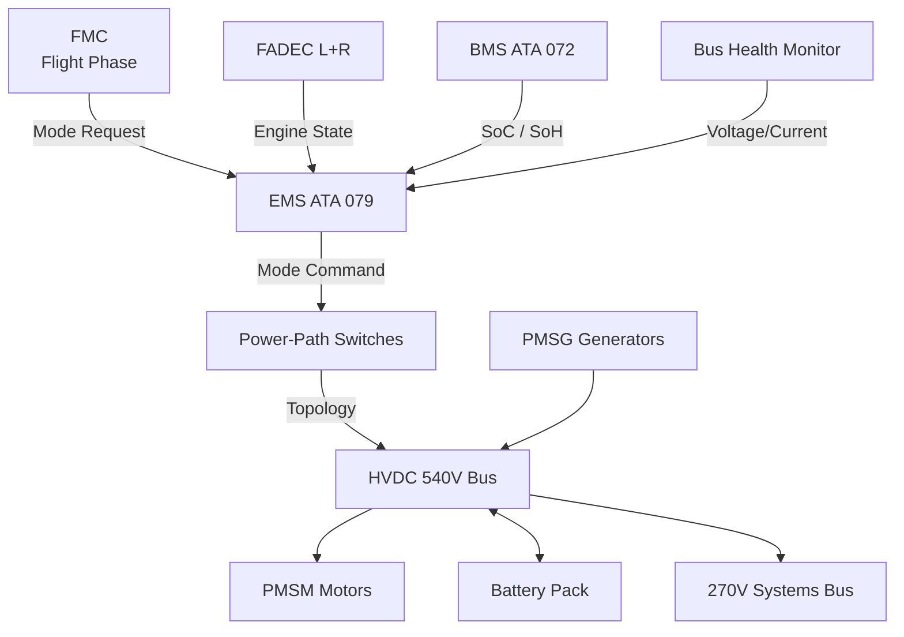
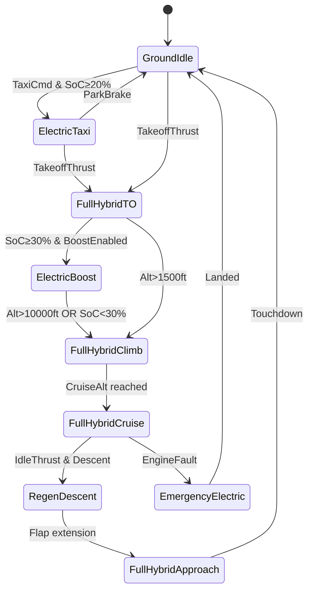

# Architecture Modes and Power Flow

---

## §0 Hyperlink Policy
All hyperlinks in this document are **relative**. Absolute URLs are forbidden.

---

## §1 Purpose
This document defines the discrete operating modes of the AMPEL360E eWTW hybrid-electric propulsion architecture and specifies the power-flow paths active in each mode. It establishes the mode-transition logic, power-split setpoints, bus connectivity states, and energy-source priorities that govern every phase of a typical flight. This document is authoritative for EMS mode logic design and serves as the primary reference for simulation model initialisation and flight-test mode verification.

## §2 Applicability
| Aircraft | Variant | MSN Range | Effectivity |
|---|---|---|---|
| AMPEL360E | eWTW | All | From EIS |

## §3 Functional Description 

The AMPEL360E eWTW hybrid-electric architecture supports seven distinct operating modes, each characterised by a unique combination of active power sources, bus topology, and thrust allocation. Mode transitions are commanded by the EMS (ATA 079) in response to flight-phase signals from the FMC, pilot inputs, and fault status from the BMS, FADEC, and power-bus health monitors. Transitions are constrained by minimum dwell times and SoC boundary conditions to prevent oscillation and thermal stress.

During the **Full Hybrid Cruise** mode, both turbofan-PMSG channels feed the HVDC 540 V bus, the EMS dynamically apportions surplus generation to battery charging or PMSM motor assist, and the 270 V systems bus is sustained by a regulated DC-DC converter from the propulsion bus. Power flow is bidirectional at the battery interface, with the BMS reporting available charge and discharge power every 100 ms to the EMS for real-time optimisation. The PMSM motors operate at partial torque to provide BLI drag-reduction benefits on the aft fuselage.

In **Electric Boost** mode, initiated during take-off roll and early climb, the battery discharges at up to C/2 rate through the bidirectional DC-DC converters into the propulsion bus, supplementing PMSG output. Both PMSM motors operate at their continuous-rated thrust ceiling. This mode is time-limited (≤ 8 min) and gated on SoC ≥ 30 %. The **Regenerative Descent** mode reverses the PMSM torque command, operating both aft motors as generators feeding the propulsion bus and then the battery through the bidirectional converters, recovering energy during idle-thrust descent. The **Electric Taxi** mode operates solely from the battery with turbofans shutdown or in ground-idle, providing zero-emission airport surface movement.

## §4 Functional Breakdown
| ID | Function | Description | Owner | DAL |
|---|---|---|---|---|
| F-070-010-01 | Mode Detection & Transition Logic | EMS state-machine evaluates phase triggers and issues mode change commands | Q-HPC | DAL-A |
| F-070-010-02 | Power-Flow Path Switching | Contactors and solid-state switches route power per active mode topology | Q-INDUSTRY | DAL-A |
| F-070-010-03 | Power-Split Optimisation | EMS computes real-time power setpoints for PMSG, battery, and PMSM per mode | Q-HPC | DAL-B |
| F-070-010-04 | Mode Health Monitoring | Validates that bus currents/voltages match commanded mode topology | Q-GREENTECH | DAL-B |
| F-070-010-05 | Emergency Mode Activation | Automatically transitions to Emergency Electric on dual-turbofan failure | Q-MECHANICS | DAL-A |

## §5 System Context — Architecture

## §6 Internal Architecture

## §7 Components and LRUs
| LRU ID | Name | P/N | Qty | Location |
|---|---|---|---|---|
| LRU-070-010-01 | EMS Mode Controller Module | TBD | 2 | Avionics Bay |
| LRU-070-010-02 | HVDC Mode Contactor Assembly | TBD | 4 | Forward Equipment Bay |
| LRU-070-010-03 | Power-Flow Monitoring Unit | TBD | 2 | HVDC Bus Panel |
| LRU-070-010-04 | Mode Annunciation Interface Unit | TBD | 1 | Cockpit Avionics Bay |
| LRU-070-010-05 | Bus Cross-Tie Solid-State Switch | TBD | 2 | Central Bus Tie Panel |

## §8 Interfaces
| Interface | Source | Destination | Protocol | Notes |
|---|---|---|---|---|
| IF-070-010-01 | FMC | EMS Mode Controller | AFDX (ARINC 664) | Flight phase, waypoint, and descent profile |
| IF-070-010-02 | EMS Mode Controller | HVDC Contactor Assembly | Discrete (28 V DC) | Open/close commands per mode |
| IF-070-010-03 | BMS | EMS Mode Controller | CAN FD | SoC boundary signals for mode gating |
| IF-070-010-04 | FADEC (L+R) | EMS Mode Controller | ARINC 429 | Engine thrust and shaft power availability |
| IF-070-010-05 | EMS Mode Controller | ECAM | AFDX | Mode state, transition alerts, power-flow display |

## §9 Operating Modes
| Mode | Trigger | Description | Power State | Notes |
|---|---|---|---|---|
| Electric Taxi | Taxi clearance + SoC ≥ 20 % | Battery-only propulsion; turbofans off/idle | Battery discharge | Zero local emissions |
| Electric Boost | Take-off thrust + SoC ≥ 30 % | PMSG + battery → PMSM at max power | Peak discharge | ≤ 8 min limit |
| Full Hybrid Cruise | Cruise altitude established | Both PMSGs supply bus; EMS splits to battery/PMSM | Balanced | Primary mode |
| Regenerative Descent | Idle throttle + descent rate | PMSM in generator mode → battery charge | Active charge | Subject to SoC ≤ 95 % |
| Emergency Electric | Turbofan fault (one or both) | Battery + remaining PMSG sustain flight | Reserve discharge | EMS DAL-A failsafe |

## §10 Performance and Budgets 
| Parameter | Requirement | Current Estimate | Unit | Status |
|---|---|---|---|---|
| Mode transition time (normal) | ≤ 500 | 350 | ms |  |
| Electric Boost max duration | ≤ 8 | 8 | min |  |
| Regen descent recovery power | ≥ 400 | 450 | kW |  |
| SoC minimum for Electric Boost | ≥ 30 | 30 | % |  |
| Emergency mode endurance (battery) | ≥ 45 | 50 | min |  |

## §11 Safety, Redundancy and Fault Tolerance
- All mode transitions are validated by dual EMS lanes before contactor actuation; a single-lane disagreement inhibits the transition and logs a fault.
- The Emergency Electric mode is an irreversible transition during flight; reinstatement of normal modes requires FADEC confirmation of engine re-start.
- SoC lower boundary (20 % reserve) is hardware-enforced at the BMS level independently of EMS mode commands.
- HVDC bus cross-tie is normally open during dual-engine operation; automatic closure on single-engine failure is a DAL-A function with < 50 ms actuation time.
- All mode-transition events are time-stamped and transmitted to ACMS for post-flight analysis and trend monitoring.

## §12 Maintenance and Diagnostics
| Task | Interval | Tool | Reference |
|---|---|---|---|
| Mode-transition logic BITE test | Pre-flight / on-demand | ECAM CMS | FCOM 070-010-01 |
| Contactor cycling inspection | 1 200 FH | Contactor test set CTR-540 | AMM 070-010-011 |
| EMS mode-log review | 300 FH or A-Check | ACMS report tool | MPD 070-010-A1 |
| Power-flow monitoring calibration | 600 FH | AGSE-070 calibrator | AMM 070-010-012 |

## §13 Footprint
| Metric | Physical | Electrical | Maintenance | Data |
|---|---|---|---|---|
| Mode contactor set mass |  kg | 540 V / 800 A rated | Standard HVDC tools | Discrete 28 V signals |
| EMS Mode Controller size | 2 × 1.5 ATR | 28 V DC, 15 W each | Standard avionics bay | AFDX / CAN FD |
| Mode monitoring harness |  m | — | Standard harness tools | Differential analog + AFDX |

## §14 Safety and Certification References
| Standard | Requirement | Applicability | Status | Notes |
|---|---|---|---|---|
| DO-178C | DAL-A software for mode state machine | EMS Mode Controller | Planned | MC1–MC6 compliance |
| DO-254 | DAL-A hardware for contactor drive logic | Contactor drive FPGA | Planned | Complex electronic hardware |
| ARP4754A | System-level mode design assurance | Hybrid mode architecture | Planned | Safety assessment per ARP4761 |
| CS-25 | §25.1309 failure probability for mode errors | All mode transitions | Planned | Catastrophic = < 1×10⁻⁹/FH |
| FAR Part 25 | §25.1309 equivalent requirements | All mode transitions | Planned | Parallel to CS-25 certification |

## §15 V&V Approach
| Phase | Method | Tool/Facility | Status |
|---|---|---|---|
| Requirements review | MBSE model simulation of mode state machine | Cameo/Simulink |  |
| Software integration test | HIL mode injection testing | HPS-070 HIL Rig |  |
| Iron-bird power-flow test | Full-power mode cycling on iron bird | Iron Bird Facility |  |
| Flight test | Mode activation at altitude, performance measurement | AMPEL360E FTB-001 |  |

## §16 Glossary
| Term | Definition |
|---|---|
| EMS | Energy Management System — governs mode selection and power-split |
| Mode | Discrete operating state of the hybrid architecture with defined power topology |
| Power-Split | EMS-determined allocation of generation between PMSG, battery, and PMSM |
| SoC | State of Charge — remaining battery energy as a percentage of capacity |
| Contactor | High-power electromechanical or solid-state switching device for HVDC bus paths |
| FADEC | Full Authority Digital Engine Control — provides engine state to EMS |
| FMC | Flight Management Computer — provides phase/profile data to EMS |
| BLI | Boundary Layer Ingestion — aft motor benefit of ingesting retarded fuselage airflow |
| Dwell Time | Minimum time a mode must remain active before another transition is permitted |
| ACMS | Aircraft Condition Monitoring System — records and trends flight data |

## §17 Open Issues
| ID | Description | Owner | Priority | Status |
|---|---|---|---|---|
| OI-070-010-001 | Validate 500 ms mode-transition time against FADEC latency budget | @copilot | High | Open |
| OI-070-010-002 | Define regenerative descent power limits for varying OAT and SoC conditions | @copilot | Medium | Open |

## §18 Status Legend
| Badge | Meaning |
|---|---|
|  | Content under active development |
|  | Value or content to be determined |
|  | Approved and baselined |
|  | Placeholder, not yet populated |

## §19 Related Documents
| Code | Title | Link |
|---|---|---|
| 070-000 | Hybrid-Electric Architecture Overview — General | [070-000-Hybrid-Electric-Architecture-Overview-General.md](070-000-Hybrid-Electric-Architecture-Overview-General.md) |
| 070-020 | Turbofan-Electric Integration | [070-020-Turbofan-Electric-Integration.md](070-020-Turbofan-Electric-Integration.md) |
| 070-030 | Electric Propulsion Integration | [070-030-Electric-Propulsion-Integration.md](070-030-Electric-Propulsion-Integration.md) |
| 070-040 | Energy Storage Integration | [070-040-Energy-Storage-Integration.md](070-040-Energy-Storage-Integration.md) |
| 070-050 | Power Electronics and Conversion | [070-050-Power-Electronics-and-Conversion.md](070-050-Power-Electronics-and-Conversion.md) |
| 070-060 | Hybrid Control Architecture | [070-060-Hybrid-Control-Architecture.md](070-060-Hybrid-Control-Architecture.md) |
| 070-070 | Safety, Redundancy and Fault Tolerance Architecture | [070-070-Safety-Redundancy-and-Fault-Tolerance-Architecture.md](070-070-Safety-Redundancy-and-Fault-Tolerance-Architecture.md) |
| 070-080 | Hybrid System Monitoring, Diagnostics and Control Interfaces | [070-080-Hybrid-System-Monitoring-Diagnostics-and-Control-Interfaces.md](070-080-Hybrid-System-Monitoring-Diagnostics-and-Control-Interfaces.md) |
| 070-090 | S1000D CSDB Mapping and Traceability | [070-090-S1000D-CSDB-Mapping-and-Traceability.md](070-090-S1000D-CSDB-Mapping-and-Traceability.md) |

## §20 Change Log
| Rev | Date | Author | Summary |
|---|---|---|---|
| 0.1 | 2026-05-11 | @copilot | Initial creation |
